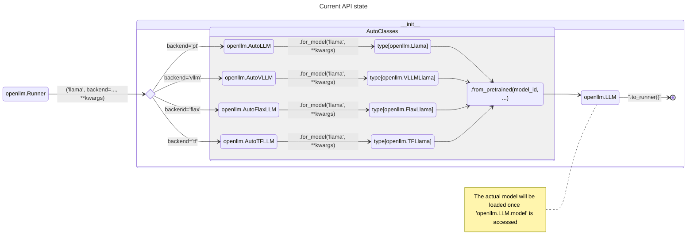

# Problem

Currently, it seems the API is way too complicated from internal feedback. We want to simplify and provide a simple abstraction on top.

Current UX:

```bash
openllm start llama ... --backend vllm
```

OpenLLM provides both options to either use OpenLLM Client or use the OpenAI compatible API to interact with this LLM.

The following includes all available APIs/SDK that OpenLLM currently offers:

1. Auto classes
   > If you aren't sure what LLM to use, then the auto classes API will map the desired backend to the LLM classes itself, via `openllm.[AutoLLM|AutoVLLM|AutoTFLLM|AutoFlaxLLM].for_model`:

```python
pt_llm = openllm.AutoLLM.for_model('llama', model_id='meta-llama/Llama-2-13b-chat-hf')
vllm_llm = openllm.AutoVLLM.for_model('llama', model_id='meta-llama/Llama-2-13b-chat-hf', max_new_tokens=4096)
```

`AutoLLM` contains a `_model_mapping` of `type[openllm.LLMConfig]` to `type[openllm.LLM]` (note that these `openllm.LLM` class are backend specific.)

`for_model` is responsible for:

- `ensure_available=True|False` will check if the model weights is available under BentoML model store
- Choose the correct `type[openllm.LLM]` backend to load a `openllm.LLM` instance

> [!IMPORTANT]
> OpenLLM's Auto classes therefore is backend-dependent. This is similar to transformers' Auto classes design.

2. `openllm.LLM`
   > `openllm.LLM` is a ref class that holds a lot of information that allows access directly to Runner creation, as well as the model and tokenizer.

`openllm.LLM.from_pretrained`: If you know exactly what model to use, then these `openllm.LLM` class can be used directly to load the ref into memory:

```python title="example.py"
pt_llama = openllm.Llama.from_pretrained('meta-llama/Llama-2-13b-chat-hf')

vllm_llama = openllm.VLLMLlama.from_pretrained('meta-llama/Llama-2-13b-chat-hf')
```

Note that this draws similarity with transformers' `from_pretrained` API. In fact, this is pretty much drop-in replacement for it! `openllm.LLM.from_pretrained` supports all attrs from transformers + openllm specific attributes.

One different behaviour with `openllm.LLM.from_pretrained` is that we don't load the model into the memory. Instead, it is then lazily loaded via `openllm.LLM.model`

> The behaviour of loading model, tokenizer from `openllm.LLM` are lazy, meaning it will only be loaded once `openllm.LLM.model` and `openllm.LLM.tokenizer` is called.

> [!NOTE] > `openllm.Runner` currently relies on this side effect to load model

```python title="openllm-python/src/openllm/_llm.py" {11}
def llm_runnable_class(...) -> type[bentoml.Runnable]:
  class _Runnable(bentoml.Runnable):
	  SUPPORTED_RESOURCES = ('nvidia.com/gpu', 'amd.com/gpu', 'cpu')
	  SUPPORTS_CPU_MULTI_THREADING = True
	  backend = self.__llm_backend__

	  def __init__(__self: _Runnable):
	    # NOTE: The side effect of this line is that it will load the imported model during runner startup. So don't remove it!!
		if not self.model: raise RuntimeError('Failed to load the model correctly (See traceback above)')
		if self.adapters_mapping is not None:
		  logger.info('Applying LoRA to %s...', self.runner_name)
		  self.apply_adapter(inference_mode=True, load_adapters='all')
```

3. `openllm.Runner`
   > `openllm.Runner` is a light factory that facilitate backend on top of the Auto class API to create BentoML's compatible Runner API.

```python title="service.py"
runner = openllm.Runner('llama', model_id='meta-llama/Llama-2-13b-chat-hf', backend='vllm')

runner.vllm_generate_iterator.async_stream
runner.generate_iterator.async_stream
```

The following illustrates the relationship among these APIs:



> [!IMPORTANT] > `openllm.Runner` will provides the most feature-rich APIs to interact with different backends and offers an simple API for people who are familiar with, know of BentoML architecture.

## Issues

While `openllm.Runner` is the most feature-full, people who don't know about BentoML's architecture might not understand what Runner is, as Runner is relatively low-level. Thus, OpenLLM should provide a higher level API that abstract some of these concepts and logics away from the users.

The Auto classes tries to solve this, but `openllm.LLM` doesn't contain all features that Runner has (runner has specific implementation for continuous batching, vllm support, LoRA adapters dynamic mounting, etc.), plus some drawback:

- It is relatively verbose (backend-dependent, therefore users will need to explicit write which Auto classes to use) (this is intended when I first implemented this.)
- The `openllm.LLM` APIs are inherently fragmented (text generation signature are not consistent, which leads to inconsistency between function signature for runners.)
  - PyTorch implementation are sync, whereas vLLM implementation are async
- Currently the most optimised path is implemented in Runner, not `openllm.LLM`

## Goal

- automatic backend detection:
  - if `vllm` is available, default to use vLLM implementation, otherwise fallback to PyTorch implementation
- Async
  - `generate_iterator` should be async?
- One API
  - `LLM.generate_iterator` and `LLM.async_generate_iterator`

# Proposal

```python title="proposal.py"
import attr

@attr.define
class CompletionChunk:
  index: int
  text: str
  token_ids: t.List[int]
  cumulative_logprob: float
  logprobs: t.Optional[t.List[t.Dict[int, float]]] = None
  finish_reason: t.Optional[FinishReason] = None

@attr.define
class GenerationOutput:
  prompt: str
  finished: bool
  outputs: t.List[CompletionChunk]
  prompt_token_ids: t.Optional[t.List[int]] = attr.field(default=None)
  request_id: str = attr.field(factory=lambda: gen_random_uuid())

class LLM:
    async def generate_iterator(
            self,
            prompt: str,
            request_id: str,
            stop: str | list[str] | None = None,
            stop_token_ids: list[int] | None = None,
            **kwargs: t.Any) -> t.Iterator[GenerationOutputs]:
        from ._generation import get_context_length
        from ._generation import is_partial_stop
        from ._generation import prepare_logits_processor

        temperature = attrs.pop('temperature', self.config['temperature'])
        top_p = attrs.pop('top_p', self.config['top_p'])
        prompt, *_ = self.sanitize_parameters(prompt, **attrs)

        if stop_token_ids is None: stop_token_ids = []
        stop_token_ids.append(self.tokenizer.eos_token_id)
        stop_: set[str] = set()
        if isinstance(stop, str) and stop != '': stop_.add(stop)
        elif isinstance(stop, list) and stop != []: stop_.update(stop)
        for tid in stop_token_ids:
            if tid: stop_.add(self.tokenizer.decode(tid))

        if temperature <= 1e-5: top_p = 1.0
        config = self.config.model_construct_env(stop=list(stop_),
                                                 top_p=top_p,
                                                 **attrs)
        sampling_params = config.to_sampling_config()

        len_prompt = len(prompt)

        if self.__llm_backend__ == 'vllm':
            async for out in self.model.generate(
                    prompt=prompt, sampling_params=sampling_params):
                yield GenerationOutput.from_gen_outputs(out)
        else:
            logits_processor = prepare_logits_processor(config)

            with torch.inference_mode():
                input_ids = self.tokenizer(prompt).input_ids

                if context_length is None:
                    context_length = get_context_length(self.model.config)
                max_src_len = context_length - config['max_new_tokens'] - 1

                input_ids = input_ids[-max_src_len:]
                output_ids = list(input_ids)
                input_echo_len = len(input_ids)

                past_key_values = out = token = None
                finish_reason = None
                for i in range(config['max_new_tokens']):
                    if torch.cuda.is_available(): torch.cuda.synchronize()
                    if i == 0:  # prefill
                        out = self.model(torch.as_tensor([input_ids],
                                                         device=self.device),
                                         use_cache=True)
                    else:  # decoding
                        out = self.model(torch.as_tensor([[token]],
                                                         device=self.device),
                                         use_cache=True,
                                         past_key_values=past_key_values)
                    logits = out.logits
                    past_key_values = out.past_key_values
                    if torch.cuda.is_available(): torch.cuda.synchronize()

                    if logits_processor:
                        if config['repetition_penalty'] > 1.0:
                            tmp_output_ids: t.Any = torch.as_tensor(
                                [output_ids], device=self.device)
                        else:
                            tmp_output_ids = None
                        last_token_logits = logits_processor(
                            tmp_output_ids, logits[:, -1, :])[0]
                    else:
                        last_token_logits = logits[0, -1, :]

                    # Switch to CPU by avoiding some bugs in mps backend.
                    if self.device.type == 'mps':
                        last_token_logits = last_token_logits.float().to('cpu')

                    if config['temperature'] < 1e-5 or config['top_p'] < 1e-8:
                        token = int(torch.argmax(last_token_logits))  # greedy
                    else:
                        probs = torch.softmax(last_token_logits, dim=-1)
                        indices = torch.multinomial(probs, num_samples=2)
                        token = int(indices.tolist()[0])
                    output_ids.append(token)

                    stopped = token in stop_token_ids

                    # Yield the output tokens
                    if i % stream_interval == 0 or i == config[
                            'max_new_tokens'] - 1 or stopped:
                        tmp_output_ids = output_ids[input_echo_len:]
                        rfind_start = 0
                        output = self.tokenizer.decode(
                            tmp_output_ids,
                            skip_special_tokens=True,
                            spaces_between_special_tokens=False,
                            clean_up_tokenization_spaces=True)

                        partially_stopped = False
                        if stop:
                            if isinstance(stop, str):
                                pos = output.rfind(stop, rfind_start)
                                if pos != -1:
                                    output, stopped = output[:pos], True
                                else:
                                    partially_stopped = is_partial_stop(
                                        output, stop)
                            elif isinstance(stop, t.Iterable):
                                for each_stop in stop:
                                    pos = output.rfind(each_stop, rfind_start)
                                    if pos != -1:
                                        output, stopped = output[:pos], True
                                        break
                                    else:
                                        partially_stopped = is_partial_stop(
                                            output, each_stop)
                                        if partially_stopped: break
                        else: raise ValueError('Invalid stop field type.')

                        # Prevent yielding partial stop sequence
                        if not partially_stopped:
                            yield GenerationOutput(
                                prompt=prompt,
                                finished=False,
                                outputs=[
                                    CompletionChunk(index=0,
                                                    text=output,
                                                    token_ids=tmp_output_ids,
                                                    cumulative_logprob=0.0,
                                                    finish_reason=None)
                                ])
                    if stopped: break
                else:
                    finish_reason = 'length'  # finish stream events
                if stopped: finish_reason = 'stop'
                yield GenerationOutput(prompt=prompt,
                                       finished=False,
                                       outputs=[
                                           CompletionChunk(
                                               index=0,
                                               text=output,
                                               token_ids=tmp_output_ids,
                                               cumulative_logprob=0.0,
                                               finish_reason=None)
                                       ])

                # Clean
                del past_key_values, out
                gc.collect()
                torch.cuda.empty_cache()

    async def generate(self,
                       prompt: str,
                       request_id: str,
                       stop: str | list[str] | None = None,
                       **kwargs: t.Any):
        result = None
        async for gen in self.generate_iterator(prompt,
                                                request_id=request_id,
                                                stop=stop):
            result = gen
        if result is None: raise RuntimeError
        return result
```

From the service level, the runner can be accessed with `llm.runner`

```python title="service.py"

llm = openllm.LLM("meta-llama/Llama-2-7b-chat-hf")

# if vllm is available => use vllm else pt
# 1. if not a path (given id) -> <framework>-<repo>--<model_id>
# llm.bentomodel (if exists -> return full tags) -> else we download (version: revision_hash)
# for vllm -> AsyncLLMEngine
# for py -> transformers.<AutoModelForCausalLM|AutoModelForSeq2SeqLM>.from_pretrained
# 2. given id is a path => depends on the config.json
llm = openllm.LLM("", model_name='...', model_version="...", model_tag=None | bentoml.Tag)

llm = openllm.LLM("asd", model_name='...', model_version="...", model_tag=None | bentoml.Tag)

# openllm.Runner

svc = bentoml.Service('chat', runners=[llm.runner])

@svc.api(...)
async def chat(input):
	await llm.generate(...)
```

The architecture of `openllm.LLM` are now as follow
![[dump/openllm.LLM architecture.png]]
