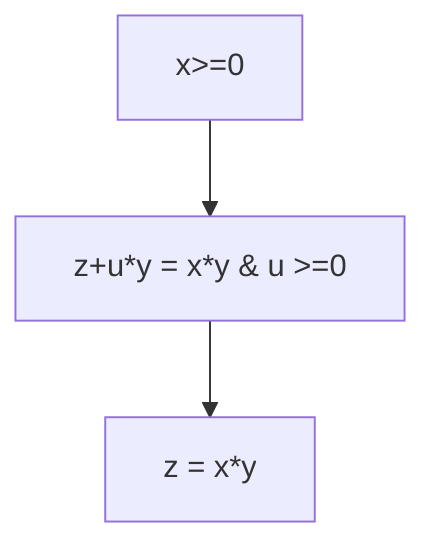

See also [[dump/university/concurrent-design-3bb4/README|3BB4 - Concurrent System Design]]



Sequential composition: Array as a partial function

```algorithm
x := (x; E:F)
```

> _array_ is a function $D \rightarrow T$ where $D$ is a 'small' range of integers and $T$ is the type of array element

_alter function ` (x; E:F)`_ is defined by

```algorithm

(x; E:F)(G) = F if E = G
(x; E:F)(G) = x(G) if e != G
```

For example:

Given array `x`:

```algorithm
{x(0) = a ^ x(1) = b}
x(1) := c
{x(0) = a ^ x(1) = c}
```

> S is the sum(0..k) -> loop invariant

```algorithm
s, k := a(0), 1`
{s = (\sum )}
```
