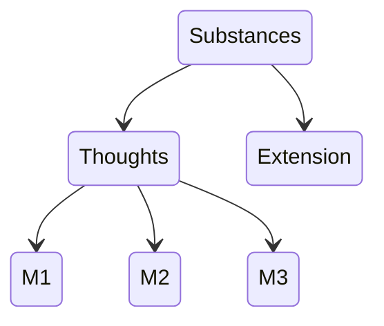

Substance = God = Nature

-> There is only one substances 

Many attributes:
- Thought
- Extensions

Each attributes:
- Mode (Aristotle's substances)

_Think Least of Death_ by Nadler

## Principle of Sufficient reason
> Everything that exists (and non-exists) has a cause and or reason

## Ethics Part II, pp. 190
