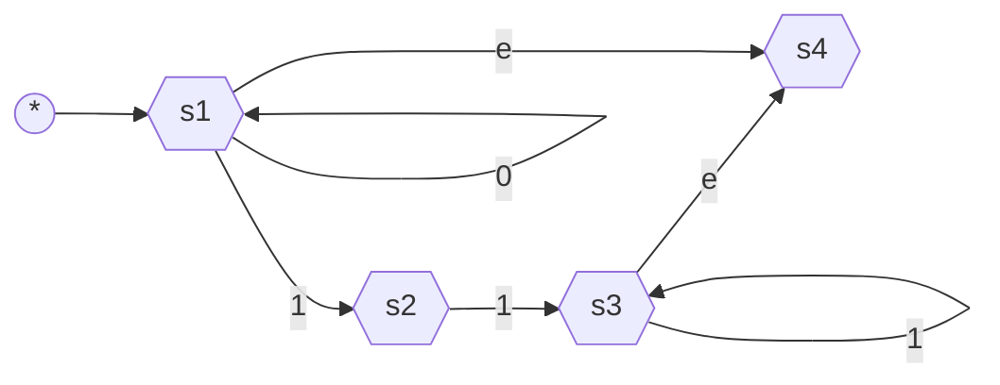

Ex. $\Sigma = {0, 1}$

1. $\mathcal{L}(M) = \{ abxba \space | \space x \in \Sigma^{*}\}$ ![[dump/university/sfwr-2fa3/abxba-nfa.png]]
1. $\mathcal{L}(M) = \{ yx \space | \space x = 00 \lor x =11 \land  y \in \Sigma^{*}\}$ ![[dump/university/sfwr-2fa3/yxx-nfa.png]]![[dump/university/sfwr-2fa3/yxx-nfa-4s.png]]

## $\epsilon$ transition

![[dump/university/sfwr-2fa3/eps-nfa.png]]

---
Given the following $M$

$\mathcal{L}(M) = \{0^n1^m \space | \space n \geq 0, m \neq 1 \space, x \in \Sigma^{*}\}$
