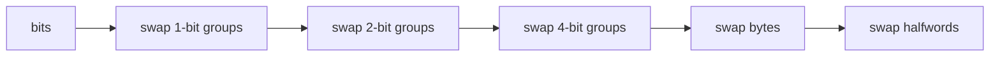

## route

Learn this file as machinery for the rest of the kit.

1. Read `picture`, `bit fields`, and `fixed-width python`.
2. Solve `pack_rgba`, `unpack_rgba`, `extract_field`, and `insert_field`.
3. Read `power tools`.
4. Solve `next_pow2`, `reverse_bits32`, and `sar32`.
5. Review [[hinterland/prep/01-bits/notes.fc]].

Depth after that: `popcount_swar` and `submasks`.

## picture

A fixed-width integer is a row of bits. Arithmetic happens mod $2^n$. Signed two's-complement is the same row of bits with the top bit given negative weight:

$$
\text{signed}(x) =
\begin{cases}
x & x < 2^{n-1} \\
x - 2^n & x \ge 2^{n-1}
\end{cases}
$$

Negation is flip and add one:

```text
  6  = 0000_0110
 ~6  = 1111_1001
 +1  = 1111_1010 = -6 as an 8-bit pattern
```

Shifts are the first fork:

| operation              | meaning                                                 |
| ---------------------- | ------------------------------------------------------- |
| left shift             | multiply by powers of two, then truncate if fixed-width |
| logical right shift    | shift in zeros                                          |
| arithmetic right shift | shift in the sign bit                                   |

Python only has arithmetic right shift for negative values. If you want logical shift at u32, mask first:

```python shell
M32 = (1 << 32) - 1
logical = (x & M32) >> n
```

## bit fields

Count bit positions from the least-significant bit, starting at 0.

| task               | expression       |
| ------------------ | ---------------- | --------- |
| test bit `k`       | `(x >> k) & 1`   |
| set bit `k`        | `x               | (1 << k)` |
| clear bit `k`      | `x & ~(1 << k)`  |
| toggle bit `k`     | `x ^ (1 << k)`   |
| set bit `k` to `v` | `(x & ~(1 << k)) | (v << k)` |

The reusable field recipe:

```python shell
mask = (1 << width) - 1
field = (word >> offset) & mask
word = (word & ~(mask << offset)) | ((value & mask) << offset)
```

Worked example:

```text
word = 0xdeadbeef
extract offset 8, width 8:
  0xdeadbeef >> 8 = 0x00deadbe
  0x00deadbe & 0xff = 0xbe

insert 0x42 at offset 8:
  clear field: 0xdeadbeef & ~0x0000ff00 = 0xdead00ef
  insert:      0xdead00ef |  0x00004200 = 0xdead42ef
```

For `pack_rgba`, pick a wire contract and stick to it. The stubs use one u32 with one byte per component; the same extract/insert recipe does every channel.

## fixed-width python

Python integers are unbounded. A value only becomes u32 or u64 because you mask it.

Mask after operations that can grow:

- `+`
- `-`
- `*`
- `<<`
- `~`
- unary `-`

These cannot escape once the input is already masked:

- `& M`
- `>>` on a nonnegative masked value

```python shell
M32 = (1 << 32) - 1

add32 = (a + b) & M32
not32 = ~x & M32
neg32 = -x & M32
shr32 = (x & M32) >> n
```

C has the inverse problem: unsigned arithmetic wraps by definition, signed overflow is undefined, and shifting by the width of the type is undefined. In live code, say which language semantics you are using before writing clever bit code.

## power tools

The lowest-set-bit family:

| expression     | result                   |
| -------------- | ------------------------ | ------------------------------------- |
| `x & -x`       | isolate lowest set bit   |
| `x & (x - 1)`  | clear lowest set bit     |
| `x             | (x - 1)`                 | set all bits below the lowest set bit |
| `~x & (x + 1)` | isolate lowest clear bit |

Power of two:

```python shell
x != 0 and (x & (x - 1)) == 0
```

The zero guard is load-bearing. Without it, `0` passes.

Next power of two:

```python shell
def next_pow2(x: int) -> int:
  if x <= 1:
    return 1
  return 1 << (x - 1).bit_length()
```

The bit-smear version is the C-ish follow-up:

```text
x -= 1
x |= x >> 1
x |= x >> 2
x |= x >> 4
x |= x >> 8
x |= x >> 16
x += 1
```

Reverse bits by swapping progressively wider groups:



For u32, each rung uses masks: `0x55555555`, `0x33333333`, `0x0f0f0f0f`, `0x00ff00ff`.

## popcount and submasks

First popcount answer: Kernighan's loop.

```python shell
n = 0
while x:
  x &= x - 1
  n += 1
```

It runs once per set bit.

Production answers:

- Python: `x.bit_count()`
- C/C++: `__builtin_popcountll`, `std::popcount`
- Rust: `count_ones`
- Go: `math/bits.OnesCount64`

All submasks of `m`:

```python shell
s = m
while True:
  visit(s)
  if s == 0:
    break
  s = (s - 1) & m
```

Two bugs:

- `while s:` drops the empty submask.
- continuing after `0` loops back to `m`.

## guards

- `__builtin_ctz(0)` and `__builtin_clz(0)` are undefined in C.
- `(1 << 31)` is undefined in C if `1` is signed `int`; use `1u`.
- `(1 << width) - 1` is undefined in C when `width` equals the word size.
- `char` may be signed in C; decode bytes through `uint8_t`.
- `-7 >> 1` is `-4`; C `-7 / 2` is `-3`.
- integer bit layout is not byte order. Endianness starts at the wire or memory boundary.

## drills

1. Extract bits 23..16 of `x`.
2. Set bit 5 to 0 without branching.
3. Compute logical right shift of a possibly-negative Python int at u32.
4. Explain why `0` passes the naked power-of-two test.
5. Reverse bits of `0x00000001`.
6. List all submasks of `0b101`.
7. Explain why `x & -x` isolates the lowest set bit.
8. Say what masks must happen after `~x` in Python.
