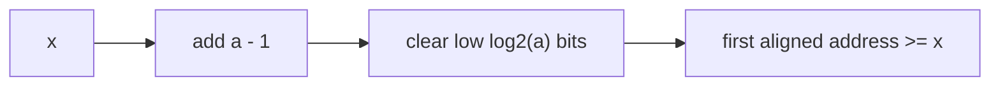

## route

This module makes width and layout explicit.

1. Read `unsigned model` and `sign bridges`.
2. Solve `add32`, `sub32`, `mul32`, `shl32`, `shr32`, `to_unsigned`, and `to_signed`.
3. Read `alignment`.
4. Solve `align_up`, `align_down`, and `is_aligned`.
5. Skim `struct layout` before solving `struct_layout`.
6. Review [[hinterland/prep/02-unsigned-alignment/notes.fc]].

Depth: `c_promote_trap` and `reorder_fields`.

## unsigned model

An n-bit unsigned integer is a residue modulo $2^n$.

$$
x + y \quad\text{means}\quad (x + y) \bmod 2^n
$$

Examples at u32:

- `0xffffffff + 1 -> 0`
- `0 - 1 -> 0xffffffff`
- `0x10000 * 0x10000 -> 0`

Two's complement signed values are the same residues relabeled. Add, subtract, and multiply produce the same bit patterns. Comparisons, division, right shift, widening, and overflow rules diverge.

| operation            | C unsigned      | C signed                                       | Python               |
| -------------------- | --------------- | ---------------------------------------------- | -------------------- |
| overflow             | wraps mod $2^n$ | undefined                                      | grows forever        |
| right shift negative | n/a             | implementation-defined, arithmetic in practice | arithmetic           |
| shift by width       | undefined       | undefined                                      | allowed              |
| `%` with negative    | n/a             | sign follows dividend                          | sign follows divisor |

The Python discipline:

```python shell
M32 = (1 << 32) - 1
add32 = (a + b) & M32
sub32 = (a - b) & M32
mul32 = (a * b) & M32
shl32 = (x << n) & M32
shr32 = (x & M32) >> n
```

## sign bridges

Unsigned bridge:

```python shell
def to_unsigned(x: int, bits: int) -> int:
  return x & ((1 << bits) - 1)
```

Signed bridge:

```python shell
def to_signed(u: int, bits: int) -> int:
  mask = (1 << bits) - 1
  sign = 1 << (bits - 1)
  return ((u & mask) ^ sign) - sign
```

Why the signed bridge works:

```text
u range:      0 ........ sign-1 | sign ........ 2^bits-1
xor sign:    sign ..... 2^bits-1 | 0 .......... sign-1
subtract:    0 ........ sign-1 | -sign ........ -1
```

Worked:

```text
to_signed(0xfe, 8)
0xfe ^ 0x80 = 0x7e = 126
126 - 128 = -2
```

## alignment

For power-of-two alignment `a`, `a - 1` is a mask of the low bits. Clearing those bits rounds down.

| task       | expression               |
| ---------- | ------------------------ |
| align down | `x & ~(a - 1)`           |
| align up   | `(x + a - 1) & ~(a - 1)` |
| is aligned | `(x & (a - 1)) == 0`     |



Worked with `a = 8`:

- `align_up(13, 8)`: `13 + 7 = 20`, clear low 3 bits, result `16`.
- `align_up(16, 8)`: `16 + 7 = 23`, clear low 3 bits, result `16`.
- `align_up(0, 8)`: result `0`.

The common bug is `x + a` instead of `x + a - 1`; it bumps already-aligned inputs.

Properties worth testing:

- result `>= x`
- result is aligned
- distance from `x` is `< a`
- applying `align_up` twice changes nothing

For non-power-of-two `a`, use division:

```python shell
((x + a - 1) // a) * a
```

## why alignment matters

Alignment is about how hardware fetches memory.

- A load inside one cache line is cheap.
- A load crossing a cache line can need two line reads.
- A load crossing a page can need two TLB translations.
- Atomics usually require natural alignment.
- C and Rust treat misaligned references as undefined behavior even on CPUs that tolerate the actual load.

The safe C idiom for unaligned wire data is `memcpy` into a local, then byte-swap if needed. Do not cast a byte pointer to `uint32_t *` and dereference it.

## struct layout

C layout algorithm:

1. Start `cursor = 0`.
2. For each member in declaration order, align `cursor` to that member's alignment.
3. Place the member there and advance by its size.
4. Struct alignment is the max member alignment.
5. Struct size is rounded up to struct alignment.

Worked LP64:

| member    | align | offset | note                  |
| --------- | ----- | ------ | --------------------- |
| `char a`  | 1     | 0      | 3 bytes padding after |
| `int b`   | 4     | 4      | 4 bytes               |
| `short c` | 2     | 8      | 2 bytes               |

`sizeof` is 12, because 2 tail bytes keep array elements aligned.

Reordering by descending alignment shrinks many structs:

```text
char, double, char -> 24 bytes
double, char, char -> 16 bytes
```

Tail padding exists because `arr[i + 1]` must be aligned if `arr[i]` is.

## python struct

| prefix | order       | sizes    | padding |
| ------ | ----------- | -------- | ------- |
| `<`    | little      | standard | none    |
| `>`    | big         | standard | none    |
| `!`    | network big | standard | none    |
| `=`    | native      | standard | none    |
| `@`    | native      | native   | native  |

For wire data, always write `<` or `>`.

The default `@` is how weird bugs enter:

```python shell
struct.calcsize('<BI') == 5
struct.calcsize('@BI') == 8
```

## guards

- `a` must be positive and power-of-two for mask alignment formulas.
- `x + a - 1` can wrap in C near the address-space top.
- `uint8_t * uint8_t` promotes to signed `int` in C before multiplication.
- `-1 < 1u` is false in C because `-1` converts to a huge unsigned value.
- `for (size_t i = n - 1; i >= 0; --i)` never terminates.
- Python `while x: x >>= 1` never terminates for negative `x`.

## drills

1. Compute `to_unsigned(-1, 8)`.
2. Compute `to_signed(0x80, 8)`.
3. Align 33 up and down to 16.
4. Explain why `a = 12` breaks `x & ~(a - 1)`.
5. Layout `char, int, short` on LP64.
6. Explain why `struct.calcsize("@ic")` differs from C `sizeof`.
7. State the C rule for unsigned overflow.
8. Explain why signed overflow being undefined helps optimization.
