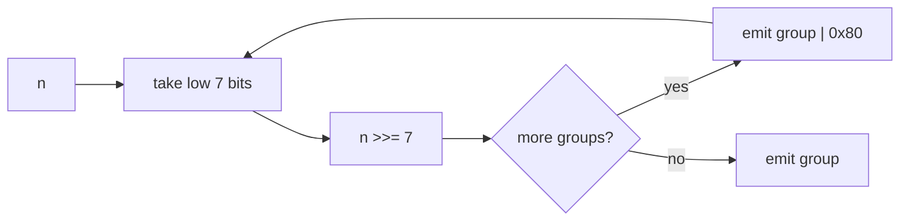

## route

This is the most likely live prompt.

1. Read `uvarint picture`, `encode recipe`, `decode recipe`, and `error taxonomy`.
2. Solve `encode_uvarint` and `decode_uvarint`.
3. Read `zigzag`.
4. Solve `zigzag_encode`, `zigzag_decode`, `encode_svarint`, and `decode_svarint`.
5. Solve `decode_uvarint_seq`.
6. Review [[hinterland/prep/03-varint/notes.fc]].

Depth: `encode_vlq`, `decode_vlq`, `pv_encode`, and `pv_decode`.

## uvarint picture

Uvarint stores an unsigned integer in 7-bit groups. Each byte carries:

- low 7 bits: payload
- high bit: continuation flag

Groups are least-significant first.



Worked vectors:

| value        | bytes             | reason                  |
| ------------ | ----------------- | ----------------------- |
| 0            | `00`              | loop must emit once     |
| 127          | `7f`              | last 1-byte value       |
| 128          | `80 01`           | first 2-byte value      |
| 300          | `ac 02`           | `0x2c + (0x02 << 7)`    |
| 16384        | `80 80 01`        | bit 14 lands in group 2 |
| $2^{64} - 1$ | `ff` x9 then `01` | 10 bytes                |

Length:

$$
\max(1, \lceil \operatorname{bitlen}(n) / 7 \rceil)
$$

So a u64 takes at most 10 bytes. On the 10th byte, only bit 0 may be payload; any higher payload bit is overflow.

## encode recipe

The loop must be do-while shaped because `0` encodes as one byte.

```python shell
def encode_uvarint(n: int) -> bytes:
  out = bytearray()
  while True:
    group = n & 0x7F
    n >>= 7
    if n:
      out.append(group | 0x80)
    else:
      out.append(group)
      return bytes(out)
```

For this kit, `n` must be in `[0, 2**64)`. Reject negatives. Otherwise Python right-shifts a negative toward `-1`, and `while n` can run forever.

## decode recipe

State:

- `acc`
- `shift`
- `count`

```python shell
acc = 0
shift = 0
count = 0
while True:
  b = read_byte()
  count += 1
  acc |= (b & 0x7F) << shift
  if b < 0x80:
    return acc, count
  shift += 7
```

Trace for `ac 02`:

| byte | payload | shift | acc |
| ---- | ------- | ----- | --- |
| `ac` | `2c`    | 0     | 44  |
| `02` | `02`    | 7     | 300 |

C follow-up: cast before shifting.

```c
value |= (uint64_t)(b & 0x7f) << shift;
```

Without the cast, `(b & 0x7f)` is promoted to `int`, and shifting past 31 is undefined.

## error taxonomy

Keep these distinct. This is where interviewers grade actual protocol judgment.

| class     | example                           | recoverable?      | meaning                         |
| --------- | --------------------------------- | ----------------- | ------------------------------- |
| truncated | `80`                              | yes, in streaming | valid prefix, needs more bytes  |
| too long  | `80` x10 then `01`                | no                | u64 can never need an 11th byte |
| overflow  | 10th byte has payload above bit 0 | no                | value is `>= 2**64`             |
| overlong  | `80 00`                           | policy            | shorter encoding exists         |

Canonicality matters when bytes are hashed, signed, cached, or consensus-critical. Protobuf accepts overlong varints, so canonicality is not automatic. State the policy.

## zigzag

Raw two's-complement negative numbers are terrible varints: protobuf `int64 -1` becomes `2**64 - 1`, which takes 10 bytes.

Zigzag maps small signed magnitudes to small unsigned values:

| n            | zigzag       |
| ------------ | ------------ |
| 0            | 0            |
| -1           | 1            |
| 1            | 2            |
| -2           | 3            |
| 2            | 4            |
| $2^{63} - 1$ | $2^{64} - 2$ |
| $-2^{63}$    | $2^{64} - 1$ |

Python:

```python shell
MASK64 = (1 << 64) - 1


def zigzag_encode(n: int) -> int:
  return ((n << 1) ^ (n >> 63)) & MASK64


def zigzag_decode(u: int) -> int:
  return (u >> 1) ^ -(u & 1)
```

The encode mask is mandatory in Python because negative integers have infinitely many sign bits.

## families

| format            | group order                 | length signal             | why care                         |
| ----------------- | --------------------------- | ------------------------- | -------------------------------- |
| LEB128 / protobuf | least-significant first     | continuation bit per byte | likely prompt                    |
| MIDI VLQ          | most-significant first      | continuation bit per byte | decode accumulates left-to-right |
| UTF-8             | most-significant first      | lead byte prefix          | self-synchronizing               |
| PrefixVarint      | lead byte says total length | first-byte tag            | fewer branches                   |
| SQLite varint     | most-significant first      | continuation, 9-byte cap  | byte 9 carries 8 payload bits    |
| Group Varint      | four values per tag byte    | 2 tag bits/value          | bulk u32 throughput              |

Use LEB128 unless the prompt names another format.

## guards

- Negative input to unsigned encode must raise.
- Empty input is truncated, not value 0.
- `0` must emit `00`.
- A length prefix must be checked against `max_frame` before allocation.
- Return convention matters: `(value, consumed)` and `(value, new_offset)` are not interchangeable.
- "Little-endian" in LEB128 means 7-bit group order, not CPU byte order.

## drills

1. Encode 150.
2. Decode `e5 8e 26`.
3. Classify `80`, `80 00`, and `80` x10 then `01`.
4. Explain why `ff 00` is overlong.
5. Compute zigzag of `-3`.
6. Say why protobuf `int64 -1` takes 10 bytes.
7. Give the max encoded length of u32 and u64.
8. Explain the missing-cast C bug.
