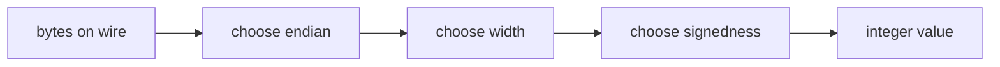

## route

This module is about turning byte positions into values.

1. Read `picture`, `endian recipes`, and `cursor readers`.
2. Solve `read_u32_le`, `read_u32_be`, `write_i64_le`, `bswap32`, and `BinaryReader`.
3. Read `floats` if the prompt mentions IEEE 754.
4. Solve `float32_parts`, `float_to_bits`, and `bits_to_float`.
5. Solve `hexdump`.
6. Review [[hinterland/prep/04-byte-streams/notes.fc]].

## picture

A byte stream contains bytes, not numbers. A decoder supplies the convention.

$$
v = \sum_i b_i \cdot 256^{k(i)}
$$

Little-endian:

$$
k(i) = i
$$

Big-endian:

$$
k(i) = n - 1 - i
$$



## endianness

Memory or wire bytes for `0x11223344`:

| offset | little-endian | big-endian |
| ------ | ------------- | ---------- |
| `+0`   | `44`          | `11`       |
| `+1`   | `33`          | `22`       |
| `+2`   | `22`          | `33`       |
| `+3`   | `11`          | `44`       |

Quick vectors:

- `0xdeadbeef` little-endian: `ef be ad de`
- `0xdeadbeef` big-endian: `de ad be ef`
- network byte order: big-endian
- x86 and Apple Silicon: little-endian

Endianness starts when a value hits memory or the wire. Shifts on an integer value are endian-free.

## endian recipes

Read u32 little-endian:

```python shell
def read_u32_le(buf: bytes, offset: int) -> int:
  v = 0
  for i in range(4):
    v |= buf[offset + i] << (8 * i)
  return v
```

Read u32 big-endian:

```python shell
def read_u32_be(buf: bytes, offset: int) -> int:
  v = 0
  for i in range(4):
    v = (v << 8) | buf[offset + i]
  return v
```

Write little-endian:

```python shell
bytes((v >> (8 * i)) & 0xFF for i in range(width))
```

Signed bridge for width `w`:

- encode: `u = n & ((1 << w) - 1)`, then write unsigned.
- decode: read unsigned `u`, then `u - (1 << w)` if `u >= 1 << (w - 1)`.

Worked i16:

```text
-2 & 0xffff = 0xfffe
little-endian bytes = fe ff
decode 0xfffe -> 0xfffe - 0x10000 = -2
```

## cursor readers

A binary reader needs a cursor invariant:

- check bounds before reading.
- advance the cursor only after a successful read.
- on EOF, leave the cursor where it was.

That invariant lets callers recover or retry with more bytes.

Python tools:

| tool                          | use                             |
| ----------------------------- | ------------------------------- |
| `int.from_bytes` / `to_bytes` | simple integers                 |
| `struct.unpack_from`          | records and floats at offsets   |
| `struct.pack_into`            | write into existing `bytearray` |
| `memoryview`                  | avoid copying slices in loops   |

`struct` prefixes:

| prefix | behavior                                   |
| ------ | ------------------------------------------ |
| `<`    | little-endian, standard sizes, no padding  |
| `>`    | big-endian, standard sizes, no padding     |
| `!`    | network order                              |
| `@`    | native order, native sizes, native padding |

Never parse wire data without an explicit `<` or `>`.

## byte swaps

Byte swap reverses byte order inside a fixed-width integer.

```python shell
def bswap32(x: int) -> int:
  return (
    (x >> 24)
    | ((x >> 8) & 0x0000FF00)
    | ((x << 8) & 0x00FF0000)
    | ((x << 24) & 0xFF000000)
  )
```

`0x12345678 -> 0x78563412`.

C follow-up: `*(uint32_t *)p` on a wire buffer is wrong twice: alignment and strict aliasing. Use `memcpy` into a local or explicit shifts.

## floats

IEEE 754 float32:

```text
[ sign:1 ][ exponent:8 bias 127 ][ mantissa:23 ]
```

Categories:

| exponent | mantissa | meaning   |
| -------- | -------- | --------- |
| 0        | 0        | zero      |
| 0        | nonzero  | subnormal |
| 1..254   | any      | normal    |
| 255      | 0        | infinity  |
| 255      | nonzero  | NaN       |

Memorize:

- `1.0f -> 0x3f800000`
- `-0.0f -> 0x80000000`
- smallest positive subnormal f32 -> `0x00000001`

Bit cast in Python:

```python shell
bits = struct.unpack('<I', struct.pack('<f', value))[0]
value = struct.unpack('<f', struct.pack('<I', bits))[0]
```

NaN is never equal to itself. If you mean bit identity, compare bits.

## hexdump

Canonical row:

```text
00000000  89 50 4e 47 0d 0a 1a 0a  00 00 00 0d 49 48 44 52  |.PNG........IHDR|
```

Read it in this order:

1. offset column
2. sixteen hex bytes
3. ASCII panel
4. endian interpretation of any multi-byte fields

When a codec fails, diff expected and actual hexdumps before rereading code. The bytes usually confess first.

## guards

- `to_bytes()` defaults to big-endian in modern Python; pass byteorder explicitly.
- `struct.unpack` wants exact length; `unpack_from` works with an offset into a larger buffer.
- `bytes[i]` is an `int`; `bytes[i:i+1]` is `bytes`.
- C `char` may be signed; cast to `unsigned char` before shifts.
- raw structs are not portable serialization because of padding and endianness.
- cursor should advance only after successful reads.

## drills

1. Bytes of `0x12345678` in both endians.
2. Decode `b"\x44\x33\x22\x11"` as u32 little-endian.
3. Write `-2` as i16 little-endian.
4. Explain why `struct.calcsize("<BI")` and `struct.calcsize("@BI")` differ.
5. Identify NaN from raw float32 bits.
6. Explain why hashing a raw C struct is wrong.
7. State the hexdump printable ASCII range.
8. Explain the cursor invariant for `BinaryReader`.
