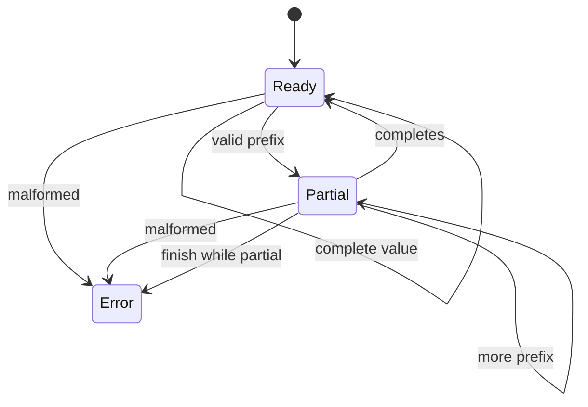
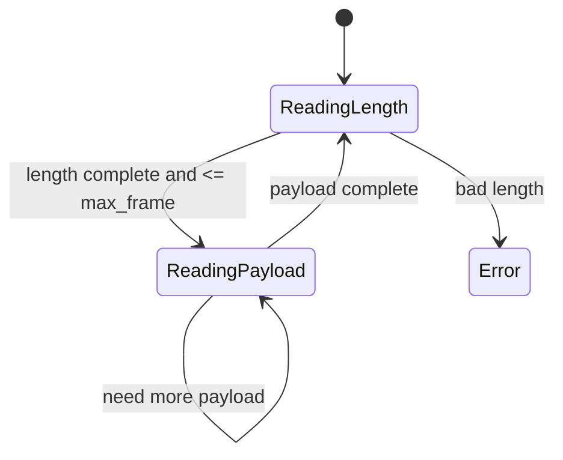
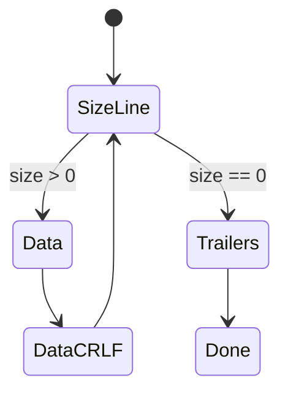

## route

This module turns one-shot decoders into state machines.

1. Read `picture`, `split invariance`, and `varint state`.
2. Solve `StreamingVarintDecoder`.
3. Read `framing`.
4. Solve `FrameDeframer` and `TlvStreamParser`.
5. Skim `utf-8`, `cobs`, and `chunked` for follow-ups.
6. Review [[hinterland/prep/05-decode/notes.fc]].

Depth: `Utf8StreamValidator`, `cobs_encode`, `cobs_decode`, and `ChunkedDecoder`.

## picture

A streaming decoder is a state machine plus retained partial state.



`feed(chunk)` returns items completed by this chunk and keeps enough state to continue later. The chunk boundary is transport noise.

## split invariance

The invariant:

```text
feed(a + b) emits the same total output as feed(a); feed(b)
```

Test three ways:

1. feed the whole byte stream.
2. feed it one byte at a time.
3. feed every two-part split.

This catches almost every streaming bug: state reset too early, cursor off by one, EOF confused with "need more data", and buffer slicing that loses bytes.

Two failure modes:

| mode           | meaning                             | action                            |
| -------------- | ----------------------------------- | --------------------------------- |
| need more data | current bytes are a valid prefix    | keep state, emit what is complete |
| malformed      | no possible future bytes can fix it | raise or mark invalid now         |

`finish()` changes dangling partial state from "need more data" into "truncated".

## varint state

A streaming varint decoder does not need a byte buffer. It digests partial bytes into `(acc, shift, count)`.

```python shell
for b in chunk:
  acc |= (b & 0x7F) << shift
  if b & 0x80:
    shift += 7
  else:
    emit(acc)
    acc = 0
    shift = 0
```

Walk `ac | 02`:

| feed | state                       | output |
| ---- | --------------------------- | ------ |
| `ac` | `acc = 0x2c`, `shift = 7`   | none   |
| `02` | completes `0x2c + (2 << 7)` | 300    |

Guards:

- at most 10 bytes for u64.
- 10th byte can carry only payload bit 0.
- continuation on the 10th byte is too long.
- multi-byte final `00` is overlong if canonicality is required.

## framing

Framing recovers message boundaries from byte soup.

| strategy           | state                      | risk                    | resync         |
| ------------------ | -------------------------- | ----------------------- | -------------- |
| length prefix      | length, payload bytes left | hostile length          | none           |
| delimiter + escape | escape bit                 | worst-case 2x expansion | next delimiter |
| COBS               | current block length       | truncated block         | next `00`      |
| TLV                | tag, length, value         | hostile length          | none           |

Length-prefix rule: check `length > max_frame` immediately after decoding the length, before buffering or allocating payload. A peer claiming a 1 GiB frame should lose at byte 5, not after your process tries to become a database.

Frame deframer state:



TLV gives forward compatibility: unknown tag plus known length means skip and continue. Protobuf is varint-key TLV: key = `(field_number << 3) | wire_type`.

## utf-8

Strict UTF-8 streaming state:

- remaining continuation bytes
- allowed range for the next byte
- sticky invalid flag

Lead bytes:

| lead | next byte constraint | reason                 |
| ---- | -------------------- | ---------------------- |
| `e0` | `a0..bf`             | reject overlong 3-byte |
| `ed` | `80..9f`             | reject surrogates      |
| `f0` | `90..bf`             | reject overlong 4-byte |
| `f4` | `80..8f`             | reject > U+10ffff      |

Invalid outright:

- lone continuation byte
- `c0`, `c1`
- `f5..ff`

EOF with `remaining > 0` is truncated.

## cobs

COBS removes zero bytes so `00` can delimit frames.

Encoding rule:

1. split input at zeros.
2. emit `code = len(run) + 1`.
3. emit the nonzero run.
4. if run length is 254, code is `ff` and no zero is implied.

Worked:

```text
input:  11 22 00 33
runs:   [11 22] zero [33]
output: 03 11 22 02 33
```

Overhead is one byte per 254 payload bytes, about 0.4%, plus the delimiter. Escaping can double the payload in the worst case.

## chunked transfer

HTTP chunked body:

```text
hex-size CRLF
data CRLF
...
0 CRLF
trailers CRLF
```

State machine:



Bugs:

- CRLF split across chunks.
- size line with no maximum length.
- forgetting the CRLF after data.
- trailing bytes after done.

## buffer management

Avoid this:

```python shell
buf = buf[n:]
```

That copies the tail every time. Use:

- `bytearray` plus cursor.
- compact only when dead prefix is large.
- `memoryview` for zero-copy reads.
- max-buffer guard independent of declared frame length.

Every adversarial stream either completes, waits with bounded state, or fails. Anything else is a memory leak with network access, which is a cursed vending machine.

## guards

- empty chunk is a no-op.
- `finish()` must check dangling state.
- after a parse error, state is undefined unless the API specifies resync.
- return independent `bytes` objects, not views into mutable internal buffers.
- streaming varint overflow is policy in Python but memory safety in C.
- a decoder must not grow unbounded under valid prefixes forever.

## drills

1. State split invariance.
2. Walk `ac` then `02` through streaming varint state.
3. Explain why `80 00` is overlong.
4. Explain where the `max_frame` check belongs.
5. COBS encode `11 22 00 33`.
6. Name the UTF-8 constraints after `e0`, `ed`, `f0`, and `f4`.
7. Explain what `finish()` does.
8. Explain why repeated `buf = buf[n:]` is quadratic.
