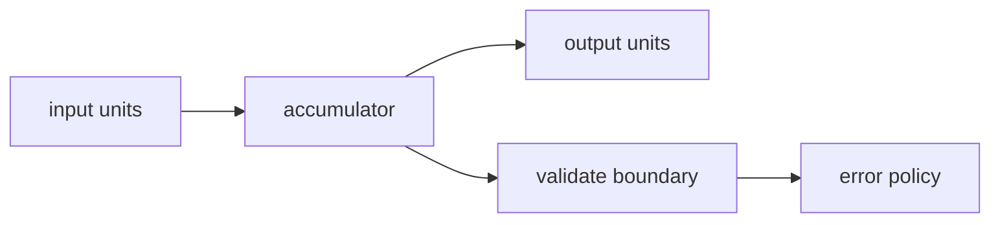
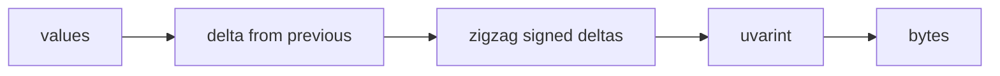

## route

This module is breadth after varints and streams.

1. Read `picture`, `utf-8`, `base64`, and `rle`.
2. Solve `utf8_encode`, `utf8_decode`, `b64_encode`, `b64_decode`, `rle_encode`, and `rle_decode`.
3. Read `delta stack`.
4. Solve `delta_varint_encode` and `delta_varint_decode`.
5. Read `bitpacking` and `checksums`.
6. Solve `bitpack`, `bitunpack`, and `fletcher16`.
7. Review [[hinterland/prep/06-codecs/notes.fc]].

## picture

Every codec is a contract about units, boundaries, and invalid inputs.



Say these before coding:

- input unit
- output unit
- bit order
- length rule
- canonical form
- malformed input behavior

## utf-8

UTF-8 maps a Unicode codepoint to 1-4 bytes.

| range               | bytes                                 | payload |
| ------------------- | ------------------------------------- | ------- |
| `0x0000..0x007f`    | `0xxxxxxx`                            | 7 bits  |
| `0x0080..0x07ff`    | `110xxxxx 10xxxxxx`                   | 11 bits |
| `0x0800..0xffff`    | `1110xxxx 10xxxxxx 10xxxxxx`          | 16 bits |
| `0x10000..0x10ffff` | `11110xxx 10xxxxxx 10xxxxxx 10xxxxxx` | 21 bits |

Worked euro sign:

```text
U+20AC = 0010 0000 1010 1100
split 4|6|6: 0010 000010 101100
emit: e2 82 ac
```

Boundary vectors:

| codepoint  | UTF-8         |
| ---------- | ------------- |
| `0x7f`     | `7f`          |
| `0x80`     | `c2 80`       |
| `0x7ff`    | `df bf`       |
| `0x800`    | `e0 a0 80`    |
| `0x10000`  | `f0 90 80 80` |
| `0x10ffff` | `f4 8f bf bf` |

Decoder validation order:

1. classify lead byte.
2. check enough continuation bytes exist.
3. check each continuation has top bits `10`.
4. assemble codepoint.
5. reject overlongs, surrogates, and values above `0x10ffff`.

Overlongs are security bugs, not tidiness. `c0 af` encodes `/` in two bytes under a sloppy decoder.

## base64

Base64 maps 3 bytes to 4 sextets.

```text
Man = 4d 61 6e
bits = 010011 010110 000101 101110
chars = T W F u
```

Rules:

- alphabet is `A-Z`, `a-z`, `0-9`, `+`, `/`.
- urlsafe swaps `+ /` for `- _`.
- output length with padding is `4 * ceil(n / 3)`.
- 1 leftover byte -> 2 chars plus `==`.
- 2 leftover bytes -> 3 chars plus `=`.
- encoded length mod 4 equal to 1 is impossible.

Validation:

1. padding appears only at the end.
2. no more than two `=`.
3. every non-padding char is in the reverse table.
4. if canonicality matters, reject nonzero dangling bits.

## rle

Three levels:

| format             | shape                         | when it works                      |
| ------------------ | ----------------------------- | ---------------------------------- |
| textual count-char | `"3A1B"`                      | toy only                           |
| byte pair          | `[count][value]`              | long byte runs                     |
| PackBits style     | literal runs plus repeat runs | avoids 2x expansion on random data |

Pair RLE recipe:

```text
scan maximal run
while run length > 255:
  emit ff value
  run length -= 255
emit run length, value
```

Example: 300 `A` bytes -> `ff 41 2d 41`.

Worst case for pair RLE is 2x expansion when every run has length 1. Say that without being asked.

## delta stack

The timestamp / posting-list compression stack:



Worked:

| value | delta | zigzag | uvarint |
| ----- | ----- | ------ | ------- |
| 1000  | 1000  | 2000   | `d0 0f` |
| 1005  | 5     | 10     | `0a`    |
| 1004  | -1    | 1      | `01`    |
| 1010  | 6     | 12     | `0c`    |

Stream: `d0 0f 0a 01 0c`.

Delta overflow matters. For int64 inputs, a delta can need 64 unsigned bits. Do the delta in unsigned mod-$2^{64}$ arithmetic; Python must mask by hand.

## bitpacking

Pack `n` values of width `k` into `ceil(n*k/8)` bytes.

State bit order before coding. This kit uses LSB-first:

- value `i` owns stream bits `[i*k, (i+1)*k)`.
- stream bit `j` lives at bit `j % 8` of byte `j // 8`.
- unused high bits of the last byte are zero.

Accumulator recipe:

```python shell
acc = 0
nbits = 0
for value in values:
  acc |= value << nbits
  nbits += k
  while nbits >= 8:
    out.append(acc & 0xFF)
    acc >>= 8
    nbits -= 8
```

Sanity checks:

- `k = 8` returns the input bytes.
- `k = 1`, values `[1,0,1,1,0,0,1,0]`, byte `0x4d`.

## checksums

| check       | catches                          | misses                           |
| ----------- | -------------------------------- | -------------------------------- |
| byte sum    | single-byte changes              | permutations, balanced changes   |
| XOR         | some flips                       | duplicated changes, permutations |
| Fletcher-16 | position changes better than sum | `0x00` vs `0xff` blind spot      |
| CRC-32      | burst errors                     | adversarial edits                |
| MAC         | adversarial edits                | needs key management             |

Fletcher-16:

```python shell
s1 = 0
s2 = 0
for b in buf:
  s1 = (s1 + b) % 255
  s2 = (s2 + s1) % 255
return (s2 << 8) | s1
```

Know when to step up: CRC for accidental corruption, keyed MAC for adversaries.

## guards

- UTF-8 rejects surrogates `0xd800..0xdfff`.
- UTF-8 rejects lead bytes `c0`, `c1`, and `f5..ff`.
- Base64 length mod 4 equal to 1 is invalid.
- Pair RLE must reject count 0.
- Uvarint decode must cap at 10 bytes for u64.
- Bitpacking must reject values that do not fit in `k` bits.
- Checksum code in C should keep accumulators unsigned.

## drills

1. Encode U+20AC.
2. Explain why `c0 af` is invalid.
3. Base64 encode `"Man"`.
4. How many `=` for 5 bytes?
5. Pair-RLE encode 300 `A` bytes.
6. Encode `[1000, 1005, 1004, 1010]` through delta-zigzag-uvarint.
7. Compute bytes needed for 100 five-bit values.
8. Explain why XOR is a weak checksum.
