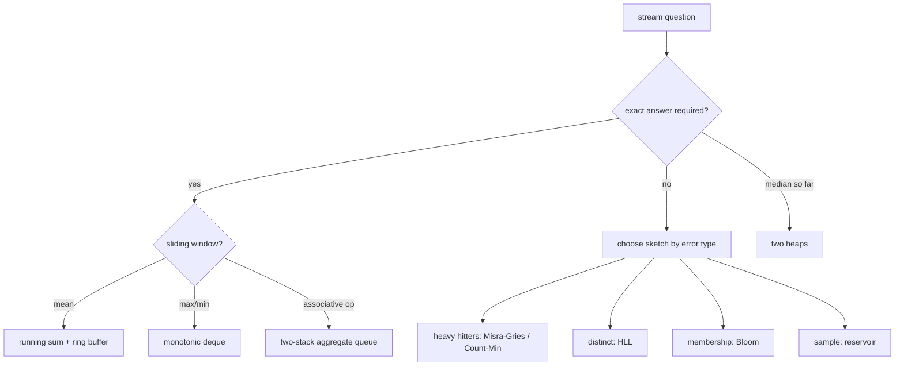
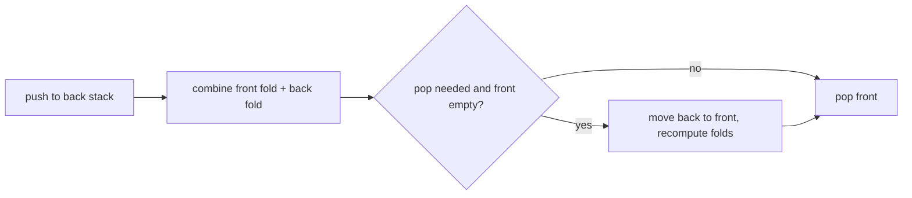

## route

This module is for adjacent systems screens and follow-ups.

1. Read `choice map`.
2. Solve `MovingAverage`, `StreamingMedian`, `sliding_window_max`, and `reservoir_sample`.
3. Read `sketches`.
4. Solve `misra_gries`, `CountMinSketch`, and `SwagWindow`.
5. Skim `systems stream vocabulary`.
6. Review [[hinterland/prep/07-stream-algorithms/notes.fc]].

## choice map

The interview move: name the state, the update cost, the query cost, and the guarantee.

## core exact structures

### moving average

State:

- fixed-size circular buffer
- running sum
- count seen
- next index

Update:

1. subtract overwritten value if full.
2. write new value.
3. add new value.
4. divide by current count.

Cost: O(1) time, O(k) memory.

### running median

State:

- max-heap for low half.
- min-heap for high half.
- sizes differ by at most 1.

Median:

- odd count: top of larger heap.
- even count: mean of both tops.

Cost: `add` O(log n), `median` O(1).

### sliding max

Use a monotonic deque of indices, decreasing by value.

Recipe per index `i`:

1. pop back while `values[back] <= values[i]`.
2. push `i`.
3. pop front if it left the window.
4. front is the max once the first full window exists.

Each index enters and leaves once, so total O(n).

### swag

For any associative operation, use two stacks with running folds.

No inverse required. Sum can subtract, but max, gcd, and matrix product need this shape.

## reservoir sampling

Algorithm R samples `k` items uniformly from a stream of unknown length.

1. Keep first `k` items.
2. For item at zero-based index `i >= k`, draw `j = rng.randrange(i + 1)`.
3. If `j < k`, replace reservoir slot `j`.

Why it works: every item survives to length `n` with probability `k/n`.

Inject the RNG. Global randomness makes tests unstable and cross-process behavior weird for no upside.

## sketches

| need            | structure                | memory                                     | guarantee                                          |
| --------------- | ------------------------ | ------------------------------------------ | -------------------------------------------------- |
| heavy hitters   | Misra-Gries              | `k - 1` counters                           | undercount `<= n/k`; all `> n/k` survive           |
| point frequency | Count-Min                | `ceil(e/eps) * ceil(ln(1/delta))` counters | overestimate by `eps*N` with probability `1-delta` |
| distinct count  | HyperLogLog              | `m` registers                              | relative error `1.04 / sqrt(m)`                    |
| membership      | Bloom                    | bits                                       | false positives only                               |
| quantiles       | GK / t-digest / DDSketch | sketch-specific                            | rank or relative-error guarantee                   |

Concrete denominators to memorize:

- Misra-Gries for 1% heavy hitters: `k = 100`, so 99 counters.
- HLL with `2^14` registers: about 12 KiB and about 0.8% relative error.
- Bloom at 1% false positives: about 9.6 bits per element, about 7 hash probes.

Bias directions:

- Misra-Gries undercounts.
- Count-Min overcounts.
- Bloom has false positives, never false negatives.
- HLL union is register-wise max; small intersections via inclusion-exclusion are bad.

## systems stream vocabulary

Event time: when the event happened. Processing time: when the system saw it.

Watermark: the system's heuristic claim that no events older than time `W` will arrive. Late data is data older than the watermark.

Windows:

- tumbling: fixed, disjoint.
- sliding: fixed length plus slide, overlapping.
- session: per-key gap timeout.

Delivery:

- at-most-once: may lose.
- at-least-once: may duplicate.
- exactly-once processing: replayable source, snapshotted state, idempotent or transactional sink.

Kafka:

- partition order only.
- consumer groups split partitions.
- key choice is ordering choice and skew choice.
- compaction keeps latest value per key.

Backpressure:

- bounded buffers expose overload.
- unbounded buffers hide overload until latency and memory explode.
- consumer lag is a queue, and Little's law applies.

## guards

- sliding-window max stores indices, not values.
- two-heap median must rebalance after every add.
- reservoir's first `k` items should not consume randomness.
- Count-Min cannot enumerate top-k by itself; keep candidates separately.
- Python `hash()` is process-randomized; use a stable hash for sketches.
- t-digest is practical but lacks the worst-case bound DDSketch has.

## drills

1. State the deque invariant for sliding max.
2. Explain Algorithm R replacement probability.
3. Give Misra-Gries memory for 1% heavy hitters.
4. Give Count-Min width and depth.
5. Explain why HLL union is easy and intersection is not.
6. Bloom false positive or false negative?
7. Define event time and processing time.
8. Explain why exactly-once delivery is the wrong phrase.
