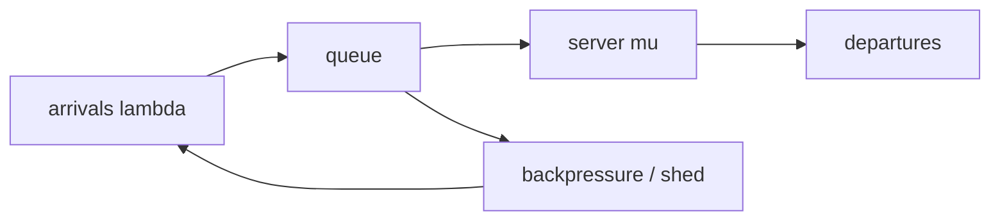

## route

This module turns overloaded systems into math you can say in an interview.

1. Read `picture`, `little's law`, and `m/m/1`.
2. Solve `mm1_metrics`.
3. Read `variance`.
4. Solve `pk_wq`, `kingman_wq`, and `simulate_fifo`.
5. Read `rate limiters`.
6. Solve `TokenBucket`, `SlidingWindowCounter`, and `BoundedQueue`.
7. Review [[hinterland/prep/08-queueing/notes.fc]].

Depth: `two_choices`.

## picture

Three symbols carry the module:

| symbol    | meaning                 |
| --------- | ----------------------- |
| $\lambda$ | arrival rate            |
| $\mu$     | service rate per server |
| $\rho$    | utilization             |

For one server:

$$
\rho = \lambda / \mu
$$

Stability requires $\rho < 1$. At $\rho \ge 1$, the queue has nonnegative drift and mean wait diverges.



Queues exist because arrival and service are variable. Deterministic arrivals plus deterministic service below capacity have zero wait. Real systems pay for utilization and variance.

## little's law

$$
L = \lambda W
$$

Mean number in system equals arrival rate times mean time in system. No Poisson assumption. The only requirement is that `L`, `lambda`, and `W` describe the same boundary.

Uses:

- 500 req/s at 100 ms mean latency means 50 in flight.
- 2000 req/s at 50 ms means 100 in flight.
- if dashboards say 10,000 req/s and 200 ms but only 500 in flight, some queue is outside the measured boundary.

## m/m/1

For Poisson arrivals, exponential service, one server:

$$
W = \frac{1}{\mu - \lambda} = \frac{E[S]}{1 - \rho}
$$

Latency multiplier:

| rho  | W / E[S] |
| ---- | -------- |
| 0.50 | 2        |
| 0.80 | 5        |
| 0.90 | 10       |
| 0.95 | 20       |
| 0.99 | 100      |

The curve is the hockey stick. Going from 50% to 99% utilization costs 50:1 in mean latency multiplier. At 99%, adding 1% capacity halves the multiplier from 100 to 50.

M/M/1 metrics:

$$
L = \frac{\rho}{1-\rho}, \quad L_q = \frac{\rho^2}{1-\rho}
$$

$$
W = \frac{1}{\mu-\lambda}, \quad W_q = \frac{\rho}{\mu-\lambda}
$$

Little's identities:

- `L = lambda * W`
- `Lq = lambda * Wq`
- `L = Lq + rho`

## variance

Pollaczek-Khinchine for M/G/1:

$$
W_q = \frac{\lambda E[S^2]}{2(1-\rho)}
$$

The second moment matters. A small fraction of huge requests can dominate everyone else's wait.

Kingman for G/G/1:

$$
W_q \approx \frac{\rho}{1-\rho} \cdot \frac{C_a^2 + C_s^2}{2} \cdot E[S]
$$

Read it as:

```text
wait ~= utilization blow-up * variability * service time
```

If load is moderate, reduce variability. If utilization is near one, buy capacity or shed load.

FIFO simulator, Lindley recursion:

$$
W_i = \max(0, W_{i-1} + S_{i-1} - (A_i - A_{i-1}))
$$

One pass. No event heap needed for a single FIFO server.

## rate limiters

### token bucket

State:

- tokens
- last timestamp
- rate `r`
- capacity `B`

Lazy refill:

```python shell
tokens = min(B, tokens + (now - last) * r)
last = now
if cost <= tokens:
  tokens -= cost
  allow
else:
  deny
```

Guarantee over interval `T`: admitted cost `<= B + r*T`.

If `cost > B`, it can never be admitted. Return false up front.

### sliding-window counter

Estimate true trailing-window count with two aligned counters:

```text
estimate = previous * (1 - elapsed / window) + current
```

Memory: two counters per key.

Tradeoff:

- exact for aligned windows.
- approximate for true trailing windows.
- can be about 2x wrong in the worst bunched-arrival case.

### bounded queue

Pick a policy:

- reject new work.
- drop oldest.
- block producer.
- shed by deadline or priority.

Unbounded queues convert overload into unbounded latency and eventual OOM. Bounded queues make overload visible while the caller can still choose.

## tails and fan-out

Parallel fan-out multiplies tail risk.

If each of `n` leaves is fast with probability `p`, all leaves are fast with probability:

$$
p^n
$$

At 100 leaves, per-leaf p99 gives `0.99^100 ~= 0.37`. Only 37% of root requests see no slow leaf; the leaf p99 has become near the root median.

Hedging sends a duplicate after a high percentile delay and keeps the first result. It needs a budget. Hedging at p50 doubles load for vibes, which is illegal under the engineers' statute of not being silly.

## load balancing

Power of two choices:

- choose one random server: max load about $\log n / \log\log n$.
- choose two random servers and pick the lighter: max load about $\log\log n / \log 2$.

One extra probe buys a large tail reduction. More than two probes gives smaller marginal wins.

## benchmarking

Open-loop load: arrivals continue at a fixed rate even when the system slows. This matches public internet traffic.

Closed-loop load: each virtual user waits for a response before sending the next request. This hides saturation because arrival rate falls when latency rises.

Coordinated omission: the load generator stalls during the system stall, so the requests that would have observed the queue never enter the histogram. Fix by measuring against intended send time.

## guards

- Little's law requires matching measurement boundaries.
- utilization averages hide peak queues.
- retry counts multiply load during incidents; retry budgets cap it.
- pooling helps, except when cache locality, tenant isolation, or head-of-line blocking dominates.
- token bucket lazy refill should handle backward time by clamping.
- load tests should say open-loop or closed-loop.

## drills

1. 500 req/s at 100 ms latency means how many in flight?
2. M/M/1 at `rho = 0.95`: latency multiplier?
3. What happens at `rho = 0.99` if capacity rises by 1%?
4. Which term makes service whales hurt every request?
5. Token bucket `r=100/s`, `B=500`: max burst after idle?
6. Sliding log vs sliding counter memory.
7. Fan-out 50 leaves at per-leaf p99: chance no leaf is slow?
8. Define coordinated omission.
