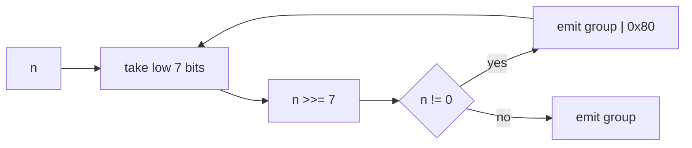
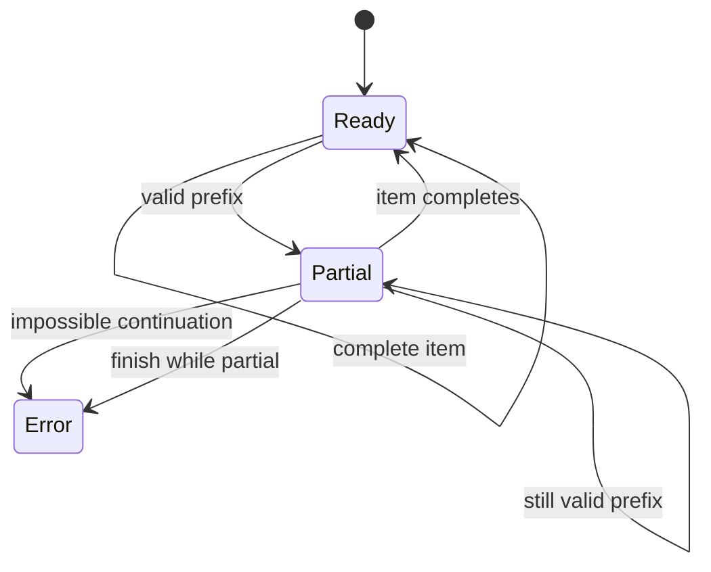

One page for the night before. Define `M32 = (1 << 32) - 1` and `M64 = (1 << 64) - 1` before coding anything with fixed width.

## interview loop

1. Contract: unsigned or signed, width, byte order, one-shot or streaming, canonical or permissive.
2. Examples: write 0, boundary, first-multi-byte, and max-width cases by hand.
3. API: return `(value, consumed)` or `(value, new_offset)`, then keep it consistent.
4. Happy path: implement the simple loop.
5. Guards: bounds, overflow, truncation, canonicality.
6. Properties: `decode(encode(x)) == x`; streaming output independent of chunk splits.

## bit and width idioms

| task                          | idiom                                               |
| ----------------------------- | --------------------------------------------------- |
| fixed-width mask              | `(1 << bits) - 1`                                   |
| to unsigned                   | `x & ((1 << bits) - 1)`                             |
| to signed                     | `((u & M) ^ (1 << (bits - 1))) - (1 << (bits - 1))` |
| logical right shift in Python | `(x & M32) >> n`                                    |
| test bit `k`                  | `(x >> k) & 1`                                      |
| set bit `k`                   | `x \| (1 << k)`                                     |
| clear bit `k`                 | `x & ~(1 << k)`                                     |
| insert field                  | `(word & ~(m << off)) \| ((value & m) << off)`      |
| lowest set bit                | `x & -x`                                            |
| clear lowest set bit          | `x & (x - 1)`                                       |
| power of two                  | `x != 0 and (x & (x - 1)) == 0`                     |
| align down                    | `x & ~(a - 1)`                                      |
| align up                      | `(x + a - 1) & ~(a - 1)`                            |
| is aligned                    | `(x & (a - 1)) == 0`                                |

Python never wraps. C unsigned wraps. C signed overflow and shift-by-width are undefined. That sentence saves live-coding time.

## uvarint

7 payload bits per byte. Least-significant group first. Bit 7 set means another byte follows.



| value        | bytes             |
| ------------ | ----------------- |
| 0            | `00`              |
| 127          | `7f`              |
| 128          | `80 01`           |
| 300          | `ac 02`           |
| 16383        | `ff 7f`           |
| 16384        | `80 80 01`        |
| $2^{64} - 1$ | `ff` x9 then `01` |

Decoder state:

- `acc |= (b & 0x7f) << shift`
- if `b & 0x80`, then `shift += 7`
- otherwise emit and reset

Error classes:

| class     | example            | meaning                          |
| --------- | ------------------ | -------------------------------- |
| truncated | `80`               | valid prefix, needs more bytes   |
| too long  | `80` x10 then `01` | no valid u64 continuation exists |
| overlong  | `80 00`            | shorter encoding exists          |

## zigzag

Signed varint = `uvarint(zigzag(n))`.

| n            | zigzag       |
| ------------ | ------------ |
| 0            | 0            |
| -1           | 1            |
| 1            | 2            |
| -2           | 3            |
| 2            | 4            |
| $2^{63} - 1$ | $2^{64} - 2$ |
| $-2^{63}$    | $2^{64} - 1$ |

Encode in Python: `((n << 1) ^ (n >> 63)) & M64`.

Decode: `(u >> 1) ^ -(u & 1)`.

Protobuf `int64` stores raw two's complement, so `-1` takes 10 bytes. Protobuf `sint64` uses zigzag, so `-1` takes 1 byte.

## bytes

Every fixed-width integer decoder is this polynomial:

$$
v = \sum_i b_i \cdot 256^{k(i)}
$$

Little-endian: byte 0 is the $256^0$ digit. Big-endian: byte 0 is the highest digit.

| value        | little-endian | big-endian    |
| ------------ | ------------- | ------------- |
| `0x12345678` | `78 56 34 12` | `12 34 56 78` |
| `0xdeadbeef` | `ef be ad de` | `de ad be ef` |

`struct` prefixes:

| prefix | meaning                                    |
| ------ | ------------------------------------------ |
| `<`    | little-endian, standard sizes, no padding  |
| `>`    | big-endian, standard sizes, no padding     |
| `!`    | network order, big-endian                  |
| `@`    | native order, native sizes, native padding |

Never parse wire data with `@`.

## streaming decoders

The invariant:

```text
feed(a + b) == feed(a) followed by feed(b)
```

The EOF rule: incomplete state is "need more data" until `finish()`, then it is truncated.



Length prefixes need a `max_frame` guard immediately after the length is decoded. Waiting until the payload arrives gives the attacker your buffer.

## codecs

| codec      | first thing to say                    | traps                                                             |
| ---------- | ------------------------------------- | ----------------------------------------------------------------- |
| UTF-8      | lead byte declares 1-4 byte length    | overlongs, surrogates, > U+10ffff                                 |
| base64     | 3 bytes become 4 sextets              | len mod 4 == 1, bad `=`, dangling bits                            |
| RLE        | count/value pairs split runs greedily | pair RLE can double random data                                   |
| bitpacking | state LSB-first or MSB-first          | pad bits must be zero                                             |
| checksum   | know the threat model                 | XOR is weak, CRC is for accidental corruption, MAC is adversarial |

UTF-8 boundaries:

- `0x7f -> 7f`
- `0x80 -> c2 80`
- `0x7ff -> df bf`
- `0x800 -> e0 a0 80`
- `0x10000 -> f0 90 80 80`
- `0x10ffff -> f4 8f bf bf`

## sketches

| structure       | memory                                     | guarantee                                       | use               |
| --------------- | ------------------------------------------ | ----------------------------------------------- | ----------------- |
| reservoir       | `k` items                                  | uniform sample from unknown length              | sampling          |
| Misra-Gries     | `k - 1` counters                           | undercount `<= n/k`; all `> n/k` survive        | heavy hitters     |
| Count-Min       | `ceil(e/eps) * ceil(ln(1/delta))` counters | overestimate by `eps * N` with prob `1 - delta` | point frequencies |
| HyperLogLog     | `2^14` 6-bit registers ~= 12 KiB           | relative error about 0.8%                       | distinct count    |
| Bloom           | about 9.6 bits/item at 1% FP               | false positives only                            | membership        |
| two heaps       | all values                                 | exact median                                    | running median    |
| monotonic deque | window indices                             | exact max in O(n) total                         | sliding max       |

## queueing

Little's law:

$$
L = \lambda W
$$

M/M/1 sojourn:

$$
W = \frac{E[S]}{1 - \rho}
$$

| rho  | W / E[S] |
| ---- | -------- |
| 0.50 | 2        |
| 0.80 | 5        |
| 0.90 | 10       |
| 0.95 | 20       |
| 0.99 | 100      |

Pollaczek-Khinchine:

$$
W_q = \frac{\lambda E[S^2]}{2(1 - \rho)}
$$

Kingman:

$$
W_q \approx \frac{\rho}{1-\rho} \cdot \frac{C_a^2 + C_s^2}{2} \cdot E[S]
$$

Rate-limiters:

- Token bucket: burst up to `B`, sustained `r`, lazy refill.
- Sliding log: exact, one timestamp per admitted request.
- Sliding-window counter: two counters, approximate trailing window.

Fan-out tail: if each of `n` leaves is fast with probability `p`, then all leaves are fast with probability `p^n`.
