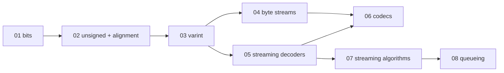

Prep for a 60-minute algorithmic code screen on encoding and decoding.

This kit is now meant to be learned in layers:

1. **shape**: learn the mental model and one diagram.
2. **recipe**: implement the smallest correct algorithm.
3. **guards**: add the failure cases the interviewer will probe.
4. **recall**: review `notes.fc`, then solve again from a clean stub.

The main path is [[hinterland/prep/03-varint/notes]], [[hinterland/prep/05-decode/notes]], [[hinterland/prep/04-byte-streams/notes]], and [[hinterland/prep/06-codecs/notes]]. Use [[hinterland/prep/01-bits/notes]] and [[hinterland/prep/02-unsigned-alignment/notes]] as the machinery layer. Use [[hinterland/prep/07-stream-algorithms/notes]] and [[hinterland/prep/08-queueing/notes]] for systems follow-ups.

## map



## modules

| module                                          | learn first                                | first solves                                                                 | recall deck                                        |
| ----------------------------------------------- | ------------------------------------------ | ---------------------------------------------------------------------------- | -------------------------------------------------- |
| [[hinterland/prep/01-bits/notes]]               | masks, shifts, bit fields                  | `pack_rgba`, `extract_field`, `next_pow2`, `reverse_bits32`                  | [[hinterland/prep/01-bits/notes.fc]]               |
| [[hinterland/prep/02-unsigned-alignment/notes]] | wraparound, sign bridges, alignment        | `align_up`, `to_unsigned`, `to_signed`, `struct_layout`                      | [[hinterland/prep/02-unsigned-alignment/notes.fc]] |
| [[hinterland/prep/03-varint/notes]]             | uvarint, malformed input, zigzag           | `encode_uvarint`, `decode_uvarint`, `decode_uvarint_seq`                     | [[hinterland/prep/03-varint/notes.fc]]             |
| [[hinterland/prep/04-byte-streams/notes]]       | endian reads, binary cursors, floats       | `read_u32_le`, `read_u32_be`, `BinaryReader`, `hexdump`                      | [[hinterland/prep/04-byte-streams/notes.fc]]       |
| [[hinterland/prep/05-decode/notes]]             | split-invariance, finish, max-frame guards | `StreamingVarintDecoder`, `FrameDeframer`, `TlvStreamParser`                 | [[hinterland/prep/05-decode/notes.fc]]             |
| [[hinterland/prep/06-codecs/notes]]             | UTF-8, base64, RLE, delta varints          | `utf8_decode`, `b64_decode`, `rle_decode`, `delta_varint_decode`             | [[hinterland/prep/06-codecs/notes.fc]]             |
| [[hinterland/prep/07-stream-algorithms/notes]]  | sketches, windows, heaps                   | `MovingAverage`, `StreamingMedian`, `sliding_window_max`, `reservoir_sample` | [[hinterland/prep/07-stream-algorithms/notes.fc]]  |
| [[hinterland/prep/08-queueing/notes]]           | Little's law, hockey stick, rate limiters  | `TokenBucket`, `SlidingWindowCounter`, `mm1_metrics`, `kingman_wq`           | [[hinterland/prep/08-queueing/notes.fc]]           |

## practice loop

Each module has `notes.md`, `notes.fc`, `problems.py`, `solutions.py`, and `test_problems.py`, except the overview pages.

From inside a module directory:

```bash
python3 test_problems.py
PRACTICE_MODULE=solutions python3 test_problems.py
```

Use this loop:

1. Read the `route`, `picture`, and `recipe` sections only.
2. Implement the first listed stubs cold.
3. Run the harness.
4. Review only the failing function in `solutions.py`.
5. Delete your attempt and solve the same stub again.
6. Review the matching `notes.fc` deck.

Misses count until the clean re-solve passes. Reading a solution once is not learning. It is merely witnessing code happen, which is frankly mid.

## screen order

If the screen is soon:

1. [[hinterland/prep/03-varint/notes]]
2. [[hinterland/prep/05-decode/notes]]
3. [[hinterland/prep/04-byte-streams/notes]]
4. [[hinterland/prep/06-codecs/notes]]
5. [[hinterland/prep/cheatsheet]]

If you have five days, follow [[hinterland/prep/study]].
