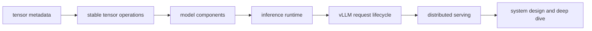
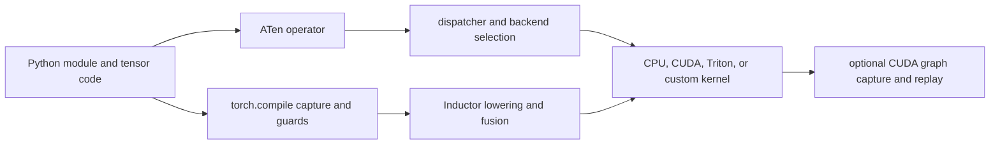
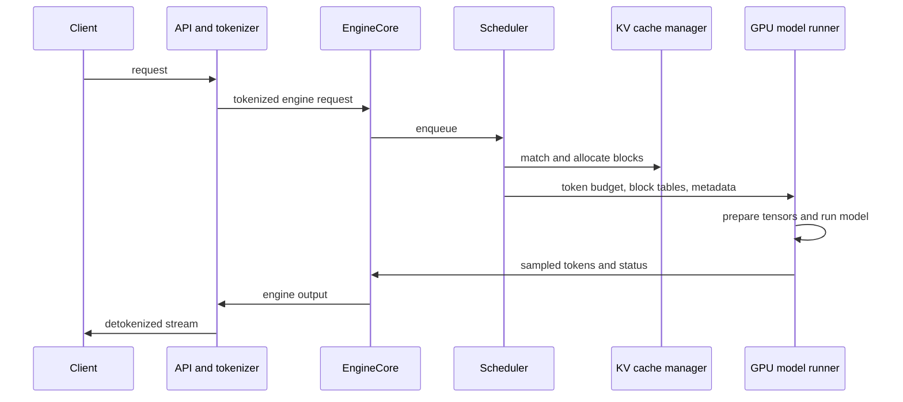

# core map

The shortest route is tensor semantics, inference components, model execution, vLLM state ownership, performance reasoning, system design, and one deep project. Each layer depends on the previous one.



## priority 0: tensor metadata

Every PyTorch tensor carries shape, stride, dtype, device, storage offset, layout, and autograd state. Most coding failures in this role-shaped surface begin here.

| concept                    | interview bar                                                                                 | typical failure                                                        |
| -------------------------- | --------------------------------------------------------------------------------------------- | ---------------------------------------------------------------------- |
| shape                      | name batch, sequence, head, beam, vocabulary, block, and feature axes before coding           | a broadcast succeeds with the wrong semantic alignment                 |
| stride and storage offset  | determine whether an operation is a view, a copy, or incompatible with `view`                 | transpose followed by `view` fails or `reshape` hides an allocation    |
| aliasing                   | know when input and output share storage and whether mutation is legal                        | an in-place cache update changes another logical view                  |
| indexing                   | distinguish basic-index views from advanced-index copies; use gather and scatter deliberately | hidden allocations or batch mixing                                     |
| dtype                      | select accumulation precision and know when casting is required                               | fp16 logits overflow or quantization scales apply along the wrong axis |
| device and synchronization | keep tensors colocated and identify host-device synchronization                               | `.item()`, printing, or a device copy stalls the decode loop           |

Read [tensor views](https://docs.pytorch.org/docs/stable/tensor_view.html), [`Tensor.view`](https://docs.pytorch.org/docs/stable/generated/torch.Tensor.view.html), [broadcasting semantics](https://docs.pytorch.org/docs/stable/notes/broadcasting.html), and [`torch.gather`](https://docs.pytorch.org/docs/stable/generated/torch.gather.html).

## priority 1: stable inference operations

Own these from an empty editor:

- masked fill with a defined all-masked-row contract
- `logsumexp`, `softmax`, and `log_softmax` in a stable accumulation dtype
- top-k and top-p filtering
- deterministic sampling with an explicit `torch.Generator`
- beam parent and token selection with `gather`
- last-valid-token gather for ragged batches
- in-place cache writes with unchanged storage addresses
- vectorized block-table lookup

For beam search, use `log_softmax` rather than `softmax().log()`. For sampling, require every probability row to be finite, nonnegative, and have positive mass. For low-precision logits, accumulate normalization in fp32 unless the contract explicitly says otherwise.

Read [`softmax`](https://docs.pytorch.org/docs/stable/generated/torch.nn.functional.softmax.html), [`log_softmax`](https://docs.pytorch.org/docs/stable/generated/torch.nn.functional.log_softmax.html), [`topk`](https://docs.pytorch.org/docs/stable/generated/torch.topk.html), and [`multinomial`](https://docs.pytorch.org/docs/stable/generated/torch.multinomial.html).

## priority 2: modules and inference state

Know the boundary among parameters, buffers, ordinary attributes, and request state.

| state                 | owner                     | example                                                |
| --------------------- | ------------------------- | ------------------------------------------------------ |
| parameter             | model                     | projection or embedding weight                         |
| persistent buffer     | model state dictionary    | precomputed RoPE frequency table when persistence fits |
| nonpersistent buffer  | module device/dtype state | derived lookup table that should move with the module  |
| request state         | runtime                   | sequence length, block table, sampling parameters      |
| mutable cache storage | cache manager and worker  | K/V pages and slot mapping                             |

`model.eval()` changes module behavior such as dropout. `torch.no_grad()` disables gradient recording. `torch.inference_mode()` also removes view tracking and version-counter overhead, with stricter rules on later autograd use. These mechanisms solve different problems.

Read [`nn.Module`](https://docs.pytorch.org/docs/stable/generated/torch.nn.Module.html), [module notes](https://docs.pytorch.org/docs/stable/notes/modules.html), and [autograd grad modes](https://docs.pytorch.org/docs/stable/notes/autograd.html).

## priority 3: model implementation ladder

Use [[hinterland/prep/inferact/model-builds|the model-build lane]] as the primary coding curriculum. The goal is to turn a config, diagram, or paper fragment into a complete PyTorch module, then connect that module to inference-runtime state. The P-series drills repair individual mechanisms when a full build exposes a gap.

### dense decoder block

Be able to implement and explain:

1. token embedding
2. RMSNorm
3. Q, K, and V projections
4. RoPE at the correct positions
5. grouped-query attention
6. output projection and residual
7. second RMSNorm
8. SwiGLU MLP and residual
9. final norm and logits projection

The shape ledger should include:

```text
hidden: [batch, tokens, hidden_size]
q:      [batch, query_heads, tokens, head_dim]
k, v:   [batch, kv_heads, tokens, head_dim]
scores: [batch, query_heads, query_tokens, kv_tokens]
logits: [batch, tokens, vocabulary]
```

Use [`scaled_dot_product_attention`](https://docs.pytorch.org/docs/stable/generated/torch.nn.functional.scaled_dot_product_attention.html) as the optimized reference boundary. Know that its dropout argument remains active when greater than zero, even when the surrounding module is in evaluation mode.

### inference variants

| variant                 | mechanism to own                                                            | runtime pressure                                                 |
| ----------------------- | --------------------------------------------------------------------------- | ---------------------------------------------------------------- |
| grouped-query attention | more Q heads than K/V heads; queries share K/V groups                       | lower KV memory and repeated-head indexing                       |
| mixture of experts      | top-k routing, capacity, expert dispatch, weighted combine                  | load skew, all-to-all, expert parallelism, quantized expert GEMM |
| multimodal              | media processing, encoder outputs, placeholder-token merge, encoder cache   | TTFT variance, cache identity, large visual-token counts         |
| hybrid attention/SSM    | attention KV plus recurrent state with different cache semantics            | hybrid cache grouping, alignment, prefix validity                |
| diffusion serving       | iterative denoising with repeated model calls and scheduler-dependent state | batch evolution, graph capture, latency and memory reuse         |
| speculative decoding    | draft proposals, target verification, acceptance, rollback, bonus token     | lookahead cache slots, batch dependence, correctness             |

The live Inferact role explicitly values paper-to-code implementation. For an unfamiliar architecture, first write the config invariants, module tree, state and tensor contracts, and hidden tests. Then implement a reference path and identify which vLLM interfaces the architecture stresses.

The implementation progression is:

```text
minimal causal LM
  -> Llama-style GQA, RoPE, RMSNorm, and SwiGLU
  -> functional prefill and decode cache
  -> vLLM-shaped flattened-token model port
  -> MoE and multimodal variants
  -> hybrid recurrent state or diffusion model
  -> strict weight loading and paper-fragment capstone
```

Read the official [PyTorch transformer-building-blocks tutorial](https://docs.pytorch.org/tutorials/intermediate/transformer_building_blocks.html) and [vLLM basic-model implementation guide](https://docs.vllm.ai/en/v0.17.0/contributing/model/basic/) after attempting the reference build.

## priority 4: PyTorch execution internals

The interview bar is a mechanistic map, not memorizing every dispatcher class.



Know these tradeoffs:

- `torch.compile` specializes under guards and may recompile when shapes, values, or Python control flow violate them.
- graph breaks preserve correctness and lose fusion or whole-graph optimization opportunities.
- custom operators define an opaque boundary when the compiler should call a kernel rather than trace through its implementation.
- CUDA graphs reduce Python and launch overhead by replaying fixed work with stable memory addresses.
- dynamic request batches need padding, piecewise capture, bounded capture sizes, or an eager fallback.
- profiling must separate compilation and warmup from steady-state execution.

Read [`torch.compile`](https://docs.pytorch.org/docs/stable/generated/torch.compile.html), [custom operators](https://docs.pytorch.org/tutorials/advanced/custom_ops_landing_page.html), [CUDA semantics](https://docs.pytorch.org/docs/stable/notes/cuda.html), and [PyTorch profiler](https://docs.pytorch.org/tutorials/recipes/recipes/profiler_recipe.html).

## priority 5: vLLM request lifecycle

Carry one exact owner map:



The V1 scheduler's central invariant is that each request has computed tokens catching up to known prompt, output, and speculative tokens. Scheduling token counts instead of rigid prefill and decode batches permits chunked prefill, prefix hits, lookahead slots, and external KV loads inside one model step.

The owner chain to explain:

1. frontend owns HTTP, request parsing, tokenization, multimodal preprocessing, detokenization, and streaming
2. engine core owns request lifecycle and output coordination
3. scheduler owns waiting and running state plus per-step token admission
4. KV cache manager owns block matching, allocation, reference counts, prefix reuse, and eviction
5. model runner owns persistent batch tensors, input preparation, graph dispatch, forward execution, and sampling boundaries
6. attention backend owns compatible paged-KV metadata and kernel execution
7. distributed layer owns process groups, rank-local shards, collectives, and connector transport

Read the [architecture overview](https://docs.vllm.ai/en/latest/design/arch_overview/), [[thoughts/vllm|the garden vLLM note]], [[thoughts/Continuous batching|continuous batching]], and [[thoughts/paged attention|paged attention]].

## priority 6: KV and scheduler mechanics

### KV capacity

For a decoder-only model, begin with:

$$
\text{KV bytes per token} = 2 \cdot L \cdot H_{KV} \cdot D \cdot b
$$

where the factor of two is K and V, the model has `L` layers, `H_KV` KV heads, head dimension `D`, and `b` bytes per element. Then account for tensor or context sharding, block rounding, hybrid cache groups, quantization scales, reserved watermarks, and non-KV runtime memory.

### prefix caching

vLLM hashes complete blocks from the parent hash, block tokens, and identity data such as LoRA, multimodal, prompt-embedding, and cache-salt information. A useful answer distinguishes matching, ownership, reference counting, reusable free blocks, and eviction order.

### chunked prefill

Decode is usually bandwidth-bound. Prefill is usually compute-heavy. Chunked prefill uses the remaining per-step token budget to mix them, which can increase utilization while protecting ITL. Chunk size and token budget still expose a TTFT, ITL, and throughput frontier.

### disaggregated prefill and decode

Separate fleets can tune TTFT and ITL independently. KV transfer becomes a critical path, a capacity consumer, and a failure surface. Disaggregation does not create throughput for free.

Read [prefix caching](https://docs.vllm.ai/en/stable/design/prefix_caching/), [optimization and chunked prefill](https://docs.vllm.ai/en/stable/configuration/optimization/), [disaggregated prefill](https://docs.vllm.ai/en/latest/features/disagg_prefill/), [[thoughts/KV connector|KV connectors]], [[thoughts/KV offloading|KV offloading]], and [[thoughts/PD disaggregated serving|P/D serving]].

## current vLLM source tour

The local vLLM checkout at `/Users/aarnphm/workspace/vllm` provides a concrete reading route. Read the owner abstractions before the large model-runner file.

| stop | source path                                                                   | question it answers                                                               |
| ---: | ----------------------------------------------------------------------------- | --------------------------------------------------------------------------------- |
|    1 | `vllm/model_executor/models/registry.py` and `model_loader/`                  | How does a Hugging Face architecture string become a loaded model module?         |
|    2 | `vllm/distributed/parallel_state.py`                                          | Which ranks and process groups own TP, PP, DP, EP, and context parallelism?       |
|    3 | `vllm/model_executor/layers/linear.py` and `layers/quantization/`             | How do sharded linear layers compose local GEMMs, collectives, and quantization?  |
|    4 | `vllm/model_executor/models/llama.py`                                         | What does one complete dense decoder implementation look like in vLLM?            |
|    5 | `vllm/model_executor/layers/attention/attention.py` and `vllm/v1/attention/`  | Where do the model facade, cache update, metadata, backend, and kernel split?     |
|    6 | `vllm/v1/kv_cache_interface.py` and `vllm/v1/core/kv_cache_manager.py`        | How do logical blocks become physical KV tensors and block tables?                |
|    7 | `vllm/v1/request.py`, `vllm/v1/core/sched/scheduler.py`, and `engine/core.py` | How does continuous batching move requests through states and token budgets?      |
|    8 | `vllm/v1/worker/gpu_model_runner.py`                                          | How does scheduler output become persistent GPU buffers, model input, and output? |
|    9 | `vllm/v1/sample/sampler.py` and `sample/ops/topk_topp_sampler.py`             | How do logits, masks, penalties, random sampling, and TP vocabulary meet?         |
|   10 | `vllm/compilation/decorators.py`, `backends.py`, and `piecewise_backend.py`   | Where does vLLM partition and lower `torch.compile` graphs?                       |
|   11 | `vllm/v1/cudagraph_dispatcher.py` and `vllm/compilation/cuda_graph.py`        | How does a batch choose eager, piecewise, or full CUDA graph replay?              |
|   12 | `vllm/model_executor/custom_op.py`, `vllm/_custom_ops.py`, and `csrc/`        | How does Python reach a registered PyTorch operator and a CUDA kernel?            |

The high-yield chain is:

```text
architecture string
  -> model registry and loader
  -> LlamaForCausalLM
  -> tensor-parallel layers
  -> attention facade and backend
  -> scheduler and logical KV blocks
  -> GPU model runner and physical tensors
  -> logits and sampling
  -> torch.compile partitioning
  -> CUDA graph replay
  -> torch.ops, C++ registration, CUDA kernel
```

For a short preparation window, read stops 4, 5, 7, 8, 10, and 12. Explain the boundary between each pair before opening the next file.

## priority 7: distributed inference

| method | state split                        | dominant communication or cost                       | useful when                                             |
| ------ | ---------------------------------- | ---------------------------------------------------- | ------------------------------------------------------- |
| TP     | weight and activation dimensions   | row-output all-reduce; optional column-output gather | one model needs multiple tightly connected accelerators |
| PP     | layer ranges                       | stage-to-stage activations and pipeline bubbles      | weak cross-node links or uneven stage memory            |
| DP     | replicated engines and separate KV | request routing and optional synchronized features   | capacity grows through independent replicas             |
| EP     | experts                            | token dispatch and all-to-all                        | MoE weights or compute need sharding                    |
| CP     | sequence or KV context dimensions  | attention-specific exchange and reductions           | context length becomes the limiting dimension           |

Use tensor collectives for tensor data. Object collectives serialize through CPU paths and can introduce synchronization, host copies, and asymmetric work. Every rank must enter collectives with compatible order, shape, dtype, and group semantics.

Read [PyTorch distributed](https://docs.pytorch.org/docs/stable/distributed.html), [tensor parallelism](https://docs.pytorch.org/docs/stable/distributed.tensor.parallel.html), [vLLM parallelism and scaling](https://docs.vllm.ai/en/stable/serving/parallelism_scaling/), and [[thoughts/distributed inference|distributed inference]].

## priority 8: performance language

For any optimization, state this tuple:

```text
workload -> baseline -> measured bottleneck -> mechanism -> result -> regression -> correctness bound
```

Use the right serving metrics:

- TTFT for initial responsiveness
- the ITL distribution for per-token jitter and tail stalls
- TPOT for average per-request decode cadence
- end-to-end latency for user completion
- goodput for throughput that meets latency SLOs
- prompt and output tokens per second for phase-specific capacity
- queue time, running and waiting requests, and preemptions for scheduler pressure
- KV utilization and prefix hit tokens for cache behavior
- accepted draft tokens and verifier time for speculative decoding
- transfer bytes, latency, and failure rate for KV connectors

For kernels, state grid, tile, pointer formula, mask, bytes moved, operations, occupancy limiter, and benchmark evidence.

## priority 9: system-design loop

Use this order on every design:

1. define model, workload, arrival process, input and output lengths, SLOs, quality, and hardware
2. estimate weights, KV bytes per token, concurrency, and communication volume
3. draw request and state ownership
4. choose batching, cache, parallelism, and routing policies
5. define overload, cancellation, retry, and failure recovery
6. instrument request SLOs and server causes
7. identify the first two experiments that decide among designs

A diagram without a capacity estimate is decoration. A capacity estimate without a workload distribution is numerology.

## priority 10: technical deep dive

Select one project with the strongest combination of ownership, mechanism, measurements, failures, correctness, and operational evidence. Use two projects only when the second covers a distinct layer.

The primary story should fit this causal chain:

```text
claim -> boundary -> workload -> baseline evidence -> diagnosis -> intervention -> ablation -> correctness -> deployment -> residual risk
```

Prepare an eight-to-twelve-slide deck, a two-page memo, an architecture diagram, a request-lifecycle diagram, one profiler trace, benchmark and ablation tables, a failure ledger, a correctness matrix, a deployment timeline, and an appendix with formulas.

Every claim should survive these prompts:

- how do you know
- what did you personally own
- what was the first wrong hypothesis
- what regressed
- what invariant protected correctness
- what would change under another workload, model, accelerator, or SLO
- which measurement would prove your diagnosis wrong

## reuse map

- PagedAttention: [[thoughts/paged attention|paged attention]]
- continuous batching: [[thoughts/Continuous batching|continuous batching]]
- speculative decoding: [[thoughts/Speculative decoding|speculative decoding]]
- radix and prefix reuse: [[thoughts/radix attention|radix attention]]
- P/D disaggregation: [[thoughts/PD disaggregated serving|P/D disaggregated serving]]
- distributed inference: [[thoughts/distributed inference|distributed inference]]
- KV compression and offload: [[thoughts/KV compression|KV compression]] and [[thoughts/KV offloading|offloading]]
- GPU fundamentals: [[thoughts/GPU programming|GPU programming]]
- FlashAttention: [[thoughts/flash attention|FlashAttention]]
- quantization: [[thoughts/quantization|quantization]]
- structured outputs: [[thoughts/structured outputs|structured outputs]]
- general coding: [[hinterland/prep/nv/core|NVIDIA core]]
- queues and streams: [[hinterland/prep/bt/08-queueing/notes|queueing]] and [[hinterland/prep/bt/07-stream-algorithms/notes|stream algorithms]]
