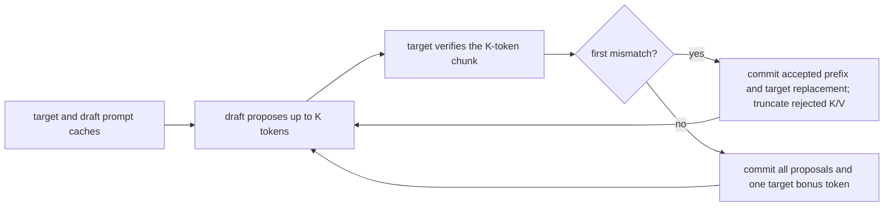

# tiny gpt interview lab

This lab composes [[hinterland/prep/inferact/model-builds#M01: minimal decoder-only language model|M01]] with the functional-cache slice of [[hinterland/prep/inferact/model-builds#M03: cache-aware prefill and decode|M03]]. It keeps M01's ordinary multi-head attention, learned absolute positions, LayerNorm, and GELU so the cache mechanism remains visible.

> [!warning] executable reference
> `labs/tiny_gpt.py` is an executable reference for comparison after a timed attempt. It is not an interview answer to memorize. Reconstructing its invariants from a blank editor is the exercise.

The checked-in files cover the model, functional-cache, and runtime-cache contracts:

- `labs/tiny_gpt.py` defines the reference model and public contract.
- `labs/test_tiny_gpt.py` turns hidden-interview invariants into executable checks using real PyTorch computation.
- `labs/cache_aware_lm.py` defines the mixed-prefix behavioral reference.
- `labs/test_cache_aware_lm.py` grades an advanced M03 artifact through two adapter factories.
- `labs/kv_cache.py` defines fixed-capacity request-owned K/V storage and explicit position writes.
- `labs/test_kv_cache.py` grades stable storage, batched append, prefix seeding, and model parity.
- `labs/prefix_cache.py` defines an exact-prefix snapshot cache and a runner over `CacheAwareCausalLM`.
- `labs/test_prefix_cache.py` grades aligned lookup, snapshot ownership, LRU, and model parity.
- `labs/chunked_prefill.py` threads functional cache state through bounded prompt chunks.
- `labs/test_chunked_prefill.py` grades full-forward parity, seeded-cache continuation, and position origins.
- `labs/speculative_decoding.py` implements lossless greedy draft-and-verify decoding.
- `labs/test_speculative_decoding.py` grades acceptance, rejection rollback, bonus tokens, EOS, and target parity.

The four runtime helpers assume well-formed tensors, compatible models, valid positions, sufficient cache capacity, and evaluation mode. Their tests grade inference semantics and state ownership rather than malformed-input behavior. The model references retain their own public contracts.

The harness imports `tiny_gpt` by default. Set `TINY_GPT_MODULE` to grade another module exposing `GPTConfig`, `CausalLMOutput`, and `TinyGPT` through the same graded interface. This keeps the test contract fixed while the implementation begins empty.

## blank-editor stages

Start the first slice in an empty editor with only this page open. Continue later stages in the same scratch file. A clean re-solve on a later day starts from an empty editor again, following [[hinterland/prep/inferact/index#definition of learned|the definition of learned]]. Record the first wrong decision before opening the reference.

Create the blank-editor attempt at `content/hinterland/prep/inferact/labs/tiny_gpt_attempt.py`, then grade it without editing or copying the tests:

```bash
TINY_GPT_MODULE=tiny_gpt_attempt uv run --project content/thoughts/tsfm/lecture-3-exercise pytest content/hinterland/prep/inferact/labs/test_tiny_gpt.py -q
```

| stage | time | build                                                                                                                                                           | stop condition                                                                                    |
| ----: | ---: | --------------------------------------------------------------------------------------------------------------------------------------------------------------- | ------------------------------------------------------------------------------------------------- |
|     1 |  10m | write the config invariants, module tree, shape ledger, state owners, and invalid-input contract                                                                | every learned tensor has a module owner and every attention dimension has a name                  |
|     2 |  45m | implement token and learned-position embeddings, a `ModuleList` of pre-norm blocks, ordinary MHA through SDPA, GELU MLPs, final LayerNorm, and the tied LM head | logits have shape `[B, T, V]` and a changed future token cannot affect earlier logits             |
|     3 |  20m | add shifted cross-entropy, `ignore_index=-100`, evaluation-aware dropout, strict serialization, and a finite backward pass                                      | the M01 test tier passes and the tied weights are one `Parameter` object                          |
|     4 |  30m | define `LayerKV`, validate one cache pair per layer, append K/V functionally, and return cache state only when requested                                        | each returned K/V tensor has shape `[B, H, S, D]` and caller-owned cache tensors remain unchanged |
|     5 |  45m | derive absolute query and key positions, build a rectangular boolean mask, and prove full, tokenwise, and chunked parity                                        | full and cached logits and final caches agree within fp32 tolerance                               |
|     6 |  30m | implement greedy decoding for temperature zero, generator-driven sampling for positive temperature, EOS stopping, and context checks                            | equal generator seeds reproduce tokens and greedy EOS ends the loop                               |
|     7 |  15m | in the scheduled test block, run the cache and generation tiers, inspect failures by owner, then run the complete suite                                         | every tier passes and the first-wrong-decision log names a mechanism rather than a symptom        |

The first three stages consume M01's seventy-five-minute implementation budget. Stages 4 through 6 consume M03's 105-minute implementation budget; stage 7 uses the daily fifteen-minute test block. This optional simple-GPT path is an alternative to spending the same implementation block on the advanced mixed-prefix `CacheAwareCausalLM`; the routes do not add both. On the full and intermediate routes, the baseline P19 artifact selects the branch before day 5. Choose the blank simple-GPT path when its frozen tests fail padded-length exclusion, full-versus-final-token parity, or caller-owned cache immutability. Choose advanced when all three pass, and record the decision. The simple branch uses day 5's thirty-minute M03 slice for stage 4 and day 6's seventy-five-minute block for stages 5 and 6. The compressed route is a scaffolded exception: it always implements advanced M03 on the supplied working M02 artifact in seventy-five minutes and uses the separate fifteen-minute block for adapter grading. This reference uses a functional `torch.cat` cache because it tests ownership and correctness. [[hinterland/prep/inferact/role-drills#P20: in-place KV append|P20]] owns the later fixed-capacity, in-place serving variant.

## public interface

```python
@dataclass(frozen=True)
class GPTConfig:
  vocab_size: int
  context_length: int
  d_model: int
  n_layers: int
  n_heads: int
  d_ff: int
  dropout: float = 0.0
  layer_norm_eps: float = 1e-5


LayerKV = tuple[Tensor, Tensor]
PastKeyValues = tuple[LayerKV, ...]


@dataclass(frozen=True)
class CausalLMOutput:
  logits: Tensor
  loss: Tensor | None = None
  past_key_values: PastKeyValues | None = None


class TinyGPT(nn.Module):
  def forward(
    self,
    input_ids: Tensor,
    labels: Tensor | None = None,
    past_key_values: PastKeyValues | None = None,
    use_cache: bool = False,
  ) -> CausalLMOutput: ...

  def generate(
    self,
    input_ids: Tensor,
    max_new_tokens: int,
    temperature: float = 0.0,
    eos_token_id: int | None = None,
    generator: torch.Generator | None = None,
  ) -> Tensor: ...
```

The structural schema is part of the exercise contract. `GPTConfig` exposes the derived `head_dim` property. `TinyGPT` retains its frozen `config` and exposes `token_embedding`, `position_embedding`, `blocks`, `final_norm`, and `lm_head`. `blocks` is an `nn.ModuleList`; each block exposes `attention` with one biased `qkv_proj` and one biased `out_proj`, `attention_norm`, `mlp_norm`, and `mlp`. The MLP exposes biased `up_proj` and `down_proj` linear layers with GELU between them. The tests inspect exact paths such as `blocks.1.mlp.down_proj.bias` to verify registration and parameter count, then check the first attention block against an independently decomposed oracle. A different correct decoder layout needs an adapted structural tier while the behavioral cache, loss, and generation tiers remain reusable.

The contract is deliberately narrow:

- `input_ids` and `labels` are `torch.long` tensors shaped `[B, T]` on the model device.
- `GPTConfig` is frozen. It rejects nonpositive sizes, a hidden size indivisible by the head count, invalid dropout, and invalid LayerNorm epsilon.
- logits have shape `[B, T, V]`. Loss uses logits at `0` through `T - 2` against labels at `1` through `T - 1`.
- a cache is a tuple with one `(key, value)` pair per decoder block. Every tensor has shape `[B, H, S, D]`, and all layers share `S`.
- returned caches are newly constructed tensors. Forward never writes into a caller-owned cache.
- positions are contiguous learned absolute positions. An uncached call starts at zero, while a cached call starts at the supplied cache length.
- `use_cache=False` returns no cache state, including when a cache is consumed as input.
- generation treats temperature zero as exact greedy decoding. Positive temperature samples with the supplied `torch.Generator`.
- generation rejects a requested length beyond `context_length`, stops after every batch row emits EOS, and restores the model's previous training mode.

For a past length $P$, query length $T_q$, and total key length $T_k=P+T_q$, the mask is

$$
M_{i,j} = [j \leq P + i],
\qquad
0 \leq i < T_q,
\quad
0 \leq j < T_k.
$$

`True` means the key may participate in SDPA. This predicate places a cached chunk in absolute sequence coordinates. A lower-triangular `T_q` by `T_k` mask places the triangle in the upper-left corner and blocks valid cached keys for later queries. [[hinterland/prep/inferact/pytorch-practice#PT17: rectangular causal mask|PT17]] isolates that failure.

## test tiers

Run commands from the repository root. The complete suite collects thirty-five tests. The `uv` project supplies PyTorch and pytest without adding a dependency to this prep directory.

### tier 0: construction and shape

This tier covers config validation, immutability, module registration, parameter count, stable state paths, output shape, and tied-parameter identity.

```bash
uv run --project content/thoughts/tsfm/lecture-3-exercise pytest content/hinterland/prep/inferact/labs/test_tiny_gpt.py -q -k 'config or registered or parameter_identity or forward_shape'
```

### tier 1: m01 numerical contract

This tier covers causality, a decomposed attention oracle independent of SDPA, exact shifted loss, evaluation dropout, strict `state_dict` restoration, and finite gradients.

```bash
uv run --project content/thoughts/tsfm/lecture-3-exercise pytest content/hinterland/prep/inferact/labs/test_tiny_gpt.py -q -k 'future_token or decomposed_causal_oracle or shifted_cross_entropy or eval_is_deterministic or state_dict_roundtrip or backward'
```

### tier 2: m03 cache contract

This tier covers full-versus-tokenwise parity, chunked parity, final-cache equality, input-cache immutability, malformed cache rejection, `use_cache=False`, and context overflow.

```bash
uv run --project content/thoughts/tsfm/lecture-3-exercise pytest content/hinterland/prep/inferact/labs/test_tiny_gpt.py -q -k 'cache or context_overflow'
```

### tier 3: generation contract

This tier covers greedy decoding against full-prefix recomputation, one-step sampling against an explicit-generator oracle, seeded multi-step sampling, staggered batched EOS stopping, model-mode restoration, and generation bounds.

```bash
uv run --project content/thoughts/tsfm/lecture-3-exercise pytest content/hinterland/prep/inferact/labs/test_tiny_gpt.py -q -k 'sampling or generation'
```

### complete suite

```bash
uv run --project content/thoughts/tsfm/lecture-3-exercise pytest content/hinterland/prep/inferact/labs/test_tiny_gpt.py -q
```

## advanced m03 adapter suite

The advanced mixed-prefix path has a separate black-box harness because its M02-shaped GQA, RoPE, and RMSNorm tree is intentionally incompatible with the simple `TinyGPT` structural tier. The checked-in `labs/cache_aware_lm.py` is a small behavioral reference; `labs/test_cache_aware_lm.py` is the reusable ten-test contract.

An advanced attempt keeps its own model and config names and exports two zero-argument adapter factories:

```python
def make_test_model() -> CacheAwareCausalLM: ...
def make_eos_test_model() -> CacheAwareCausalLM: ...
```

`make_test_model` returns a deterministic fp32 CPU model in evaluation mode with vocabulary IDs 0 through 6 and absolute positions 0 through 8 valid. `make_eos_test_model` returns the same public model shape with a controlled greedy transition: from one-token rows `[[1], [2]]` at positions `[[0], [0]]`, EOS ID 0 yields `[[1, 0, 0], [2, 3, 0]]`. The adapter may initialize the candidate's actual M02-shaped module however it needs; the harness interacts only through `forward` and `generate`.

The advanced output exposes `logits`, `past_key_values`, `cache_lengths`, and `cache_start_positions`. The suite checks homogeneous tokenwise and chunked parity, mixed prefix lengths with poison in padded cache slots, functional cache ownership, omitted cache outputs under `use_cache=False`, malformed metadata, full-prefix greedy parity, staggered batched EOS, and mode restoration.

Run the checked reference:

```bash
uv run --project content/thoughts/tsfm/lecture-3-exercise pytest content/hinterland/prep/inferact/labs/test_cache_aware_lm.py -q
```

Create `content/hinterland/prep/inferact/labs/cache_aware_lm_attempt.py`, export the two factories, then grade the advanced artifact:

```bash
CACHE_AWARE_LM_MODULE=cache_aware_lm_attempt uv run --project content/thoughts/tsfm/lecture-3-exercise pytest content/hinterland/prep/inferact/labs/test_cache_aware_lm.py -q
```

The behavioral reference uses ordinary multi-head attention so cache semantics remain isolated. It does not replace M02's independent GQA, RoPE, RMSNorm, and checkpoint-path acceptance tests.

## request-owned fixed-capacity KV cache

`CacheAwareCausalLM` returns a functional cache so numerical correctness and caller ownership remain easy to test. `labs/kv_cache.py` adds the serving-storage step for one active request. It preallocates every layer's key and value tensors as `[B, Hkv, capacity, D]`, converts absolute positions into row-local slots, and writes new K/V with `scatter_` without reallocating the destination.

The two public layers are:

```python
def append_kv_cache(
  key_cache: Tensor,
  value_cache: Tensor,
  key_new: Tensor,
  value_new: Tensor,
  positions: Tensor,
) -> None: ...


class KVCache:
  def append(
    self,
    past_key_values: tuple[tuple[Tensor, Tensor], ...],
    positions: Tensor,
  ) -> None: ...

  def load(
    self,
    past_key_values: tuple[tuple[Tensor, Tensor], ...],
    cache_lengths: Tensor,
    cache_start_positions: Tensor,
  ) -> None: ...

  def model_inputs(
    self,
  ) -> tuple[
    tuple[tuple[Tensor, Tensor], ...] | None,
    Tensor | None,
    Tensor | None,
  ]: ...
```

`append_kv_cache` is the P20 primitive. It expands the slot tensor to K/V shape and uses `scatter_` to write both destinations. `KVCache.append` converts absolute positions into row-local slots and advances each row's logical length. `load` copies the valid prefix of every row and can seed request storage from a prefix-cache match. `model_inputs` exposes bounded views plus the current length and start metadata for the functional model oracle.

The ownership chain is:

```text
immutable cross-request prefix snapshot
  -> copy one matching prefix into request storage
  -> load request-owned fixed-capacity storage
  -> run the uncached suffix
  -> append the suffix K/V at explicit positions
  -> reset the request storage
```

The implementation assumes the caller supplies tensors with the documented shape, dtype, device, layer count, and contiguous positions. The suite checks selected batched slot writes, stable storage pointers across appends and resets, mixed-length padded loads, prefix-match seeding, suffix-logit parity, and final K/V parity.

Run the checked reference:

```bash
uv run --project content/thoughts/tsfm/lecture-3-exercise pytest content/hinterland/prep/inferact/labs/test_kv_cache.py -q
```

Create `content/hinterland/prep/inferact/labs/kv_cache_attempt.py`, export `append_kv_cache` and `KVCache`, then grade the blank-editor artifact:

```bash
KV_CACHE_MODULE=kv_cache_attempt uv run --project content/thoughts/tsfm/lecture-3-exercise pytest content/hinterland/prep/inferact/labs/test_kv_cache.py -q
```

The checked model and prefix cache remain independent oracles. Set `CACHE_AWARE_LM_MODULE` or `PREFIX_CACHE_MODULE` as well when grading those candidate layers together.

## runtime prefix-cache extension

This extension begins after either M03 branch passes. M03 owns one request's functional prefill and decode semantics. `PrefixCache` and `PrefixCachedRunner` add a small cross-request reuse layer over that model.

Start `content/hinterland/prep/inferact/labs/prefix_cache_attempt.py` from an empty editor and preserve the checked-in model as the numerical oracle.

| stage | time | build                                                                                                       | stop condition                                                    |
| ----: | ---: | ----------------------------------------------------------------------------------------------------------- | ----------------------------------------------------------------- |
|     1 |  15m | map `(namespace, start position, prefix tokens)` to cloned full-prefix K/V snapshots at block boundaries    | partial tails create no entry                                     |
|     2 |  15m | search from the longest aligned prefix downward and maintain entry-level LRU with an `OrderedDict`          | branched prompts find their exact common prefix                   |
|     3 |  20m | run only the uncached suffix through `CacheAwareCausalLM`, then publish the complete returned K/V snapshots | suffix logits and every final K/V tensor match full recomputation |
|     4 |  10m | connect a `PrefixMatch` to `KVCache.from_past_key_values`                                                   | request storage continues at the first uncached absolute position |

For block size $B$, `store` publishes a snapshot at lengths $B,2B,3B,\ldots$. Entry $L$ stores cloned K/V tensors sliced through token $L$ and uses the exact key

$$
(\text{namespace},\ \text{absolute start},\ \text{tokens}_{0:L}).
$$

The exact tuple key keeps the implementation legible. A partial tail creates no entry. Two branched prompts reuse their common tuple-keyed snapshot and retain separate longer entries.

Lookup rounds its maximum reusable length down to a block boundary and searches toward zero. For a prompt of length $T$, the runner caps reused tokens at

$$
B\left\lfloor\frac{T-1}{B}\right\rfloor.
$$

This leaves at least one query token for the model call that produces next-token logits, including when $T$ is exactly block aligned. A lookup returns an independent `PrefixMatch`, so request code can mutate or load its K/V without changing the stored snapshot. Capacity counts prefix entries. A hit moves its entry to the end of the `OrderedDict`; insertion removes the oldest entry when the limit is exceeded.

This CPU reference stores full-prefix snapshots, so longer entries duplicate earlier K/V. The representation is chosen to expose lookup and model-state reuse in a short implementation. Production vLLM-style prefix caching replaces these snapshots with chained physical blocks, hash lookup, reference-counted ownership, page tables, and eviction coordinated with active requests. Those mechanisms remain in [[hinterland/prep/inferact/core#prefix caching|the systems-design model]] and the prefix-cache mock.

The acceptance matrix is:

- lookup returns the longest complete aligned prefix
- branched prompts find their exact common prefix entry
- namespace and absolute position origin participate in the key
- source tensors and returned matches cannot mutate stored snapshots
- entry-level LRU removes the least-recently-used snapshot
- cached suffix logits and the final per-layer K/V state match full recomputation
- a whole-prompt hit still recomputes one block to produce logits

Run the executable reference and acceptance suite from the repository root:

```bash
uv run --project content/thoughts/tsfm/lecture-3-exercise pytest content/hinterland/prep/inferact/labs/test_prefix_cache.py -q
```

The candidate exports `PrefixCacheNamespace`, `PrefixMatch`, `PrefixCache`, and `PrefixCachedRunner`. Grade it against the same cases:

```bash
PREFIX_CACHE_MODULE=prefix_cache_attempt uv run --project content/thoughts/tsfm/lecture-3-exercise pytest content/hinterland/prep/inferact/labs/test_prefix_cache.py -q
```

To grade both candidate layers together, also set `CACHE_AWARE_LM_MODULE=cache_aware_lm_attempt`. The model module needs only its documented `make_test_model()` factory; the cache harness does not require its concrete class name.

## chunked-prefill reference

`labs/chunked_prefill.py` isolates the model-runner half of chunked prefill. Given a prompt tensor `[B, T]` and a positive chunk width $C$, it performs

$$
\left\lceil \frac{T}{C} \right\rceil
$$

cached forward calls. Each call consumes at most $C$ new tokens, returns the complete functional K/V state, and supplies that state to the next call. Concatenating the per-chunk logits must reproduce one full-prefill call, and the final K/V tensors must match at every layer.

The function also accepts an existing functional cache. That path composes with a `PrefixMatch` loaded into `KVCache`: a reusable prefix snapshot provides the initial K/V, chunked prefill computes the uncached suffix, and the suffix K/V can then be appended to request-owned storage.

```python
output = chunked_prefill(
  model,
  suffix_ids,
  suffix_positions,
  chunk_size=2,
  past_key_values=prefix_kv,
  cache_lengths=prefix_lengths,
  cache_start_positions=prefix_starts,
)
```

The reference function does not batch requests or select a token budget. Those are scheduler decisions. In vLLM V1, the scheduler prioritizes decode work and uses the remaining `max_num_batched_tokens` budget for prefill chunks. Increasing that budget tends to improve time to first token, while decreasing it tends to improve inter-token latency. The executable reference keeps only the state transition needed to reason about correctness.

Run the checked reference:

```bash
uv run --project content/thoughts/tsfm/lecture-3-exercise pytest content/hinterland/prep/inferact/labs/test_chunked_prefill.py -q
```

Create `content/hinterland/prep/inferact/labs/chunked_prefill_attempt.py`, export `chunked_prefill`, then grade it:

```bash
CHUNKED_PREFILL_MODULE=chunked_prefill_attempt uv run --project content/thoughts/tsfm/lecture-3-exercise pytest content/hinterland/prep/inferact/labs/test_chunked_prefill.py -q
```

## greedy speculative-decoding reference

`labs/speculative_decoding.py` implements a single-request, greedy draft-and-verify loop. The draft model proposes up to $K$ tokens through ordinary cached decoding. The target verifies those proposals in one multi-token cached forward call.

For draft tokens $d_1,\ldots,d_K$, target verification aligns the choices as

$$
\left[
\arg\max \ell_{\text{prompt}},
\arg\max \ell_{d_1},
\ldots,
\arg\max \ell_{d_K}
\right].
$$

The first $K$ choices verify $d_1$ through $d_K$. The final choice is a target bonus token when every proposal is accepted.



At a mismatch index $m$, the loop commits `draft[:m]` followed by the target replacement token. Both model caches are sliced back to the prompt plus those $m$ accepted tokens before the replacement is appended. When every proposal matches, the loop commits the proposals and, when the generation budget permits, the target's bonus token. Therefore the emitted sequence equals ordinary target-model greedy decoding for every draft acceptance pattern.

This reference deliberately supports batch size one and temperature zero. Sampling requires the rejection-sampling acceptance ratio and residual distribution, while production serving also needs lookahead-slot reservation, paged-cache rollback, request batching, and scheduler accounting. Those mechanisms would bury the cache transition that this interview exercise is meant to expose.

Run the checked reference:

```bash
uv run --project content/thoughts/tsfm/lecture-3-exercise pytest content/hinterland/prep/inferact/labs/test_speculative_decoding.py -q
```

Create `content/hinterland/prep/inferact/labs/speculative_decoding_attempt.py`, export `speculative_generate`, then grade it:

```bash
SPECULATIVE_DECODING_MODULE=speculative_decoding_attempt uv run --project content/thoughts/tsfm/lecture-3-exercise pytest content/hinterland/prep/inferact/labs/test_speculative_decoding.py -q
```

Run the complete inference-state slice:

```bash
uv run --project content/thoughts/tsfm/lecture-3-exercise pytest \
  content/hinterland/prep/inferact/labs/test_cache_aware_lm.py \
  content/hinterland/prep/inferact/labs/test_kv_cache.py \
  content/hinterland/prep/inferact/labs/test_prefix_cache.py \
  content/hinterland/prep/inferact/labs/test_chunked_prefill.py \
  content/hinterland/prep/inferact/labs/test_speculative_decoding.py -q
```

## failure-to-owner routing

Repair the smallest mechanism that owns the failed invariant, then resume the model stage.

| failure                                                                         | owner                                                                                                                                                                   | repair target                                                                                       |
| ------------------------------------------------------------------------------- | ----------------------------------------------------------------------------------------------------------------------------------------------------------------------- | --------------------------------------------------------------------------------------------------- |
| missing decoder parameters or unstable state paths                              | [[hinterland/prep/inferact/pytorch-practice#PT06: repair an unregistered decoder stack\|PT06]] and M01                                                                  | replace plain containers with registered modules and recount unique parameters                      |
| embedding and LM-head weights compare equal while remaining distinct parameters | [[hinterland/prep/inferact/pytorch-practice#PT08: tied embedding and output projection\|PT08]]                                                                          | assign the same `Parameter` object and verify identity after strict loading                         |
| head split, merge, or output shape failure                                      | [[hinterland/prep/inferact/role-drills#P03: split and merge attention heads\|P03]]                                                                                      | redraw `[B, T, C] -> [B, H, T, D] -> [B, T, C]` with every transpose and reshape                    |
| an earlier logit changes after mutating a future token                          | [[hinterland/prep/inferact/role-drills#P05: causal and length masks\|P05]] and [[hinterland/prep/inferact/role-drills#P18: reference attention\|P18]]                   | verify boolean-mask polarity, query/key axes, and the SDPA call                                     |
| evaluation changes across repeated calls                                        | [[hinterland/prep/inferact/role-drills#P17: inference-state probe\|P17]] and P18                                                                                        | separate module mode from grad mode and pass zero SDPA dropout in evaluation                        |
| loss disagrees with direct cross-entropy                                        | M01                                                                                                                                                                     | shift logits left, labels right, flatten only after the shift, and preserve `-100`                  |
| tokenwise decode disagrees with full prefill                                    | [[hinterland/prep/inferact/role-drills#P19: single-token decode attention\|P19]]                                                                                        | inspect cache append order, learned-position offset, and final-token attention                      |
| tokenwise works while a multi-token cached chunk fails                          | [[hinterland/prep/inferact/pytorch-practice#PT17: rectangular causal mask\|PT17]]                                                                                       | compare absolute query positions against every key position instead of using an upper-left triangle |
| a functional cache input changes after forward                                  | M03                                                                                                                                                                     | remove in-place writes and return newly constructed layer caches                                    |
| the next serving exercise needs stable cache pointers                           | [[hinterland/prep/inferact/role-drills#P20: in-place KV append\|P20]]                                                                                                   | move to fixed-capacity storage with explicit write positions                                        |
| a prefix hit reuses the wrong prompt or position                                | runtime prefix-cache extension                                                                                                                                          | include namespace, absolute start, and the complete prefix token tuple in the key                   |
| prefix-cache capacity removes the recently used entry                           | runtime prefix-cache extension                                                                                                                                          | move every hit to the end of the `OrderedDict` before evicting the oldest entry                     |
| chunked-prefill logits drift from full prefill                                  | chunked-prefill reference                                                                                                                                               | thread returned cache metadata and preserve the rectangular absolute-position mask                  |
| speculative output drifts after a rejected proposal                             | greedy speculative-decoding reference                                                                                                                                   | truncate both caches to the accepted prefix before appending the target replacement                 |
| positive-temperature samples drift across equal seeds                           | [[hinterland/prep/inferact/role-drills#P11: deterministic sampler\|P11]] and [[hinterland/prep/inferact/pytorch-practice#PT28: batch-order-independent sampling\|PT28]] | thread the explicit generator through `torch.multinomial` and isolate ordering assumptions          |
| EOS or context behavior is ambiguous                                            | M03                                                                                                                                                                     | state the batch stopping rule and reject overflow before the first decode mutation                  |

## reference boundary

The model is a dense correctness oracle. Its functional cache reallocates on every append, all batch rows share one cache length, and learned absolute positions cap the sequence at `context_length`. Those choices keep M01 and M03 interview invariants legible on CPU.

A serving implementation changes the storage owner. Preallocated or paged K/V, per-request lengths, slot mappings, prefix sharing, graph replay, and cache eviction belong to [[hinterland/prep/inferact/core#priority 5: vLLM request lifecycle|the runtime owner chain]], [[hinterland/prep/inferact/role-drills#P20: in-place KV append|P20]], and [[hinterland/prep/inferact/role-drills#P21: paged-cache lookup|P21]]. Preserve the logits-parity oracle while replacing the cache representation.

## primary references

- [PyTorch `nn.Module`](https://docs.pytorch.org/docs/stable/generated/torch.nn.Module.html)
- [PyTorch scaled dot-product attention](https://docs.pytorch.org/docs/stable/generated/torch.nn.functional.scaled_dot_product_attention.html)
- [PyTorch causal lower-right attention bias](https://docs.pytorch.org/docs/stable/generated/torch.nn.attention.bias.causal_lower_right.html)
- [PyTorch cross-entropy loss](https://docs.pytorch.org/docs/stable/generated/torch.nn.functional.cross_entropy.html)
- [PyTorch multinomial sampling](https://docs.pytorch.org/docs/stable/generated/torch.multinomial.html)
- [PyTorch `torch.testing.assert_close`](https://docs.pytorch.org/docs/stable/testing.html#torch.testing.assert_close)
- [vLLM automatic prefix caching](https://docs.vllm.ai/en/latest/design/prefix_caching/)
- [vLLM chunked prefill optimization](https://docs.vllm.ai/en/latest/configuration/optimization/)
- [vLLM speculative decoding](https://docs.vllm.ai/en/latest/features/speculative_decoding/)
