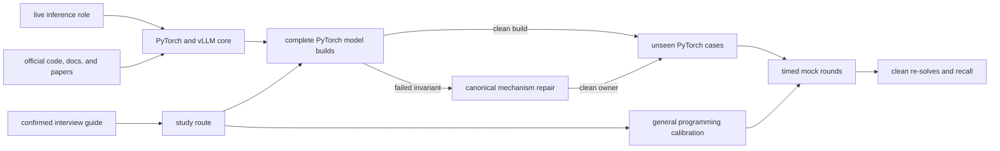

Prep for Inferact's Member of Technical Staff, Inference loop, with full PyTorch model construction as the main coding surface and vLLM as the system under discussion.

The supplied interview guide confirms three technical rounds:

1. independent coding in CoderPad
2. a Socratic technical deep dive on one or two prior projects
3. collaborative system design around an open-ended problem

For the inference track, the guide explicitly says to program in PyTorch. Triton is an adjacent kernel refresher. General distributed programming may use a preferred language.

This kit keeps three evidence classes separate:

1. [[hinterland/prep/inferact/00-recon/intel|role and interview intel]] records the supplied guide and first-party company evidence.
2. [[hinterland/prep/inferact/core|the core map]] records current PyTorch, vLLM, and model-runtime knowledge from official sources.
3. [[hinterland/prep/inferact/model-builds|PyTorch model builds]], [[hinterland/prep/inferact/role-drills|role drills]], [[hinterland/prep/inferact/pytorch-practice|the PyTorch practice bank]], and [[hinterland/prep/inferact/programming-practice|the programming bank]] contain original practice prompts. Inferact has not confirmed these questions.

No attributable public Inferact candidate report was found as of July 21, 2026. The absence matters: the preparation target comes from the actual guide, the live role, and the codebase, not question-leak astrology.

## start here

1. Read [[hinterland/prep/inferact/00-recon/intel|the evidence boundary]].
2. Take the baseline in [[hinterland/prep/inferact/study|the study route]] from a blank editor.
3. Learn the owner chain in [[hinterland/prep/inferact/core|the core map]].
4. Build complete `nn.Module` paths in [[hinterland/prep/inferact/model-builds|the model lane]], then implement the functional, fixed-capacity request, reusable prefix-snapshot, chunked-prefill, and greedy speculative-decoding paths in [[hinterland/prep/inferact/gpt-lab|the tiny GPT lab]].
5. Use [[hinterland/prep/inferact/role-drills|role drills]] to repair weak tensor, attention, cache, or runtime mechanisms.
6. Test transfer with a fresh case from [[hinterland/prep/inferact/pytorch-practice|the PyTorch practice bank]].
7. Route any programming-calibration miss through [[hinterland/prep/inferact/programming-practice|the programming bank]] at no more than one case per three completed timed PyTorch coding rounds.
8. Run complete rounds from [[hinterland/prep/inferact/mocks|the mock set]].
9. Review the bank's PQ oral pool, [[hinterland/prep/inferact/notes.fc|the recall deck]], and [[hinterland/prep/inferact/cheatsheet|the interview sheet]].

## preparation budget

The default fourteen-day route allocates its forty-two scheduled hours this way because the target role and aarnphm's stated emphasis are PyTorch-heavy. Named mock blocks are included. Miss-driven clean re-solves are additional unless the route explicitly replaces a later stretch, reading, or practice block.

| share | lane                          | output                                                                        |
| ----: | ----------------------------- | ----------------------------------------------------------------------------- |
|   25% | complete PyTorch model builds | config-to-`nn.Module`, full forward paths, cache, serialization, ports        |
|   20% | PyTorch mechanisms            | canonical repairs plus unseen tensor, state, cache, compiler, and TP variants |
|   20% | vLLM runtime                  | request lifecycle, scheduler, model runner, and executable prefix-block cache |
|   15% | system design                 | SLO-driven serving designs with capacity and failure reasoning                |
|   10% | technical deep dive           | one evidence-backed project story that survives Socratic counterfactuals      |
|    5% | general programming           | arrays, maps, heaps, graphs, parsers, ownership, and concurrency              |
|    5% | Triton and GPU performance    | tile, pointer, mask, traffic, occupancy, and benchmark reasoning              |

The PyTorch-heavy route uses day 11's primary block for the runtime-level prefix-cache exercise. Triton remains in the shorter kernel-explanation and stretch blocks unless the recruiter selects the kernel focus.

Move Triton to 30% only if the recruiter explicitly selects the kernel focus. Take those hours from PyTorch application drills and system design, while keeping tensor layout, attention, and numerical correctness intact.

## round contracts

| round         | prepare to demonstrate                                                                               | main artifact                                                                                                                                                                                                                                                                           |
| ------------- | ---------------------------------------------------------------------------------------------------- | --------------------------------------------------------------------------------------------------------------------------------------------------------------------------------------------------------------------------------------------------------------------------------------- |
| coding        | correct PyTorch and Python from a blank editor, explicit contracts, tests, complexity, readable code | ten model builds, one executable GPT with request cache, prefix cache, chunked prefill, and speculative decoding labs, twenty-eight canonical drills, forty sampled PyTorch cases, twenty-four general-programming cases, sixty-four oral checks, four model mocks, and the Triton lane |
| deep dive     | causal technical depth, measurements, failures, ownership, correctness, deployment                   | one primary project deck and hostile Q&A sheet                                                                                                                                                                                                                                          |
| system design | workload-first vocabulary, tradeoffs, capacity, SLOs, failure recovery, experiments                  | twelve designs and a reusable design rubric                                                                                                                                                                                                                                             |

A counted timed PyTorch coding round is one independently timed attempt of at least twenty minutes that produces executable PyTorch and receives its own score and first-wrong-decision entry. One P-series or PT-series prompt, one M-series or GPT implementation slice, one qualifying clean re-solve, or one sixty-minute PyTorch coding mock counts as one round. Several P prompts bundled inside one seventy-five-minute primary block count as one round unless each is separately timed and graded. Reference-canary runs, test-only blocks, reading, Triton, general Python, system design, and deep-dive work do not count. Every three newly completed rounds earn one GP replacement slot; spending the slot resets that counter, and at most one unspent slot may exist. Spend a slot only when every PyTorch or GPT owner scheduled before or inside the replacement block is clean, so general work never displaces an unresolved inference owner.

## language rule

Use Python and PyTorch for every inference drill. Avoid NumPy in the implementation so tensor semantics stay visible. Use CPU tensors unless the prompt requires CUDA. A CoderPad answer should remain correct without a GPU; performance follow-ups can then move it toward CUDA, Triton, or a vLLM custom operator.

Use Python for the first two general-programming calibrations and a preferred systems language for later ownership or distributed variants. [[hinterland/prep/inferact/programming-practice|The programming bank]] owns Inferact-shaped selection and transfer, while [[hinterland/prep/nv/core|the NVIDIA core set]], [[hinterland/prep/nv/role-drills|the existing systems-shaped drills]], and the BT executable modules retain their canonical algorithm implementations.

## definition of learned

A standalone drill, first non-scaffolded model-build slice, or named clean reconstruction counts after all of these hold:

- the implementation starts from an empty editor without an agent or editorial
- every tensor dimension is named before code is written
- tests include empty or degenerate shapes, tails, dtype behavior, and invalid input where applicable
- aliasing and allocation behavior are stated
- the numerical-stability decision is explicit
- time, auxiliary memory, and device synchronization costs are stated
- one clean re-solve passes on a later day

A coding, system-design, or deep-dive mock counts immediately at 24 out of 28 with every dimension at least 2. A lower score enters the redo schedule. Scaffolded model deltas and coding mock 4 start from their supplied working artifacts.

A model build's complete first artifact counts only after its config invariants, module tree, state owners, full forward path, randomized oracle, serialization contract, artifact-appropriate inference-state behavior, and serving-integration boundary pass. A later clean reimplementation retests the named highest-risk slice unless a route explicitly requires a full reconstruction; M01 is the full-reconstruction case, while the full route names an M02 decoder layer and an M03 cache slice. Inference-state behavior means full-sequence inference for base M01 and M02, prefill and decode for the one selected M03-bearing autoregressive artifact, denoising-step and scheduler state for M08, and loader mapping plus ownership for M09. Correct output shape alone counts for approximately fuck-all.

A PT-series case measures transfer after its connected P-series or M-series owner is already clean. A failed PT case returns to the owning invariant. Transfer is retested with a fresh sibling case rather than a memorized re-solve of the same prompt.

A GP-series case counts under its separate general-programming rubric. The two calibration cases are mandatory on every multi-day route and sit outside the frequency cap. Later GP work remains miss-driven and capped at one case per three completed timed PyTorch coding rounds. An activated miss is tested with a different sibling from the same family; a score below 19 or any dimension below 2 requires family repair first.

The tiny GPT lab counts after its reference passes the complete suite and one blank-editor M01 implementation passes the construction and numerical tiers. During M03, either reconstruct the lab's simple homogeneous-cache path or satisfy the separate executable advanced-M03 adapter contract. These are alternative implementation paths inside the same time block. The compressed route uses the advanced path because its supplied starter is M02-shaped.

The executable prefix-cache extension is a separate artifact downstream of M03. It counts after exact block-aligned prefix keys return independent K/V snapshots, entry-level LRU behaves deterministically, partial tails create no entry, and cached-suffix logits plus every layer's K/V match a full uncached prefill. The physical-block hash chain, request leases, page table, and eviction lifecycle remain a systems-design follow-up in [[hinterland/prep/inferact/core#prefix caching|the core map]].

A systems topic counts after aarnphm can draw the state owners, derive the memory or throughput constraint, name the governing SLO, describe one rejected design, and choose the measurement that would falsify the preferred design.

A deep-dive claim counts only when the workload, baseline, intervention, result, and residual risk are all attached to evidence. The neurons demand receipts. Fair enough.
