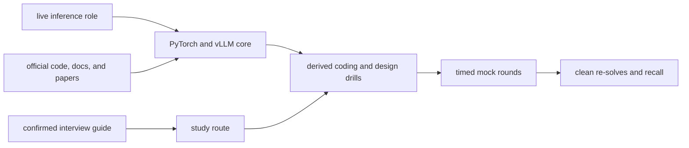

Prep for Inferact's Member of Technical Staff, Inference loop, with PyTorch as the main coding surface and vLLM as the system under discussion.

The supplied interview guide confirms three technical rounds:

1. independent coding in CoderPad
2. a Socratic technical deep dive on one or two prior projects
3. collaborative system design around an open-ended problem

For the inference track, the guide explicitly says to program in PyTorch. Triton is an adjacent kernel refresher. General distributed programming may use a preferred language.

This kit keeps three evidence classes separate:

1. [[hinterland/prep/inferact/00-recon/intel|role and interview intel]] records the supplied guide and first-party company evidence.
2. [[hinterland/prep/inferact/core|the core map]] records current PyTorch, vLLM, and model-runtime knowledge from official sources.
3. [[hinterland/prep/inferact/role-drills|role drills]] contains original practice prompts. Inferact has not confirmed these questions.

No attributable public Inferact candidate report was found as of July 21, 2026. The absence matters: the preparation target comes from the actual guide, the live role, and the codebase, not question-leak astrology.

## start here

1. Read [[hinterland/prep/inferact/00-recon/intel|the evidence boundary]].
2. Take the baseline in [[hinterland/prep/inferact/study|the study route]] from a blank editor.
3. Learn the owner chain in [[hinterland/prep/inferact/core|the core map]].
4. Implement the PyTorch-first prompts in [[hinterland/prep/inferact/role-drills|role drills]].
5. Run complete rounds from [[hinterland/prep/inferact/mocks|the mock set]].
6. Review [[hinterland/prep/inferact/notes.fc|the recall deck]] and [[hinterland/prep/inferact/cheatsheet|the interview sheet]].

## preparation budget

The default fourteen-day route allocates time this way because the target role and aarnphm's stated emphasis are PyTorch-heavy:

| share | lane                           | output                                                                   |
| ----: | ------------------------------ | ------------------------------------------------------------------------ |
|   45% | PyTorch coding and model paths | clean tensor code, attention, KV updates, sampling, model components     |
|   20% | vLLM runtime                   | exact request lifecycle, scheduler, cache, model-runner ownership        |
|   15% | system design                  | SLO-driven serving designs with capacity and failure reasoning           |
|   10% | technical deep dive            | one evidence-backed project story that survives Socratic counterfactuals |
|   10% | Triton and GPU performance     | tile, pointer, mask, traffic, occupancy, and benchmark reasoning         |

Move Triton to 30% only if the recruiter explicitly selects the kernel focus. Take those hours from PyTorch application drills and system design, while keeping tensor layout, attention, and numerical correctness intact.

## round contracts

| round         | prepare to demonstrate                                                                 | main artifact                                                                                  |
| ------------- | -------------------------------------------------------------------------------------- | ---------------------------------------------------------------------------------------------- |
| coding        | correct PyTorch from a blank editor, explicit shapes, tests, complexity, readable code | twenty-eight PyTorch drills, five default Triton drills, and three kernel-focus stretch drills |
| deep dive     | causal technical depth, measurements, failures, ownership, correctness, deployment     | one primary project deck and hostile Q&A sheet                                                 |
| system design | workload-first vocabulary, tradeoffs, capacity, SLOs, failure recovery, experiments    | twelve designs and a reusable design rubric                                                    |

## language rule

Use Python and PyTorch for every inference drill. Avoid NumPy in the implementation so tensor semantics stay visible. Use CPU tensors unless the prompt requires CUDA. A CoderPad answer should remain correct without a GPU; performance follow-ups can then move it toward CUDA, Triton, or a vLLM custom operator.

Use the preferred systems language for general distributed questions. Reuse [[hinterland/prep/nv/core|the NVIDIA core set]] and [[hinterland/prep/nv/role-drills|the existing systems-shaped drills]] for caches, graphs, queues, allocators, and schedulers instead of duplicating them here.

## definition of learned

A coding topic counts after all of these hold:

- the implementation starts from an empty editor without an agent or editorial
- every tensor dimension is named before code is written
- tests include empty or degenerate shapes, tails, dtype behavior, and invalid input where applicable
- aliasing and allocation behavior are stated
- the numerical-stability decision is explicit
- time, auxiliary memory, and device synchronization costs are stated
- one clean re-solve passes on a later day

A systems topic counts after aarnphm can draw the state owners, derive the memory or throughput constraint, name the governing SLO, describe one rejected design, and choose the measurement that would falsify the preferred design.

A deep-dive claim counts only when the workload, baseline, intervention, result, and residual risk are all attached to evidence. The neurons demand receipts. Fair enough.
