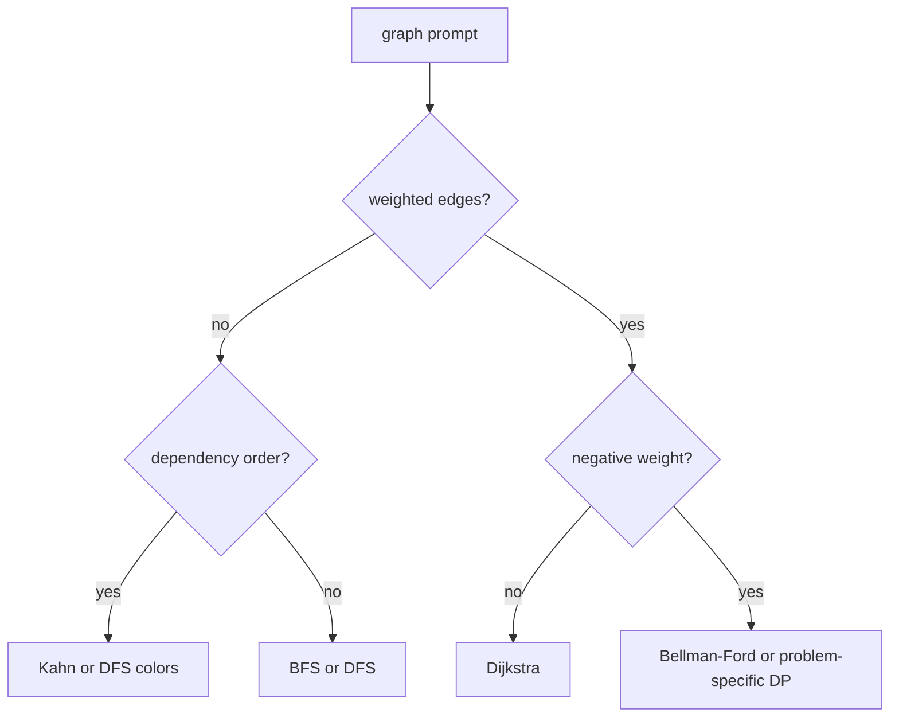

# pattern sheet

## recognition

| cue                                        | structure                       | invariant                                                   | usual target                      |
| ------------------------------------------ | ------------------------------- | ----------------------------------------------------------- | --------------------------------- |
| pair, complement, count, group             | hash map or set                 | stored state summarizes the processed prefix                | expected $O(n)$                   |
| longest or shortest valid contiguous range | sliding window                  | current window satisfies the constraint after shrinking     | $O(n)$                            |
| exact subarray sum with signed values      | prefix sum and count map        | map contains counts of earlier prefix sums                  | $O(n)$                            |
| sorted input or monotone feasibility       | binary search                   | answer remains inside the closed search interval            | $O(\log n)$ or $O(n \log M)$      |
| top-k, next worker, repeated minimum       | heap                            | heap root is the next globally valid choice                 | $O(n \log k)$ or $O(n \log n)$    |
| overlap, allocation ranges, time windows   | sort and sweep                  | active state represents intervals crossing the sweep point  | $O(n \log n)$                     |
| next greater or smaller element            | monotonic stack                 | stack values remain monotone and unresolved                 | $O(n)$                            |
| maximum or minimum over every window       | monotonic deque                 | front is the best live candidate                            | $O(n)$                            |
| dependency order                           | topological sort                | zero-indegree queue contains currently runnable nodes       | $O(V + E)$                        |
| unweighted shortest path                   | BFS                             | first visit has minimum edge count                          | $O(V + E)$                        |
| nonnegative weighted shortest path         | Dijkstra                        | popped distance is final                                    | $O((V + E) \log V)$               |
| connectivity under edge additions          | union-find                      | each set has one representative                             | almost linear                     |
| choose or skip with overlapping states     | dynamic programming             | state stores the best answer for a defined prefix or suffix | state count times transition cost |
| enumerate constrained choices              | backtracking                    | partial choice satisfies every checked constraint           | output-sensitive                  |
| recency plus constant-time lookup          | hash map and doubly linked list | list order is recency order, map points to live nodes       | expected $O(1)$                   |
| stream median                              | two heaps                       | lower max-heap and upper min-heap differ by at most one     | $O(\log n)$ update                |

## graph choice

## cache and scheduler invariants

- LRU: the front or back convention never changes. Every live key has exactly one list node and one map entry.
- LFU: each entry belongs to exactly one frequency bucket. `min_frequency` points to the lowest nonempty bucket.
- worker heap: a popped worker is the eligible worker with minimum availability under the stated tie break.
- dynamic batch: every accepted request satisfies both capacity limits and the queue-order contract.
- dependency scheduler: a task becomes ready exactly when its remaining dependency count reaches zero.
- bounded queue: `0 <= size <= capacity`; wait predicates are checked while holding the mutex.

## matrix and tensor formulas

For row-major shape `(rows, cols)`:

$$
offset(i, j) = i \cdot cols + j
$$

Transpose destination shape is `(cols, rows)`:

$$
dst(j, i) = j \cdot rows + i
$$

For rank `r` with element strides `s_k`:

$$
offset = \sum_{k=0}^{r-1} index_k \cdot s_k
$$

Check multiplication and addition overflow before computing the final offset.

## bit rules

- Test bit `k`: `(x >> k) & 1`.
- Set bit `k`: `x | (U{1} << k)`.
- Clear bit `k`: `x & ~(U{1} << k)`.
- Toggle bit `k`: `x ^ (U{1} << k)`.
- Remove the lowest set bit: `x &= x - 1`.
- Isolate the lowest set bit for unsigned `x`: `x & (~x + 1)`.
- Power of two: `x != 0 && (x & (x - 1)) == 0`.
- Align unsigned `x` up to power-of-two `a`: `(x + a - 1) & ~(a - 1)`, after guarding overflow.

See [[hinterland/prep/bt/01-bits/notes|bits]] and [[hinterland/prep/bt/02-unsigned-alignment/notes|unsigned alignment]] for the full machinery.

## c++ screen checklist

Before coding:

- Ask about input bounds, mutation, duplicates, ordering, overflow, and error behavior.
- Choose ownership. Prefer values, references, and `std::unique_ptr` when one owner exists.
- Reserve vectors or hash maps when the size is known and reallocation would invalidate references.
- Decide whether map iterators, list iterators, pointers, or indices remain stable under mutation.

While coding:

- Use fixed-width integer types when width matters.
- Cast after validating range.
- Guard `a * b` with division before multiplication when size overflow is possible.
- Avoid holding references across `std::vector` growth.
- Never erase from a container and then use the erased iterator.
- Pass large read-only inputs by `std::span` or `const&`.
- Use `std::optional` for an expected missing result.
- Keep comparator tie breaks deterministic.

For concurrency:

- Put every wait in a predicate loop.
- Change shared state while holding the mutex.
- Notify after the state change.
- Define close, cancellation, and destruction behavior.
- Identify which data can be read without the lock and why.

## complexity traps

- Repeated front erasure from `std::vector` is linear per erase.
- String or vector slicing inside recursion can turn a linear traversal into quadratic copying.
- A heap with stale entries needs a validity check when popping.
- `unordered_map` is expected constant time, with linear worst case.
- DFS recursion can overflow on a path-shaped graph.
- Copying a growing sequence for every beam-search expansion multiplies token storage work.
- One heap cannot choose the earliest eligible GPU when eligibility depends on memory capacity.

## inference follow-up map

| coding shape     | likely systems follow-up                                        |
| ---------------- | --------------------------------------------------------------- |
| LRU cache        | byte capacity, pinning, prefix reuse, sharding, concurrent hits |
| matrix traversal | strides, row-major locality, tiling, vectorized access          |
| graph traversal  | execution DAG, cycle rejection, critical path, parallel waves   |
| heap scheduling  | GPU capacity, fairness, deadlines, heterogeneous workers        |
| sliding window   | batching window, token budget, streaming logs                   |
| fixed allocator  | alignment, fragmentation, coalescing, thread safety             |
| ring buffer      | producer-consumer predicates, close semantics, backpressure     |
| top-k stream     | profiling aggregation, distributed merge, memory bounds         |
| tree DP          | operation pruning, fusion choices, execution cost               |
