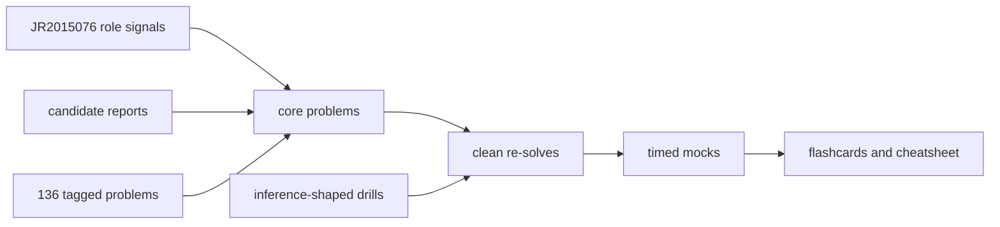

Prep for NVIDIA requisition JR2015076, Software Engineer, AI Inference Systems, New College Graduate 2026.

The first rounds are likely to test ordinary data structures and algorithms. This kit keeps three evidence classes separate:

1. [[hinterland/prep/nv/reported-questions|reported questions]] contains prompts that candidates say NVIDIA asked.
2. [[hinterland/prep/nv/question-bank|question bank]] contains all 136 problems in the public NVIDIA company-tag dataset captured on July 16, 2026.
3. [[hinterland/prep/nv/role-drills|role drills]] contains new interview-sized problems derived from this job's inference, GPU, compiler, and scheduler work.

These sets overlap. A company tag is a useful lead, not proof that this team asks the problem. The role drills are predictions, not leaks.

## start here

1. Read [[hinterland/prep/nv/00-recon/intel|role and interview intel]].
2. Solve [[hinterland/prep/nv/core|the core set]] in order.
3. Use [[hinterland/prep/nv/study|the study route]] to schedule clean re-solves.
4. Run rounds from [[hinterland/prep/nv/mocks|the mock set]].
5. Review [[hinterland/prep/nv/notes.fc|the recall deck]] and [[hinterland/prep/nv/cheatsheet|the pattern sheet]].
6. Pull from the full question bank only after the core set exposes a weak pattern.

## priority map

| priority | material                             | reason                                                                                                  |
| -------- | ------------------------------------ | ------------------------------------------------------------------------------------------------------- |
| first    | trees, graphs, caches, hash maps     | These dominate the closest inference reports and map to execution graphs, KV caches, and request state. |
| second   | arrays, matrices, windows, heaps     | These map to tensor layouts, batching, top-k profiling, and schedulers.                                 |
| third    | linked lists, stacks, queues, bits   | NVIDIA reports repeatedly add pointer, memory, synchronization, or in-place constraints.                |
| fourth   | dynamic programming and backtracking | These remain common coding patterns, with weaker direct evidence for this team.                         |

## language rule

Use C++17 for the closest reported questions and every role drill. Use Python when it helps you learn a new pattern quickly, then re-solve the same problem in C++ without reading the Python version.

For every accepted solution, say these points out loud:

- the invariant
- the time and auxiliary space cost
- the failure cases
- the C++ ownership and iterator rules
- the memory-access pattern when arrays or matrices are involved
- the synchronization boundary when shared state is involved

## definition of learned

A problem counts after a clean implementation from an empty editor, a correct complexity explanation, and one passing re-solve at least one day later. Reading an editorial and recognizing the code does not count. The neurons have union rules, tragic.
