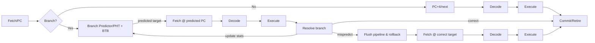

see also [[thoughts/Speculative decoding]], [[/speculative|wip ideas]]

![[thoughts/Speculative decoding#von Neumann acceptance-rejection]]

### historical inspiration & motivation 🚀

![[thoughts/Autoregressive models#next token prediction]]

### self-speculative techniques

Self-speculation reuses the same model (or the input context) to draft tokens that are verified by the full forward pass, avoiding a separate speculator.

- Prompt n-gram lookup (PLD; “assisted generation”)
  - Mechanism: Maintain an n-gram index over the prompt; when the trailing context matches a prompt n-gram, emit the subsequent prompt tokens as a draft continuation. No extra model is evaluated.
  - Characteristics: Effective when output has high lexical overlap with input (summarization, extraction, entity repetition). Practically uses small n (e.g., 2–3) and yields measurable speedups on overlap-heavy tasks.
  - References: [Hugging Face blog: Assisted Generation](https://huggingface.co/blog/assisted-generation), [Prompt Lookup Decoding (implementation)](https://github.com/apoorvumang/prompt-lookup-decoding/).

- LayerSkip (early-exit self-speculation)
  - Training: Add auxiliary next-token heads at intermediate layers with progressive layer dropout; encourage earlier layers to be predictive while preserving final-layer quality. Exits are trained to be accurate enough for drafting.
  - Inference: Compute up to an exit layer to propose a draft token; continue through later layers to verify. If the exit token matches the final prediction, later-layer compute can be partially skipped. Otherwise, the full stack corrects the draft (akin to rejection).
  - Properties: Single-model pipeline that reuses activations; reduced memory and duplicate compute versus two-model drafting. Reported speedups ~1.8–2.2× with negligible accuracy loss on several tasks.
  - References: @Elhoushi2024
