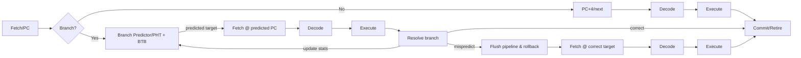

see also [[thoughts/Speculative decoding]], [[/speculative|wip ideas]]

![[thoughts/Speculative decoding#von Neumann acceptance-rejection]]

### historical inspiration & motivation 🚀

![[thoughts/Autoregressive models#next token prediction]]

### self-speculative techniques

Aside from using a separate small model, there are self-speculative approaches where the large model itself (or the prompt context) generates speculative tokens. These methods avoid maintaining two distinct models:

N-gram Prompt Matching (Heuristic Drafting)
• Idea: Leverage repetition in the prompt or context to guess upcoming tokens. If the end of the current context matches an $n$-gram that appeared earlier in the prompt, assume the next tokens might follow the same way. The system can directly propose those next tokens (copying from the prompt) without running the full model for each .
• Application: vLLM’s prompt lookup speculative decoding builds an $n$-gram index of the prompt (commonly $n=2$ or 3). During generation, if the last $n$ tokens match a stored key, it speculatively emits the following tokens from the prompt as a draft . For example, in a Q&A, the answer may repeat entity names from the question; or in summarization, key phrases from the passage are copied. In such cases, this method can yield big speedups (e.g. up to 2.8× in summarization) with zero additional compute .
• Limitations: This is a simple heuristic – it only works when output text overlaps significantly with input. It won’t help for wholly new continuations. Still, it’s “free” when applicable (no extra model required), making it a nice optimization for overlap-heavy tasks .

LayerSkip Early-Exit Decoding (Self-Speculative Draft)
• Early-Exit Model: LayerSkip (Mostafa Elhoushi et al., 2024) trains the large model to allow early exits at intermediate layers . The idea is to enable the model’s lower layers to produce a decent draft token, which the higher layers then verify and refine – all within one model. During training, they apply progressively increasing layer dropout (more dropout in later layers) and a shared auxiliary loss on all layers to predict the next token . This way, even say layer 12 of a 24-layer Transformer can guess the next token reasonably well.
• Inference Process: At runtime, the model runs until an early layer (exit point) to draft a token, then uses the remaining layers to check if that draft would indeed be the final prediction . If the draft is wrong, the full model’s deeper layers “correct” it (similar to rejection). If correct, the deeper layers would have predicted the same token, so the computation beyond the exit is partially skipped. Essentially the model verifies its own speculation using shared internal computation.
• Advantages: Only one model is needed, and the draft and verify stages share the same forward pass’s activations (lower layer outputs are reused) . This yields a smaller memory footprint and less duplicate compute compared to two-model speculative decoding . Reported results show up to ~1.8–2.2× speedups on tasks like summarization, coding, semantic parsing, without significant loss in accuracy . The gains aren’t as high as using an external ultra-fast draft, but LayerSkip provides an elegant, integrated speedup and can be combined with other techniques.

Other Advances: EAGLE, Multi-Token Prediction, etc.
• EAGLE (Extrapolation Algorithm for Greater LLM Efficiency): A state-of-the-art speculative decoding framework that improves draft quality by working at the feature level. Instead of predicting tokens directly, EAGLE trains a draft model to predict the second-to-last layer’s hidden state of the large model for the next token  . The large model’s final softmax (LM head) then converts this predicted feature to a token. By leveraging the richer information from the big model’s feature space, EAGLE achieves much higher draft accuracy (often ~80% acceptance vs ~60% in earlier token-level drafts) . For example, EAGLE accelerated LLaMA2-70B by 2.7×–3.5× with no output distribution change . It essentially uses the target model’s “guidance” (one step ahead token context or top-layer features) to reduce uncertainty in drafting  . Several iterations (EAGLE-2, EAGLE-3) further refine this with dynamic draft trees and scalable training, pushing speedups even further in practice  .
• Multi-Token Prediction (MTP): Instead of one token at a time, why not have the model generate multiple tokens per forward pass? MTP modifies the decoding paradigm so that each step yields, say, 2 or 3 tokens. This requires architectural and training changes – for instance, adding parallel prediction heads or position blocks. Recent research (e.g. L-MTP, 2025) shows that an LLM can be trained to output non-adjacent leap tokens in one go . The model skips some positions and fills them in a subsequent pass, enabling partial parallelism in generation. MTP approaches can improve throughput and even capture long-range dependencies better . However, these methods typically need careful retraining or fine-tuning, and ensuring they produce the exact same distribution as standard AR decoding is non-trivial (often they trade a tiny bit of perplexity for speed). They represent a promising research direction for making LLMs inherently faster at generation.
• Native Model Support (Parallel Decoding within the Model): Another line of work integrates speculative decoding into the model’s architecture itself. For example, the Medusa system adds multiple auxiliary heads to a transformer, each head guessing a future token (e.g. head1 predicts token $t+1$, head2 predicts $t+2$, etc.) using the final hidden state as input . All guesses are then checked by the standard forward pass of the model. In effect, the model’s own layers are producing a draft for subsequent positions in parallel. This approach (also related to “mixture of attentions” or parallel decoders) can eliminate the need for a separate draft model . It is still early-stage – requiring custom training and inference kernels – but demonstrates that one big model can internally achieve speculative parallelism. As optimized kernels and training techniques mature, such in-model speculative decoding could further boost generation speeds .

References: Key resources include Leviathan et al. (2023) on Fast Inference via Speculative Decoding  , which provides the acceptance sampling formulation and proof of identical output distribution; Stern et al. (2018) on blockwise parallel decoding for early inspiration ; and a flurry of recent works like LayerSkip , EAGLE , MEDUSA, MTP, etc., which continue to advance the speculative decoding frontier. These methods collectively aim to speed up LLM inference by generating multiple tokens per step – either through clever sampling algorithms or by training models to predict more with less – all while preserving the high quality that users expect from autoregressive generation.
