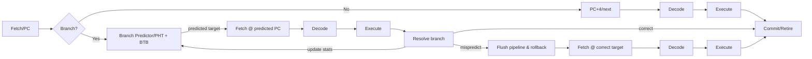

see also [[thoughts/Speculative decoding]], [[/speculative|wip ideas]]

![[thoughts/Speculative decoding#von Neumann acceptance-rejection]]

### historical inspiration & motivation 🚀

![[thoughts/Autoregressive models#next token prediction]]

### self-speculative techniques

Aside from using a separate small model, there are self-speculative approaches where the large model itself (or the prompt context) generates speculative tokens. These methods avoid maintaining two distinct models:

ngram prompt matching (heuristic drafting):

- Idea: Leverage repetition in the prompt or context to guess upcoming tokens. If the end of the current context matches an $n$-gram that appeared earlier in the prompt, assume the next tokens might follow the same way. The system can directly propose those next tokens (copying from the prompt) without running the full model for each .
- Application: vLLM’s prompt lookup speculative decoding builds an $n$-gram index of the prompt (commonly $n=2$ or 3). During generation, if the last $n$ tokens match a stored key, it speculatively emits the following tokens from the prompt as a draft . For example, in a Q&A, the answer may repeat entity names from the question; or in summarization, key phrases from the passage are copied. In such cases, this method can yield big speedups (e.g. up to 2.8× in summarization) with zero additional compute .
- Limitations: This is a simple heuristic – it only works when output text overlaps significantly with input. It won’t help for wholly new continuations. Still, it’s “free” when applicable (no extra model required), making it a nice optimization for overlap-heavy tasks .

LayerSkip early-exit decoding (self-speculative draft):

- Early-Exit Model: LayerSkip (Mostafa Elhoushi et al., 2024) trains the large model to allow early exits at intermediate layers . The idea is to enable the model’s lower layers to produce a decent draft token, which the higher layers then verify and refine – all within one model. During training, they apply progressively increasing layer dropout (more dropout in later layers) and a shared auxiliary loss on all layers to predict the next token . This way, even say layer 12 of a 24-layer Transformer can guess the next token reasonably well.
- Inference Process: At runtime, the model runs until an early layer (exit point) to draft a token, then uses the remaining layers to check if that draft would indeed be the final prediction . If the draft is wrong, the full model’s deeper layers “correct” it (similar to rejection). If correct, the deeper layers would have predicted the same token, so the computation beyond the exit is partially skipped. Essentially the model verifies its own speculation using shared internal computation.
- Advantages: Only one model is needed, and the draft and verify stages share the same forward pass’s activations (lower layer outputs are reused) . This yields a smaller memory footprint and less duplicate compute compared to two-model speculative decoding . Reported results show up to ~1.8–2.2× speedups on tasks like summarization, coding, semantic parsing, without significant loss in accuracy . The gains aren’t as high as using an external ultra-fast draft, but LayerSkip provides an elegant, integrated speedup and can be combined with other techniques.
