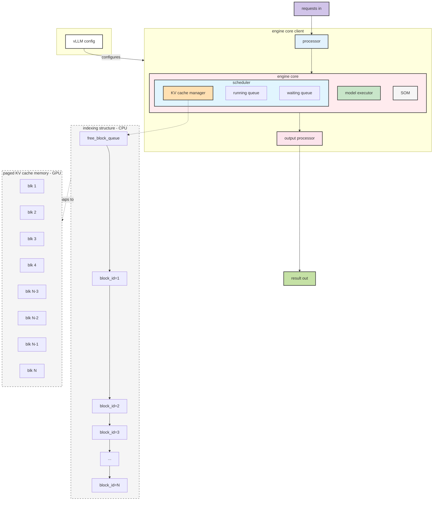
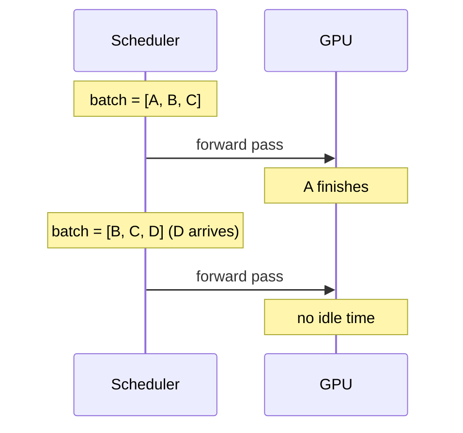
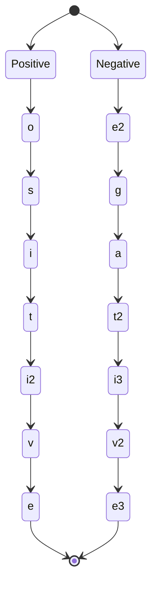
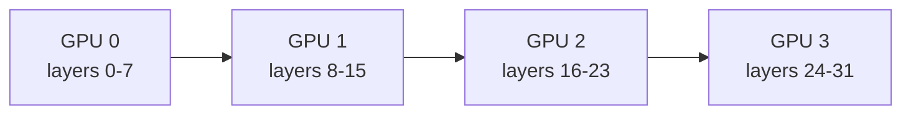
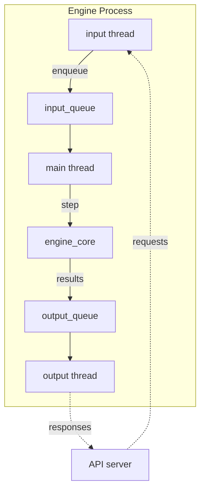

see also: [[thoughts/vllm]], [[thoughts/LLMs]], [[thoughts/tsfm/inference-exercise|BYOIE]], [[thoughts/Transformers|Transformers]], [[thoughts/Attention|Attention]], [[hinterland/nanovllm]]

> here's what we're doing today: understanding how inference engines actually work.
>
> ```bash
> # on 8xB200
> vllm serve deepseek-ai/DeepSeek-R1 -dp 8 -ep
> ```

> [!note]
>
> omitting trt-llm, sglang, lmdeploy for simplicity, but they're more or less doing the same thing.
>
> also it is because I work on vLLM 😅

s/o: Michael Goin (RedHat), Nick Hill (RedHat), Simon Go (Berkeley), and [blog post from Aleksa](https://blog.vllm.ai/2025/09/05/anatomy-of-vllm.html)

[@aarnphm_]

## agenda

- [[#fundamentals]]
- [[#features]]
  - [[#chunked prefill]]
  - [[#prefix caching]]
  - [[#structured outputs]]
  - [[#speculative decoding]]
- [[#parallelism]]
- [[#distributed inference]]

vLLM historically has V0 and V1 interfaces

we'll focus on V1 engine today, commit [ffb083](https://github.com/vllm-project/vllm/commit/ffb08379d8870a1a81ba82b72797f196838d0c86)

## fundamentals



**key components**:

- **config**: model, cache, parallelism parameters
- **processor**: validates and tokenizes into `EngineCoreRequest`
- **engine core**: contains model executor, scheduler, and structured output manager
- **scheduler**: manages waiting/running queues + KV cache allocation
- **KV cache manager**: maintains block pool (CPU) mapped to paged memory (GPU)
- **output processor**: `EngineCoreOutputs` → `RequestOutput`

## PagedAttention

> to address **the fragmentation problem**

traditional systems suffer from two types of waste:

- **internal fragmentation**: reserving full context length upfront, even if only using 10% (e.g., reserve 2048 tokens, use 200)
- **external fragmentation**: memory between requests gets fragmented over time, can't serve new requests even though total free memory is sufficient

combined, this leads to **60-70% memory waste**. you're paying for 10 GPUs but only using 3-4 effectively.

```
traditional allocation (static):

GPU memory: [████████████████████████████████████████████████]

request A: [████░░░░░░░░░░░░░░░░]  ← allocated 2048, uses 200 (internal frag)
request B: [████████░░░░░░░░░░░░]  ← allocated 2048, uses 500
           [▓▓▓▓]                 ← gap: too small for new request (external frag)
request C: [██████████░░░░░░░░░░]  ← allocated 2048, uses 600
           [▓▓▓▓▓▓]               ← gap: wasted space
request D: [████████████░░░░░░░░]  ← allocated 2048, uses 800

█ = used memory
░ = allocated but unused (internal fragmentation)
▓ = gaps between requests (external fragmentation)

result: ~65% waste, can't fit new requests despite 40% total free memory
```

> we don't need contiguous memory. allocate in small blocks (16 tokens at a time) and map them dynamically.

```
logical blocks    physical blocks
┌──────────┐     ┌──────────┐
│ block 0  │ ──> │ block 7  │  (non-contiguous!)
├──────────┤     ├──────────┤
│ block 1  │ ──> │ block 2  │
├──────────┤     ├──────────┤
│ block 2  │ ──> │ block 15 │
└──────────┘     └──────────┘
```

**block size calculation**:

```python
2 × block_size (default=16) × num_kv_heads × head_size × dtype_bytes
# typically: 2 × 16 × 32 × 128 × 2 = 524KB per block
```

**when a request needs more space**:

1. calculate blocks needed: `ceil(new_tokens / block_size)`
2. check availability (trigger preemption if needed)
3. grab blocks from `free_block_queue` (doubly-linked list)
4. update `req_to_blocks` mapping

result: **95% memory efficiency**.

![[thoughts/Attention#Paged Attention#{collapsed: true}]]

## continuous batching

instead of waiting for all requests to finish (HuggingFace), vLLM dynamically adds/removes requests mid-generation.

**the trick**: flatten everything into one "super sequence" with careful position tracking.

```
traditional batching (HuggingFace):
┌─────────────────────────────────────────────┐
│ batch = [A, B, C]                           │
│                                             │
│ step 1: process all 3                       │
│ step 2: process all 3                       │
│ step 3: process all 3                       │
│ ...                                         │
│ step N: A finishes, but wait for B, C       │ ← idle time!
│ step N+1: B finishes, but wait for C        │ ← idle time!
│ step N+2: C finishes, start new batch       │
└─────────────────────────────────────────────┘

continuous batching (vLLM):
┌─────────────────────────────────────────────┐
│ flatten: [A tokens | B tokens | C tokens]   │
│                                             │
│ step 1: [A, B, C]                           │
│ step 2: [A, B, C]                           │
│ step 3: [A, B, C]                           │
│ step 4: A done → [B, C, D] (D arrives)      │ ← no idle time!
│ step 5: [B, C, D]                           │
│ step 6: B done → [C, D, E] (E arrives)      │ ← no idle time!
└─────────────────────────────────────────────┘
```

**how flattening works**:

```
request A: [t0, t1, t2, ..., t50]     positions: [0, 1, 2, ..., 50]
request B: [t0, t1, t2, ..., t25]     positions: [0, 1, 2, ..., 25]
request C: [t0, t1, t2, ..., t10]     positions: [0, 1, 2, ..., 10]

flattened super sequence:
input_ids  = [A_t0, A_t1, ..., A_t50, B_t0, B_t1, ..., B_t25, C_t0, C_t1, ..., C_t10]
positions  = [0, 1, ..., 50, 0, 1, ..., 25, 0, 1, ..., 10]
               ↑                ↑                ↑
         request A        request B        request C

attention mask ensures isolation:
         A_t0  A_t1  ...  B_t0  B_t1  ...  C_t0  C_t1
A_t0  [   ✓     ✗    ...   ✗     ✗    ...   ✗     ✗  ]
A_t1  [   ✓     ✓    ...   ✗     ✗    ...   ✗     ✗  ]
...
B_t0  [   ✗     ✗    ...   ✓     ✗    ...   ✗     ✗  ]
B_t1  [   ✗     ✗    ...   ✓     ✓    ...   ✗     ✗  ]
...
C_t0  [   ✗     ✗    ...   ✗     ✗    ...   ✓     ✗  ]
C_t1  [   ✗     ✗    ...   ✗     ✗    ...   ✓     ✓  ]

✓ = can attend, ✗ = cannot attend (masked)
```

**timeline view**:

```
time ->

a: pre -----> dec -----> dec -----> dec -----> done
b: wait ----> pre -----> dec -----> dec -----> dec
c: wait ----> wait ----> pre -----> dec -----> dec
d: wait ----> wait ----> wait ----> pre ----> dec
          step 0    step 1    step 2    step 3    step 4

legend: pre = prefill, dec = decode, done = completed request
GPU utilization: 100% every step (no idle slots waiting for stragglers)
```



this is why vLLM gets 2-4× better throughput - no idle GPUs waiting for the slowest request.

## memory management

let's walk through a concrete example of how continuous batching and paged attention work together.

**example**: 3 prompts arrive

```python
prompts = ['Hi, my name is', 'Today is a beautiful summer day', 'Hello there']
```

**after tokenization** (simplified: block_size = 4):

```
sequence 1: [1,2,3,4,5]           # 5 tokens
sequence 2: [1,6,5,7,8,9,10]      # 7 tokens
sequence 3: [1,12,13]             # 3 tokens
```

**allocate_slots gives us blocks** (CPU side):

```
┌─────────────┐  ┌─────────────┐  ┌─────────────┐  ┌─────────────┐
│ block_id=1  │  │ block_id=2  │  │ block_id=3  │  │ block_id=4  │
│ ref_cnt=1   │  │ ref_cnt=1   │  │ ref_cnt=1   │  │ ref_cnt=1   │
│ block_hash  │  │ block_hash  │  │ block_hash  │  │ block_hash  │
└─────────────┘  └─────────────┘  └─────────────┘  └─────────────┘

┌─────────────┐
│ block_id=5  │
│ ref_cnt=1   │
│ block_hash  │
└─────────────┘
```

**continuous batching flattens into "super sequence"**:

```python
input_ids = [1, 2, 3, 4, 5, 1, 6, 5, 7, 8, 9, 10, 1, 12, 13]
positions = [0, 1, 2, 3, 4, 0, 1, 2, 3, 4, 5, 6, 0, 1, 2]
```

**slot_mapping tells us where KVs go in paged memory**:

```python
slot_mapping = [4, 5, 6, 7, 8, 12, 13, 14, 15, 16, 17, 18, 19, 20, 21, 22]
# e.g., sequence 2 goes to slots [12,13,14,15,16,17,18]
# why? it has blocks 3 and 4, and block_size=4
# so slots start at 12 (3×4) and cover 7 tokens
```

**GPU memory - initial state**:

```
┌──────┬──────┬──────┬──────┬──────┐
│ blk1 │ blk2 │ blk3 │ blk4 │ blk5 │
└──────┴──────┴──────┴──────┴──────┘
```

**after first forward pass (prefill)**:

```
┌──────┬──────┬──────┬──────┬──────┐
│ blk1 │ blk2 │ blk3 │ blk4 │ blk5 │
└──────┴──────┴──────┴──────┴──────┘
  blue    blue   green  green yellow

KVs for 5 tokens (seq 1) → stored in blks 1,2
KVs for 7 tokens (seq 2) → stored in blks 3,4
KVs for 3 tokens (seq 3) → stored in blk 5

attention metadata:
- query_start_loc = [0,5,12,15]
- seq_lens = [5,7,3]
- num_actual_tokens = 15
```

**decode step** - sample tokens [14,15,16] across 3 sequences:

```python
# continuous batching appends new tokens
input_ids = [1, 2, 3, 4, 5, 14, 1, 6, 5, 7, 8, 9, 10, 15, 1, 12, 13, 16]
positions = [0, 1, 2, 3, 4, 5, 0, 1, 2, 3, 4, 5, 6, 7, 0, 1, 2, 3]
slot_mapping = [
  4,
  5,
  6,
  7,
  8,
  9,
  12,
  13,
  14,
  15,
  16,
  17,
  18,
  19,
  20,
  21,
  22,
  23,
]
```

**GPU memory after decode**:

```
┌──────┬──────┬──────┬──────┬──────┐
│ blk1 │ blk2 │ blk3 │ blk4 │ blk5 │
└──────┴──────┴──────┴──────┴──────┘
  blue    blue   green  green yellow

KVs for 6 tokens (seq 1) → blks 1,2 (reused!) + new token
KVs for 8 tokens (seq 2) → blks 3,4 (reused!) + new token
KVs for 4 tokens (seq 3) → blk 5 (reused!) + new token

attention metadata:
- query_start_loc = [0,1,2,3]
- seq_lens = [6,8,4]
- num_actual_tokens = 3  # only computing for new tokens!
```

the key insight: `reshape_and_cache_flash` updates paged memory using slot_mapping. specialized attention kernels use this metadata to fetch the right KVs without caring about non-contiguous storage.

## vs other engines

| engine       | throughput | integration | notes                                                                             |
| ------------ | ---------- | ----------- | --------------------------------------------------------------------------------- |
| vLLM         | 2-4× HF    | moderate    | continuous batching + paged attention + structured outputs + speculative decoding |
| HuggingFace  | baseline   | excellent   | static batching limits                                                            |
| TGI          | 0.55× vLLM | good        | better HF ecosystem                                                               |
| TensorRT-LLM | similar    | complex     | lower latency if optimized                                                        |
| SGLang       | similar    | complex     | higher throughput in _1 example_                                                  |
| nanovllm     | similar    | simple      | working on this, but simpler version of vllm                                      |

## features

vllm barebone -> good for building block

vllm -> bunch of pre-baked optimization.

## chunked prefill

imagine someone sends a 32k token prompt while you're serving 50 users generating responses. without chunking, that one prefill hogs the GPU for an entire step - everyone else waits.

the fix is simple: cap tokens per step.

```python
max_per_step = 512  # typically
# split that 32k prompt into 64 chunks
chunks = [
  prompt[i : i + max_per_step] for i in range(0, len(prompt), max_per_step)
]
# interleave with decode requests
```

```
step 1: [prefill chunk 1, decode A, decode B, decode C]
step 2: [prefill chunk 2, decode A, decode B, decode C]
...
step N: [prefill chunk N, decode A, decode B, decode C]
```

impact: **3× better p99 latency** because no one gets stuck behind the whale.

## prefix caching

don't recompute prefixes you've already seen - just reuse their KV cache.

imagine two requests:

```
request 1: "system prompt (5k tokens)" + "user query 1"
request 2: "system prompt (5k tokens)" + "user query 2"
```

without prefix caching: compute all 5k tokens twice
with prefix caching: compute 5k tokens once, reuse the KV blocks

**mechanism**:

```
step 1: split into 16-token blocks and compute hashes
┌───────────────────────────────────────────────────────────────┐
│ request 1: "system prompt (5k tokens)" + "query 1"            │
│                                                               │
│ block 0: [tok0...tok15]  → hash_0 = SHA256(tokens)            │
│ block 1: [tok16...tok31] → hash_1 = SHA256(hash_0 + tokens)   │
│ block 2: [tok32...tok47] → hash_2 = SHA256(hash_1 + tokens)   │
│ ...                                                           │
│ block N: [user query 1]  → hash_N = SHA256(hash_N-1 + tokens) │
└───────────────────────────────────────────────────────────────┘

step 2: store in cache
cached_block_hash_to_block = {
  hash_0 → physical_block_7  (ref_cnt=1)
  hash_1 → physical_block_2  (ref_cnt=1)
  hash_2 → physical_block_15 (ref_cnt=1)
  ...
}

step 3: request 2 arrives with same prefix
┌─────────────────────────────────────────────────────────┐
│ request 2: "system prompt (5k tokens)" + "query 2"      │
│                                                         │
│ compute hashes for blocks 0, 1, 2, ... → MATCH!         │
│                                                         │
│ reuse: physical_block_7, physical_block_2, ...          │
│        (increment ref_cnt to 2)                         │
│                                                         │
│ only compute NEW: [user query 2] → allocate new block   │
└─────────────────────────────────────────────────────────┘
```

**hash computation** (chained for consistency):

```python
hash_input = prev_block_hash + tokens + mm_hash + lora_id + cache_salt
block_hash = sha256(hash_input)
# chaining ensures different orders → different hashes
```

**visual example**:

```
request 1 (first):
CPU: hash_0 → blk_7 ✓    GPU: [■■■■] blk_7  ← KVs computed
     hash_1 → blk_2 ✓         [■■■■] blk_2  ← KVs computed
     hash_2 → blk_15 ✓        [■■■■] blk_15 ← KVs computed
     hash_3 → blk_4 ✓         [■■■■] blk_4  ← KVs computed

request 2 (reuse):
CPU: hash_0 → blk_7 (ref↑)  GPU: [■■■■] blk_7  ← REUSED!
     hash_1 → blk_2 (ref↑)       [■■■■] blk_2  ← REUSED!
     hash_2 → blk_15 (ref↑)      [■■■■] blk_15 ← REUSED!
     hash_X → blk_9 ✓            [■■■■] blk_9  ← NEW (different query)

computation saved: 75% (3 of 4 blocks reused)
```

**pros**:

- **70% reduction** in computation for chat applications
- 2-5× speedup for RAG systems with shared context
- memory overhead: <1% for hash storage
- automatic: works without any user intervention

## structured outputs

constrained decoding via finite state machines. think: "only generate valid JSON" or "follow this regex pattern".



**process**:

1. request starts as `WAITING_FOR_FSM`
2. async FSM compilation → `WAITING`
3. `StructuredOutputManager` prepares grammar bitmask
4. post-forward: mask disallowed tokens to `-∞`
5. post-sampling: advance FSM state

**backends**: XGrammar (context-free grammars), Outlines (regex), llguidance

**cost**: 15-20% throughput reduction vs unconstrained generation

**batched implementation**:

```
example: batch = [request_A (JSON), request_B (unconstrained), request_C (regex)]

step 1: create bitmask tensor
┌────────────────────────────────────────────────────┐
│ bitmask shape: [batch_size=3, vocab_size // 32]    │
│                                                    │
│ vocab_size = 32000 (example)                       │
│ → need 32000 / 32 = 1000 integers per request      │
└────────────────────────────────────────────────────┘

step 2: fill bitmask per request
┌─────────────────────────────────────────────────────┐
│ request_A (JSON FSM):                               │
│   current state: expect '{' or whitespace           │
│   allowed tokens: [123, 32, 9, 10] ('{', ' ', ...)  │
│                                                     │
│   bitmask[0] = [0b...10010...00001]                 │
│                  bit i = 1 if token_i allowed       │
└─────────────────────────────────────────────────────┘
┌─────────────────────────────────────────────────────┐
│ request_B (unconstrained):                          │
│   all tokens allowed                                │
│                                                     │
│   bitmask[1] = [0b11111...11111]                    │
│                  all bits set to 1                  │
└─────────────────────────────────────────────────────┘
┌─────────────────────────────────────────────────────┐
│ request_C (regex: [a-z]+):                          │
│   current state: expect lowercase letter            │
│   allowed tokens: [97, 98, ..., 122] ('a'-'z')      │
│                                                     │
│   bitmask[2] = [0b...specific pattern...]           │
└─────────────────────────────────────────────────────┘

step 3: apply mask to logits
logits: [batch_size, vocab_size] = [3, 32000]

for each request in batch:
  expanded_mask = expand_bitmask(bitmask[i])  # [1000] → [32000]
  logits[i] = where(expanded_mask == 1, logits[i], -inf)

result:
- request_A can only sample '{' or whitespace
- request_B can sample anything
- request_C can only sample 'a'-'z'
```

**with speculative decoding** (numspec=3):

```
additional complexity: each speculative token needs its own FSM state

bitmask shape: [batch_size, numspec + 1, vocab_size // 32]
               [3, 4, 1000]

request_A:
  position 0 (verified): bitmask[0][0] = state after last verified
  position 1 (spec_1):   bitmask[0][1] = state if spec_1 accepted
  position 2 (spec_2):   bitmask[0][2] = state if spec_1,2 accepted
  position 3 (spec_3):   bitmask[0][3] = state if spec_1,2,3 accepted

total bitmask memory: batch_size × (numspec + 1) × (vocab_size // 32) × 4 bytes
                    = 3 × 4 × 1000 × 4 = 48KB (small overhead)
```

**implementation**:

- create batched bitmask tensor `[batch_size, vocab_size // 32]`
- XGrammar compiles FSM and fills bits based on current state
- post-forward pass: expand and mask logits to `-∞`
- post-sampling: advance FSM state with sampled token
- with speculative decoding: maintain `numspec + 1` FSM states per request

## speculative decoding

see also [[thoughts/Speculative decoding#EAGLE]], [[lectures/4/notes|0.4 lecture on speculative decoding]]

use a fast model to guess, then verify with the real model.

```
step 1: draft model guesses [t1, t2, t3, t4, t5]
step 2: large model verifies all 5 in parallel
        accepts [t1, t2, t3], rejects [t4, t5]
step 3: sample t4 from large model
```

**KV cache allocation** (the clever part):

vLLM allocates **numspec + 1** blocks in a speculative branch:

```
main KV cache (verified tokens):
┌────────────────────────────────────┐
│ [tok A] [tok B] [tok C] [tok D]    │ ← committed blocks
└────────────────────────────────────┘
                    │
                    ├─ fork point
                    ↓
spec branch (numspec=3):
┌───────────────────────────────────────┐
│ [+1 block] [spec 1] [spec 2] [spec 3] │
└───────────────────────────────────────┘
   ↑         ↑        ↑        ↑
   verified  draft    draft    draft
```

**why numspec + 1?**

- **numspec blocks**: for speculative tokens from draft model
- **+1 block**: for verified token, ensures forward progress even if all rejected

**concrete example** (numspec=3):

```
step 1: allocate spec branch
main:  [A][B][C][D] → blocks[0,1] (assume block_size=2)
spec:  allocate 4 blocks → [blk_S0, blk_S1, blk_S2, blk_S3]

step 2: draft generates [E', F', G']
store KVs:
  blk_S0: placeholder for verified token
  blk_S1: KV for E'
  blk_S2: KV for F'
  blk_S3: KV for G'

step 3: large model verifies in parallel
case 1 - all accepted:
  ┌─────────────────────────────────────┐
  │ commit all 4 blocks to main         │
  │ main: [A][B][C][D][E][F][G]         │
  │ blocks: [0,1,S0,S1,S2]              │
  └─────────────────────────────────────┘

case 2 - partial (E' accepted, F' rejected):
  ┌─────────────────────────────────────┐
  │ commit blk_S0, blk_S1               │
  │ free blk_S2, blk_S3                 │
  │ sample correct F from large model   │
  │ main: [A][B][C][D][E][F]            │
  └─────────────────────────────────────┘

case 3 - all rejected:
  ┌─────────────────────────────────────┐
  │ free blk_S1, blk_S2, blk_S3         │
  │ use blk_S0 for verified token       │
  │ main: [A][B][C][D][E_verified]      │
  └─────────────────────────────────────┘
  ↑ the +1 ensures we always make progress
```

**verification** (the interesting part):

```python
# maintain the large model's distribution exactly
for i, (p_l, p_d) in enumerate(zip(large_probs, draft_probs)):
  if p_l >= p_d or random() < p_l / p_d:
    accepted_tokens.append(draft_tokens[i])
  else:
    break  # reject and resample from large model
```

**reference counting**:

```python
class SpeculativeKVManager:
  def allocate_spec_branch(self, seq_id, numspec):
    blocks = []
    for _ in range(numspec + 1):
      blk = free_blocks.pop()
      blk.ref_count = 1
      blk.is_speculative = True
      blocks.append(blk)
    spec_blocks[seq_id] = blocks
    return blocks

  def commit_accepted(self, seq_id, num_accepted):
    # move spec blocks to main sequence
    for i in range(num_accepted):
      spec_blocks[seq_id][i].is_speculative = False
      verified_blocks[seq_id].append(spec_blocks[seq_id][i])

  def free_rejected(self, seq_id, num_accepted, numspec):
    # free remaining spec blocks
    for i in range(num_accepted, numspec + 1):
      blk = spec_blocks[seq_id][i]
      blk.ref_count -= 1
      if blk.ref_count == 0:
        free_blocks.append(blk)
```

> you always maintain the large model's distribution.
> the draft model just helps you get there faster.

| method | mechanism              | speedup  | acceptance rate |
| ------ | ---------------------- | -------- | --------------- |
| n-gram | searches recent tokens | 1.2-1.5× | varies          |
| EAGLE  | lightweight MLP stack  | 1.6-2.3× | 90%+            |
| Medusa | auxiliary linear heads | 2-3×     | k=5             |

## parallelism

there are four ways to split work across GPUs. each makes different tradeoffs.

```
single-node multiple GPUs ← we're here
          ↓
multi-node multiple GPUs
```

## tensor parallelism (tp)

split model weights across GPUs within a node.

```python
# weight splitting for linear layer
weight_per_gpu = weight.chunk(tp_size, dim=0)  # column-wise
# or
weight_per_gpu = weight.chunk(tp_size, dim=1)  # row-wise
```

```
GPU 0: [w0, w1, w2, w3] ──┐
GPU 1: [w4, w5, w6, w7] ──┼─> AllReduce
GPU 2: [w8, w9, wa, wb] ──┤
GPU 3: [wc, wd, we, wf] ──┘
```

**communication**: AllReduce after each layer (NCCL)

- bandwidth: ~100 GB/s within node
- latency overhead: 5-10% per forward pass

**when to use**: model doesn't fit on single GPU, low-latency requirements (<100ms TTFT)

typical: tp=2, 4, or 8

## data parallelism (dp)

replicate the model across instances, distribute requests.

```python
# load balancing formula
score = len(waiting_queue) × 4 + len(running_queue)
selected_engine = min(engines, key=lambda e: e.score)
```

```
request A ──> engine 0 (score: 5)
request B ──> engine 1 (score: 3) ← selected
request C ──> engine 2 (score: 8)
```

**benefits**:

- linear throughput scaling
- no communication during inference
- best for high-throughput scenarios

## pipeline parallelism (pp)

layer-wise splitting across GPUs.

```python
# 32-layer model with pp=4
gpu_0: layers[0:8]
gpu_1: layers[8:16]
gpu_2: layers[16:24]
gpu_3: layers[24:32]
```



**bubble management**: microbatching reduces idle time

- bubble ratio: ~15-25% with tuning
- requires careful batch size selection

## context parallelism

split attention heads across GPUs for long contexts.

```
GPU 0: computes attention for heads [0-7]
GPU 1: computes attention for heads [8-15]
GPU 2: computes attention for heads [16-23]
GPU 3: computes attention for heads [24-31]
         ↓
    AllReduce to combine
```

**enables**: 128K+ context with minimal latency increase

## parallelism comparison

| strategy | splits          | communication    | use case                  |
| -------- | --------------- | ---------------- | ------------------------- |
| TP       | weights         | high (AllReduce) | large models, low latency |
| DP       | requests        | none             | high throughput           |
| PP       | layers          | medium (p2p)     | very large models         |
| context  | attention heads | medium           | long contexts             |

## distributed inference

scaling from one GPU to production: multiple nodes, load balancing, fault tolerance.

```
single-node multiple GPUs
          ↓
multi-node multiple GPUs ← we're here
```

## multi-node architecture

**per node** (`CoreEngineProcManager`):

1. launches N processes per `data-parallel-size-local`
2. ZMQ handshake with API frontend
3. initializes DP group (NCCL backend)
4. instantiates `EngineCore` with `MultiProcExecutor`

```
node 0: [engine 0, engine 1] ─┐
                              ├─> API server
node 1: [engine 2, engine 3] ─┘
```

**process architecture** (tp=n, pp=m):

- total processes: n×m+1
- driver process: scheduler + memory manager
- workers: stateful, maintain request states

## communication backends

**NCCL** (nvidia collective communications):

- optimized for NVIDIA GPUs
- supports GPUDirect RDMA
- latency: <10μs within node

**Gloo** (facebook):

- CPU fallback option
- cross-platform support
- 10-20× slower than NCCL

## scheduling across nodes

three concurrent loops per engine:



1. **input thread**: blocks on socket, decodes requests
2. **main thread**: processes queue, calls `engine_core.step()`
3. **output thread**: sends results via socket

**coordination**:

- DP wave counter tracks quiescence
- control messages enable aborts
- dummy steps maintain lockstep for MoE models

## key code paths

if you're diving into the codebase, start here.

**worker initialization**: `vllm/v1/worker/gpu_worker.py`

```python
class Worker:
    def init_device(self):
        # assign CUDA device, validate dtype
        # configure distributed settings
        # instantiate model_runner

    def load_model(self):
        # instantiate architecture, load weights
        # optional torch.compile()

    def initialize_kv_cache(self):
        # profile forward pass, allocate KV tensors
        # prepare attention metadata, capture CUDA graphs
```

**scheduling sequence**: `vllm/v1/engine/scheduler.py`

```python
def schedule(self):
  # 1. decode first (prioritize running requests)
  for request in self.running:
    new_tokens = self.allocate_slots(request)
    self.token_budget -= new_tokens

  # 2. prefill next (process waiting requests)
  while self.waiting and self.token_budget > 0:
    request = self.waiting.pop()
    self.allocate_slots(request)
    self.running.append(request)
```

## cuda graph optimization

**capture phase** (during initialization):

```python
# pre-record GPU work for common batch sizes
for batch_size in [1, 2, 4, 8, 16, 32]:
  with torch.cuda.graph(cuda_graph):
    model.forward(dummy_input[batch_size])
```

**replay benefits**:

- 25-40% latency reduction
- eliminates kernel launch overhead
- limitation: requires static shapes

> instead of launching thousands of small kernels, replay a pre-recorded DAG. much faster.

## production tuning

**key parameters**:

```yaml
max_model_len: 4096 # reduce for higher throughput
gpu_memory_utilization: 0.9 # balance with other processes
max_num_batched_tokens: 8192 # affects batch formation
max_num_seqs: 256 # concurrent request limit

# advanced options
enable_prefix_caching: true # for repeated prefixes
enable_chunked_prefill: true # for mixed workloads
num_scheduler_steps: 10 # lookahead scheduling
```

**hardware selection**:

- A100 80GB: large models (70B+)
- A10G/A30: cost-effective for ≤13B
- H100: 2× A100 performance

## `<|end ftext|>`

Thank you for coming, you can find the slides at `https://workshop.aarnphm.xyz/440/notes/slides`
