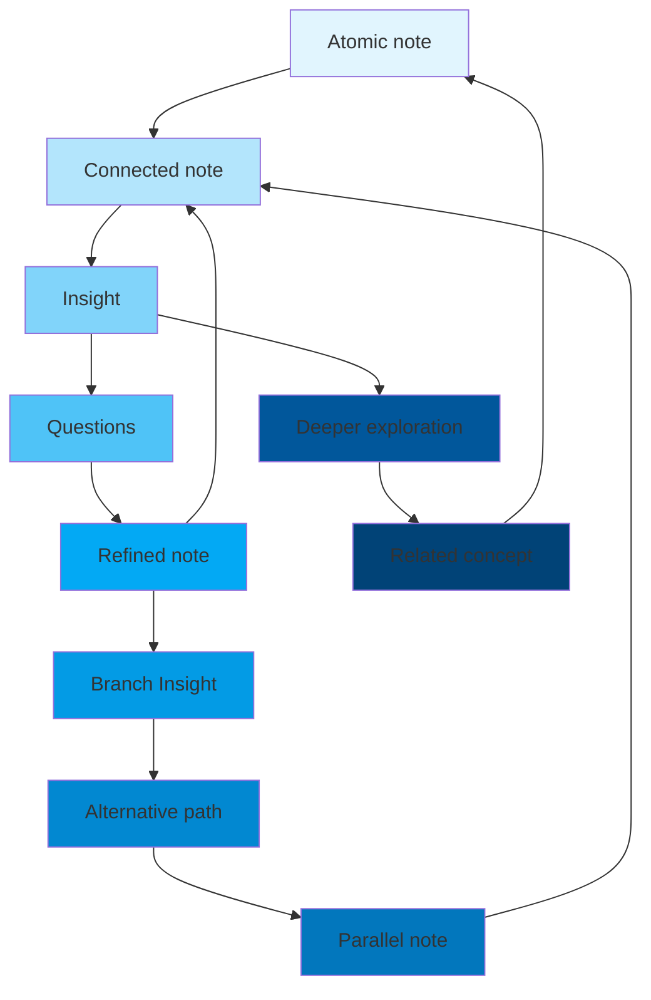

You have stumbled upon my working notes, as do to all paths of this [[thoughts/Digital garden|digital garden]]. This is pretty much inspired by [Andy's working notes](https://andymatuschak.org/)

Much of these notes/writings are written for my own consumption, a sort of [[tags/evergreen]] notes.
If any of these doesn't make sense for you, it is probably because I didn't write it for you.

My only ask for https://notes.aarnphm.xyz is to treat the sites as it. Most of other functionalities can be found on the [main site](https://aarnphm.xyz)

You can start from some related [[/thoughts|topics]] that has been on my mind these days,
or check out some [[thoughts/work|crafts]] I've been working on for the past while.

If you are into machine learning, you might be interested in [[thoughts/mechanistic interpretability|interpretable ml]],
or high performance [[thoughts/vllm|inference]] [[thoughts/LLMs|LLM engine]], or some [[/tags/math|math-related notes]], or a gentle introduction to [[thoughts/Attention|attention-mechanism]] in [[thoughts/Transformers|transformer]] model.

There are also some [[/tags/philosophy|philosophical notes]] that I think about on a daily [[thoughts/Philosophy and Nietzsche|basis]].

:wave: you can reach out to me on [twitter](https://twitter.com/aarnphm_)

