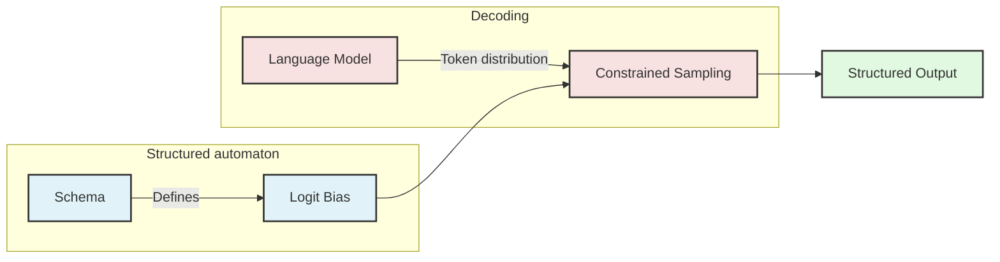

See also: [[thoughts/constrained-decoding|notes]]

_[vLLM](https://blog.vllm.ai/2023/06/20/vllm.html) is the high-throughput and efficient inference engine for running **large-language model** ([[thoughts/LLMs|LLM]])_

This post will quickly introduce the annotated history of language models, describe the current state of [[thoughts/constrained decoding|structured decoding]] in vLLM, as well as the recent integration with [xgrammar](https://github.com/vllm-project/vllm/pull/10785), and a tentative plan for vLLM's [v1](https://github.com/vllm-project/vllm/issues/8779). For more information about vLLM, please check out our [documentation](https://docs.vllm.ai/en/latest/).

## language model, a brief historical context

_If you have read about the history of the field before, feel free to skip this part to [[posts/structured decoding#why do we need structured decoding?|reason for structured decoding]]_

The inception of [[thoughts/Machine learning|AI]] might well be traced back to the origin of logics, where men put emphasis on reducing reasoning to some specific sets of calculations (a [[thoughts/reductionism|reductionist]] approach).
As such, Plato generalised the belief in total formalisation of knowledge, where knowledge must be universally applicable with explicit definitions[^intuition]. North of two thousands years later, Alan Turing's seminal paper "Computing Machinery and Intelligence"
posited that a high-speed digital computer, programmed with rules, would exhibit [[thoughts/emergent behaviour]] of [[thoughts/intelligence|intelligence]] [@10.1093/mind/LIX.236.433].
A paradigm quickly emerged among researchers in the 1950s, where expert systems were designed to replicate the decision-making capabilities of a human specialist [^expert-system], (or symbolic [[thoughts/reason|reasoning]] system), referred to by Haugland as Good Old-Fashioned AI (GOFAI) [@10.7551/mitpress/4626.001.0001]. However, it quickly ran into funding problems due to its semantic representation not being able to scaled up to generalized tasks (Also known as the "AI Winter" [@handler2008avoidanotheraiwinter]).

[^intuition]: In other words, intuition, feeling would not constitute as the definition of knowing. For Plato, cooks, who proceed by taste and intuition does not involve understanding because they have no knowledge. Intuition is considered as a mere belief.

[^expert-system]:
    Allen Newell and Herbert Simon's work at RAND initially showed that computers can simulate important aspects of intelligence.

    Another notable application was found in the medical domain [@10.7551/mitpress/4626.001.0001]. MYCIN, developed at Stanford University in the 1970s, diagnosed and recommended treatments for blood infections [@shortliffe1974mycin]. MYCIN’s developers recognized the importance of justifying recommendations, implementing what were known as “rule traces” to explain the system’s reasoning in human-understandable terms.

Concurrently, Donald Norman's Parallel Distributed Processing [@10.7551/mitpress/5236.001.0001] group investigated variations of Rosenblatt's perception [@rosenblatt1958perceptron], where they proposed _hidden layers_ within the network alongside with inputs and outputs to extrapolate appropriate responses based on what it had learned during training process. These connectionist networks, often built on top of statistical methods[^5], are often referred as New-Fangled AI (NFAI) [@10.7551/mitpress/4626.001.0001]. Given the abundance
of data and Moore's Law[^moore] resulting in an unprecedented amount of compute available, we see the complete dominance of connectionist networks in both research and production use-cases, with variants of _decoder-only_ transformers[^lstm] for _text generations_ tasks.

> [!note]- on the term "next-token prediction"
>
> The term "next-token prediction" is also used sparsely when describing text-generation tasks, but it rather describes the "autoregressive" objectives of text generations. These models
> are trained to calculate a probability distributions for next tokens based on the causality of existing tokens within a sentence [^token]
>
> You can think of intuitively as "the models try to pick from a set of words what possible options are applicable to be used given a sentence". The model then "chooses" this words (or for more correct term _tokens_) based on a probability distribution and such iteratively repeats this process until it is "being told" to stop (in this case either mechanistically via configurations or out-of-memory (OOM)).
>
> For more information on how these auto-regressive transformers work, I highly recommend checking out [this awesome visualisation by Brendan Bycroft](https://bbycroft.net/llm) or [3Blue1Brown's Deep Learning series](https://www.youtube.com/playlist?list=PLZHQObOWTQDNU6R1_67000Dx_ZCJB-3pi).
>
> For now, whenever we mentions LLMs, we assume that they are auto-regressive decoder-only transformers models.

[^token]:
    Machine learning models needs to process arbitrary numbers rather than text, as such we have to convert a given word $X$ to its corresponding encoded tokens (often known as tokenization).

    For example, the model will see the phrase `"The quick brown fox jumps over the lazy dog"` as `['<|begin_of_text|>', 'The', ' quick', ' brown', ' fox', ' jumps', ' over', ' the', ' lazy', ' dog']`

[^5]:
    In the 1990s, IBM released a sequence of complex statistical models that is trained to perform machine translations [tasks](https://en.wikipedia.org/wiki/IBM_alignment_models) [@IBMModels] (see also: this [lecture](https://www.cs.cornell.edu/courses/cs5740/2017sp/lectures/08-alignments.pdf) from Cornell).

    In 2001, Bag of words (BoW)-variants model was trained on 0.3B tokens and was considered SOTA at the time [@mikolov2013efficientestimationwordrepresentations]. These earlier works proved to the research community that statistical modelling triumphs over symbolic counterpart for language processing given it can capture the general patterns for large corpuses of text.

[^moore]:
    In 2017, The landmark paper "Attention is all You Need" introduced [[thoughts/Transformers]] architecture [@vaswani2023attentionneed] for neural machine translations tasks, which is based on the [[thoughts/Attention|attention]] mechanism first proposed by [@bahdanau2016neuralmachinetranslationjointly].

    OpenAI then introduced the scaling law for neural language models [@kaplan2020scalinglawsneurallanguage], which sets off the race towards building these systems based on foundational language models.

[^lstm]:
    Prior to Attention-based transformers, seq-to-seq models uses RNNs given its ability for longer context length and better memory. However, they are more susceptible to vanishing/exploding gradients comparing to [[thoughts/FFN|feed-forward network]], and thus LSTM [@hochreiter1997long] was used to solve this problem.

    Yet, one of the main problems with LSTM is that they still tend to have poor memory recall with data they have seen many steps ago.

    The Attention paper addresses this problem by encoding additional positional data into the inputs. The paper also additionally proposed a encoder-decoder architecture for translation tasks,
    however, most of text-generation models nowadays are _decoder-only_, given its superior performance over zero-shot tasks.

    One of the many reasons why attention-based transformers works better than LSTM is because transformers are very scalable and hardware-aware (you can’t just arbitrary add more LSTM block and hope for better long-term retention). For more information, please refer back to the original paper.

In retrospect, GOFAI are [[thoughts/Determinism|deterministic]] in a sense that intentionality is injected within symbolic tokens through explicit programming.
Connectionist networks, on the other hand, are often considered as black-box models, given their hidden nature of intermediate representations of perceptron.
Unlike GOFAI, its internal representation is determined by the state of the entire network states rather than one singular unit. Although these models exhibit [[thoughts/emergent behaviour]] of [[thoughts/intelligence|intelligence]], one should be aware that this is not [[thoughts/AGI|artificial general intelligence]] _yet_, largely due to researchers' [[thoughts/observer-expectancy effect]].

## why do we need structured decoding?

![[posts/images/shogoth-gpt.png|Shogoth as GPTs]]

[[thoughts/LLMs|LLMs]] excel at the following heuristic: given a blob of text, the model will generate a contiguous piece of text that it predicts as the most probable tokens. For example, if you give it a Wikipedia article, the model should produce text consistent with the remainder of said article.

These models works well given the following assumption: ==the inputs prompt must be coherent and well-structured surrounding a given problem the users want to achieve==. In other words, generations are **non-deterministic** if one expect
a certain formats of said outputs (most notably JSON[^prompting]).

This arises for the need of applying explicit rules and grammar[^gofai-nfai] (an addition of GOFAI system) that allows users to have control over certain aspect of the generations
format while keeping the non-deterministic nature of the overall system. OpenAI then introduced [JSON mode](https://platform.openai.com/docs/guides/structured-outputs#json-mode) to constrain [^structured-decoding] the output format from these models. If you have built with these functionality before (such as [function calling](https://bentoml.com/blog/function-calling-with-open-source-llms), [coding assistant](https://bentoml.com/blog/building-an-ai-coding-assistant-with-tabby-and-bentocloud)), chances are you are using structured decoding under the hood.

[^gofai-nfai]: Most recent notable example of GOFAI-NFAI hybrid system is AlphaZero. AlphaZero is a connectionist network-based Go playing systems, that uses a deep neural networks to assess new positions (a NFAI algorithm) and Monte-Carlo Tree Search (a GOFAI algorithm) to determine its next move [@silver2017masteringchessshogiselfplay]. DeepMind then applies these techniques to build AlphaFold, a system that predicts a protein’s 3D structure from its amino acid sequence.

[^prompting]:
    One might argue that we can reliably achieve these through few-shot promptings, i.e "Give me a JSON that yields the address of users. Example output can be ...". However, there
    is no guarantee that the generated outputs is a valid JSON. This is because these models are probabilistic systems, as they are "sampling" the next results based on
    the distribution of data that it was trained on.

    One might also argue that one should use specific fine-tuned models for JSON outputs to perform such cases. However, fine-tuning often requires extensive training and a lot more
    labor to curate data, monitor progress, and perform evaluation, which is a huge resources not everyone can afford to do.

[^structured-decoding]: Note that the phrase "[structured/constrained/guided] decoding" are used interchangeably, but they all refer to the same mechanism of "using a format for the model to structurally sampling outputs."

## layman introduction into structured decoding and current state in vLLM.

We have laid out a map of how we get here, some reasons why we need structured decoding and its application, and possibly improve native decoding [performance](https://blog.dottxt.co/coalescence.html),
one might ask, what is "structured decoding" and how I can use it in vLLM?

In layman term, structured decoding is a process where we gives the the LLMs a set of schemas, where such schemas can be used by the systems to "influence" the generated outputs that is compliant to said schemas:

From a technical perspective, a inference engine can modify the probability distribution for next-tokens by applying bias (often via logit masks) for all tokens from any given schemas. To apply these biases, [outlines](https://github.com/dottxt-ai/outlines) was proposed to construct a finite-state machine [^fsm] (FSM) from any given schemas to then guide the generations [@willard2023efficientguidedgenerationlarge]. This allows us to track the current state during decoding and filter out invalid tokens by applying logit bias to the output.

![[thoughts/images/vllm/constrained-json-fsm.webp]]
_courtesy of [LMSys, 2024](https://lmsys.org/blog/2024-02-05-compressed-fsm/)_

_in vLLM, you can use this by passing a JSON schema to the sampling params (either through [Python SDK](https://github.com/vllm-project/vllm/blob/80c751e7f68ade3d4c6391a0f3fce9ce970ddad0/benchmarks/benchmark_guided.py#L137) or HTTP requests)_

[^fsm]:
    We define a _finite-state machine_, given by $(Q, \Sigma , \delta, q_0, F)$ where character comprising the strings in $\mathcal{V}$ are drawn from $\Sigma$, i.e: $\mathcal{V} \in \mathcal{P}(\Sigma)$:

    - $Q$ is a finite set of states
    - $\Sigma$ is a finite alphabet
    - $\delta: Q \times \Sigma \to Q$ is the transition function
    - $q_0 \in Q$ is the start state
    - $F \subseteq Q$ is the set of all accepted states.

    Intuitively, we can describe any structured format (JSON, YAML, etc.) using a context-free grammar due to its expressive nature.

### current limitation.

There are currently a few limitations within vLLM's support for outlines backend:

1. FSM has to be constructed at a token-level, meaning it can only transition the state one token per step. Therefore, it can only decode _one_ token at a time, resulting in slow decoding.
2. Implementation in [vLLM](https://github.com/vllm-project/vllm/blob/80c751e7f68ade3d4c6391a0f3fce9ce970ddad0/vllm/model_executor/guided_decoding/outlines_logits_processors.py)
   relies on logit processor [^logit-processor]. As such, this is in the critical path of the sampling process [^sampling].
   In batching use-case, compiling FSM per requests as well as computing the mask synchronous means that **all requests** in any given batches will
   get blocked, resulting in high time-to-first-tokens (TTFT) and lower throughput.
   - We found that compiling FSM is proven to be a relatively expensive task, which is one of the main contributor to lower TTFT here.
3. With outlines integrations, while JSON mode are relatively fast, the CFG mode is unfortunately a lot slower, and can occasionally [crashes](https://github.com/vllm-project/vllm/issues/10081) the engine.
4. For technique such as [jump-forward decoding](https://lmsys.org/blog/2024-02-05-compressed-fsm/), this is currently not possible with logit-processor
   approach given that it requires prefilling a set of $k$-next tokens, whereas for logit processors we can only deal with the next-token.

[^logit-processor]: See this [blog post](https://huggingface.co/blog/logits-processor-zoo) from Transformers for using logit processors to control generations process.

[^sampling]:
    _The following was excerpt from [vllm-project/vllm#5329](https://github.com/vllm-project/vllm/pull/5329)_:
    ![[thoughts/images/vllm/pre-optimized-logit-processor-handling.webp|waterfall of sampling process in vLLM v0]]

### integrations with xgrammar

[xgrammar](https://github.com/mlc-ai/xgrammar) introduces a new technique to batched constrained decoding using pushdown automaton (PDA).
You can think of these PDA as a "collection of FSM, and each FSM represents a CFG." One of the advancement of PDA is its recursive nature,
allowing us to execute multiple state transitions. They also include additional [optimisation](https://blog.mlc.ai/2024/11/22/achieving-efficient-flexible-portable-structured-generation-with-xgrammar) (for those who are interested)
to reduce grammar compilation overhead.

This is great because it allows us to address limitation (1) by moving compilation out of Python into C, utilising `pthread`. Additionally, `xgrammar` enables us to implements (4) for future releases. Below includes some numbers comparing `xgrammar` and `outlines` backend:

![[posts/images/vllm-new-xgrammar.png]]

![[posts/images/vllm-xgrammar-decode-time-per-output-token.png]]

Implementation-wise, due to the constraints of v0 architecture, xgrammar is added as a [logit processor](https://github.com/vllm-project/vllm/blob/main/vllm/model_executor/guided_decoding/xgrammar_decoding.py)
albeit with some optimizations for caching tokenizer data. While we observe satisfactory improvements in overall performance, we acknowledge that there are still more performance left on the table.

> [!note] integrations with v0
>
> There are still a few usability concerns to match feature parity with all use cases:
>
> - It is yet to support grammars other than GBNF format (PR on vLLM: [github](https://github.com/vllm-project/vllm/pull/10870))
> - It is yet to support regex
> - It is yet to support complex JSON that uses regex patterns or numeric ranges [^bugfix]

[^bugfix]: There are a few PR trying to cover this usage. There was one [bugfix PR on vLLM](https://github.com/vllm-project/vllm/pull/10899) and one [upstream](https://github.com/mlc-ai/xgrammar/pull/106)

> [!important]
>
> vLLM now has a basic support for xgrammar by default. In case where we know xgrammar is insufficient to serve the request, we fall back to outlines.

## tentative plans for v1

With the release of [v1](https://github.com/vllm-project/vllm/issues/8779) on the horizon, the following includes a tentative plans we have for structured decoding going forward:

1. Moving guided decoding towards scheduler-level
   - We have more information regarding which requests use structured decoding at a scheduler-level, therefore
     it shouldn't block other requests within the batch (tentatively addressing limitation (2)). In a sense, this
     moves guided decoding outside of the critical path.
   - This would allow for more natural integration with jump-forward decoding (address limitation (4))
2. Allowing bitmask calculation in one process instead of each GPU workers
   - We can then broadcast this bitmask to each GPU worker instead of repeat this process per GPU workers.
   - Though we would have to investigate further given it might be too much to broadcast for every sample for every requests doing guided decoding.
3. Good baseline for speculative decoding and tool-use
   - XGrammar includes plans to support tool-use, such that we can move away from Python's [tool parser](https://github.com/vllm-project/vllm/tree/main/vllm/entrypoints/openai/tool_parsers)
   - Tree scoring in speculative decoding can then use the same API as jump-forward decoding. (which in turn depends on integrating this at the scheduler-level)

_NOTE: if you have any more suggestions we are more than happy to take it into consideration. Consider joining [vLLM slack](slack.vllm.ai) via `#feat-structured-output`_

## acknowledgement

I want to thank the vLLM team, XGrammar team, Michael Groin (Neural Magic), Chendi Xue (Intel), and Russell Bryant (Red Hat)
for their valuable feedback and collaboration on bringing XGrammar to vLLM and the continuous effort to improve structured decoding in vLLM.

[^ref]
