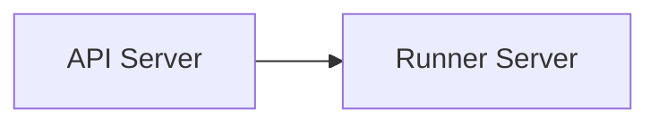

Previous links to [[Runner interface]]

### Runners Server



- Payload

```prolog
Payload
	data: arrow.RecordBatch (conversion at client)
		runner_client: arrow_to_{numpy,pandas,tensor,file,parquet}
					   {numpy,pandas,tensor,file,parquet}_to_arrow
	metadata: Map<str, Any> {
	}
```
