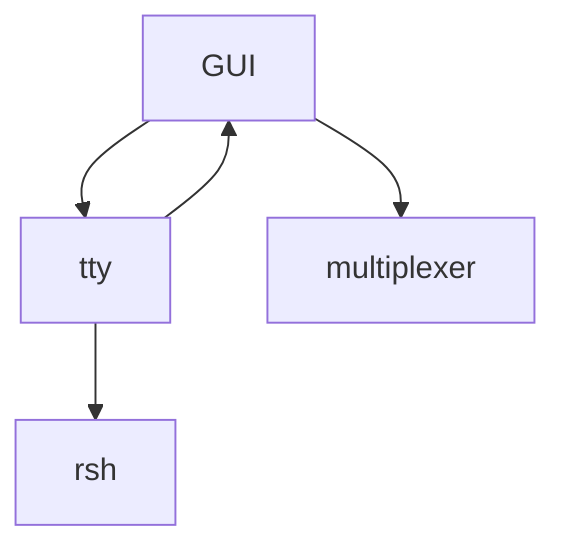

yet another terminal emulator written in rust

- with ideas to stream the current running process and make it clickable,
- vim and emacs integration,
- - a multiplexer, and streamed tty.

```mermaid
flowchart TD

1[GUI] --> 2[tty] --> 3[rsh]
1 --> 5[multiplexer]
2 --> 1
```
