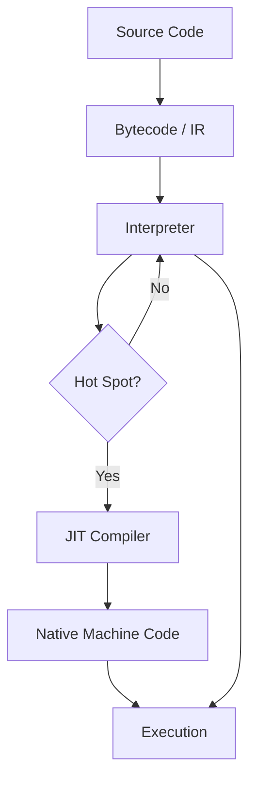

## just-in-time compiler

```mermaid
graph TD
    A[Source Code] --> B[Bytecode / IR]
    B --> C[Interpreter]
    C --> D{Hot Spot?}
    D -->|Yes| E[JIT Compiler]
    D -->|No| C
    E --> F[Native Machine Code]
    F --> G[Execution]
    C --> G
```

See also: [[thoughts/jit.py]]
