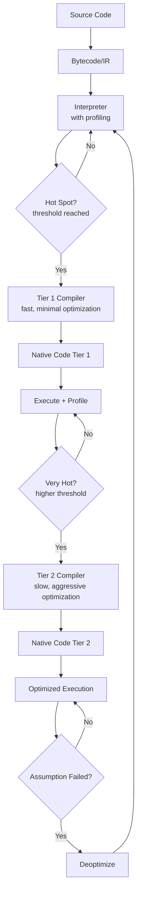
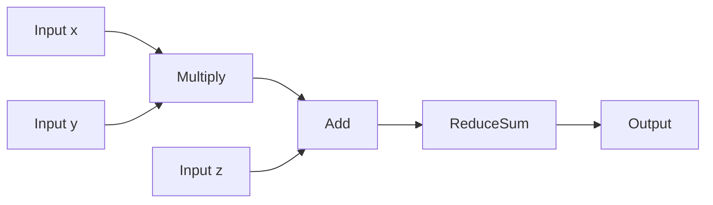

see also: [[thoughts/jit/numba_jit.py|numba jit]], [[thoughts/jit/minimal_jit.py|minimal jit]], [[thoughts/XLA|XLA]], [[thoughts/MLIR|MLIR]], [[thoughts/Autograd|autograd]]

## compilation pipeline

compilers translate source code through multiple phases, each lowering abstraction while preserving semantics.

### lexical analysis

tokenization converts character streams to tokens:

- regex-based (flex, python's tokenize)
- hand-written state machines (go, rust).

> Regex engines use thompson's construction - [[thoughts/NFA]] to [[thoughts/DFA]] conversion.
> Hand-written lexers avoid regex overhead, handle context-sensitive tokens (i.e: python's indent/dedent),
> provide better error messages.

Maximal munch principle [^maximal-munch]: consume longest matching token. `>=` tokenizes as single operator, not `>` followed by `=`.
Lookahead required for disambiguation - `>>` in C++ templates vs right shift.

[^maximal-munch]: the principle that when creating some construct, as much of the available input as possible should be consumed.

### parsing

converts token stream to abstract syntax tree. common strategies:

**recursive descent**: hand-written, predictable performance, excellent errors. rust and go use this. each grammar rule becomes a function. requires left-factoring to avoid ambiguity. handles operator precedence via precedence climbing - binary operators parsed by precedence level, right recursion for right-associative ops.

**lr/lalr**: table-driven, generated by yacc/bison. handles larger grammar class than recursive descent. poor error recovery, cryptic conflict messages. gcc used this historically, now shifting to hand-written.

**parser generators**: yacc, antlr, pest. trade implementation time for parsing performance. generated code hard to debug.

### semantic analysis

type checking, symbol tables, scope resolution. classic two-pass: first builds symbol table, second checks types. single-pass possible with forward declarations (C) or requires (rust).

**symbol tables**: map identifiers to binding information (type, location, mutability). nested scopes implemented as linked list of hash tables or single table with scope markers. rust uses def-id system - globally unique identifier for each definition.

**type checking**: algorithm W for hindley-milner (ocaml, haskell), bidirectional type checking for dependent types (lean, agda), constraint-based for subtyping (scala). invariants checked here: no undefined variables, type compatibility, lifetime validity (rust).

### code generation

lowers typed ast to intermediate representation or machine code. three-address code common - `x = y + z` becomes single instruction. basic blocks constructed by scanning for jumps, terminators. control flow graph built from basic blocks.

instruction selection chooses machine instructions for ir operations. tree pattern matching (burg), dynamic programming for optimal tiling, greedy selection for speed. modern compilers (llvm) use dag-based selection - exploit commutativity, common subexpressions.

## compilation strategies

three fundamental approaches to executing code, each making different trade-offs between compilation overhead and runtime performance.

ahead-of-time compilation produces native code before execution. gcc and clang spend minutes optimizing C++ to squeeze out every cycle. rust's borrow checker runs at compile time. go compiles fast but optimizes less aggressively. you pay compilation cost once, get predictable performance. no runtime information means missing optimization opportunities - can't inline virtual calls without knowing actual types, can't optimize branches without execution frequencies.

interpretation executes source directly. cpython walks an ast or bytecode, ruby's mri does similar. simple implementation, fast startup, trivial debugging. pays parsing and dispatch overhead on every execution. python loops run 50-100x slower than C because each iteration decodes bytecodes, performs type checks, boxes/unboxes values.

just-in-time compilation observes execution then compiles hot code. hotspot watches java bytecode execution, v8 profiles javascript, pypy traces python interpreter loops. compilation happens during execution when profiling data justifies the cost. speculative optimizations become possible - inline monomorphic call sites, eliminate type checks when types are stable, reorder branches by frequency.

## just-in-time compilation

[[thoughts/JIT]] systems defer native code generation until they have runtime information.

The observation is that most programs spend time in small hot regions. Compile those regions with profile-guided optimization.

### tiered compilation model

modern jits use multiple compilation tiers, each optimizing for different execution frequencies:



interpreter tier instruments bytecode execution. counts method entries (hotspot triggers at ~1500), loop backedges (triggers at ~150 for osr), records types at polymorphic sites, tracks branch directions. instrumentation overhead acceptable because code executes few times.

tier 1 compiles in 10-100ms. does constant folding, dead code elimination, simple inlining. generates inline caches for method dispatch. goal is eliminating interpreter overhead quickly, not peak performance.

tier 2 takes 100ms-seconds. uses full profiling data - type distributions, branch frequencies, call graphs. performs escape analysis to scalarize allocations, aggressive inlining guided by actual call frequencies, loop transformations (unrolling, invariant hoisting). generates deoptimization points for speculative optimizations.

### profiling mechanisms

runtime profiling reveals program behavior invisible at compile time.

type profiling at polymorphic sites:

```python
def add(a, b):
  return a + b


# profiler sees: 99% int, 1% float
# generates fast path for int addition with guard
```

branch profiling for layout:

```python
if condition:  # 95% true, 5% false
  hot_path()
else:
  cold_path()

# hot_path inlined, cold_path moved out of instruction cache line
```

call profiling for inlining decisions:

```python
for i in range(1000000):
  result = expensive_function(i)

# inline if callee small enough and frequently called
```

### key optimizations

inline caching eliminates method lookup overhead:

```python
obj.method()  # first call: full lookup, cache result
# subsequent: if type matches cache, direct call
# otherwise: cache miss, update cache
```

escape analysis removes unnecessary allocations:

```python
def compute(x):
  temp = SomeObject(x)  # doesn't escape
  return temp.value


# allocation eliminated, fields become locals
```

on-stack replacement compiles hot loops mid-execution:

```python
def long_running_loop():
  for i in range(1000000):  # becomes hot at i=1500
    compute(i)  # osr transfers to compiled code
```

### deoptimization

speculative optimizations require escape hatches when assumptions fail.

```python
def polymorphic_add(a, b):
  return a + b


# jit generates:
# if type(a) == int and type(b) == int:
#   return a + b  # native addition
# else:
#   deoptimize()  # reconstruct interpreter state
```

deoptimization reconstructs interpreter state from optimized code - restores stack frames, recovers local variables, transfers control. compiled code invalidated if assumptions permanently broken.

### performance tradeoffs

compilation cost must amortize over executions:

```
total_time = compile_time + n_executions × runtime(optimized)
```

fibonacci example:

- compile_time: 50ms
- runtime(interpreted): 100µs per call
- runtime(jit): 1µs per call
- break-even: 50ms / 99µs ≈ 505 calls

typical break-even points depend on optimization level - tier 1 pays off after 10-100 executions, tier 2 after 100-1000, aggressive optimization needs 1000-10000.

## practical implementations

numba compiles python to llvm ir:

```python
import numba


@numba.jit
def compute(x):
  return x**2 + 3 * x


# first call: type inference, llvm codegen, native compilation
# subsequent: cached native function
```

see [[thoughts/jit/numba_jit.py|numba demo]] for 10-100x speedups on numerical code.

pypy uses meta-tracing - traces the interpreter executing user code, not user code directly. records operations on python objects, compiles traces to machine code. typical speedup 5-20x over cpython.

v8's pipeline: ignition interpreter generates inline cache data, sparkplug does template-based tier 1 compilation, turbofan builds sea-of-nodes ir for tier 2 optimization. deoptimizes when polymorphic sites destabilize.

## bytecode optimization without native compilation

pure python bytecode manipulation demonstrates compiler concepts without leaving python:

```python
# constant folding at compile time
x = 2 + 3  # becomes LOAD_CONST 5

# peephole optimization
y = x + 0  # eliminate identity operation
z = y * 1  # same
```

see [[thoughts/jit/minimal_jit.py|minimal jit]] for educational implementation. achieves 1.5-2x speedup through profiling, constant folding, dead code elimination. limited by interpreter overhead - can't generate native code, can't vectorize, python object overhead remains.

## intermediate representations

compilers use multiple ir levels, each suited to different optimizations.

### abstract syntax tree

ast captures program structure directly from source. nodes represent language constructs - expressions, statements, declarations. typed ast annotates nodes with type information from semantic analysis.

traversal patterns: visitor (double dispatch for extensibility), interpreter (evaluate ast directly), transformer (ast → ast rewrites). immutable trees enable safe parallelization, mutable for in-place optimization.

ast limitations: verbose (binary `+` needs 3 nodes), hard to analyze (no explicit control flow), language-specific structure.

### control flow graph

cfg represents execution paths. nodes are basic blocks - straight-line code with single entry, single exit. edges represent control flow - conditional branches, loops, function calls.

construction: scan instructions, start new block at labels/branches, terminate at jumps. dominance relations: block A dominates B if all paths to B go through A. dominance frontiers used in ssa construction.

### static single assignment form

ssa ensures each variable assigned exactly once. enables sparse dataflow analysis - def-use chains explicit in ir, not computed. phi nodes merge values at control flow joins:

```
if (cond):
  x = 1
else:
  x = 2
y = x  # which x?

# ssa form:
if (cond):
  x1 = 1
else:
  x2 = 2
x3 = φ(x1, x2)  # phi node
y = x3
```

**ssa construction**: cytron's algorithm computes dominance frontiers, inserts phi nodes, renames variables. simpler approaches exist - braun et al.'s algorithm builds ssa during cfg construction, no dominance computation needed.

**properties**: def-use chains are sparse (use finds def in O(1)), constant propagation becomes trivial (if def is constant, all uses see it), dead code elimination easy (value with no uses is dead).

see [[thoughts/MLIR]] for ssa with block arguments instead of phi nodes.

### three-address code

form where instructions have at most 3 operands: `x = y op z`. makes register allocation explicit - each temporary needs storage. common in llvm ir, java bytecode (stack-based variant).

```
// source: a = b + c * d
t1 = c * d
t2 = b + t1
a = t2
```

quadruples representation: (operator, arg1, arg2, result). enables fast pattern matching for instruction selection.

### lowering passes

high-level ir → low-level ir through progressive refinement. each pass preserves semantics while reducing abstraction:

- desugar complex constructs (`for` → `while`)
- lower structured control flow (scf → branches/jumps)
- explicit memory operations (variables → load/store)
- calling conventions (arguments → registers/stack)
- platform-specific representations (llvm ir → machine ir)

see [[thoughts/XLA]] for tensor graph → hlo → llo lowering.

## dataflow analysis

optimization requires knowing how values flow through programs. dataflow frameworks provide systematic analysis.

### lattice theory

dataflow facts form lattice - partial order with meet (∧) and join (∨) operators. analysis computes fixed point by iterating transfer functions until no values change.

example lattices:

- constant propagation: ⊤ (unknown) > constants > ⊥ (unreachable)
- available expressions: sets ordered by inclusion
- liveness: sets of live variables

**monotone frameworks**: transfer functions must be monotone (preserve ordering). guarantees fixed point exists, iteration terminates. worklist algorithm: process cfg nodes until no changes, soundness proved by lattice properties.

### reaching definitions

which definitions reach each program point? definition of x reaches point p if there exists path from definition to p with no intervening definition of x.

dataflow equations:

```
IN[B] = ∪ OUT[P] for P in predecessors(B)
OUT[B] = GEN[B] ∪ (IN[B] - KILL[B])

GEN[B] = definitions in B
KILL[B] = definitions of same variables elsewhere
```

forward analysis - information flows from entry to exit. used for constant propagation, copy propagation.

### liveness analysis

which variables are live (will be used) at each point? variable x live at point p if there exists path from p to a use of x with no intervening definition.

dataflow equations:

```
OUT[B] = ∪ IN[S] for S in successors(B)
IN[B] = USE[B] ∪ (OUT[B] - DEF[B])

USE[B] = variables used before definition in B
DEF[B] = variables defined in B
```

backward analysis - information flows from exit to entry. critical for register allocation (determines interference), dead code elimination (unused values).

### available expressions

which expressions have been computed and not invalidated? expression `x + y` available at point p if every path to p evaluates `x + y` and neither x nor y redefined.

```
IN[B] = ∩ OUT[P] for P in predecessors(B)  # must property
OUT[B] = GEN[B] ∪ (IN[B] - KILL[B])

GEN[B] = expressions computed in B
KILL[B] = expressions invalidated by definitions in B
```

forward must analysis - intersection of paths. enables common subexpression elimination.

### optimization applications

**constant propagation on ssa**: trivial because def-use explicit. if value defined by constant, all uses see constant. sparse conditional constant propagation (sccp) adds control flow - only analyze reachable paths.

**dead code elimination**: value dead if not in OUT[B] for any block B. on ssa, dead if no uses in def-use chain. mark live values, sweep dead ones.

**common subexpression elimination**: global value numbering on ssa. assign value numbers to expressions - if two expressions have same value number and both available, eliminate redundant computation.

see [[thoughts/jit/python bytecode jit.md]] for constant folding and dead code elimination on python bytecode.

## backend code generation

final compilation phases produce machine code.

### register allocation

maps unlimited virtual registers to limited physical registers. formulated as graph coloring - nodes are virtual registers, edges connect registers that interfere (live simultaneously).

**interference graph**: build from liveness analysis. if two variables live at same point, they interfere - can't share same register. for ssa form, phi node arguments and results interfere with all values live across phi.

**graph coloring**: classic chaitin-briggs algorithm. simplification removes nodes with degree < k (k = number of registers), spills high-degree nodes. rebuild assigns colors to simplified graph. if no color available, insert spills (store to memory).

**linear scan**: simpler alternative to graph coloring. sort virtual registers by live intervals, scan linearly assigning registers. fast (linear time), good code quality for jit compilation. used in v8, hotspot tier-1.

**advanced techniques**: ssa-based allocation avoids coalescing phi nodes (insert moves instead), treescan allocation for expression trees, second-chance allocation retries spilled values.

see LLVM's greedy register allocator for production implementation - uses eviction with live range splitting.

### instruction selection

maps ir operations to machine instructions. optimal tiling problem: cover ir tree with instruction patterns minimizing cost.

**pattern matching**: burg (bottom-up rewrite generator) generates matcher from patterns. dynamic programming finds optimal cover. tree grammar encodes instruction costs.

```
pattern: ADD(reg, CONST(c))  → addi reg, c    cost: 1
         ADD(reg, reg)       → add  reg, reg   cost: 1
         ADD(reg, MUL(r, r)) → madd reg, r, r  cost: 2  # fused multiply-add
```

**dag-based selection**: llvm uses dag rewriting. exploits commutativity (ADD commutes), common subexpressions (share dag nodes). legalization handles operations not supported by target (64-bit add on 32-bit machine).

**complexity**: optimal instruction selection NP-complete for general dags. linear for trees (bottom-up rewrite). heuristics: greedy matching, pattern priority, cost models.

### instruction scheduling

reorder instructions to minimize stalls, maximize parallelism. list scheduling: maintain ready queue of independent instructions, choose based on priority heuristic.

**dependencies**: true dependency (read after write), anti-dependency (write after read, false dependency - renamable), output dependency (write after write, also false).

**software pipelining**: overlap loop iterations. modulo scheduling unrolls, reorders across iterations. fills pipeline - steady state executes multiple iterations simultaneously. critical for dsp, scientific computing.

**latency hiding**: schedule high-latency operations (memory loads, divides) early. interleave independent work during stalls. modern cpus have 300+ cycle memory latency - hundreds of instructions to hide it.

see [[thoughts/XLA]] for backend scheduling - xla optimizes kernel launch order, memory transfers.

## machine learning compilers

ml frameworks apply compilation to tensor computation graphs.

### [[thoughts/XLA]] (accelerated linear algebra)

xla operates on computation graphs, not bytecode:

```python
@tf.function
def compute(x, y, z):
  return tf.reduce_sum(x + y * z)


# xla fuses into single kernel:
# 3 launches → 1, eliminates 2 temporaries
# 3x memory bandwidth reduction
```

see [[thoughts/XLA|XLA]] for fusion algorithms.

optimizations at graph level: operator fusion combines elementwise ops, buffer reuse via liveness analysis, layout optimization for access patterns, multi-backend code generation (llvm, nvptx, amdgpu).

### compute graphs as ir

graphs enable whole-program optimization:



transformations: constant folding across ops, common subexpression elimination, algebraic simplification (x × 1 → x), operation reordering, vertical fusion (producer-consumer), horizontal fusion (parallel ops).

static graphs (tensorflow 1.x, jax) build once, optimize aggressively. dynamic graphs (pytorch eager) rebuild per execution, easier debugging but less optimization opportunity.

see [[thoughts/MLIR|MLIR]] for multi-level ir enabling progressive lowering.

### [[thoughts/Automatic Differentiation|automatic differentiation]]

[[thoughts/Autograd]] composes with jit for efficient gradients:

```python
import jax


@jax.jit
def loss_fn(params, x, y):
  pred = params @ x
  return jnp.mean((pred - y) ** 2)


grad_fn = jax.grad(loss_fn)

# traces to jaxpr, applies reverse-mode ad
# compiles forward and backward with xla
```
