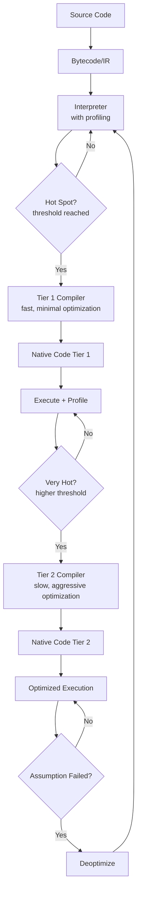
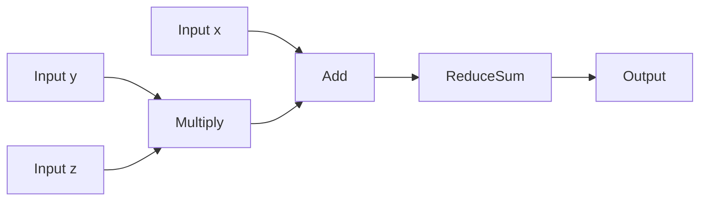

## compilation pipeline

### lexical analysis

tokenization groups source characters into identifiers, literals, keywords, and punctuation. a lexer also tracks source positions so later errors can point back to the text.

regular token patterns can be compiled into an automaton: Thompson's construction builds an [[thoughts/NFA]] from a regular expression; subset construction converts that NFA into a [[thoughts/DFA]]. these are two separate steps. an implementation can also simulate the NFA directly. [Cox's construction and implementation](https://swtch.com/~rsc/regexp/regexp1.html) show both routes.

a handwritten lexer can encode the same recognition rules. either implementation may need extra state for nested comments, string interpolation, or indentation. choosing a handwritten lexer does not by itself establish a speed or diagnostic advantage.

maximal munch [^maximal-munch] chooses the longest valid token at the current position. if `>=` is an operator in the language, it consumes both characters. equal-length matches need a priority rule, such as recognizing a keyword before an identifier. syntactic context can require additional rules, as with closing template brackets in C++.

[^maximal-munch]: consume the longest token accepted by the lexical rules, then resolve any tie using the lexer's priority rules.

### parsing

parsing determines how the tokens form expressions, statements, and declarations. an abstract syntax tree (AST) retains that structure while usually discarding punctuation that has already served its purpose.

**recursive descent** organizes the parser as mutually recursive functions. a predictive parser needs a way to choose a production; left-factoring and eliminating left recursion can make a grammar suitable for that approach. precedence climbing or Pratt parsing handles operators without a separate function for every precedence level. [LLVM's parser tutorial](https://llvm.org/docs/tutorial/MyFirstLanguageFrontend/LangImpl02.html) combines recursive descent with operator-precedence parsing.

**LR/LALR** parsers use a stack and parsing tables to decide when to shift a token or reduce a production. these methods accept left-recursive grammars directly. conflicts expose places where the grammar or the chosen parsing method does not determine one action.

**parser generators** produce parser code from a grammar. yacc, ANTLR, and pest use different parsing approaches, so generation alone says little about performance or error quality. error recovery still needs a design: where to resume, what input to skip, and how to avoid reporting consequences as separate mistakes.

### semantic analysis

semantic analysis resolves names and checks the language's rules. parsing can accept a call whose target is undefined; name resolution identifies that error. type checking then asks whether the resolved operation accepts the supplied values.

**symbol tables** associate names with declarations, types, and scope information. nested scopes can use linked tables. after resolution, an internal definition identifier lets later passes distinguish two declarations that share a spelling.

**type checking** depends on the language. Hindley–Milner inference uses unification; bidirectional checking separates synthesizing a type from checking against an expected type. production languages add constraints for features such as subtyping, traits, and effects.

the pass order follows those dependencies. collecting declarations before checking bodies permits forward references. Rust performs several stages of resolution and type analysis, then borrow checking on MIR. treating this as a universal two-pass pipeline loses the reason for those intermediate stages. [Rust compiler overview](https://rustc-dev-guide.rust-lang.org/overview.html).

### code generation

code generation lowers the checked program into an intermediate representation (IR), then eventually into target instructions. a source addition might become one IR instruction, a function call, or several machine instructions, depending on its type and semantics.

basic blocks and control-flow edges make execution order explicit. later passes choose instructions, assign physical registers, and emit object code. keeping these tasks separate lets an optimization work on typed operations before dealing with a particular instruction set.

## compilation strategies

ahead-of-time (AOT) compilation produces code before a program runs. interpretation executes a source or bytecode representation through a runtime. just-in-time (JIT) compilation produces code during execution. one implementation can combine all three.

AOT compilation can use runtime measurements from an earlier run. profile-guided optimization (PGO) feeds branch and call frequencies into decisions about layout and inlining. static analysis and link-time information can also resolve virtual calls. [Clang's PGO guide](https://clang.llvm.org/docs/UsersManual.html#profile-guided-optimization) and [LLVM's type metadata](https://llvm.org/docs/TypeMetadata.html) describe these mechanisms.

an interpreter pays dispatch costs while executing its representation. a Python loop may also perform dynamic operator lookup, object allocation, and reference management. their share of the total depends on the workload: a loop that mostly calls a native numerical library spends much of its time outside bytecode execution. a language name is insufficient to predict a speed ratio.

a profiling JIT can specialize code for behavior observed in the current process. a call site that has seen one receiver type is a candidate for guarded inlining. the runtime must retain a correct path when that assumption fails. compilation, profiling, and recovery all consume time and memory.

## just-in-time compilation

[[thoughts/JIT]] systems generate code at runtime. some select frequently executed regions; others compile a function on its first call for particular argument types or shapes.

hotness matters because compilation has a cost. repeated execution gives the generated code more opportunities to recover that cost. a type-specializing numerical JIT can make the same decision at a function boundary without first running an interpreter profiler.

### tiered compilation model

this is a schematic tiered runtime. the tier count, entry paths, and thresholds belong to the implementation:


```mermaid
graph TD
    A[Source Code] --> B[Bytecode/IR]
    B --> C[Interpreter<br/>with profiling]
    C --> D{Hot Spot?<br/>threshold reached}
    D -->|No| C
    D -->|Yes| E[Tier 1 Compiler<br/>fast, minimal optimization]
    E --> F[Native Code Tier 1]
    F --> G[Execute + Profile]
    G --> H{Very Hot?<br/>higher threshold}
    H -->|No| G
    H -->|Yes| I[Tier 2 Compiler<br/>slow, aggressive optimization]
    I --> J[Native Code Tier 2]
    J --> K[Optimized Execution]
    K --> L{Assumption Failed?}
    L -->|Yes| M[Deoptimize]
    M --> C
    L -->|No| K
```

the interpreter or baseline code can count entries and loop backedges, record receiver types, and collect branch frequencies. a runtime may sample instead of recording every event.

a baseline compiler keeps compilation work small so native execution can begin quickly. an optimizing tier spends more effort on specialization, inlining, and loop transformations. some runtimes add an intermediate optimizing tier: V8 introduced Maglev between Sparkplug and TurboFan for this purpose. [Maglev's design](https://v8.dev/blog/maglev).

an optimizing compiler also records enough state to recover from failed speculation. increasing optimization effort can improve steady-state execution while increasing startup work and the amount of generated code. there is no universal millisecond budget or invocation threshold for a tier.

### profiling mechanisms

runtime profiling measures behavior for a particular workload. the percentages below are illustrative observations, not properties of these Python functions.

type profiling at polymorphic sites:

```python
def add(a, b):
  return a + b


# profiler sees: 99% int, 1% float
# generates fast path for int addition with guard
```

branch profiling for layout:

```python
if condition:  # 95% true, 5% false
  hot_path()
else:
  cold_path()

# the compiler may place the frequent path contiguously
# inlining also depends on code size and the compiler's cost model
```

call profiling for inlining decisions:

```python
for i in range(1000000):
  result = expensive_function(i)

# inline if callee small enough and frequently called
```

### key optimizations

inline caching avoids repeating a full lookup while its cached assumptions hold:

```python
obj.method()
# cache the target and the assumptions that make it valid
# check those assumptions before using the cached target
# on a miss, perform lookup again
```

the guard may need object-shape or method-version information in addition to a receiver type. this matters when methods or properties can change at runtime.

escape analysis determines whether an object can be observed outside a region. scalar replacement can then represent its fields as separate values:

```python
def compute(x):
  temp = SomeObject(x)
  return temp.value


# candidate for scalar replacement if the object does not escape
# constructor effects and observable identity must still be preserved
```

on-stack replacement (OSR) transfers an active execution into compiled code at a supported point. a long-running loop can benefit before its containing function returns:

```python
def long_running_loop():
  for i in range(1000000):
    compute(i)  # the runtime may install compiled code at a loop entry
```

### deoptimization

speculative optimizations require escape hatches when assumptions fail.

```python
def polymorphic_add(a, b):
  return a + b


# jit generates:
# if type(a) == int and type(b) == int:
#   perform specialized addition, checking overflow if required
# else:
#   deoptimize()  # reconstruct interpreter state
```

deoptimization reconstructs the state expected by a less-optimized tier: stack frames, local values, and an execution position. inlined calls may need separate reconstructed frames. a guard failure can leave the current execution while the compiled code remains useful for later matching inputs; invalidating code is a separate runtime decision.

### performance tradeoffs

for a simple cost model, let compilation happen once and let each subsequent call have a stable cost:

$$
T_{\text{jit}}(n) = t_{\text{compile}} + n t_{\text{jit}}, \qquad
T_{\text{interpreted}}(n) = n t_{\text{interpreted}}.
$$

when $t_{\text{jit}} < t_{\text{interpreted}}$, compiled execution becomes cheaper once

$$
n > \frac{t_{\text{compile}}}{t_{\text{interpreted}} - t_{\text{jit}}}.
$$

an illustrative calculation, with no benchmark claim:

- $t_{\text{compile}} = 50\,\mathrm{ms}$
- $t_{\text{interpreted}} = 100\,\mathrm{\mu s}$ per call
- $t_{\text{jit}} = 1\,\mathrm{\mu s}$ per call
- $n > 50{,}000/99 \approx 505.05$, so the first cheaper integer call count is $506$.

real measurements must also account for warmup, profiling, guards, repeated specialization, and deoptimization. separate first-call latency from steady-state timing. if optimized calls save no time, additional executions cannot repay a positive compilation cost.

## practical implementations

Numba specializes supported Python functions for argument types and lowers them through LLVM:

```python
import numba


@numba.njit
def compute(x):
  return x**2 + 3 * x


# first call for an argument signature: specialize and compile
# later matching calls: reuse that compiled specialization
```

`njit` requests nopython compilation; unsupported operations fail compilation. this reuse is in-process. disk caching is an explicit option. [Numba's guide](https://numba.readthedocs.io/en/stable/user/5minguide.html) explains specialization and warns about including compilation in timings. see [[thoughts/JIT/numba_jit.py|numba demo]] for local examples; speedups require measurements with stated inputs and versions.

PyPy's meta-tracer records the interpreter's operations while it executes a program. specializing that trace can remove interpreter machinery and produce native code for the recorded path. [Bolz's account of meta-tracing](https://cfbolz.de/stuff/cfbolz-meta-tracing.pdf) develops this construction.

V8's documented tiered design includes Ignition, Sparkplug, Maglev, and TurboFan. the IR descriptions are version-sensitive: V8 reported in March 2025 that TurboFan's JavaScript backend had moved to the CFG-based Turboshaft representation. describing its entire optimizing pipeline as sea-of-nodes is stale. [V8's Turboshaft migration](https://v8.dev/blog/leaving-the-sea-of-nodes).

## bytecode optimization without native compilation

compilation can improve interpreted code without producing native instructions. constant folding can replace a literal arithmetic expression with its result:

```python
x = 2 + 3  # CPython can load the folded integer constant
```

algebraic identities require a known operation. Python permits classes to define addition and multiplication, so replacing `x + 0` with `x` can remove an observable call:

```python
events = []


class Number:
  def __add__(self, other):
    events.append(other)
    return self


x = Number()
y = x + 0
assert events == [0]
```

the mathematical identity $x + 0 = x$ says nothing about `Number.__add__`. the same issue applies to `y * 1` and `__mul__`. [Python's numeric protocol](https://docs.python.org/3/reference/datamodel.html#emulating-numeric-types) defines those dispatch rules. floating-point transformations have additional constraints, including rounding, signed zero, and exceptional values.

the local [[thoughts/JIT/minimal_jit.py|minimal jit]] currently demonstrates a different path: it lowers a restricted Python AST to C, invokes a C compiler, and loads the resulting shared library through `ctypes`. its disassembly display does not make it a bytecode optimizer. that demo generates native code and assumes a much narrower numerical interface than general Python.

## intermediate representations

an IR makes particular facts easy to express. an AST preserves source structure, a control-flow graph exposes possible execution paths, and machine IR records target constraints. a compiler moves between them as the questions it needs to answer change.

### abstract syntax tree

an AST represents expressions, statements, and declarations as nodes. a typed AST associates those nodes with information from semantic analysis.

a visitor traverses the nodes, an interpreter evaluates them, and a transformer constructs a revised tree. immutable nodes allow sharing without concurrent mutation; mutable trees support in-place changes with corresponding ownership requirements.

the tree is useful for source-level diagnostics and transformations. control flow is implicit in constructs such as loops and conditionals, so analyses that follow execution paths usually use a CFG instead.

### control flow graph

a control-flow graph (CFG) connects basic blocks. control enters a block at its first instruction and follows its instructions to a terminator. the terminator determines its successors.

in a function-level CFG, an ordinary returning call can remain inside a block. branches and exceptional control transfers require edges; interprocedural graphs can additionally represent calls and returns across functions.

block $A$ dominates a reachable block $B$ when every path from the entry to $B$ passes through $A$. this tells an optimizer where a computed value is guaranteed to exist. dominance frontiers identify joins where that guarantee stops holding.

### static single assignment form

in static single assignment (SSA) form, each value name has one defining instruction in the program text. a loop can execute that instruction many times. each use refers to its definition, which makes value dependencies explicit.

a $\phi$ node selects an incoming value according to the predecessor edge taken. in this pseudocode, the result at the join depends on which branch ran:

```
if (cond):
  x = 1
else:
  x = 2
y = x  # which x?

# ssa form:
if (cond):
  x1 = 1
else:
  x2 = 2
x3 = phi(then: x1, else: x2)
y = x3
```

**SSA construction**: the classical approach inserts $\phi$ nodes using dominance frontiers, then renames definitions and uses. [Braun et al.](https://compilers.cs.uni-saarland.de/papers/bbhlmz13cc.pdf) describe an alternative that constructs SSA as the CFG is built.

**properties**: a use has one defining instruction, though that instruction may be a $\phi$ that selects among several values. propagation still has to reason about joins and loops. removing an unused result also requires checking the instruction's effects.

[LLVM's $\phi$ instruction](https://llvm.org/docs/LangRef.html#phi-instruction) specifies edge-based selection. see [[thoughts/MLIR]] for SSA with block arguments instead of $\phi$ nodes.

### three-address code

three-address code names a result and up to two input operands for a simple operation. complex expressions become sequences of operations:

```
// source: a = b + c * d
t1 = c * d
t2 = b + t1
a = t2
```

one representation stores each instruction as an operator, two input fields, and a result field. these temporary names still need allocation later; the IR has not assigned physical registers. stack bytecode uses implicit stack operands, so it is a different representation of the same kind of computation.

### lowering passes

lowering makes implementation details explicit while preserving the source program's required behavior:

- desugar a language construct into simpler constructs;
- turn structured control flow into branches;
- represent addressable storage with memory operations;
- place arguments according to a calling convention;
- select target-specific operations.

the details matter: lowering a `for` loop must preserve how `continue` reaches its update step. see [[thoughts/XLA]] for tensor computations lowered through HLO and backend representations.

## dataflow analysis

dataflow analysis approximates what may or must be true at each point in a program. each block transforms a set of facts; joins combine the facts from different paths. the examples below assume local scalar variables and an intraprocedural CFG. memory aliases and calls require additional effects information.

### lattice theory

dataflow facts can form a lattice: a partial order with a meet $\wedge$ and a join $\vee$. the order expresses the analysis's information convention.

for a constant-propagation domain, use $\bot$ for no feasible execution, one element for each constant, and $\top$ for a value that may vary. distinct constants are incomparable. joining two distinct constants produces $\top$.

a transfer function is monotone when

$$
a \sqsubseteq b \implies f(a) \sqsubseteq f(b).
$$

monotonicity alone does not guarantee termination. iteration from the appropriate initial element terminates on a finite-height lattice because facts can change strictly in the chosen direction only finitely often. infinite-height domains may need widening to force convergence. soundness separately requires that transfer functions and joins conservatively cover program behavior. [Clang's dataflow introduction](https://clang.llvm.org/docs/DataFlowAnalysisIntro.html).

a worklist revisits blocks whose inputs may have changed. when no equation needs updating, the computed facts form a fixed point.

### reaching definitions

which assignments may supply a value at a later point? a definition of $x$ reaches $p$ if some CFG path from the definition to $p$ contains no intervening assignment to $x$.

dataflow equations:

$$
\begin{aligned}
\text{IN}[B] &= \bigcup_{P \in \text{pred}(B)} \text{OUT}[P] \\
\text{OUT}[B] &= \text{GEN}[B] \cup (\text{IN}[B] \setminus \text{KILL}[B])
\end{aligned}
$$

$\text{GEN}[B]$ contains definitions in $B$ that survive to its exit. $\text{KILL}[B]$ contains definitions of variables assigned in $B$; the union with $\text{GEN}[B]$ adds back the surviving local definitions.

```text
d1: x = 1
d2: x = 2
d3: y = x
```

here $\text{GEN}[B] = \{d_2, d_3\}$. including $d_1$ would incorrectly allow it to reach the block's exit.

this is a forward **may** analysis, so predecessor facts combine by union. initialize ordinary blocks with empty sets and model parameters or incoming values at the entry. [Cornell's reaching-definitions notes](https://www.cs.cornell.edu/courses/cs4120/2023sp/notes/reachdef/) connect the result to def-use information.

### liveness analysis

a variable $x$ is live at $p$ if some CFG path from $p$ uses its current value before redefining it. this is a conservative possibility; the execution need not take that path.

dataflow equations:

$$
\begin{aligned}
\text{OUT}[B] &= \bigcup_{S \in \text{succ}(B)} \text{IN}[S] \\
\text{IN}[B] &= \text{USE}[B] \cup (\text{OUT}[B] \setminus \text{DEF}[B])
\end{aligned}
$$

$\text{USE}[B]$ contains variables read before their first definition in $B$, and $\text{DEF}[B]$ contains variables defined there. a return operand counts as a use.

this is a backward may analysis. information about a later use propagates toward definitions that could supply it. liveness helps register allocation determine which values need storage at the same time. [Cornell's worklist derivation](https://www.cs.cornell.edu/courses/cs4120/2023sp/notes/dataflow/) starts with empty sets and propagates newly discovered uses.

### available expressions

an expression is available at $p$ if every path to $p$ contains an evaluation whose operands remain unchanged afterward. availability asks whether a prior result can safely be reused.

$$
\begin{aligned}
\text{IN}[B] &= \bigcap_{P \in \text{pred}(B)} \text{OUT}[P] \quad \text{(must property)} \\
\text{OUT}[B] &= \text{GEN}[B] \cup (\text{IN}[B] \setminus \text{KILL}[B])
\end{aligned}
$$

$\text{GEN}[B]$ contains evaluated expressions that remain valid at the exit. $\text{KILL}[B]$ contains expressions whose operands are assigned in $B$.

```text
t = x + y
x = 0
```

$x+y$ is absent from this block's generated set because the later assignment invalidates it. the statement `x = x + y` also fails to generate $x+y$: its assignment changes one operand after evaluation.

this is a forward **must** analysis, so joins use intersection. the entry starts with no available expressions; other reachable blocks start with the expression universe and lose unsupported facts. [Cornell's available-expression analysis](https://www.cs.cornell.edu/courses/cs412/2008sp/lectures/lec28.pdf) derives these constraints.

### optimization applications

**constant propagation on SSA** follows value dependencies and merges facts at $\phi$ nodes. sparse conditional constant propagation (SCCP) also tracks executable edges, which can make a join constant when one branch is unreachable.

**dead code elimination** removes computations that cannot affect required behavior. an unused SSA result is a candidate, but a call may still write memory, throw, or fail to terminate. a value absent from block-exit liveness can also have a use earlier inside that block. the instruction's effects and the language or IR semantics determine whether deletion is legal.

**common subexpression elimination** reuses an equivalent available value. global value numbering groups equivalent computations; dominance and effects constrain where reuse is valid. two loads from the same address can differ if an intervening operation writes through an alias.

[LLVM's pass reference](https://llvm.org/docs/Passes.html) describes SCCP, dead-code elimination, and value numbering as separate analyses and transformations.

see [[thoughts/JIT/python bytecode jit]] for constant folding and dead code elimination on python bytecode.

## backend code generation

final compilation phases produce machine code.

### register allocation

register allocation assigns virtual values to a limited set of physical registers. when values cannot all remain in registers, the allocator inserts spills and reloads or recomputes cheap values.

**interference graph**: nodes represent live ranges; an edge forbids two ranges from sharing a register. SSA $\phi$ operands are used on their incoming edges, so operands from mutually exclusive paths should not automatically interfere at the join.

**graph coloring**: with $k$ interchangeable registers, a node with fewer than $k$ neighbors can be removed temporarily and colored after its neighbors. high-degree nodes are candidates for spilling; degree alone does not prove that a spill is necessary. real targets add register classes, fixed operands, and calling-convention constraints.

**linear scan** processes live intervals in start order, expires finished intervals, and chooses a range to spill when registers run out. sorting and active-set management also cost time. splitting intervals can recover precision lost when one interval covers holes in a value's lifetime.

**advanced techniques** include coalescing copies and splitting live ranges. lowering $\phi$ nodes introduces edge copies; successful coalescing lets those copies disappear. [LLVM's greedy allocator](https://blog.llvm.org/2011/09/greedy-register-allocation-in-llvm-30.html) combines eviction with live-range splitting.

### instruction selection

instruction selection maps IR operations to instructions supported by the target. a selector can cover an expression tree with patterns and minimize a chosen cost, such as code size.

**pattern matching**: BURG-style selectors use bottom-up dynamic programming over tree patterns. these illustrative integer patterns assume that the target supports the corresponding instructions:

```
ADD(a, CONST(c))  -> add-immediate a, c
ADD(a, b)        -> add a, b
ADD(MUL(a, b), c) -> multiply-add a, b, c
```

operand widths, immediate ranges, and instruction costs belong to the target description. a floating-point fused multiply-add has one rounding step, so selecting it for separate multiply and add operations requires permission under the floating-point contract.

**DAG-based selection** can represent shared computations without duplicating tree nodes. LLVM's SelectionDAG pipeline also legalizes unsupported operations and types. LLVM has a GlobalISel pipeline as well; SelectionDAG is one implementation. [LLVM code generator](https://llvm.org/docs/CodeGenerator.html).

**complexity** depends on the representation and cost model. a locally cheapest pattern can increase register pressure or prevent another useful pattern. production selectors combine pattern rules with heuristics because minimum instruction count alone does not predict execution time.

### instruction scheduling

scheduling orders instructions subject to dependencies and machine resources. a list scheduler selects from instructions whose dependencies have been satisfied.

**dependencies** include read-after-write, write-after-read, and write-after-write. register renaming can remove name-based dependencies. memory operations also need alias and ordering information before they can move past one another.

**software pipelining** overlaps work from different loop iterations. modulo scheduling seeks a repeating schedule with a chosen initiation interval, subject to resource and loop-carried dependence limits. prologue and epilogue code handle entering and leaving that schedule.

**latency hiding** places independent work between a long-latency operation and its consumer. moving a load earlier can help, though keeping its result alive longer raises register pressure. cache level, hardware, and surrounding work determine the latency worth hiding.

see [[thoughts/XLA]] for scheduling tensor operations and managing their buffers.

## machine learning compilers

ML compilers operate on tensor programs whose operations expose shapes, element types, and data dependencies. this gives the compiler information for choosing layouts, combining kernels, and reusing buffers.

### [[thoughts/XLA]] (accelerated linear algebra)

TensorFlow can send a function's tensor computation to XLA by requesting compilation explicitly:

```python
import tensorflow as tf


@tf.function(jit_compile=True)
def compute(x, y, z):
  return tf.reduce_sum(x + y * z)


# inspect the generated HLO and profile the actual inputs
```

`tf.function` traces a TensorFlow graph; `jit_compile=True` requests XLA compilation for that function. [OpenXLA's TensorFlow tutorial](https://openxla.org/xla/tf2xla/tutorials/jit_compile) shows this boundary and how to inspect compiler output. see [[thoughts/XLA|XLA]] for fusion algorithms.

fusion can avoid materializing intermediate tensors and reduce kernel launches. the reduction's shape, target, and compiler decisions determine the generated kernels. a fixed launch count or bandwidth ratio cannot be inferred from the three source operations. [XLA's GPU architecture](https://openxla.org/xla/gpu_architecture) describes fusion, layouts, and buffer assignment.

### compute graphs as ir

this graph represents the captured computation $\sum_i (x_i + y_i z_i)$ for equally shaped vectors:


```mermaid
graph LR
    A[Input x] --> E[Add]
    B[Input y] --> D
    D --> E[Add]
    C[Input z] --> D[Multiply]
    E --> F[ReduceSum]
    F --> G[Output]
```

the graph exposes dependencies within the captured region. an optimizer can fold constants, reuse equivalent expressions, or combine producer and consumer operations. each rewrite must respect element types, shapes, side effects, and floating-point rules. reordering a reduction can change its rounding.

graph capture does not imply that the entire application was captured or that tracing happens only once. JAX caches compiled specializations and can retrace for new shapes, types, or static arguments. eager execution and captured regions can coexist in one application. [JAX's JIT guide](https://docs.jax.dev/en/latest/jit-compilation.html).

see [[thoughts/MLIR|MLIR]] for multi-level ir enabling progressive lowering.

### [[thoughts/Automatic Differentiation|automatic differentiation]]

[[thoughts/Autograd]] can compose with JIT compilation. here the gradient transformation is applied before requesting compilation of the resulting function:

```python
import jax
import jax.numpy as jnp


def loss_fn(params, x, y):
  pred = params @ x
  return jnp.mean((pred - y) ** 2)


grad_fn = jax.jit(jax.grad(loss_fn))

# differentiates the scalar loss with respect to params
# compiles the gradient computation on its first matching call
```

for a matrix `params` and vectors `x` and `y` with compatible dimensions, `loss_fn` returns a scalar mean-squared error. reverse-mode differentiation builds the operations needed for its gradient; compilation can optimize the required forward intermediates and backward computation together. [JAX's differentiation guide](https://docs.jax.dev/en/latest/automatic-differentiation.html) explains the scalar-output requirement and default differentiation argument.
