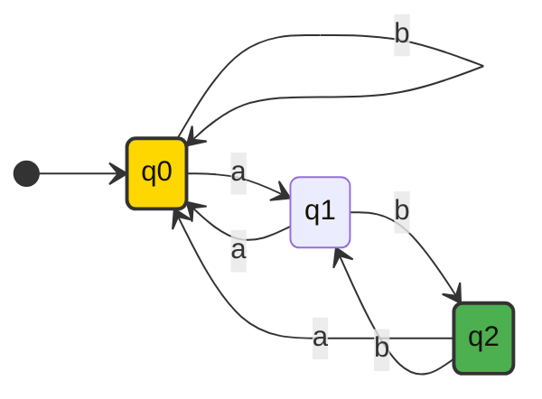
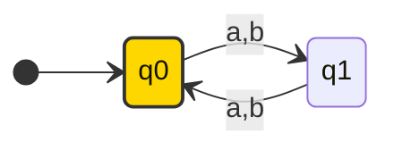
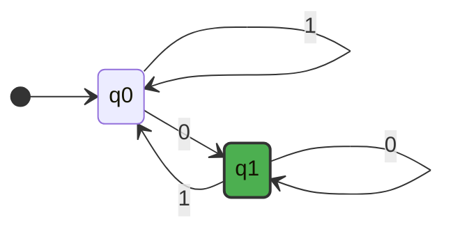

## elements

> [!math] alphabet
>
> An alphabet $\Sigma$ is any **finite** set
>
> i.e: $\Sigma =\{0,1\}$

> A string is a **finite** sequence of elements from $\Sigma$

i.e: Given $\Sigma = \{0,1\}$ string $011011\ldots$

> [!important] empty string
>
> Or also known as $\epsilon$

We get length of a string for given $\Sigma$: $\mid aaba \mid = 4$

or $\mid a^3 \mid \equiv \mid aaa \mid = 3$

### set of string

> the set of all string over $\Sigma$ be $\Sigma^{*}$

implication:

- $\Sigma \neq \emptyset \implies \Sigma^{*} \text{ is infinite}$
- All elements of $\Sigma^{*}$ is _finite_

$$
\begin{aligned}
\epsilon &\in \Sigma^{*} \\
\epsilon &\not\in \Sigma \\
\Sigma &= \emptyset \implies \Sigma^{*} = \{ \epsilon \}
\end{aligned}
$$

### concatenation

$x = 101, y=111 \implies xy=101111$

$$
\begin{align}
x^n &= x x^{n-1} \\
x^0 &= \epsilon \\
xyz &= x(yz) \\
|xy| &= |x| + |y| \\
\epsilon x &= x \epsilon = x
\end{align}
$$

### language

> A language $L$ is a set of string that conform to a set of rules.

ops: $L_{1} \cup  L_{2}$, $L_{1} \cap L_{2}$ , $\neg L = \{ x \mid x \in \Sigma^{*} \wedge  x \not\in L\}$, $L_{1}L_{2}=\{ xy \mid x \in L \wedge y \in L_{2} \}$

properties:

- $L^0 = \{ \epsilon \}$
- $L^n = L L^{n-1}$

> [!important]
>
> $\Sigma^{*} = \bigcup_{i=0}^{\infty} \Sigma = \Sigma^0 \cup \Sigma^1 \ldots$

## definition

$$
\begin{align*}
\text{DFA}\quad M &= (Q, \Sigma, \delta, s, F)  \\\
Q &: \text{finite set of states} \\\
\Sigma &: \text{finite alphabet} \\\
\delta &: Q \times \Sigma \rightarrow Q \rightarrow \delta: Q \times \Sigma \rightarrow Q \\\
s &: \text{start state},\quad s\in{Q} \\\
F &: \text{set of final states},\quad F\subseteq{Q} \\\
\end{align*}
$$

### examples

Ex: $\Sigma = \{a, b\}$. Creates a DFA $M$ that accepts all strings that contains at least three a's.

$$
\begin{align*}
Q &= \{s_1, s_2, s_3, s_4\} \\\
s &= 1 \\\
F &= \{s_4\} \\\
\end{align*}
$$

Transition function:

$$
\begin{align*}
\delta(1, a) = s_2 \\\
\delta(1, b) = s_1 \\\
\delta(2, a) = s_3 \\\
\delta(2, b) = s_2 \\\
\delta(3, a) = s_4 \\\
\delta(3, b) = s_3 \\\
\delta(4, a) = \delta(4, b) = s_4 \\\
\end{align*}
$$

[[thoughts/representations|representation]]:

> if in final string then accept, otherwise reject the string

The following is the transfer function:

$$
\begin{aligned}
\delta (1,a) &= 2 \\
\delta (2, a) &= 3 \\
\delta (3,a) &= 4 \\
\delta (\rho, b) &= \rho (\forall \rho \mid \rho  \in Q \text{ s.t } \delta (\rho,b)=\rho)
\end{aligned}
$$

Or displayed as a transition table:

| State | a   | b   |
| ----- | --- | --- |
| →1    | 2   | 1   |
| 2     | 3   | 2   |
| 3     | 4   | 3   |
| \*4   | 4   | 4   |

## language.

[[thoughts/Language|Language]] of machine $\mathcal{L}(M)$ is the set of strings M accepts, such that $\mathcal{L}(M) \in \Sigma^{*}$

$$
\mathcal{L}(M) = \{w \in \Sigma^{*} | \delta(s, w) \in F\}
$$

> Assumption: $\Sigma = \{a, b\}$

> [!math] Questions
>
> Find DFA $M$ such that $\mathcal{L}(M)=$ the following
>
> 1. $\{ xab \mid x \in \Sigma^{*} \}$
> 2. $\{ x \mid |x| \space \% \space 2 = 0 \}$
> 3. $\{ x \mid \text{x is a binary string even number}\}, \Sigma = \{0, 1\}$
> 4. $\{ x \mid "abc" \in x \}, \Sigma = \{a, b, c\}$
> 5. $\{ x \mid \text{a is the second last char of x} \}$
> 6. $\{ a^n \cdot b^n \mid n \ge 0 \}$
> 7. $\{ x \mid \text{a is the fifth last char of x} \}$
> 8. $\emptyset$
> 9. $\Sigma^{*}$

1.

2.

3.

### transfer function

$$
\begin{aligned}
\delta: Q \times \Sigma  &\to Q \\
\hat{\delta}: Q \times \Sigma^{*} &\to Q
\end{aligned}
$$

> [!important] properties
>
> $$
> \begin{aligned}
> \hat{\delta} (\rho, \epsilon) &= \rho \\
> \hat{\delta} (\rho, xa) &= \delta (\hat{\delta }(\rho, x), a)
> \end{aligned}
> $$

## acceptance

> [!math] definition
>
> $M$ accepts string $x$ iff $\hat{\delta } (s,x) \in F$
>
> Or $\mathcal{L}(M) = \{x \mid \hat{\delta}(s,x) \in F \}$

Q: Create DFA $M$ where $\Sigma = \{0,1\}$ such that $\mathcal{L}(M) = \{x \mid  \text{x is a binary string representation of a multiple of 3 or x = 6}\}$

$$
\begin{align}
\mathcal{L}(M) &= \{a^n \mid n \ge 0\} \\
\mathcal{L}(M) &= \{a^nb^m \mid  n,m \ge 0\}  \\
\mathcal{L}(M) &= \{a^nb^n \mid  0 \le n \le 3\}  \\
\mathcal{L}(M) &= \{a^nb^n \mid  n\ge 0\}  \\
\mathcal{L}(M) &= \{x \mid x[-2] = a\}  \\
\mathcal{L}(M) &= \{x \mid x[-5] = a\}
\end{align}
$$

> [!important]
>
> 4 cannot be solved with DFA, or 4 is irregular

## regular

> [!abstract]
>
> A language $\mathcal{L}$ is a _regular_ language iff $\exists M \text{ s.t } M \text{ is a DFA and } \mathcal{L}(M)=L$

If $L_{1}$ and $L_{2}$ are regular:

1. $\neg L$ is _regular_ (closed under complement)
2. $L_{1} \cap L_{2}$
3. $L_{1} \cup L_{2}$ = $\neg (\neg L_{1} \cap \neg L_2)$

### proof (1)

Let $M = (Q, \Sigma, \delta, s, F)$ and $M^{'} = (Q, \Sigma, \delta, s, Q-F)$

$$
\mathcal{L}(M^{'}) = \neg \mathcal{L}(M)
$$

Or $\neg L = \mathcal{L}(M^{'})$

### proof (2)

Let $L_1$ and $L_2$ be regular languages, there $\exists M_{1} \cap M_{2} \text{ s.t } M_{1}=(Q_{1}, \Sigma,\delta_{1}, s_{1},F_{1}) \cap M_{2}=(Q_{2}, \Sigma, \delta_{2}, s_{2}, F_{2})$ and $\mathcal{L}(M_{1})=L \cap \mathcal{L}(M_{2}) = L_{2}$

(product construction, Cartesian)

> [!important] Lemma (Kozen)
>
> $\forall x \in \Sigma^{*} | \hat{\delta_3} ((p, q), x) = (\hat{\delta_1} (p, x) , \hat{\delta_2} (q,x))$

## product construction

example: create a DFA that accepts a string as a multiple of 6 (from binary even string and a multiple of three machines via product construction)

Let $M_{3} = (Q_{3}, \Sigma, \delta_3, s_3,  F_{3})$ where

- $Q_{3} = Q_{1} \times Q_{2}$
- $\delta_3 ((p,q), a) = (\delta_1 (p,a), \delta_2 (q,a))$
- $F_{3} = F_{1} \times F_{2}$
- $s_{3} = (s_{1}, s_{2})$

Set notation:

$F_{3} = \{(a,0)\}$, $F_{1}=\{a\}$ and $F_{2} = \{0\}$

$$
\begin{aligned}
F_3 &= Q_{3} - ((Q_{1}-F_{1}) \times (Q_{2} - F_{2})) \\
&= Q_{3} - \{b\}  \times \{1, 2\} \\
&= \{ (a, 0), (b, 0), (a, 1), (a, 2)\}
\end{aligned}
$$

Ex: $L_{1} = \{a^n b^m \mid n,m \ge  0\}$ (is regular), where $L_2 = \{a^n b^n \mid  n\ge 0\}$ (is not regular), and $L_{3} = \{ x | \#(x,a) = \#(x,b)\}$

> If $L_{1}$ is regular, and $L_{2} \subseteq L_{1}$, then is $L_{2}$ Reg? (use [[thoughts/NFA]] for this)

