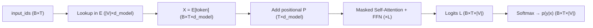

See also: [[thoughts/Transformers]], [[thoughts/Attention]]

In the context of [[thoughts/LLMs|LLMs]], Embeddings map discrete token IDs to continuous vectors so transformers can operate in a geometric space. For a vocabulary of size $\mid V\mid$ and model width `d_model`:

$$
\mathbf{x}_{b,t} = E[\text{token}_{b,t}] + P[t]\;\in\;\mathbb{R}^{d_\text{model}}
$$

where $E \in R^{\mid V\mid \times \text{d\_model}}$ is the token embedding matrix and $P \in R^{T \times \text{d\_model}}$ is a positional encoding (learned or sinusoidal). Optionally, segment/speaker embeddings are added in multi-segment settings.

## [[thoughts/Tokenization|tokenization]] and vocab

- Discrete IDs via [[thoughts/byte-pair encoding|BPE]]/WordPiece over text; special tokens like `BOS`, `EOS`, `PAD`, `UNK` included.
- Variable-length sequences are padded to `T`. The `PAD` token generally has an embedding that is either frozen or set near zero to avoid learning spurious correlations.

### shapes and flow

see also: @croft2023llm

- Example batch and length: $B \times  T = 5 \times  128$.
- Lookup and add position: $\text{input\_ids} (B\times T) \to E \to  X (B\times T\times \text{d\_model})$, then `X + P`.
- Transformer blocks consume these residuals and output logits `L (B×T×|V|)`, which become probabilities after softmax; training uses cross-entropy on the next token.

### masks

Masks ensure the model only uses valid context and ignores padding:

- Causal mask (look-ahead): disallows attending to future tokens.
  - `M_c[i,j] = 0` if `j ≤ i`, else `-∞`.
- Padding mask: removes contributions of padded positions.
  - Typically $M_p \in \{0, -\infty\}^{B\times 1\times 1\times T}$ or $B \times T$, broadcast to attention score shape.
- Combined into attention as:

$$
\text{Attn}(Q,K,V)=\text{softmax}\Big(\tfrac{QK^\top}{\sqrt{d_k}} + M_c + M_p\Big)\,V
$$

Loss masking ties in here too: cross-entropy is computed only on non-`PAD` positions with shift-right targets:

$$
\mathcal{L} = -\frac{1}{T_\text{eff}} \sum_{t\in\mathcal{M}} \log p_\theta(y_t\mid x_{\le t})
$$

where $\mathcal{M}$ indexes valid, non-padded time steps.

- Mask token vs. attention masks: masked language modeling (e.g., BERT) uses a literal `[MASK]` token in inputs; decoder-only LLMs usually do not, relying instead on causal and padding masks while training with next-token prediction.

### practical notes

- Weight tying: often `E` is reused as the output projection `W_out = E^\top` for parameter efficiency.
- Normalization: modern stacks place layer norms around attention/FFN; embeddings typically enter the residual stream unnormalized.
- Precision: embeddings can be quantized (e.g., 8-bit) with minimal quality loss relative to attention/FFN precision.

## vision and multimodal embeddings

see also: CLIP, ViT

Images are embedded as sequences of patch tokens, then optionally aligned with text in a shared space (e.g., CLIP).

### patch embeddings (ViT)

Given an RGB image $I \in \mathbb{R}^{H\times W\times 3}$, split into non-overlapping patches of size $P\times P$. The number of patches is $N = (H/P)\cdot(W/P)$.

For each patch $x_i \in \mathbb{R}^{(P\cdot P\cdot 3)}$, linearly project to model width $d$ and add position:

$$
Z_0 = \big[\,x_{\text{CLS}},\; x_1 E,\; x_2 E,\;\ldots,\; x_N E\,\big] + P\;\in\;\mathbb{R}^{(N+1)\times d}
$$

where $E \in \mathbb{R}^{(P^2\cdot 3)\times d}$ is the patch embedding matrix, $x_{\text{CLS}}$ is a learned class token, and $P$ are 1D/2D positional encodings. A ViT encoder produces token features; the global image embedding is taken from the `[CLS]` token or pooled features.

Masks in vision:

- Padded patches (for variable sizes) can be masked out in attention like text padding.
- Masked image modeling (MAE/BEiT) hides a subset of patches and reconstructs them; this uses special mask tokens for the missing patches (analogous to BERT’s `[MASK]`).

### CLIP-style dual encoders (image–text)

CLIP learns a joint space by aligning image and text embeddings via a symmetric contrastive loss. With image encoder $f_{\text{img}}$ and text encoder $f_{\text{txt}}$ and batch size $B$:

$$
v_i = \operatorname{norm}(f_{\text{img}}(I_i)),\quad t_i = \operatorname{norm}(f_{\text{txt}}(T_i)),\quad s_{ij} = \tfrac{v_i^\top t_j}{\tau}
$$

The loss uses cross-entropy in both directions (InfoNCE):

$$
\mathcal{L} = \tfrac{1}{2}\Big(\tfrac{1}{B}\sum_i \text{CE}(s_{i,:}, i)\; +\; \tfrac{1}{B}\sum_j \text{CE}(s_{:,j}, j)\Big)
$$

Practical notes:

- Projection heads map encoder outputs to a shared dim; temperature $\tau$ is learned or fixed.
- Zero-shot classification: encode class name prompts with the text encoder and pick the class with highest similarity to the image embedding.
- Retrieval: nearest-neighbor in the joint space for image↔text search.
