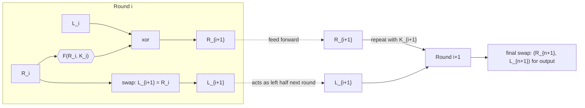

> [!summary] key idea
> alias: _luby–rackoff block cipher_
>
> is a symmetric block cipher scaffold where encryption and decryption share the same round structure, differing only in the subkey order.

emerged from Horst Feistel's work on IBM lucifer (1973) and reached wide deployment with the 1976 DES standard.

repeating identical rounds was a good match for hardware pipelines available at the time and still helps constant-time software today [@menezes2001handbook; @schneier1996applied; @stinson1995cryptography].

- encryption and decryption share almost all code, so implementations can reuse silicon or instruction-side logic.
- the round function can be arbitrarily complex, since only its input/output size matters for invertibility.
- timing attacks from table lookups can be mitigated by using xor and addition-heavy rounds instead of large substitution boxes.

to read:

- substitution–permutation networks
- lai–massey scheme
- format-preserving encryption

## mechanics

- parameters: block size $2m$, round function $\mathrm f : \{0,1\}^m \times \mathcal{K} \to \{0,1\}^m$, subkeys $K_0,\dots,K_n$.
- split plaintext into $(L_0,R_0)\in\{0,1\}^m\times\{0,1\}^m$.
- iterate for $i=0,\dots,n$:
  $$
  L_{i+1} = R_i,\qquad
  R_{i+1} = L_i \oplus \mathrm f(R_i,K_i).
  $$
- ciphertext output swaps the halves: $(R_{n+1},L_{n+1})$.
- decryption walks the same circuit with keys in reverse, since $R_i=L_{i+1}$ and
  $$
  L_i = R_{i+1} \oplus \mathrm f(L_{i+1},K_i).
  $$
- the XOR feedback guarantees invertibility even when $\mathrm f$ is not, letting designers focus on diffusion and nonlinearity without building an explicit inverse.



## security notes

- luby and rackoff proved that if $\mathrm f$ is a pseudorandom function, three rounds yield a pseudorandom permutation and four rounds produce a strong pseudorandom permutation (secure even with inverse queries) [@luby1988construct].
- later work tightened round-bounds and indifferentiability guarantees (patarin; zheng–matsumoto–imai; russell–tang–zhu) [@patarin2003luby; @zheng1990construction; @russell2024crookedindifferentiabilityfeistelconstruction].
- provable analyses now cover related-key security and small-domain enciphering [@guo2019understandingrelatedkeysecurityfeistel; @morris2009smalldomain].
- quantum-era hardness relies on hidden-shift assumptions matched to feistel structure choices [@alagic2017quantumsecuresymmetrickeycryptographybased].

## variants

```jsx imports={MethodologyStep,MethodologyTree}
<MethodologyTree
  title="feistel landscape"
  description="track the mainstream feistel block ciphers and the designs that generalise or remix the structure."
>
  <MethodologyStep
    title="classic feistel lineage"
    summary="balanced-round designs that stay close to the luby–rackoff template."
    points={[
      'blowfish, camellia, cast-128, des and triple des, feal, gost 28147-89',
      'ice, kasumi, loki97, lucifer, magenta, mars, misty1',
      'rc5, simon, tea/xtea, twofish',
    ]}
  />
  <MethodologyStep
    title="generalised or derivative designs"
    summary="wider-branch or format-preserving variants that alter the round routing."
    points={['cast-256, clefia, macguffin, rc2, rc6', 'skipjack, sms4, threefish (skein)']}
  />
</MethodologyTree>
```

### unbalanced feistel

- uneven halves trade diffusion speed for accommodating domain constraints [@schneier1996unbalanced; @lee2017permutationgeneratorsbasedunbalanced].
- skipjack (nsa, 1993) and texas instruments' dst tags are notable unbalanced deployments, with security lessons distilled in the usenix analysis of dst tags [@bono2005security].
- the thorp shuffle pushes the idea to a 1-bit half, improving provable bounds at the cost of many more rounds.

### generalized feistel

- split the block into $k>2$ branches and permute them each round [@aragona2018waveshapedroundfunctionsprimitive].
- format-preserving encryption schemes reuse the approach to cover decimal strings or other small domains without padding [@morris2009smalldomain].
- oaep wraps rsa ciphertexts with a two-branch feistel step for randomness hardening.

## design companions

- misty1 embeds a three-round mini-feistel inside each round.
- many substitution–permutation networks borrow feistel-like mixing layers even when the top-level cipher is not a pure feistel construction [@patarin2003luby; @russell2024crookedindifferentiabilityfeistelconstruction].
- engineers often pair feistel cores with key schedules that inject round-dependent constants to avoid slide attacks [@bono2005security].
