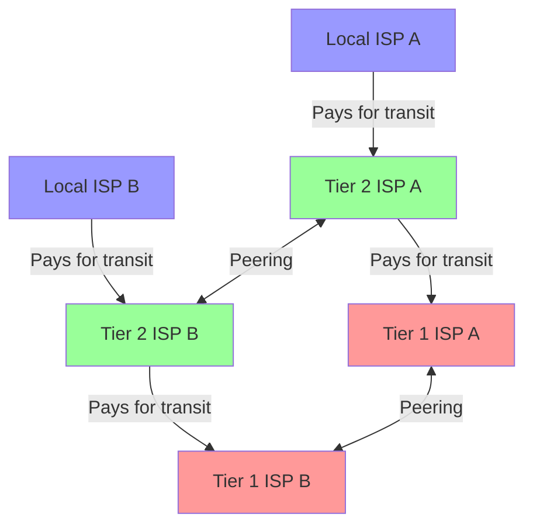

hierarchical architecture

- Tier-1 ISP -> Tier-2 ISP -> Tier-3 ISP -> Local ISP

```mermaid
graph TD
    %% Tier 1 ISPs
    T1A[Tier 1 ISP A]
    T1B[Tier 1 ISP B]

    %% Tier 2 ISPs
    T2A[Tier 2 ISP A]
    T2B[Tier 2 ISP B]

    %% Tier 3 ISPs
    T3A[Local ISP A]
    T3B[Local ISP B]

    %% Customer-Provider Relationships
    T3A -->|"Pays for transit"| T2A
    T3B -->|"Pays for transit"| T2B
    T2A -->|"Pays for transit"| T1A
    T2B -->|"Pays for transit"| T1B

    %% Peer-to-Peer Relationships
    T1A <-->|"Peering"| T1B
    T2A <-->|"Peering"| T2B

    %% Styling
    classDef tier1 fill:#ff9999
    classDef tier2 fill:#99ff99
    classDef tier3 fill:#9999ff

    class T1A,T1B tier1
    class T2A,T2B tier2
    class T3A,T3B tier3
```

Use `traceroute` for finding probes between transit
