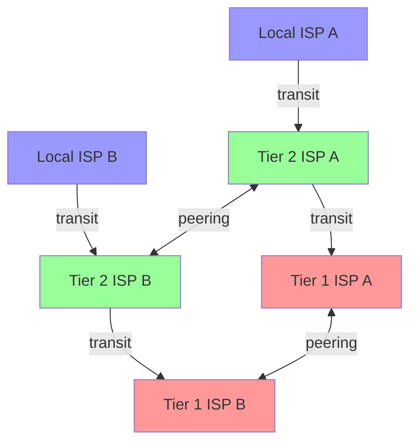

The Internet connects independently operated networks. An _autonomous system_ (AS) groups routers and prefixes under a common routing policy; BGP lets neighbouring systems advertise which destinations they can reach. Each network decides which routes to accept and export. [RFC 4271](https://www.rfc-editor.org/rfc/rfc4271.html#section-1.1)

## transit and peering

An ISP can buy **transit** from a provider that carries traffic to the rest of the Internet. With **peering**, two networks exchange traffic for their own networks and customers. A peer ordinarily does not provide onward access to its other peers or transit providers. Settlement-free peering means neither party pays the other for exchanged traffic; each still pays for its infrastructure. [Internet Society](https://www.internetsociety.org/policybriefs/internetinterconnection/)

The tier terminology describes these relationships. A tier-1 network reaches the Internet through customers and settlement-free peers without buying transit. A tier-2 network combines peering with purchased transit. Tier 3 usually names an access network that relies entirely on purchased transit. These are commercial categories; packets carry no tier number. [ThousandEyes' tier definitions](https://www.thousandeyes.com/learning/techtorials/isp-tiers)

One possible arrangement follows. Transit arrows point from customer to provider; traffic can travel in both directions.

Here, the tier-2 peering link can carry traffic between the two local ISPs without visiting either tier-1 network. Direct content-provider connections can shorten the route further. [APNIC's measurements of Internet flattening](https://blog.apnic.net/2020/12/04/unpacking-a-flattened-internet/)

## traceroute

`traceroute` sends probes with increasing IPv4 time-to-live values. A forwarding router decrements the TTL and discards a packet when it reaches zero, normally returning an ICMP Time Exceeded message. Those replies reveal responding hops along the probes' outward paths. [RFC 1812, section 5.3.1](https://www.rfc-editor.org/rfc/rfc1812.html#section-5.3.1)

The reported time includes the reply's return journey. An asterisk means no reply arrived before the timeout; filtering or ICMP rate limits can hide a working router. Load balancing can also send successive probes along different paths. A trace therefore gives partial routing observations, with no direct evidence of whether an interconnection is paid transit or peering. [RFC 1812, section 4.3.2.8](https://www.rfc-editor.org/rfc/rfc1812.html#section-4.3.2.8), [RFC 9198, section 1](https://www.rfc-editor.org/rfc/rfc9198.html#section-1)
