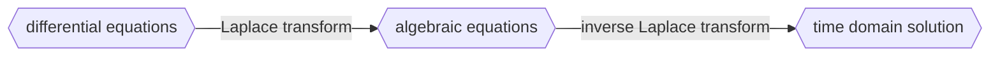

$$
\mathcal{L} \{f(t)\} = \int_0^{\infty}f(t)^{-st}dt = F(s)
$$

Table

$$
\begin{array}{c c c} \hline \text{Item no.} & f(t) & F(s) \\ \hline 1. & \delta(t) & 1 \\ 2. & u(t) & \frac{1}{s} \\ 3. & tu(t) & \frac{1}{s^2} \\ 4. & t^n u(t) & \frac{n!}{s^{n+1}} \\ 5. & e^{-at}u(t) & \frac{1}{s + a} \\ 6. & \sin(\omega t)u(t) & \frac{\omega}{s^2 + \omega^2} \\ 7. & \cos(\omega t)u(t) & \frac{s}{s^2 + \omega^2} \\ \hline \end{array}
$$

$$
\delta{(t)} = 0, \quad t \neq 0,\quad \int_0^{\infty}{\delta{(t)}}dt=1
$$

example: Given a unit step function $u(t) = \begin{cases} 0 & t < 0 \\ 1 & t \ge 0 \end{cases}$, find $U(s)$

$$
\begin{aligned}
U(s) = \mathcal{L} \{u(t)\} &= \int_{0}^{\infty} u(t) e^{-st} dt = -\frac{1}{s} e^{-st} dt \\
U(s) &= -\frac{1}{s}(0-1) = \frac{1}{s}
\end{aligned}
$$

## inverse form

$$
\mathcal{L}^{-1} \{ F(s) \} = \frac{1}{2\pi j} \lim_{\omega \to \infty} \int_{\sigma-j\omega}^{\sigma+j\omega} F(s) e^{st} \, ds
$$
