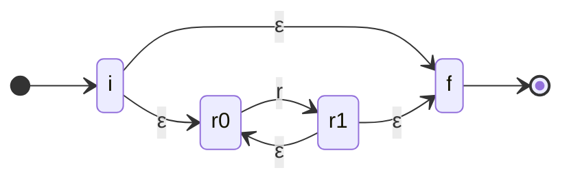

## syntax

A regular expression over an alphabet $\Sigma$ is defined inductively. The base cases are $\emptyset$, $\epsilon$, and a single symbol $a \in \Sigma$; the recursive cases close the set under union, concatenation, and Kleene star.

> [!definition] regular expression
>
> $$
> r ::= \emptyset \mid \epsilon \mid a \mid r_1 + r_2 \mid r_1 r_2 \mid r^{*} \qquad a \in \Sigma
> $$

Each form denotes a [[thoughts/Language|language]] $\mathcal{L}(r) \subseteq \Sigma^{*}$ by structural recursion:

$$
\begin{aligned}
\mathcal{L}(\emptyset) &= \emptyset \\
\mathcal{L}(\epsilon) &= \{\epsilon\} \\
\mathcal{L}(a) &= \{a\} \\
\mathcal{L}(r_1 + r_2) &= \mathcal{L}(r_1) \cup \mathcal{L}(r_2) \\
\mathcal{L}(r_1 r_2) &= \{ xy \mid x \in \mathcal{L}(r_1),\ y \in \mathcal{L}(r_2) \} \\
\mathcal{L}(r^{*}) &= \bigcup_{n \geq 0} \mathcal{L}(r)^n
\end{aligned}
$$

$\emptyset$ is the empty language (matches nothing); $\epsilon$ matches only the empty string. Star is the reflexive-transitive closure of concatenation, so $\mathcal{L}(r^{*}) = \{\epsilon\} \cup \mathcal{L}(r) \cup \mathcal{L}(r)^2 \cup \ldots$. The usual sugar reduces to these: $r^{+} = r r^{*}$, $r? = \epsilon + r$, and a character class $[a_1 \ldots a_k] = a_1 + \cdots + a_k$.

## Kleene's theorem

> [!abstract] equivalence
>
> A language is regular iff it is denoted by some regular expression iff it is accepted by some [[thoughts/DFA|DFA]] (equivalently [[thoughts/NFA|NFA]]).

The three characterizations coincide. Both directions are constructive: regex $\to$ NFA by Thompson's construction, and NFA $\to$ regex by state elimination (Kleene's algorithm). Closure of the regular languages under union, concatenation, and star is exactly what the regex grammar witnesses; closure under complement and intersection comes from the [[thoughts/DFA|DFA]] side via the swap-final and product constructions.

## Thompson's construction

Compile a regex to an $\epsilon$-[[thoughts/NFA|NFA]] bottom-up. Each fragment has one entry and one exit; the recursive cases wire fragments together with $\epsilon$-transitions. The construction yields at most $2|r|$ states, linear in the size of the expression. The star fragment is the instructive case: the entry can skip the body or enter it, and the body loops back on itself.



- $a$: two states $i \to f$ on symbol $a$.
- $r_1 + r_2$: a fresh entry forks via $\epsilon$ into both fragments, and a fresh exit joins them.
- $r_1 r_2$: the exit of $r_1$ links by $\epsilon$ to the entry of $r_2$.
- $r^{*}$: the fragment above.

Subset construction then determinizes the $\epsilon$-NFA into a [[thoughts/DFA|DFA]], and the DFA minimizes by the quotient construction. That is the classical pipeline a lexer generator (lex, re2c) walks.

## Brzozowski derivatives

The pipeline above builds an automaton first. Derivatives skip it: they match by differentiating the expression itself, one symbol at a time, which is what makes them clean to implement directly.

> [!definition] derivative
>
> The derivative of a language $L$ with respect to a symbol $a$ strips a leading $a$:
>
> $$
> \partial_a L = \{ w \mid aw \in L \}
> $$

A string $w = a_1 a_2 \ldots a_n$ is in $L$ iff $\partial_{a_n} \cdots \partial_{a_1} L$ contains $\epsilon$. On expressions the derivative is computed structurally, where $\nu(r)$ is the **nullability** predicate ($\nu(r) = \epsilon$ if $\epsilon \in \mathcal{L}(r)$, else $\emptyset$):

$$
\begin{aligned}
\nu(\emptyset) = \nu(a) &= \emptyset & \nu(\epsilon) = \nu(r^{*}) &= \epsilon \\
\nu(r_1 + r_2) &= \nu(r_1) + \nu(r_2) & \nu(r_1 r_2) &= \nu(r_1)\, \nu(r_2)
\end{aligned}
$$

$$
\begin{aligned}
\partial_a \emptyset = \partial_a \epsilon &= \emptyset \\
\partial_a b &= \begin{cases} \epsilon & b = a \\ \emptyset & b \neq a \end{cases} \\
\partial_a (r_1 + r_2) &= \partial_a r_1 + \partial_a r_2 \\
\partial_a (r_1 r_2) &= (\partial_a r_1)\, r_2 + \nu(r_1)\, \partial_a r_2 \\
\partial_a (r^{*}) &= (\partial_a r)\, r^{*}
\end{aligned}
$$

The concatenation rule is the only subtle one: if $r_1$ accepts the empty string ($\nu(r_1) = \epsilon$), the symbol $a$ may instead belong to $r_2$, so both branches survive. Brzozowski's result is that, up to similarity (associativity, commutativity, idempotence of $+$, and the identities $\emptyset r = \emptyset$, $\epsilon r = r$), an expression has finitely many distinct derivatives. Those derivative classes are precisely the states of the minimal DFA, so derivatives build it lazily.

> [!example] matching against $(a + b)^{*}\,ba$ (strings ending in $ba$)
>
> Write $r = (a+b)^{*} ba$ and feed $aba$ left to right:
>
> $$
> \begin{aligned}
> \partial_a r &= (a+b)^{*} ba \quad (\nu((a+b)^{*}) = \epsilon,\ \partial_a(ba) = \emptyset) \\
> \partial_b \partial_a r &= (a+b)^{*} ba + a \\
> \partial_a \partial_b \partial_a r &= (a+b)^{*} ba + \epsilon
> \end{aligned}
> $$
>
> The final expression is nullable ($\nu = \epsilon$ via the $\epsilon$ summand, since $\partial_a a = \epsilon$), so $aba \in \mathcal{L}(r)$. Stopping one symbol early at $ab$ instead leaves $\partial_b \partial_a r = (a+b)^{*} ba + a$, whose $\nu = \emptyset$ — $ab$ does not end in $ba$, so it is rejected.

## implementation in Mojo

Derivatives map onto an algebraic data type directly: a regex node is one of six constructors, and $\nu$ / $\partial_a$ are folds over it. Mojo has no payload-carrying `enum`, so the node is a tagged struct whose children are reference-counted (`ArcPointer`) to share subtrees across derivatives, with `Optional` marking the leaves. The smart constructors fold in the similarity identities ($\emptyset r = \emptyset$, $\epsilon r = r$) so the derivative set stays finite and small.

```mojo
from std.memory import ArcPointer

struct Re(Copyable, Movable):
    comptime NUL = 0   # ∅
    comptime EPS = 1   # ε
    comptime CHR = 2   # literal byte
    comptime ALT = 3   # r₁ + r₂
    comptime CAT = 4   # r₁ r₂
    comptime STA = 5   # r*

    var kind: Int
    var ch: UInt8
    var a: Optional[ArcPointer[Self]]
    var b: Optional[ArcPointer[Self]]

    def __init__(out self, kind: Int, ch: UInt8,
                 var a: Optional[ArcPointer[Self]],
                 var b: Optional[ArcPointer[Self]]):
        self.kind = kind
        self.ch = ch
        self.a = a^
        self.b = b^

# leaves
def nul() -> Re: return Re(Re.NUL, 0, None, None)
def eps() -> Re: return Re(Re.EPS, 0, None, None)
def lit(c: UInt8) -> Re: return Re(Re.CHR, c, None, None)

# smart constructors fold in the similarity identities
def alt(var r: Re, var s: Re) -> Re:
    if r.kind == Re.NUL: return s^
    if s.kind == Re.NUL: return r^
    return Re(Re.ALT, 0, ArcPointer(r^), ArcPointer(s^))

def cat(var r: Re, var s: Re) -> Re:
    if r.kind == Re.NUL or s.kind == Re.NUL: return nul()
    if r.kind == Re.EPS: return s^
    if s.kind == Re.EPS: return r^
    return Re(Re.CAT, 0, ArcPointer(r^), ArcPointer(s^))

def star(var r: Re) -> Re:
    if r.kind == Re.NUL or r.kind == Re.EPS: return eps()
    return Re(Re.STA, 0, ArcPointer(r^), None)

def nullable(r: Re) -> Bool:
    if r.kind == Re.EPS or r.kind == Re.STA: return True
    if r.kind == Re.ALT: return nullable(r.a.value()[]) or nullable(r.b.value()[])
    if r.kind == Re.CAT: return nullable(r.a.value()[]) and nullable(r.b.value()[])
    return False

def deriv(r: Re, c: UInt8) -> Re:
    if r.kind == Re.CHR: return eps() if r.ch == c else nul()
    if r.kind == Re.ALT:
        return alt(deriv(r.a.value()[], c), deriv(r.b.value()[], c))
    if r.kind == Re.CAT:
        var d = cat(deriv(r.a.value()[], c), r.b.value()[].copy())
        if nullable(r.a.value()[]):
            return alt(d^, deriv(r.b.value()[], c))
        return d^
    if r.kind == Re.STA:
        return cat(deriv(r.a.value()[], c), star(r.a.value()[].copy()))
    return nul()   # ∅ and ε differentiate to ∅

def matches(r: Re, s: String) -> Bool:
    var cur = r.copy()
    for b in s.as_bytes():
        cur = deriv(cur, b)
    return nullable(cur)
```

The matcher is online: it consumes the input one byte at a time and never materializes the automaton. Each step is $O(|r|)$ in the current derivative, and similarity pruning keeps that bounded, so the whole match runs linear in $|w|$ with no backtracking. That property is the reason RE2 and the Rust `regex` crate refuse the backtracking model. The same shape extends to capture tracking and to _antiderivatives_ for a symmetric right-to-left scan.

> [!note] toolchain
>
> Written against the moving Mojo surface; no compiler was on hand to build it here. Read the listing as the derivative algorithm transcribed into Mojo's value/`ArcPointer` model rather than a vetted compile.
