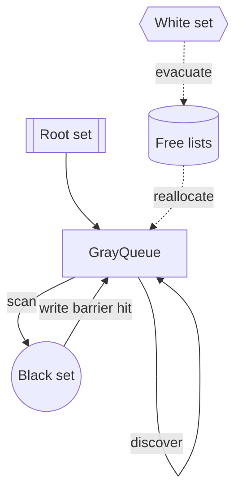
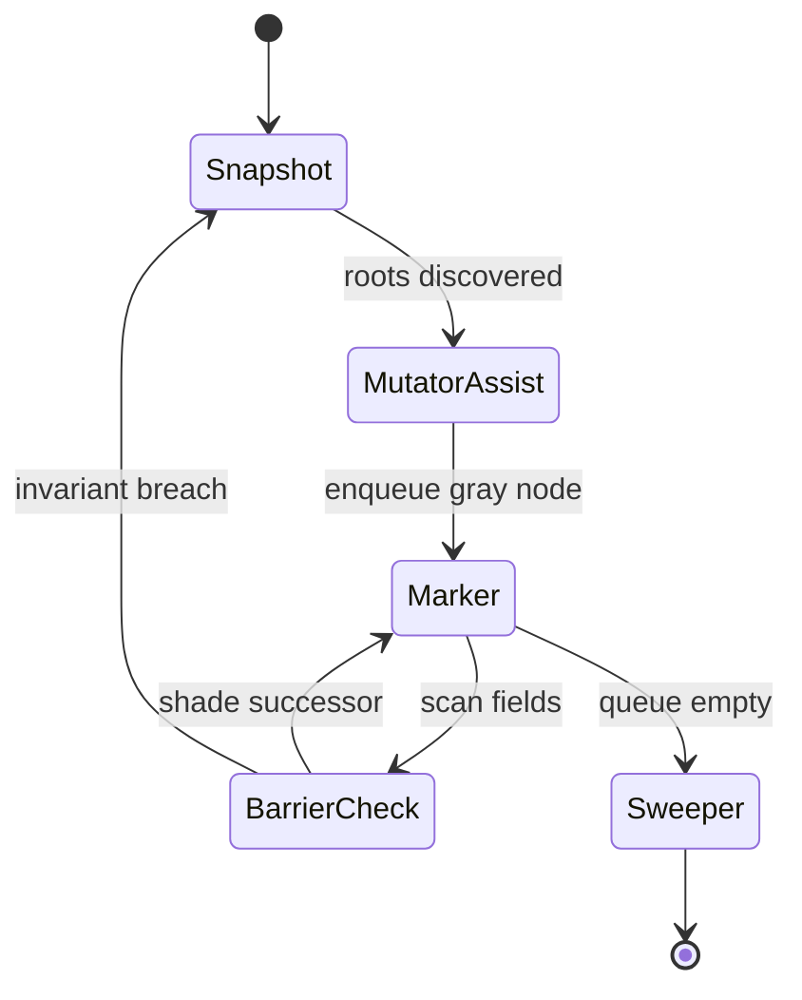

> [!summary]

- tracing gc keeps only objects reachable from the root set while tri-color invariants coordinate collector and mutators.[^tracing]
- go uses a concurrent mark-sweep collector with mutator assists; go 1.25 adds the experimental "greentea" collector to accelerate small-object workloads.[^gc-guide][^go125]
- rust avoids a builtin tracing gc, but crates like `zerogc` and `gc-arena` provide opt-in tracing heaps when ownership cannot express cycles.[^zerogc][^gcarena]

## mental model

- roots comprise stacks, globals, and registered handles; reachability is the transitive closure from these anchors.[^tracing]
- tri-color marking keeps white (candidate garbage), gray (scheduled), and black (scanned) sets disjoint to ensure progress during concurrent marking.[^ravenbrook]
- practical collectors chase syntactic garbage; semantic garbage detection would require solving the halting problem, so systems accept liveness slack.[^tracing]

## algorithm skeleton

1. pause briefly to snapshot roots, then seed the gray set.[^go125]
2. drain gray work queues by scanning references, shading newly discovered pointers, and honoring write barriers to maintain the invariant.[^ravenbrook]
3. recycle the remaining white set via sweep lists or evacuation; optionally compact by generation or region depending on implementation goals.[^mark-sweep]

## naive mark-and-sweep

- stop-the-world traversal: mark phase walks the object graph from roots, setting per-object mark bits before sweeping unreachable blocks into free lists.[^mark-sweep][^javaiq]
- complexity: proportional to heap size because both mark and sweep must touch every allocated slot each cycle, even if most objects are live.[^javaiq]
- fragmentation: leaving survivors in place scatters free space, forcing additional allocators (segregated free lists, compaction) to recover contiguous regions.[^medium-frag]
- strengths: handles cycles without reference counting overhead and keeps pointers stable because objects never move, which simplifies FFI and interior pointers.[^javaiq]

## tri-color marking

- invariant: never let a black object reference a white object; gray nodes act as a work set until every reachable object is promoted to black.[^tracing]
- incremental safety: write barriers either shade the written pointer target or revert the source object to gray (incremental update) so concurrent mutators cannot violate the invariant.
- scheduling: collectors interleave short marking steps with application execution, emptying gray queues gradually and greatly shrinking pause windows versus naive mark-sweep.[^tracing][^ravenbrook]

## trade-offs to track

- precise stack maps versus conservative scanning trade metadata overhead for false positives and collector safety.[^tracing]
- write barriers impose per-mutation cost yet unlock incremental or concurrent cycles that cap pause times.[^gc-guide]
- bump-pointer plus evacuation boosts locality; free-list sweeping avoids relocation but risks fragmentation and metadata churn.[^mark-sweep]

## pause-time math

- define $H_t$ as the heap footprint at collection start, $L_t$ the live subgraph, and $B$ the aggregate scan bandwidth. Concurrent mark-sweep minimizes the stop-the-world envelope by bounding delay to stack scanning and root buffering.

$$
T_{\text{stw}}(t) \approx \frac{|R_t|}{b_{\text{stack}}} + \frac{|U_t|}{b_{\text{handoff}}}
$$

- here $R_t$ counts stack roots and $U_t$ counts unsafepointed writes buffered into the `grey` work queue; tightening safepoint density shrinks $U_t$ but taxes mutators with more frequent polls.
- the concurrent tranche dominates overall GC budget, amortized over mutator progress: if $M_t$ bytes are allocated between safepoints and the runtime schedules assists with rate $\alpha$, the steady-state mutator share obeys

$$
\Theta_{\text{mutator}} = \frac{\mu}{\mu + \alpha \cdot \frac{|L_t|}{B}}
$$

- $\mu$ measures raw mutator throughput. Raising `GOGC` increases $|L_t|$, stretching the denominator and trading throughput for latency; `GOMEMLIMIT` caps $|H_t|$ thus bounding $|L_t|$ indirectly.
- evacuation collectors minimize $T_{\text{stw}}$ by copying survivors: with promotion rate $p_t$ and region size $S$, the copy workload is approximately $p_t S$, so compaction remains linear but with a smaller constant when live ratios stay low.

## go's collector

- default collector is concurrent, non-generational mark-sweep with two short stop-the-world phases to flip into and out of GC.[^gc-guide]
- mutator assists and background workers pace marking proportional to allocation, targeting the `GOGC` growth factor (default 100%).[^gc-guide]
- `GOMEMLIMIT` constrains total runtime-managed memory; the runtime increases GC pressure when the soft cap is approached.[^runtime]
- go 1.25 introduces the `GOEXPERIMENT=greenteagc` collector for denser marking of small objects and reports 10–40% GC overhead reductions in trials.[^go125]

## rust landscape

- rust's ownership and borrow checker give deterministic destruction, so the standard library omits a tracing collector.[^zerogc]
- `zerogc` exposes tri-color tracing with safepoints driven by the borrower; collection occurs only at explicit `safepoint` calls to avoid runtime overhead between cycles.[^zerogc]
- `gc-arena` builds single-root arenas with branded lifetimes so all traced pointers stay inside the arena; collection is incremental mark-sweep tuned for low pause time.[^gcarena]

## prompts for further study

- measure pause histograms comparing go's default collector with the greentea experiment under mixed allocation patterns.
- prototype a rust arena for cyclic subsystems while leaving acyclic data under ownership semantics.
- profile `GOGC` and `GOMEMLIMIT` sweeps on production-like workloads to map throughput versus latency knees.

[^tracing]: "tracing garbage collection." wikipedia, accessed 27 september 2025. https://en.wikipedia.org/wiki/Tracing_garbage_collection.

[^gc-guide]: "a guide to the go garbage collector." go.dev/doc/gc-guide, accessed 27 september 2025.

[^go125]: "go 1.25 release notes." go.dev/doc/go1.25, accessed 27 september 2025.

[^zerogc]: "zerogc crate documentation." docs.rs/zerogc, accessed 27 september 2025.

[^gcarena]: "gc-arena crate." lib.rs/crates/gc-arena, accessed 27 september 2025.

[^mark-sweep]: "mark-and-sweep (garbage collection algorithm)." java iq, accessed 27 september 2025. https://sandeepin.wordpress.com/2011/12/11/mark-and-sweep-garbage-collection-algorithm/.

[^javaiq]: "garbage collector algorithms explained." medium, 10 august 2025. https://medium.com/%40dahemisankalpana/garbage-collector-algorithms-explained-776bfc8a6e88.

[^medium-frag]: "garbage collection demystified: mark and sweep explained visually." notes.suhaib.in, accessed 27 september 2025. https://notes.suhaib.in/docs/tech/dsa/garbage-collection-demystified-mark-and-sweep-explained-visually/.

[^ravenbrook]: "tri-color marking." memory management glossary, ravenbrook mps 1.112 manual, accessed 27 september 2025. https://www.ravenbrook.com/project/mps/version/1.112/manual/html/glossary/t.html.

[^runtime]: "runtime package." pkg.go.dev/runtime, accessed 27 september 2025.
