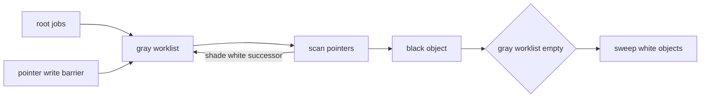

> [!summary]
>
> tracing garbage collection keeps objects reachable from a root set and reclaims the rest. tri-color marking tracks the reached objects whose pointers still need scanning, and write barriers keep that state correct while the program changes pointers. Go uses precise, concurrent, non-generational, non-compacting mark-sweep. Go 1.26 made Green Tea the default marking implementation.[^go-runtime][^go126]

## reachability

Treat the heap as a directed graph. Objects are vertices and pointers are edges. Roots are references held in stacks, globals, and runtime data structures. The collector computes the transitive closure of the roots and reclaims vertices outside it.

Reachability overapproximates future use. A reachable object may never affect the program again, yet deciding that property in general would require predicting future execution. Tracing collectors therefore reclaim unreachable garbage and may retain semantic garbage.

## tri-color marking

The colors describe one marking cycle:

- white objects have not been reached.
- gray objects have been reached, but their outgoing pointers have not all been scanned.
- black objects have been reached and scanned.

The collector starts with gray roots. Scanning a gray object turns it black and shades each white successor gray. When the gray worklist is empty, every remaining white object is unreachable for that cycle.

```mermaid
flowchart LR
    Roots[root jobs] --> Gray[gray worklist]
    Gray --> Scan[scan pointers]
    Scan --> Black[black object]
    Scan -->|shade white successor| Gray
    Barrier[pointer write barrier] --> Gray
    Black --> Done{gray worklist empty}
    Done --> Sweep[sweep white objects]
```

An incremental collector must prevent the mutator from hiding a white object behind an already scanned black object. Write barriers record the relevant pointer changes. Go's current hybrid barrier shades both the overwritten pointer and the new pointer value during marking.[^go-runtime]

## collector families

Mark-sweep traces the live graph, then walks allocation units and returns unmarked storage to free lists. Marking costs $O(V_{\mathrm{live}}+E_{\mathrm{live}})$ for the reachable graph. Sweeping costs $O(H)$ over the heap units being swept.

Evacuating collectors move live survivors into another region and reclaim the old region at once. Mark-compact collectors also move live objects, then leave free memory contiguous. Generation and region are policies for choosing which part of the heap to collect. They do not determine whether survivors move.

## Go's collector

The runtime describes Go's collector as precise, parallel, concurrent mark-sweep with a write barrier. It is non-generational and non-compacting.[^go-runtime] A cycle has two short global stops. The first enables the barrier and prepares root jobs. Mark workers and allocation assists scan roots and gray objects while the program runs. The second stop ends marking. Sweeping then proceeds concurrently and on demand during allocation.

Go 1.25 introduced Green Tea as an experiment. Go 1.26 enabled it by default.[^go126] Green Tea keeps the same reachability semantics and reorganizes marking work around spans so small objects on the same page can be scanned together. This improves locality and CPU scaling when each page contains enough live objects that need scanning. The Go team reports a 10% to 40% reduction in GC overhead for programs that spend substantial time in the collector, with results depending on heap shape.[^green-tea]

## pacing and memory

The Go guide models one cycle's CPU cost as a fixed cost plus work proportional to the live heap and roots:

$$
C_{\mathrm{cycle}} \approx C_{\mathrm{fixed}} + c_{\mathrm{scan}}\left(H_{\mathrm{live}} + R_{\mathrm{roots}}\right).
$$

`GOGC` controls how much new heap may accumulate before the next cycle:

$$
H_{\mathrm{target}}
=
H_{\mathrm{live}}
+
\left(H_{\mathrm{live}}+R_{\mathrm{roots}}\right)
\frac{\mathrm{GOGC}}{100}.
$$

Under the guide's steady-state assumptions, doubling `GOGC` roughly doubles heap overhead and halves GC CPU cost. It changes the collection target, while the program determines the live set. `GOMEMLIMIT` adds a soft limit for runtime-managed memory. The runtime increases collection pressure near that limit, but it may exceed the limit to avoid spending more than about half of available CPU time in GC.[^go-guide]

Pause time needs measurement. Stack scanning, scheduler delays at safe points, mark termination, and operating-system effects can each dominate a particular workload. `runtime/metrics`, `GODEBUG=gctrace=1`, CPU profiles, and pause histograms expose different parts of that cost.

## Rust

Rust uses ownership and deterministic destruction for its standard allocation model. Strong `Rc<T>` cycles can still leak because their reference counts never reach zero; `Weak<T>` breaks the usual parent-child cycle.[^rust-cycles]

Programs that need traced cyclic subgraphs can opt into a separate heap. `zerogc` exposes explicit safepoints through an implementation-independent API.[^zerogc] `gc-arena` confines traced pointers to a branded arena with one root and uses incremental mark-sweep.[^gcarena] These crates collect only the objects placed in their heaps. Ordinary Rust allocation still uses ownership and deterministic destruction.

[^go-runtime]: "Garbage collector," Go runtime source. https://go.dev/src/runtime/mgc.go

[^go126]: "Go 1.26 release notes: new garbage collector." https://go.dev/doc/go1.26#new-garbage-collector

[^green-tea]: Michael Knyszek and Austin Clements, "The Green Tea Garbage Collector," 2025. https://go.dev/blog/greenteagc

[^go-guide]: "A Guide to the Go Garbage Collector." https://go.dev/doc/gc-guide

[^rust-cycles]: "Reference Cycles Can Leak Memory," The Rust Programming Language. https://doc.rust-lang.org/book/ch15-06-reference-cycles.html

[^zerogc]: `zerogc` crate documentation. https://docs.rs/zerogc/latest/zerogc/

[^gcarena]: `gc-arena` repository. https://github.com/kyren/gc-arena
