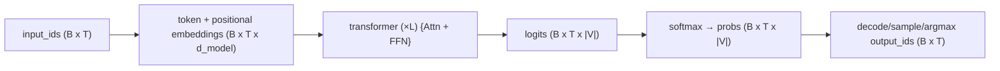
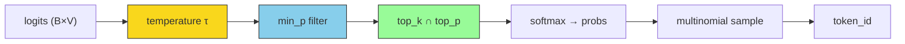

> A multi-layer perceptron (MLP) architecture built on top of a [[thoughts/Attention#Muti-head Attention|multi-head attention]] mechanism [@vaswani2023attentionneed] to signal high entropy tokens to be amplified and less important tokens to be diminished.

ELI5: Mom often creates a food list consists of $n$ of items to buy. Your job is to guess what the last item on this list would be.

Most implementations are [[thoughts/Autoregressive models|autoregressive]]. Most major SOTA are decoder-only, given that encoder-decoder are mostly used for machine translation task.

[[thoughts/state-space models|state-space models]] which address transformers' [efficiency issues](https://arxiv.org/abs/2009.06732) in attention layers within information-dense data.

## internals

See also: [transformers from scratch](https://e2eml.school/transformers.html), @geva2021transformerfeedforwardlayerskeyvalue

procedure: tokenization -> positional_embeddings -> input_embeddings -> ffn + attn -> hidden_states -> probability distributions -> sampled (next token)



Objective (next‑token NLL / cross‑entropy): given logits $L \in R^{B\times T\times \mid V\mid}$ and probabilities `p = softmax(L)`, with gold next tokens $y \in V^{B\times T}$, training minimizes the negative log‑likelihood across tokens:

$$
\mathcal{L}(\theta) = -\frac{1}{B T_\text{eff}} \sum_{b=1}^B \sum_{t\in\mathcal{M}} \log\, p_\theta\big(y_{b,t}\mid x_{b,\le t}\big),
$$

where $\mathcal{M}$ indexes non‑padded, shift‑right targets.

> [!note] intuition
>
> for each position in the batch and sequence (e.g., $5 \times 128$), the model produces a probability distribution over the vocabulary;
>
> the loss is the sum of the log probabilities assigned to the correct next tokens, averaged over all supervised positions.

Let number of tokens $N$, embedding dim to $d$, we have embeddings $E \in R^{N\times d}$

### [[thoughts/Embedding]]

The idea of Q,K,V is to project with the embeddings to create $W_q, W_k, W_v$

### Attention

![[thoughts/Attention#{collapsed: true}]]

## memory limitations.

https://arxiv.org/abs/2403.14123

https://x.com/karpathy/status/1691571869051445433

## inference.

Either compute-bound (batch inference, saturated usage) or memory-bound (latency)

![[thoughts/PD disaggregated serving#prefill/decode]]

![[thoughts/Speculative decoding#{collapsed: true}]]

### sampling

see also: [vLLM's sampler implementation](https://github.com/vllm-project/vllm/blob/main/vllm/v1/sample/sampler.py)

given logits $z_i$ and base distribution $p_i = \text{softmax}(z)_i$, sampling methods modify this distribution before drawing tokens.

#### temperature

rescales logits before softmax: $p_i^{(\tau)} = \text{softmax}(z/\tau)_i$

$$
\lim_{\tau \to 0^+} p_i^{(\tau)} = \mathbf{1}[i = \arg\max z], \quad \lim_{\tau \to \infty} p_i^{(\tau)} = 1/|\mathcal{V}|
$$

entropy $H(p^{(\tau)})$ monotonically increases with $\tau$.

```python
def apply_temperature(
  logits: torch.Tensor, temp: torch.Tensor
) -> torch.Tensor:
  temp = torch.where(temp < 1e-5, 1.0, temp)
  return logits.div_(temp.unsqueeze(dim=1))
```

#### top-k

retain $k$ highest-probability tokens, renormalize:

$$
p_i^{(k)} = \frac{p_i \cdot \mathbf{1}[i \in \mathcal{V}_k]}{\sum_{j \in \mathcal{V}_k} p_j}, \quad \mathcal{V}_k = \{i : \text{rank}(p_i) \leq k\}
$$

fixed $k$ ignores distribution shape—problematic when peaked (includes noise) or flat (truncates options).

```python
def apply_top_k(logits: torch.Tensor, k: torch.Tensor) -> torch.Tensor:
  vocab_size = logits.shape[1]
  k = k.clamp(min=1, max=vocab_size)
  top_k_values = logits.topk(k.max(), dim=1).values
  threshold = top_k_values.gather(1, (k - 1).unsqueeze(1))
  return logits.masked_fill_(logits < threshold, -float('inf'))
```

#### top-p (nucleus) [@holtzman2020curious]

dynamic vocabulary: smallest set with cumulative probability $\geq p$:

$$
\mathcal{V}_p = \arg\min_{V \subseteq \mathcal{V}} |V| \quad \text{s.t.} \quad \sum_{i \in V} p_i \geq p
$$

requires sorting: $O(|\mathcal{V}| \log |\mathcal{V}|)$. adapts to distribution—peaked → few tokens, flat → many.

```python
def apply_top_p(logits: torch.Tensor, p: torch.Tensor) -> torch.Tensor:
  logits_sort, logits_idx = logits.sort(dim=-1, descending=False)
  probs_sort = logits_sort.softmax(dim=-1)
  probs_cumsum = probs_sort.cumsum(dim=-1)
  mask = probs_cumsum <= (1 - p.unsqueeze(1))
  mask[:, -1] = False
  logits_sort.masked_fill_(mask, -float('inf'))
  return logits_sort.scatter(dim=-1, index=logits_idx, src=logits_sort)
```

#### min-p [@nguyen2024minp]

probability floor relative to maximum: $\mathcal{V}_{\min p} = \{i : p_i \geq \min_p \cdot \max_j p_j\}$

scales with model confidence—tighter threshold when confident, looser when uncertain. outperforms top-p at high temperatures ($\tau > 1$). [^minp-iclr]

[^minp-iclr]: ICLR 2025 oral. addresses top-p failure mode: flat distribution includes low-quality tokens.

```python
def apply_min_p(logits: torch.Tensor, min_p: torch.Tensor) -> torch.Tensor:
  probs = logits.softmax(dim=-1)
  max_probs = probs.amax(dim=-1, keepdim=True)
  threshold = max_probs * min_p.unsqueeze(1)
  return logits.masked_fill_(probs < threshold, -float('inf'))
```

#### pipeline order



vLLM applies: **temperature → min_p → top_k/top_p → sample**

temperature before truncation means flatter distributions include more tokens in top-p. this order maximizes diversity control.

```python
def sample(logits: torch.Tensor, params: SamplingParams) -> torch.Tensor:
  logits = apply_temperature(logits, params.temperature)
  logits = apply_min_p(logits, params.min_p)
  logits = apply_top_k(logits, params.top_k)
  logits = apply_top_p(logits, params.top_p)
  probs = logits.softmax(dim=-1)
  return torch.multinomial(probs, num_samples=1)
```

#### rejection sampling

![[thoughts/Speculative decoding#von Neumann acceptance–rejection|see also: speculative decoding]]

### KV

![[thoughts/KV offloading#motivation]]

The core "retrieval" bags that contains all previous stored key-value pair or newly added items.

[[thoughts/PD disaggregated serving|Prefill disaggregation]] is pretty interesting in a sense that we can separate prefill stage to a separate nodes [@qin2024mooncakekvcachecentricdisaggregatedarchitecture]

![[thoughts/images/mooncake-pd.webp|KV-centric optimization]]

![[lectures/3/notes#kvcache ad-hoc implementation]]

### next-token prediction.

Sampling: we essentially look forward K-tokens, and then we sample from the distribution of the next token.

### multi-token prediction.

@gloeckle2024betterfasterlarge, also used in [[thoughts/Speculative decoding]] for [[thoughts/DeepSeek|DeepSeek-V3 and DeepSeek-R1]]

![[thoughts/images/MTP-deepseek.webp|MTP implementation in DeepSeek, where they keep causal chain for prediction of each token at each depth]]

tl/dr: predict $n$-tokens at once, via shared trunk and ==n dedicated attention heads== [^attention-head]

Note that during inference, we only employ _one attention head_

[^attention-head]:
    @gloeckle2024betterfasterlarge employs $n=4$. The order of the forward and backward in a n-token prediction model with $n=4$ heads of the shared trunk works as follow:

    ```python
    z = model.shared(x)
    d = z.detach()
    d.requires_grad = False

    for i in range(n):
      p = model.heads[i](d)
      loss(p, y[i]).backward()
    z.backward()
    ```

## Byte-Latent Transformer

idea: learn from raw-bytes and skip tokenizer/detokenizer protocol.

## Feynman-Kac

Let $\mathcal{V}$ be the vocab of given transformers model, and $\mathcal{S} = \mathcal{V}^{*}$ the set of multi-token strings. Assume $\mathcal{V}$ contains token `EOS` and write $\mathcal{F} \subseteq \mathcal{S}$ for the set of `EOS`-terminated strings.

> [!definition] _Feynman-Kac Transformer model_
>
> is a tuple $(s_{0}, \{M_t\}_{t\ge 1}, \{G_t\}_{t\ge 1})$ where:
>
> - $s_{0} \in \mathcal{S}$ is an _initial state_, which will take as empty string $\epsilon$
> - $M_t(s_t \mid s_{t-1}, f_\theta)$ is a _Markov kernel_ from $s_{t-1} \in \mathcal{F}^c$ to $s_t \in \mathcal{S}$, parameterised by a transformer network $f_\theta: \mathcal{F}^c \to \mathbb{R}^{\mid \mathcal{V} \mid}$ mapping non-`EOS`-terminated strings to vectors of logits
> - $G_t(s_{t-1}, s_t, f_\theta)$ is a _potential function_, mapping a pair $(s_{t-1}, s_t) \in \mathcal{F}^c \times \mathcal{S}$ to a real-valued non-negative score.

Goal: generate from distribution $\mathbb{P}$ that reweights Markov chain $\mathbb{M}$ by potential functions $G_t$. We define ==_step-t filtering posteriors_==:

$$
P_t(s_t) = \frac{\mathbb{E}_\mathbb{M} \left[ \prod_{i=1}^{t \wedge T} G_i(S_{i-1}, S_i, f_\theta) \cdot [S_t = s_t] \right]}{\mathbb{E}_\mathbb{M} \left[ \prod_{i=1}^{t \wedge T} G_i(S_{i-1}, S_i, f_\theta) \right]}
$$

_Given that $T$ is mostly finite_ we can then define _overall posterior_ [@lew2023sequentialmontecarlosteering{see 2.2 for examples}]

$$
\mathbb{P}(s) = \lim_{t \to \infty} \mathbb{P}_t(s)
$$

```pseudo lineNumber=false
\begin{algorithm}
\caption{Sequential Monte Carlo Transformer Steering}
\begin{algorithmic}
\State \textbf{Input:} $N$ (\# particles), $K$ (factor), Feynman-Kac Transformer model $\{s_0, \{M_t\}_{t \geq 1}, \{G_t\}_{t \geq 1}\}$
\State \textbf{Output:} Weighted particle approximation $\{(x_i, w_i)\}_{i=1,\ldots,N}$ of the posterior $\mathbb{P}$ \\
\State \textbf{Output:} Unbiased estimate $\hat{Z}$ of the partition function $Z = \mathbb{E}_\mathbb{M}[\prod_{t=1}^T G_t(s_t, s_{t-1}, f_\theta)]$ \\
\State Initialize $f_\theta \gets \texttt{CachedTransformer}()$
\State Initialize $(x_i, w_i) \gets (s_0, 1)$ for $i = 1, \ldots, N$
\State Initialize $t \gets 1$
\While{$x_i \not\in \mathcal{F}$ for some $i \in \{1, \ldots, N\}$}
    \State $K_i \gets K (1 - \mathbb{1}_{\mathcal{F}}(x_i)) + \mathbb{1}_{\mathcal{F}}(x_i)$ for $i = 1, \ldots, N$
    \State $N' \gets \sum_{i=1}^N K_i$
    \For{$i \in \{1, \ldots, N\}$}
        \If{$x_i \in \mathcal{F}$}
            \State Set $(x_{i,1}, w_{i,1}) \gets (x_i, w_i \cdot \frac{N'}{N})$
        \Else
            \State Generate $x_{i,k} \sim M_t(\cdot \mid x_i, f_\theta)$ for $k = 1, \ldots, K$
            \State Set $w_{i,k} \gets w_i \cdot G_t(x_i, x_{i,k}, f_\theta) \cdot \frac{N'}{K N}$ for $k = 1, \ldots, K$
        \EndIf
    \EndFor
    \State Set normalized weights $\hat{w}_{i,k} \gets \frac{w_{(i,k)}}{\sum_{j=1}^N \sum_{l=1}^{K_j} w_{(j,l)}}$ for $i = 1, \ldots, N$ and $k = 1, \ldots, K_i$
    \State Set $c^* \gets \inf\{c \in \mathbb{R}_{> 0} \mid \sum_{i=1}^N \sum_{k=1}^{K_i} (\mathbb{1} \wedge c \hat{w}_{(i,k)}) > N\}$
    \State Set $(I_\text{det}, I_\text{stoch}, I_\text{strat}) \gets (\{(i,k) \mid c^{*} \hat{w}_{i,k} \geq 1\}, \{(i,k) \mid c^{*} \cdot \hat{w}_{i,k} < 1\}, \{\})$
    \State Set $\alpha \gets \frac{\sum_{i \in I_\text{stoch}} \hat{w}_i}{|I_\text{det}|}$ and generate $U \sim \text{Uniform}([0, \alpha])$
    \For{$i \in I_\text{stoch}$}
        \State Set $U \gets U - \hat{w}_i$
        \If{$U < 0$}
            \State Set $I_\text{strat} \gets I_\text{strat} \cup \{i\}$
            \State Set $U \gets U + \alpha$
        \EndIf
    \EndFor
    \State Set particles $\{(x_i, w_i)\}_{i=1,\ldots,|I_\text{det}|} \gets \{(x_j, w_j \cdot \frac{N}{N'}) \mid j \in I_\text{det}\}$
    \State Set particles $\{(x_i, w_i)\}_{i=|I_\text{det}|+1,\ldots,N} \gets \{(x_j, \frac{N}{c^* N'} \sum_{l=1}^{N} \sum_{k=1}^{K_l} w_{(j,k)}) \mid j \in I_\text{strat}\}$
\EndWhile
\State \Return $\left((x_i, w_i)_{i=1,\ldots,N}, \hat{Z} = \frac{1}{N} \sum_{i=1}^N w_i \right)$
\end{algorithmic}
\end{algorithm}
```
