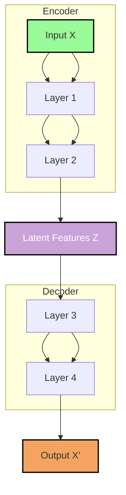

Think of using autoencoders to extract [[thoughts/representations]].

see also [[thoughts/autoencoder diagrams intuition]]

[[thoughts/sparse autoencoder|sparsity]] allows us to interpret hidden layers and internal representations of [[thoughts/Transformers]] model.

see also [[thoughts/latent space]]

## definition

$$
\begin{aligned}
\text{Enc}_{\Theta_1}&: \mathbb{R}^d \to \mathbb{R}^q \\
\text{Dec}_{\Theta_2}&: \mathbb{R}^q \to \mathbb{R}^d \\[12pt]
&\because q \ll d
\end{aligned}
$$

loss function: $l(x) = \|\text{Dec}_{\Theta_2}(\text{Enc}_{\Theta_1}(x)) - x\|$

![[thoughts/contrastive representation learning|contrastive learning]]

## training objective

we want smaller reconstruction error, or

$$
\|\text{Dec}(\text{Sampler}(\text{Enc}(x))) - x\|_2^2
$$

we want to get the latent space distribution to look something similar to isotopic Gaussian!

![[thoughts/Kullback-Leibler divergence|KL divergence]]

## variational autoencoders

idea: to add a gaussian sampler after calculating latent space.

objective function:

$$
\min (\sum_{x} \|\text{Dec}(\text{Sampler}(\text{Enc}(x))) - x\|^2_2 + \lambda \sum_{i=1}^{q}(-\log (\sigma_i^2) + \sigma_i^2 + \mu_i^2))
$$
