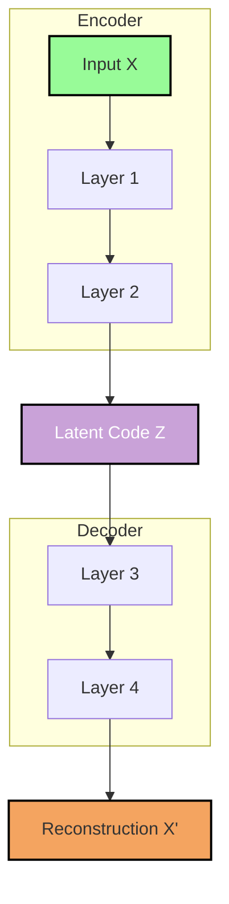

An autoencoder learns [[thoughts/representations]] by reconstructing its input. The encoder produces a code; the decoder uses that code to recover the input. What the model learns depends on which information the architecture and loss allow it to retain.

```mermaid
graph TD
    A[Input X] --> B[Layer 1]
    B --> C[Layer 2]
    C --> D[Latent Code Z]
    D --> E[Layer 3]
    E --> F[Layer 4]
    F --> G[Reconstruction X']

    subgraph Encoder
        A
        B
        C
    end

    subgraph Decoder
        E
        F
    end

    style D fill:#c9a2d8,stroke:#000,stroke-width:2px,color:#fff
    style A fill:#98FB98,stroke:#000,stroke-width:2px
    style G fill:#F4A460,stroke:#000,stroke-width:2px
```

## definition

For an input $x \in \mathbb{R}^d$, a deterministic autoencoder computes

$$
\begin{aligned}
f_\phi &: \mathbb{R}^d \to \mathbb{R}^k, & z &= f_\phi(x), \\
g_\theta &: \mathbb{R}^k \to \mathbb{R}^d, & \hat{x} &= g_\theta(z).
\end{aligned}
$$

An _undercomplete_ code has $k<d$. This limits how much the encoder can pass directly to the decoder, though a sufficiently flexible model can still memorize the training set. An _overcomplete_ code has $k>d$ and usually needs another constraint, such as sparsity, to avoid learning a trivial copy. A small reconstruction error alone tells us little about whether the code is useful elsewhere. See [Deep Learning, chapter 14](https://www.deeplearningbook.org/contents/autoencoders.html).

Related: [[thoughts/contrastive representation learning|contrastive learning]].

## training objective

For real-valued inputs, one choice is squared reconstruction error over a dataset $\mathcal{D}$:

$$
\min_{\phi,\theta}
\frac{1}{|\mathcal{D}|}\sum_{x\in\mathcal{D}}
\left\|g_\theta(f_\phi(x))-x\right\|_2^2.
$$

This objective has no sampler or prescribed distribution over codes.

For a [[thoughts/sparse autoencoder]], we can add a penalty such as $\lambda\|f_\phi(x)\|_1$ for each input. When those inputs are activations from a [[thoughts/Transformers|transformer]], we can inspect the learned features through examples that activate them and interventions on their activations. Sparsity alone does not establish a feature's meaning. [@bricken2023monosemanticity]

## variational autoencoders

A VAE specifies a generative model: draw $z$ from a prior $p(z)$, then draw $x$ from a decoder distribution $p_\theta(x\mid z)$. The encoder learns an approximate posterior $q_\phi(z\mid x)$. A common Gaussian choice is [@kingma2022autoencodingvariationalbayes]

$$
p(z)=\mathcal{N}(0,I_k),\qquad
q_\phi(z\mid x)=\mathcal{N}\!\left(\mu_\phi(x),\operatorname{diag}(\sigma_\phi^2(x))\right).
$$

Here $\sigma_\phi(x)$ contains positive standard deviations. We minimize the negative evidence lower bound (ELBO), averaged over inputs:

$$
\mathcal{J}(x)=
-\mathbb{E}_{q_\phi(z\mid x)}\!\left[\log p_\theta(x\mid z)\right]
+D_{\mathrm{KL}}\!\left(q_\phi(z\mid x)\,\|\,p(z)\right).
$$

The first term rewards explaining the observed input. The [[thoughts/Kullback-Leibler divergence|KL term]] penalizes departures from the prior. Their balance allows input-dependent codes; it does not require every encoded distribution to equal the prior. The bound follows from

$$
\mathcal{J}(x)=
-\log p_\theta(x)
+D_{\mathrm{KL}}\!\left(q_\phi(z\mid x)\,\|\,p_\theta(z\mid x)\right)
\ge -\log p_\theta(x).
$$

This is the variational bound described in [Deep Learning, §20.10.3](https://www.deeplearningbook.org/contents/generative_models.html).

For the diagonal Gaussian above, writing $\mu_i$ and $\sigma_i$ for the encoder outputs at $x$,

$$
D_{\mathrm{KL}}\!\left(q_\phi(z\mid x)\,\|\,p(z)\right)
=\frac12\sum_{i=1}^{k}
\left(\mu_i^2+\sigma_i^2-1-\log\sigma_i^2\right).
$$

At $\mu=0$ and $\sigma_i=1$, this is zero. The factor $\tfrac12$ sets the scale relative to reconstruction; the $-1$ makes the KL value correct.

### where squared error comes from

Choose a Gaussian decoder with fixed variance $\tau^2>0$:

$$
\begin{aligned}
p_\theta(x\mid z)&=\mathcal{N}\!\left(g_\theta(z),\tau^2 I_d\right),\\
-\log p_\theta(x\mid z)
&=\frac{\|x-g_\theta(z)\|_2^2}{2\tau^2}
+\frac d2\log(2\pi\tau^2).
\end{aligned}
$$

The last term is constant only while $\tau$ is fixed. This gives the squared-error reconstruction term its weight in $\mathcal{J}$. Binary observations can instead use a Bernoulli likelihood, giving binary cross-entropy. An arbitrary weight on KL changes the stated objective. [@kingma2022autoencodingvariationalbayes]

### differentiating through a sample

Draw noise independently of the encoder parameters, then compute

$$
\epsilon\sim\mathcal{N}(0,I_k),\qquad
z=\mu_\phi(x)+\sigma_\phi(x)\odot\epsilon.
$$

This _reparameterization_ gives a sample from $q_\phi(z\mid x)$. Holding the sampled $\epsilon$ fixed during backpropagation leaves a differentiable path through $\mu_\phi$ and $\sigma_\phi$. Sampling estimates the expectation in $\mathcal{J}$; the Gaussian KL can be evaluated exactly. [@kingma2022autoencodingvariationalbayes]
