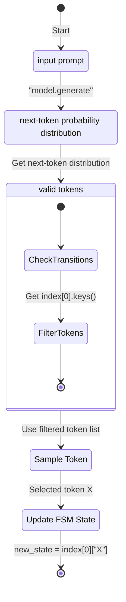

The following document describes and summarizes existing works in vLLM to improve general guided decoding performance. [^performance]

[^performance]:
    Benchmark script can be found at https://github.com/vllm-project/vllm/pull/10046. Current RFC https://github.com/vllm-project/vllm/issues/5423
    Note that `lm-format-enforcer` failed to compile the test schema.

This design will largely affect how `logit_processor` are currently being handle within the vLLM architecture.

Main mega thread: https://github.com/vllm-project/vllm/issues/5423

Goal:

- Improve general TPS when using guided decoding.
- Standardize logit processor interface [^samplingpr]
- separate compute_logits and preparing logits into two separate steps

[^samplingpr]: https://github.com/vllm-project/vllm/pull/6273 proposed a sampling controller interface, but @cadedaniel shares some [concerns](https://github.com/vllm-project/vllm/pull/6273#issuecomment-2243654991) wrt fast-forward tokens

Orthogonal, but still goals:

- https://github.com/vllm-project/vllm/pull/5006
- Logit processor plugins, similar to how vLLM plugins are handled. https://github.com/vllm-project/vllm/pull/4769
- xgrammar: https://github.com/mlc-ai/xgrammar

Scope: `logit_processor`, sampling controller interface

## background

![[thoughts/images/vllm/pre-optimized-logit-processor-handling.webp|flow]]

_reference: [vllm-project/vllm#5329](https://github.com/vllm-project/vllm/pull/5329)_

Currently, generations with FSM is super slow, even with warmup steps to initialize given FSM. This behaviour is further exemplified when running with context longer than 4096 tokens.

Additionally, all outlines logit processors are considered stateful, which slows down the model executor, given in V0 logit processors are applied [row-by-row blocking](https://github.com/vllm-project/vllm/blob/1ea291a4173a82c537ab42487e23375be4926d30/vllm/model_executor/layers/logits_processor.py#L143)

Thus comparing to sglang, vLLM v0 is currently not up to par.

## plan

- Implement [jump-ahead decoding](https://lmsys.org/blog/2024-02-05-compressed-fsm/#method-1-finite-state-machine-based) through a JSONWorker, we can then extend this to CFGWorker
- similar to how spec decode is currently implemented in V0

echo from @cadedaniel: "tree scoring in [spec decode] could use the same API as multi-path jump decoding."

> [!question] How should we handle FSM per requests?
>
> - Currently, users can specify different schemas per request, which means the FSM will be compiled per request. This is suboptimal because it slows down general TTFT.
> - For most use cases, we should assume JSON schema similar to how the system prompt is currently being handled (pass during server init)

---

## appendix.

The following includes background information about guided generations.

### compressed FSM for jump-ahead tokens.

Implemented in [@zheng2024sglangefficientexecutionstructured]

#### Method 1: [[thoughts/constrained decoding#Guided generations with FSM.|FSM]]-based decoding

- intuition: Using FSM [@willard2023efficientguidedgenerationlarge] to guide generations by increasing logit bias for tokens that conform to given JSON schema. This allows us to track the current state during decoding and filter out invalid tokens by applying logit bias to the output.
  ![[thoughts/images/vllm/constrained-json-fsm.webp]]

- limitation: we can see that given construction of FSM requires token-level access, it can only transition the state by only _one_ token at a time, resulting in slow decoding.

#### Method 2: Interleaved-based

- intuition: breaks down JSON schemas, each containing either a chunk prefill part or constrained decoding part. They are then executed interleaved by inference system.
  Faster than per-token decoding given that chunked prefill components can process multiple tokens per forward pass

  See also <https://github.com/guidance-ai/guidance#guidance-acceleration> using llama.cpp as backend.

- limitation:
  - interleaved-based require custom syntax, making it less expressive compared to regex.
  - struggles to deal with tokenization boundaries due to conflicts between decode and chunked prefill segments.
  - frequent communications between interpreter and back-end adds additional overhead.

#### **==Method 3: Jump-Forward Decoding with compressed FSM==**

![[thoughts/images/vllm/jump-forward-decoding-fsm.webp]]

> [!important] tokenization boundary handling
>
> During decoding, it is preferred to combine multiple characters into a single tokens.
>
> For example, when decoding `"Hello"` in context of JSON decoding, LLM might output the following token `"`, `He`, `llo`, `",`
>
> This may cause some strange behaviour if we combine the last `"` with `,` (this regex `"[\w\d\s]*"` with the last `,` will lead to endless decoding because this token `",` is not valid even if the LM wants to stop.)

Fix:

- implement ==re-tokenization== mechanism during jump-forward phase (append string instead of the tokens, followed with re-tokenization of the entire text) $\to$ add approximately 4% of overhead
- use a comprehensive regex to guide the decoding phase, instead of employing multiple concatenated regex [^coalescence]

[^coalescence]: this phenomena is also known as [[thoughts/constrained decoding#Coalescence|coalescence]] in structured generations, where it exploit deterministic structures in desired outputs to skip expensive forward pass

### Coalescence

intuition: Instead of expanding to $n$ state, we can compress certain chunks into one state to reduce the size of said FSM.

![[thoughts/images/vllm/part-of-json-fsm.webp]]
_figure 1: initial FSM state_

![[thoughts/images/vllm/compressed-fsm-json.webp]]
_figure 2: compressed FSM state_

A way to adapt character regex to work with tokens in `outlines`:

```python
import outlines.fsm as fsm
from outlines.fsm.regex import make_deterministic_fsm, create_fsm_index_tokenizer

new_fsm, _ = make_deterministic_fsm(fsm)
idx, _ = create_fsm_index_tokenizer(new_fsm, tokenizer)
```



```python
idx_with_tokens = {
  state: {tokenizer.tokenizer.decode([key]): value for key, value in transitions.items()}
  for state, transitions in idx.items()
}
```

> [!note]- example
>
> ```mermaid
> stateDiagram-v2
>     direction LR
>     0 --> 2: n
>     0 --> 1: t
>     1 --> 2: a
>     2 --> 4: na
>     2 --> 3: a
>     3 --> 5: am
>     4 --> 6: me
>     5 --> 6: me
>     2 --> 6: name
>     6 --> 7: e
>     6 --> 8: c
>     7 --> 9: p
>     8 --> 9: p
>     9 --> 11: Paul
>     9 --> 12: Pa
>     9 --> 10: Jo
>     11 --> 13: aul
>     12 --> 14: ul
>     10 --> 26: o
>     26 --> 27: h
>     27 --> 14: n
>     13 --> 14: l
>     14 --> 16: s
>     14 --> 15: s
>     15 --> 17: s
>     16 --> 17: s
>     17 --> 18: a
>     17 --> 19: ag
>     18 --> 20: ge
>     19 --> 20: e
>     20 --> 21: 30
>     20 --> 22: 20
>     21 --> 24: 2
>     22 --> 24: 2
>     22 --> 23: 3
>     24 --> 25: 0
>     25 --> [*]
> ```

_note:_ each state of FSM represents a forward pass to the LM. In vanilla generation, this is essentially necessary. Thus there is no added overhead of FSM for controlling the generated outputs.

From state 2-6, we observer that there are eight different paths to get the same generations of `name`. We probably don't need to do this, given that it will all give us result `name`

But suffice to say, we can hijack this behaviour to accelerate generations by append either of the following tokens **word** to currently generated sequence:

- [”name”]
- [”n”, “a”, “m”, “e”]
- [”na”, “m”, “e”]
- [”nam”, “e”]
- [”n”, “am”, “e”]
- [”n”, “ame”]
- [”na”, “me”]
- [”n”, “a”, “me”]

A simplified index can be shown as:

```python
simplified_index = {
    0: {'{"': 2},
    2: {"name": 6},
    6: {'":"': 9},
    9: {'Paul': 14, 'John': 14},
    14: {'","': 17},
    17: {'age': 20},
    20: {'":': 22},
    22: {'20': 24, '30': 24},
    24: {'}': 25},
}
```

That's at least a 5x speedup over structured generations, given that out of the 9 tokens, two states are single-state transitions. Therefore we only need to call the model ==twice==!!

> [!important]- difference in sampling distribution
>
> All these paths lead to the same string and the same speedup, however they lead to potentially very different states for the LLM when it reaches state 6. That is, the strings are the same, but each path leads to a different conditional probability distribution in stage 6.
>
> ![[thoughts/images/vllm/json-difference-in-sampling-distribution.webp]]

### Guided generations with FSM.

[@willard2023efficientguidedgenerationlarge], implemented at <https://github.com/dottxt-ai/outlines>

_assumption: we are building against [[thoughts/Autoregressive models|autoregressive transformers models]]_

- Let $\mathcal{F} \subset \mathcal{P}(\mathcal{V})$, where $\mathcal{P}$ is the powerset operator, be subset of multi-token string that ends with tokens $\text{EOS} \in \mathcal{V}$.
- Text generation tasks is to draw samples from $\mathcal{F}$

Notable ==sampling== methods include greedy decoding (generate tokens recursively with highest probability tokens), beam search (but using heuristic to find the mode of distribution) [^smc]

[^smc]:
    [@lew2023sequentialmontecarlosteering] recently proposes a sequential [[thoughts/Monte-Carlo|Monte Carlo steering]]. The idea is to classify causal generations as a _posteriori inference_ problem in a class of discrete probabilistic sequence models.

    See also [[thoughts/Transformers#Feynman-Kac|Feynman-Kac transformers models]]

A pseudocode for sampling procedure is as follow:

```pseudo
\begin{algorithm}
\caption{LLM token sampling}
\begin{algorithmic}
\Function{sample}{$L$}
    \State $s \gets ()$
    \For{$i \gets 1, L$}
        \State $\alpha \gets \text{LM}(s, \theta)$
        \State Sample $s \sim \text{Categorical}(\alpha)$
        \If{$s = \text{EOS}$}
            \State \textbf{break}
        \EndIf
        \State $s \gets \text{append}(s, s)$
    \EndFor
    \State \Return $s$
\EndFunction
\end{algorithmic}
\end{algorithm}
```

Given that we are dealing with finite discrete distribution, we can then compute an un-normalized conditional distribution by applying a boolean mask $m: \mathcal{P}(\mathcal{V}) \to \{0,1\}^N$, which restricts the support of original distribution:

$$
\begin{aligned}
\alpha &= \text{LM}(\tilde{S_t}, \theta) \\
\tilde{\alpha} &= m(\tilde{S_t}) \odot \alpha \\
\tilde{s_{t+1}} &\approx \text{Categorial}(\tilde{\alpha})
\end{aligned}
$$

> [!abstract] augmentation upon sampling algorithm
>
> ```pseudo
> \begin{algorithm}
> \caption{token sampling with masking}
> \begin{algorithmic}
> \Function{sample}{$L$}
>     \State $s \gets ()$
>     \For{$i \gets 1, L$}
>         \State $\alpha \gets \text{LM}(s, \theta)$
>         \State Construct the mask m($s$)
>         \State $\tilde{\alpha} \gets m \odot \alpha$
>         \State Sample $\tilde{s} \sim \text{Categorical}(\tilde{\alpha})$
>         \If{$\tilde{s} = \text{EOS}$}
>             \State \textbf{break}
>         \EndIf
>         \State $s \gets \text{append}(s, \tilde{s})$
>     \EndFor
>     \State \Return $s$
> \EndFunction
> \end{algorithmic}
> \end{algorithm}
> ```

> [!important] finite automaton
>
> We define a _finite-state machine_, given by $(Q, \Sigma , \delta, q_0, F)$ [^automaton-definition]
> where character comprising the strings in $\mathcal{V}$ are drawn from $\Sigma$, i.e: $\mathcal{V} \in \mathcal{P}(\Sigma)$
>
> ![[thoughts/images/vllm/fsm-iterative-generations.webp]]

[^automaton-definition]:
    [[thoughts/university/twenty-three-twenty-four/sfwr-2fa3/DFA|finite state machine]]

    - $Q$ is a finite set of states
    - $\Sigma$ is a finite alphabet
    - $\delta: Q \times \Sigma \to Q$ is the transition function
    - $q_0 \in Q$ is the start state
    - $F \subseteq Q$ is the set of all accepted states.

We define finding sub-sequences of FSM $M$ that accept string $v$ as follow:

```pseudo
\begin{algorithm}
\caption{Find sub-sequences of the FSM $M$ that accept the string $v$}
\begin{algorithmic}
\Function{FindSubSequences}{$M, v$}
    \State $M = (Q, \Sigma, \delta, q_0, F)$
    \State $\texttt{res} \gets ()$
    \For{$r \in \delta^{-1}(\cdot, v_0)$} \Comment{$\text{ Loop through states that read } v_0$}
        \State $p \gets (r)$
        \For{$i \gets 1, |v| - 1$} \Comment{$\text{ Walk the FSM}$}
            \If{$\delta(r, v_i) = \emptyset$} \Comment{$\text{ The FSM does not read } v_i$}
                \State $p \gets ()$
                \State \textbf{break} \Comment{$\text{ Stop walking and try the next start state}$}
            \EndIf
            \State $r \gets \delta(r, v_i)$
            \State $p \gets \text{append}(p, r)$
        \EndFor
        \State $\texttt{res} \gets \text{append}(\texttt{res}, p)$
    \EndFor
    \State \Return $\texttt{res}$
\EndFunction
\end{algorithmic}
\end{algorithm}
```

We can then define construction of $\sigma$

```pseudo
\begin{algorithm}
\caption{Construct a map from FSM states to subsets of $\mathcal{V}$}
\begin{algorithmic}
\Function{MapStatesToVocab}{$M, \mathcal{V}$}
    \State $M = (Q, \Sigma, \delta, q_0, F)$
    \State Initialize the map $\sigma$ with empty sets for each element in $Q$
    \For{$v \in \mathcal{V}$} \Comment{$\text{Loop through the vocabulary}$}
        \State $Z \gets \text{find\_sub\_sequences}(M, v)$
        \For{$z \in Z$} \Comment{$\text{Loop through state sequences accepting } v$}
            \State $\sigma(z_0) \gets \sigma(z_0) \cup v$
        \EndFor
    \EndFor
    \State \Return $\sigma$
\EndFunction
\end{algorithmic}
\end{algorithm}
```
