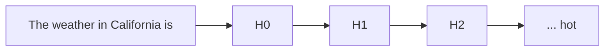
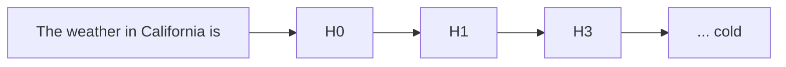

[whirlwind tour](https://www.youtube.com/watch?v=veT2VI4vHyU&ab_channel=FAR%E2%80%A4AI), [[thoughts/pdfs/tinymorph exploration.pdf|initial exploration]], [glossary](https://dynalist.io/d/n2ZWtnoYHrU1s4vnFSAQ519J)

> The subfield of alignment that delves into reverse engineering of a neural network, especially [[thoughts/LLMs]]

To attack the _curse of dimensionality_, the question remains: ==How do we hope to understand a function over such
a large space, without an exponential amount of time?==

## steering

refers to the process of manually modifying certain activations and hidden state of the neural net to influence its
outputs

For example, the following is a toy example of how a decoder-only transformers (i.e: GPT-2) generate text given the prompt "The weather in California is"



To steer to model, we modify $H_2$ layers with certain features amplifier with scale 20 (called it $H_{3}$)[^1]

[^1]: An example steering function can be:

    $$
    H_{3} = H_{2} + \text{steering\_strength} * \text{SAE}.W_{\text{dec}}[20] * \text{max\_activation}
    $$



One usually use techniques such as [[thoughts/mechanistic interpretability#sparse autoencoders]] to decompose model activations into a set of
interpretable features.

For feature [[thoughts/mechanistic interpretability#ablation]], we observe that manipulation of features activation can be strengthened or weakened
to directly influence the model's outputs

## sparse autoencoders

abbrev: SAE

_see also: [landspace](https://docs.google.com/document/d/1lHvRXJsbi41bNGZ_znGN7DmlLXITXyWyISan7Qx2y6s/edit?tab=t.0#heading=h.j9b3g3x1o1z4)_

Often contains one layers of MLP with few linear ReLU that is trained on a subset of datasets the main LLMs is trained on.

> empirical example: if we wish to interpret all features related to the author Camus, we might want to train an SAEs based on all given text of Camus
> to interpret "similar" features from Llama-3.1

> [!abstract] definition
>
> We wish to decompose a models' activitation $x \in \mathbb{R}^n$ into sparse, linear combination of feature directions:
>
> $$
> x \sim x_{0} + \sum_{i=1}^{M} f_i(x) d_i
> \\
> \\
> \\
> \because \begin{aligned}
>  d_i M \gg n&:\text{ latent unit-norm feature direction} \\
> f_i(x) \ge 0&: \text{ corresponding feature activation for }x
> \end{aligned}
> $$

Thus, the baseline architecture of SAEs is a linear autoencoder with L1 penalty on the activations:

$$
\begin{aligned}
f(x) &\coloneqq \text{ReLU}(W_\text{enc}(x - b_\text{dec}) + b_\text{enc}) \\
\hat{x}(f) &\coloneqq W_\text{dec} f(x) + b_\text{dec}
\end{aligned}
$$

> training it to reconstruct a large dataset of model activations $x \sim \mathcal{D}$, constraining hidden representation $f$ to be sparse

[[thoughts/university/twenty-four-twenty-five/sfwr-4ml3/tut/tut1#^l1norm|L1 norm]] with coefficient $\lambda$ to construct loss during training:

$$
\mathcal{L}(x) \coloneqq \| x-\hat{x}(f(x)) \|_2^2 + \lambda \| f(x) \|_1
\\
\because \|x-\hat{x}(f(x)) \|_2^2 : \text{ reconstruction loss}
$$

> [!important] intuition
>
> We need to reconstruction fidelity at a given sparsity level, as measured by
> L0 via a mixture of reconstruction fidelity and L1 regularization.

We can reduce sparsity loss term without affecting reconstruction by scaling up norm of
decoder weights, or constraining norms of columns $W_\text{dec}$ during training

Ideas: output of decoder $f(x)$ has two roles

- detects what features acre active <= L1 is crucial to ensure sparsity in decomposition
- _estimates_ magnitudes of active features <= L1 is unwanted bias

### Gated SAE

see also: [paper](https://arxiv.org/abs/2404.16014)

_uses Pareto improvement over training to reduce L1 penalty_ [@rajamanoharan2024improvingdictionarylearninggated]

Clear consequence of the bias during training is _shrinkage_ [@sharkey2024feature] [^shrinkage]

[^shrinkage]:
    If we hold $\hat{x}(\bullet)$ fixed, thus L1 pushes $f(x) \to 0$, while reconstruction loss pushes $f(x)$ high enough to produce accurate reconstruction.<br>
    An optimal value is somewhere between.<br>
    However, rescaling the [[thoughts/mechanistic interpretability#feature suppression|shrink]] feature activations [@sharkey2024feature] is not necessarily enough to overcome bias induced by L1: a SAE might learnt sub-optimal encoder and decoder directions that is not improved by the fixed.

Idea is to use [[thoughts/optimization#Gated Linear Units and Variants|gated ReLU]] encoder [@shazeer2020gluvariantsimprovetransformer; @dauphin2017languagemodelinggatedconvolutional]:

$$
\tilde{f}(\mathbf{x}) \coloneqq \underbrace{\mathbb{1}[\underbrace{(\mathbf{W}_{\text{gate}}(\mathbf{x} - \mathbf{b}_{\text{dec}}) + \mathbf{b}_{\text{gate}}) > 0}_{\pi_{\text{gate}}(\mathbf{x})}]}_{f_{\text{gate}}(\mathbf{x})} \odot \underbrace{\text{ReLU}(\mathbf{W}_{\text{mag}}(\mathbf{x} - \mathbf{b}_{\text{dec}}) + \mathbf{b}_{\text{mag}})}_{f_{\text{mag}}(\mathbf{x})}
$$

where $\mathbb{1}[\bullet > 0]$ is the (pointwise) Heaviside step function and $\odot$ denotes elementwise multiplication.

| term                 | annotations                                                                     |
| -------------------- | ------------------------------------------------------------------------------- |
| $f_\text{gate}$      | which features are deemed to be active                                          |
| $f_\text{mag}$       | feature activation magnitudes (for features that have been deemed to be active) |
| $\pi_\text{gate}(x)$ | $f_\text{gate}$ sub-layer's pre-activations                                     |

to negate the increases in parameters, use ==weight sharing==:

Scale $W_\text{mag}$ in terms of $W_\text{gate}$ with a vector-valued rescaling parameter $r_\text{mag} \in \mathbb{R}^M$:

$$
(W_\text{mag})_{ij} \coloneqq (\exp (r_\text{mag}))_i \cdot (W_\text{gate})_{ij}
$$

![[thoughts/images/gated-sae-architecture.png]]
Figure 3: Gated SAE with weight sharing between gating and magnitude paths

![[thoughts/images/jump_relu.png]]
Figure 4: A gated encoder become a single layer linear encoder with Jump ReLU [@erichson2019jumpreluretrofitdefensestrategy] activation function $\sigma_\theta$

### feature suppression

See also: [link](https://www.alignmentforum.org/posts/3JuSjTZyMzaSeTxKk/addressing-feature-suppression-in-saes)

Loss function of SAEs combines a MSE reconstruction loss with sparsity term:

$$
L(x, f(x), y) = \|y-x\|^2/d + c\mid f(x) \mid
\\
\because d: \text{ dimensionality of }x
$$

> the reconstruction is not perfect, given that only one is reconstruction. **For smaller value of $f(x)$, features will be suppressed**

> [!note]- illustrated example
>
> consider one binary feature in one dimension $x=1$ with probability $p$ and $x=0$ otherwise. Ideally, optimal SAE would extract feature activation of $f(x) \in \{0,1\}$ and have decoder $W_d=1$
>
> However, if we train SAE optimizing loss function $L(x, f(x), y)$, let say encoder outputs feature activation $a$ if $x=1$ and 0 otherwise, ignore bias term, the optimization problem becomes:
>
> $$
> \begin{aligned}
> a &= \argmin p * L(1,a,a) + (1-p) * L(0,0,0) \\
> &= \argmin (1-a)^2 + \mid a \mid * c  \\
> &= \argmin a^2 + (c-2) *a +1
> \end{aligned}
> \\
> \Longrightarrow \boxed{a = 1-\frac{c}{2}}
> $$

> [!question]+ How do we fix feature suppression in training SAEs?
>
> introduce element-wise scaling factor per feature in-between encoder and decoder, represented by vector $s$:
>
> $$
> \begin{aligned}
> f(x) &= \text{ReLU}(W_e x + b_e) \\
> f_s(x) &= s \odot f(x) \\
> y &= W_d f_s(x) + b_d
> \end{aligned}
> $$

## superposition hypothesis

> [!abstract]+ tl/dr
>
> phenomena when a neural network represents _more_ than $n$ features in a $n$-dimensional space

> Linear representation of neurons can represent more features than dimensions. As sparsity increases, model use
> superposition to represent more [[thoughts/mechanistic interpretability#features]] than dimensions.
>
> neural networks “want to represent more features than they have neurons”.

When features are sparsed, superposition allows compression beyond what linear model can do, at a cost of interference that requires non-linear filtering.

reasoning: “noisy simulation”, where small neural networks exploit feature sparsity and properties of high-dimensional spaces to approximately simulate much larger much sparser neural networks

In a sense, superposition is a form of **lossy [[thoughts/Compression|compression]]**

### importance

- sparsity: how _frequently_ is it in the input?

- importance: how useful is it for lowering loss?

### overcomplete basis

_reasoning for the set of $n$ directions [^direction]_

[^direction]: Even though features still correspond to directions, the set of interpretable direction is larger than the number of dimensions

## features

> A property of an input to the model

When we talk about features [@elhage2022superposition{see "Empirical Phenomena"}], the theory building around
several observed empirical phenomena:

1. Word Embeddings: have direction which corresponding to semantic properties [@mikolov-etal-2013-linguistic]. For
   example:
   ```prolog
   V(king) - V(man) = V(monarch)
   ```
2. Latent space: similar vector arithmetics and interpretable directions have also been found in generative adversarial
   network.

We can define features as properties of inputs which a sufficiently large neural network will reliably dedicate
a neuron to represent [@elhage2022superposition{see "Features as Direction"}]

## ablation

> refers to the process of removing a subset of a model's parameters to evaluate its predictions outcome.

idea: deletes one activation of the network to see how performance on a task changes.

- zero ablation or _pruning_: Deletion by setting activations to zero
- mean ablation: Deletion by setting activations to the mean of the dataset
- random ablation or _resampling_

## residual stream


residual stream $x_{0}$ has dimension $\mathit{(C,E)}$ where

- $\mathit{C}$: the number of tokens in context windows and
- $\mathit{E}$: embedding dimension.

[[thoughts/Attention]] mechanism $\mathit{H}$ process given residual stream $x_{0}$ as the result is added back to $x_{1}$:

$$
x_{1} = \mathit{H}{(x_{0})} + x_{0}
$$

## grokking

See also: [writeup](https://www.alignmentforum.org/posts/N6WM6hs7RQMKDhYjB/a-mechanistic-interpretability-analysis-of-grokking), [code](https://colab.research.google.com/drive/1F6_1_cWXE5M7WocUcpQWp3v8z4b1jL20), [circuit threads](https://transformer-circuits.pub/2022/in-context-learning-and-induction-heads/index.html)

> A phenomena discovered by [@power2022grokkinggeneralizationoverfittingsmall] where small algorithmic tasks like modular addition will initially memorise training data, but after a long time ti will suddenly learn to generalise to unseen data

> [!important] empirical claims
>
> related to phase change

[^ref]
