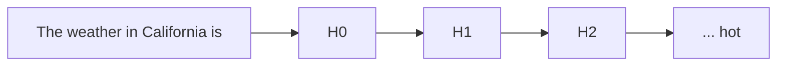
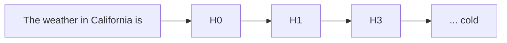

[whirlwind tour](https://www.youtube.com/watch?v=veT2VI4vHyU&ab_channel=FAR%E2%80%A4AI), [[thoughts/pdfs/tinymorph exploration.pdf|initial exploration]], [glossary](https://dynalist.io/d/n2ZWtnoYHrU1s4vnFSAQ519J)

> The subfield of alignment that delves into reverse engineering of a neural network, especially [[thoughts/LLMs]]

To attack the _curse of dimensionality_, the question remains: _==how do we hope to understand a function over such a large space, without an exponential amount of time?==_ [^lesswrongarc]

[^lesswrongarc]: good read from [Lawrence C](https://www.lesswrong.com/posts/6FkWnktH3mjMAxdRT/what-i-would-do-if-i-wasn-t-at-arc-evals#Ambitious_mechanistic_interpretability) for ambitious mech interp.

![[thoughts/sparse autoencoder#{collapsed: true}]]

![[thoughts/sparse crosscoders#{collapsed: true}]]

![[thoughts/Attribution parameter decomposition#{collapsed: true}]]

## open problems

see also: [neuronpedia aug 25 landscape reports](https://www.neuronpedia.org/graph/info#section-directions-for-future-work), @sharkey2025openproblemsmechanisticinterpretability

- differentiate between "reverse engineering" versus "concept-based"
  - reverse engineer:
    - decomposition -> hypotheses -> validation
      - Decomposition via dimensionality [[thoughts/university/twenty-four-twenty-five/sfwr-4ml3/principal component analysis|reduction]]
  - drawbacks with [[thoughts/sparse autoencoder#sparse dictionary learning|SDL]]:
    - SDL reconstruction error are way too high [@rajamanoharan2024improvingdictionarylearninggated{see section 2.3}]
    - SDL assumes linear representation hypothesis against non-linear feature space.
    - SDL leaves feature geometry unexplained ^geometry

![[thoughts/circuit tracing#open problems]]

## transcoders

Transcoders are variants of SAEs that reconstruct the output of a component given its input, rather than reconstructing activations from themselves [@paulo2025transcodersbeatsparseautoencoders]. Unlike SAEs which encode and decode at a single layer, transcoders bridge layers by predicting downstream activations from upstream ones.

comparing to SAEs:

- Significantly more interpretable features - transcoders find features that better correspond to human-understandable concepts
- Enable analysis of direct feature-feature interactions by bridging over nonlinearities
- Form the basis for replacement models used in {{sidenotes[attribution graphs.]: Skip transcoders add affine skip connections, achieving lower reconstruction loss with no effect on interpretability.}}

> [!note] Cross-layer transcoders
>
> Each feature reads from the residual stream at one layer and contributes to outputs of all subsequent MLP layers. This greatly simplifies resulting circuits by:
>
> - Handling cross-layer superposition directly
> - Allowing features to "jump" across many uninteresting identity circuit connections
> - Matching underlying model outputs in ~50% of cases when substituting for MLPs

Transcoders enable the linear attribution framework used in attribution graphs - by replacing MLP computations, they make feature interactions linear and attribution well-defined.

see also: [[thoughts/circuit tracing]] for open-source tools using transcoders

## inference

Application in the wild: [Goodfire](https://goodfire.ai/) and [Transluce](https://transluce.org/)

> [!question]- How we would do inference with SAE?
>
> https://x.com/aarnphm/status/1839016131321016380

idea: treat SAEs as a logit bias, similar to [[thoughts/structured outputs]]

> [!abstract] proposal for [[thoughts/vllm|vLLM]] plugin
>
> Design goals: <5% latency overhead, support for CLTs and matryoshka SAEs, feature drift detection, production-grade observability

### motivation

Current SAE deployments (Goodfire, Transluce) run as separate inference services, creating duplication and latency overhead. Integrating SAEs directly into vLLM's execution pipeline enables:

- **Zero-copy activation access** - Direct manipulation of residual stream without serialization
- **Batched processing** - Leverage vLLM's continuous batching for SAE operations
- **Unified deployment** - Single service for base model + interpretability
- **Production monitoring** - Real-time feature drift detection and steering validation

### architecture overview

The plugin leverages vLLM v1's modular architecture and plugin system via Python entry points:

```python title="setup.py"
setup(
  name='vllm-sae-plugin',
  entry_points={
    'vllm.general_plugins': ['register_sae = vllm_sae_plugin:register']
  },
)
```

Components:

1. `SAERegistry` - Manages multiple SAE/CLT checkpoints per layer
2. `ActivationInterceptor` - Hooks into attention/MLP outputs
3. `FeatureCache` - Persistent batch caching for sparse representations
4. `DriftMonitor` - Tracks feature activation distributions
5. `SteeringController` - Applies feature-level interventions

### design: activation interception

Hook into vLLM's model executor at attention output layer (pre-residual addition):

```python title="activations.py"
from __future__ import annotations

from collections.abc import Callable
from dataclasses import dataclass
from typing import Any

import torch


@dataclass(frozen=True)
class InterceptionConfig:
  sae_registry: dict[tuple[int, str], Any]
  target_modules: tuple[str, ...]
  intervention_cache: dict[int, dict[str, Any]]


def create_interception_config(
  sae_registry: dict[tuple[int, str], Any], target_modules: list[str]
) -> InterceptionConfig:
  return InterceptionConfig(
    sae_registry=sae_registry,
    target_modules=tuple(target_modules),
    intervention_cache={},
  )


def get_sae_for_layer(
  registry: dict[tuple[int, str], Any], layer_idx: int, module_type: str
) -> Any | None:
  return registry.get((layer_idx, module_type))


def apply_steering(
  sparse_features: torch.Tensor,
  interventions: dict[int, dict[str, Any]],
  layer_idx: int,
) -> torch.Tensor:
  if layer_idx not in interventions:
    return sparse_features

  intervention = interventions[layer_idx]
  return sparse_features + intervention.get('bias', 0) * intervention.get(
    'scale', 1.0
  )


def process_activations(
  activations: torch.Tensor,
  sae: Any | None,
  interventions: dict[int, dict[str, Any]],
  layer_idx: int,
  drift_monitor: Callable[[torch.Tensor, int], None],
) -> torch.Tensor:
  if sae is None:
    return activations

  sparse_features = sae.encode(activations)
  sparse_features = apply_steering(sparse_features, interventions, layer_idx)
  drift_monitor(sparse_features, layer_idx)

  return sae.decode(sparse_features)


def create_attention_hook(
  config: InterceptionConfig,
  layer_idx: int,
  drift_monitor: Callable[[torch.Tensor, int], None],
) -> Callable:
  def hook(module, input, output):
    activations = output[0]
    sae = get_sae_for_layer(config.sae_registry, layer_idx, 'attn')
    reconstructed = process_activations(
      activations, sae, config.intervention_cache, layer_idx, drift_monitor
    )
    return (reconstructed,) + output[1:]

  return hook


def register_hooks(
  config: InterceptionConfig,
  model,
  drift_monitor: Callable[[torch.Tensor, int], None],
):
  target_layers = [
    idx
    for idx in range(model.config.num_hidden_layers)
    if f'layer.{idx}.attn' in config.target_modules
  ]

  return [
    model.layers[idx].self_attn.register_forward_hook(
      create_attention_hook(config, idx, drift_monitor)
    )
    for idx in target_layers
  ]
```

### design: cross-layer transcoder support

CLTs read from one layer and write to multiple downstream layers, requiring special handling:

```python title="transcoders.py"
from __future__ import annotations

from collections.abc import Callable
from typing import Any, NamedTuple

import torch


class CLTConfig(NamedTuple):
  clt: Any
  source_layer: int
  target_layers: tuple[int, ...]


def create_clt_config(clt_checkpoint) -> CLTConfig:
  clt = load_clt(clt_checkpoint)
  return CLTConfig(
    clt=clt,
    source_layer=clt_checkpoint.source_layer,
    target_layers=tuple(clt_checkpoint.target_layers),
  )


def encode_source_activations(
  clt: Any, activations: torch.Tensor, position_ids: torch.Tensor
) -> tuple[torch.Tensor, dict[int, torch.Tensor]]:
  sparse_features = clt.encode(activations)
  feature_cache = {
    pos.item(): sparse_features[idx] for idx, pos in enumerate(position_ids)
  }
  return sparse_features, feature_cache


def apply_cached_to_target(
  clt: Any,
  feature_cache: dict[int, torch.Tensor],
  target_layers: tuple[int, ...],
  layer_idx: int,
  position_ids: torch.Tensor,
) -> torch.Tensor | None:
  if layer_idx not in target_layers:
    return None

  cached = torch.stack([feature_cache[pos.item()] for pos in position_ids])
  return clt.decode_to_layer(cached, layer_idx)


def create_clt_pipeline(config: CLTConfig):
  def encode(activations: torch.Tensor, position_ids: torch.Tensor):
    return encode_source_activations(config.clt, activations, position_ids)

  def decode(
    feature_cache: dict[int, torch.Tensor],
    layer_idx: int,
    position_ids: torch.Tensor,
  ):
    return apply_cached_to_target(
      config.clt, feature_cache, config.target_layers, layer_idx, position_ids
    )

  return encode, decode
```

### design: matryoshka SAE support

Matryoshka SAEs enable dynamic sparsity levels - use fewer features for simple tokens, more for complex:

```python title="matryoshka.py"
from __future__ import annotations

from collections.abc import Callable
from typing import Any, NamedTuple

import torch


class MatryoshkaConfig(NamedTuple):
  encoder: Any
  decoders: dict[int, Any]
  sparsity_levels: tuple[int, ...]
  complexity_estimator: Callable[[torch.Tensor], torch.Tensor]


def create_matryoshka_config(
  checkpoint, sparsity_levels: list[int] | None = None
) -> MatryoshkaConfig:
  if sparsity_levels is None:
    sparsity_levels = [32, 64, 128, 256]

  return MatryoshkaConfig(
    encoder=checkpoint.encoder,
    decoders={k: checkpoint.decoders[k] for k in sparsity_levels},
    sparsity_levels=tuple(sparsity_levels),
    complexity_estimator=ComplexityEstimator(),
  )


def select_sparsity_level(
  complexity_score: float, thresholds: tuple[float, ...] = (0.3, 0.6, 0.85)
) -> int:
  levels = [32, 64, 128, 256]
  for i, threshold in enumerate(thresholds):
    if complexity_score < threshold:
      return levels[i]
  return levels[-1]


def create_sparse_features(
  all_features: torch.Tensor, k: int, idx: int
) -> torch.Tensor:
  topk_vals, topk_idx = torch.topk(all_features[idx], k)
  sparse = torch.zeros_like(all_features[idx])
  sparse.scatter_(0, topk_idx, topk_vals)
  return sparse


def decode_with_sparsity(
  sparse_features: torch.Tensor, decoders: dict[int, Any], k: int
) -> torch.Tensor:
  return decoders[k](sparse_features)


def adaptive_encode_decode(
  config: MatryoshkaConfig, activations: torch.Tensor, token_ids: torch.Tensor
) -> torch.Tensor:
  complexity = config.complexity_estimator(token_ids)
  all_features = config.encoder(activations)

  def process_token(idx: int, complexity_score: float) -> torch.Tensor:
    k = select_sparsity_level(complexity_score)
    sparse = create_sparse_features(all_features, k, idx)
    return decode_with_sparsity(sparse, config.decoders, k)

  reconstructed = [
    process_token(i, score) for i, score in enumerate(complexity)
  ]

  return torch.stack(reconstructed)
```

### design: feature drift monitoring

Track distributional shifts in feature activations over time:

```python title="drift.py"
from __future__ import annotations

from collections.abc import Callable
from typing import Any, NamedTuple

import torch


class DriftState(NamedTuple):
  n_features: int
  window_size: int
  activation_counts: torch.Tensor
  activation_means: torch.Tensor
  activation_vars: torch.Tensor
  baseline_counts: torch.Tensor | None
  baseline_means: torch.Tensor | None
  total_samples: int


def create_drift_state(n_features: int, window_size: int = 1000) -> DriftState:
  return DriftState(
    n_features=n_features,
    window_size=window_size,
    activation_counts=torch.zeros(n_features),
    activation_means=torch.zeros(n_features),
    activation_vars=torch.zeros(n_features),
    baseline_counts=None,
    baseline_means=None,
    total_samples=0,
  )


def update_welford_statistics(
  state: DriftState, sparse_features: torch.Tensor
) -> DriftState:
  active_mask = sparse_features != 0
  new_counts = state.activation_counts + active_mask.sum(dim=0)

  new_means = state.activation_means.clone()
  new_vars = state.activation_vars.clone()
  total = state.total_samples

  for i in range(state.n_features):
    active_values = sparse_features[:, i][active_mask[:, i]]
    if len(active_values) > 0:
      for val in active_values:
        total += 1
        delta = val - new_means[i]
        new_means[i] += delta / total
        delta2 = val - new_means[i]
        new_vars[i] += delta * delta2

  return state._replace(
    activation_counts=new_counts,
    activation_means=new_means,
    activation_vars=new_vars,
    total_samples=total,
  )


def compute_kl_divergence(
  freq_current: torch.Tensor,
  freq_baseline: torch.Tensor,
  epsilon: float = 1e-10,
) -> float:
  return torch.sum(
    freq_current
    * torch.log(freq_current / (freq_baseline + epsilon) + epsilon)
  ).item()


def detect_frequency_drift(
  state: DriftState, threshold: float = 0.1
) -> tuple[str, float] | None:
  if state.baseline_counts is None:
    return None

  freq_current = state.activation_counts / state.total_samples
  freq_baseline = state.baseline_counts / state.baseline_counts.sum()

  kl_div = compute_kl_divergence(freq_current, freq_baseline)

  return ('frequency_drift', kl_div) if kl_div > threshold else None


def detect_mean_shift(
  state: DriftState, threshold: float = 2.0
) -> tuple[str, list[int]] | None:
  if state.baseline_means is None:
    return None

  mean_shifts = torch.abs(state.activation_means - state.baseline_means)
  significant_shifts = mean_shifts > threshold

  if significant_shifts.any():
    drifted_features = torch.where(significant_shifts)[0].tolist()
    return ('feature_shift', drifted_features)

  return None


def check_drift(
  state: DriftState, alert_fn: Callable[[str, Any], None]
) -> DriftState:
  if state.baseline_counts is None:
    return state._replace(
      baseline_counts=state.activation_counts.clone(),
      baseline_means=state.activation_means.clone(),
    )

  for drift_result in [
    detect_frequency_drift(state),
    detect_mean_shift(state),
  ]:
    if drift_result is not None:
      drift_type, details = drift_result
      alert_fn(drift_type, details)

  return state


def update_drift_monitor(
  state: DriftState,
  sparse_features: torch.Tensor,
  alert_fn: Callable[[str, Any], None],
) -> DriftState:
  new_state = update_welford_statistics(state, sparse_features)

  if new_state.total_samples % new_state.window_size == 0:
    new_state = check_drift(new_state, alert_fn)

  return new_state


def emit_drift_alert(drift_type: str, details: Any) -> None:
  logger.warning(
    f'Feature drift detected: {drift_type}', extra={'details': details}
  )
```

### optimization: batched sparse operations

Critical for <5% overhead - fuse TopK selection and reconstruction:

```python title="kernels.py"
from __future__ import annotations

import torch


@torch.compile(mode='max-autotune')
def fused_topk_decode(
  encoded: torch.Tensor, decoder_weights: torch.Tensor, k: int
) -> torch.Tensor:
  batch, seq_len, n_features = encoded.shape
  topk_vals, topk_idx = torch.topk(encoded, k, dim=-1)
  selected_weights = decoder_weights[topk_idx]
  reconstructed = (topk_vals.unsqueeze(-1) * selected_weights).sum(dim=-2)
  return reconstructed


def register_sae_custom_op():
  from vllm.model_executor.custom_op import CustomOP

  @CustomOP.register_oot(name='sae_topk_decode')
  class SAETopKDecode:
    def forward(self, encoded, decoder, k):
      return fused_topk_decode(encoded, decoder, k)

  return SAETopKDecode
```

### optimization: persistent caching

Leverage vLLM v1's persistent batch technique for SAE state:

```python title="cache.py"
from __future__ import annotations

from typing import Any, NamedTuple

import torch


class CacheState(NamedTuple):
  sparse_indices: torch.Tensor
  sparse_values: torch.Tensor
  position_map: dict[str, int]


class CacheConfig(NamedTuple):
  max_batch_size: int
  max_seq_len: int
  n_features: int
  k: int = 128
  dtype: torch.dtype = torch.float16
  device: str = 'cuda'


def create_cache_state(config: CacheConfig) -> CacheState:
  return CacheState(
    sparse_indices=torch.zeros(
      (config.max_batch_size, config.max_seq_len, config.k),
      dtype=torch.int32,
      device=config.device,
    ),
    sparse_values=torch.zeros(
      (config.max_batch_size, config.max_seq_len, config.k),
      dtype=config.dtype,
      device=config.device,
    ),
    position_map={},
  )


def extract_topk_features(
  sparse_features: torch.Tensor, k: int = 128
) -> tuple[torch.Tensor, torch.Tensor]:
  return torch.topk(sparse_features, k, dim=-1)


def update_cache_diff(
  state: CacheState,
  request_id: str,
  new_positions: list[int],
  sparse_features: torch.Tensor,
) -> CacheState:
  base_idx = state.position_map.get(request_id, 0)
  topk_vals, topk_idx = extract_topk_features(sparse_features)

  new_indices = state.sparse_indices.clone()
  new_values = state.sparse_values.clone()

  n_new = len(new_positions)
  new_indices[base_idx : base_idx + n_new] = topk_idx
  new_values[base_idx : base_idx + n_new] = topk_vals

  new_position_map = {**state.position_map, request_id: base_idx + n_new}

  return CacheState(
    sparse_indices=new_indices,
    sparse_values=new_values,
    position_map=new_position_map,
  )


def reconstruct_from_cache(
  state: CacheState, request_id: str, decoder_weights: torch.Tensor
) -> torch.Tensor:
  positions = state.position_map.get(request_id, 0)
  indices = state.sparse_indices[:positions]
  values = state.sparse_values[:positions]

  weights = decoder_weights[indices]
  return (values.unsqueeze(-1) * weights).sum(dim=-2)


def create_cache_manager(config: CacheConfig):
  state_ref = [create_cache_state(config)]

  def update(
    request_id: str, new_positions: list[int], sparse_features: torch.Tensor
  ):
    state_ref[0] = update_cache_diff(
      state_ref[0], request_id, new_positions, sparse_features
    )

  def reconstruct(
    request_id: str, decoder_weights: torch.Tensor
  ) -> torch.Tensor:
    return reconstruct_from_cache(state_ref[0], request_id, decoder_weights)

  return update, reconstruct
```

### API design

Production-first configuration API:

```python
from vllm import LLM
from vllm_sae_plugin import SAEConfig, SteeringVector

# Initialize with SAE config
llm = LLM(
  model='meta-llama/Llama-3.2-3B',
  sae_config=SAEConfig(
    checkpoints={
      'attn_15': 'path/to/clt_layer15.pt',  # CLT
      'attn_20': 'path/to/matryoshka_layer20.pt',  # Matryoshka
      'mlp_23': 'path/to/standard_sae_layer23.pt',  # Standard
    },
    target_modules=['attn_output'],  # Hook attention outputs
    enable_drift_monitoring=True,
    drift_window=1000,  # samples
    cache_config={'max_cached_features': 100_000, 'eviction_policy': 'lru'},
    optimization={
      'use_custom_kernels': True,
      'compile_mode': 'max-autotune',
      'enable_persistent_cache': True,
    },
  ),
)

# Define steering intervention
steering = SteeringVector(
  layer=15,
  features={
    1337: 2.5,  # Amplify feature 1337 by 2.5x
    4242: -1.0,  # Suppress feature 4242
  },
  mode='additive',  # or "multiplicative"
)

# Generate with steering
outputs = llm.generate(
  'The weather in California is', steering_vectors=[steering], temperature=0.7
)

# Access drift metrics
drift_report = llm.sae_plugin.get_drift_report()
# {
#   "layer_15": {
#     "kl_divergence": 0.03,
#     "shifted_features": [128, 1337, 2048],
#     "dead_features": [42, 99],
#   }
# }
```

### monitoring and observability

Integration with production monitoring stacks:

```python title="metrics.py"
from __future__ import annotations

from typing import Any, NamedTuple

import torch


class MetricsConfig(NamedTuple):
  port: int = 9090
  dead_feature_threshold: float = 0.001


def create_metrics_registry() -> dict[str, Any]:
  return {
    'sae_feature_activations': Counter(),
    'sae_drift_kl_divergence': Gauge(),
    'sae_reconstruction_error': Histogram(),
    'sae_latency_overhead': Histogram(),
  }


def compute_activation_rate(drift_state: DriftState) -> list[float]:
  if drift_state.total_samples == 0:
    return torch.zeros(drift_state.n_features).tolist()
  return (drift_state.activation_counts / drift_state.total_samples).tolist()


def detect_dead_features(
  drift_state: DriftState, threshold: float = 0.001
) -> list[int]:
  activation_rate = drift_state.activation_counts / drift_state.total_samples
  dead_mask = activation_rate < threshold
  return torch.where(dead_mask)[0].tolist()


def compute_current_kl_divergence(drift_state: DriftState) -> float | None:
  if drift_state.baseline_counts is None:
    return None

  freq_current = drift_state.activation_counts / drift_state.total_samples
  freq_baseline = (
    drift_state.baseline_counts / drift_state.baseline_counts.sum()
  )

  return compute_kl_divergence(freq_current, freq_baseline)


def export_metrics(
  drift_state: DriftState, config: MetricsConfig
) -> dict[str, Any]:
  return {
    'feature_activation_rate': compute_activation_rate(drift_state),
    'drift_kl': compute_current_kl_divergence(drift_state),
    'dead_features': detect_dead_features(
      drift_state, config.dead_feature_threshold
    ),
  }


def create_metrics_exporter(config: MetricsConfig):
  registry = create_metrics_registry()

  def export(drift_state: DriftState) -> dict[str, Any]:
    metrics = export_metrics(drift_state, config)
    registry['sae_drift_kl_divergence'].set(metrics['drift_kl'] or 0.0)
    return metrics

  return export
```

### performance targets

Based on vLLM v1 benchmarks and SAE overhead analysis:

| Metric                  | Target            | Justification                                  |
| ----------------------- | ----------------- | ---------------------------------------------- |
| Latency overhead        | <5%               | Custom kernels + persistent caching            |
| Memory overhead         | <10%              | Sparse representations, shared decoder weights |
| Throughput impact       | <8%               | Batched operations, minimal serialization      |
| Feature refresh rate    | >1000 Hz          | Real-time drift detection                      |
| Max concurrent requests | Same as base vLLM | No batching constraints                        |

**Optimization breakdown:**

- Custom CUDA kernels for TopK: ~2% overhead
- Fused decode operation: ~1.5% overhead
- Persistent cache updates: ~0.5% overhead
- Drift monitoring (async): ~1% overhead
- **Total: ~5% end-to-end latency**

### future extensions

1. **Multi-SAE ensembles** - Run multiple SAEs per layer for robustness
2. **Adaptive sparsity scheduling** - Vary k based on token importance
3. **Feature attribution caching** - Pre-compute common steering vectors
4. **Cross-request feature analysis** - Aggregate statistics across users
5. **Online SAE finetuning** - Adapt to distribution shift automatically

## steering

refers to the process of manually modifying certain activations and hidden state of the neural net to influence its
outputs

For example, the following is a toy example of how a decoder-only transformers (i.e: GPT-2) generate text given the prompt "The weather in California is"



To steer to model, we modify $H_2$ layers with certain features amplifier with scale 20 (called it $H_{3}$)[^1]

[^1]: An example steering function can be:

    $$
    H_{3} = H_{2} + \text{steering\_strength} * \text{SAE}.W_{\text{dec}}[20] * \text{max\_activation}
    $$



One usually use techniques such as [[thoughts/mechanistic interpretability#sparse autoencoders]] to decompose model activations into a set of
interpretable features.

For feature [[thoughts/mechanistic interpretability#ablation]], we observe that manipulation of features activation can be strengthened or weakened
to directly influence the model's outputs

@panickssery2024steeringllama2contrastive uses [[thoughts/contrastive representation learning|contrastive activation additions]] to [steer](https://github.com/nrimsky/CAA) Llama 2

### [[thoughts/contrastive representation learning|contrastive]] activation additions

intuition: using a contrast pair for steering vector additions at certain activations layers

Uses _mean difference_ which produce difference vector similar to PCA:

Given a dataset $\mathcal{D}$ of prompt $p$ with positive completion $c_p$ and negative completion $c_n$, we calculate mean-difference $v_\text{MD}$ at layer $L$ as follow:

$$
v_\text{MD} = \frac{1}{\mid \mathcal{D} \mid} \sum_{p,c_p,c_n \in \mathcal{D}} a_L(p,c_p) - a_L(p, c_n)
$$

> [!important] implication
>
> by steering existing learned representations of behaviors, CAA results in better out-of-distribution generalization than basic supervised finetuning of the entire model.

## superposition hypothesis

see also: https://colab.research.google.com/github/anthropics/toy-models-of-superposition/blob/main/toy_models.ipynb

a phenomena when a neural network represents _more_ than $n$ features in a $n$-dimensional space

> [!abstract]+ tl/dr
>
> Linear representation of neurons can represent more features than dimensions. As sparsity increases, model use
> superposition to represent more [[thoughts/mechanistic interpretability#features]] than dimensions.
>
> neural networks “want to represent more features than they have neurons”.

When features are sparsed, superposition allows compression beyond what linear model can do, at a cost of interference that requires {{sidenotes<dropdown:true>[non-linear]: or "noisy simulation", where small neural networks exploit feature sparsity and properties of high-dimensional spaces to approximately simulate much larger much sparser neural networks}} filtering.

In a sense, superposition is a form of **lossy [[thoughts/Compression|compression]]**

This is plausible because:

- almost _orthogonal vectors_
  - it's only possible to have $n$ orthogonal vectors in an $n$-dimensional space, it's possible to have $\exp (n)$ many "almost orthogonal" ($< \epsilon$ cosine similarity) vectors in {{sidenotes[high-dimensional spaces.]: See the [Johnson–Lindenstrauss lemma](https://en.wikipedia.org/wiki/Johnson%E2%80%93Lindenstrauss_lemma) for the mathematical foundation.}}
- compressed sensing
  - In general, if one projects a vector into a lower-dimensional space, one can't reconstruct the {{sidenotes<inline: true>[original vector.]: However, this changes if one knows that the original vector is sparse - in this case, it is often possible to recover the original vector.}}

### properties

One can think in terms of _four progressively more strict properties_ that [[/tags/ml|neural network]] representations might have:

- **Decomposability**:
  - Neural network activations which are _decomposable_ can be into features, the meaning of which is not dependent on the value of other features.
  - This property is ultimately the most important — see the role of decomposition in defeating the curse of dimensionality.
- **Linearity**:
  - Features correspond to directions. Each feature $f_i$ has a corresponding representation direction $W_i$.
  - The presence of multiple features $f_1, f_2, \dots$ activating with values $x_{f_1}, x_{f_2}, \dots$ is represented by
  - $$
    x_{f_1} W_{f_1} + x_{f_2} W_{f_2} + \dots.
    $$
- **Superposition vs Non-Superposition**:
  - A linear representation exhibits superposition if $W^\top W$ is _not_ invertible.
  - If $W^\top W$ _is_ invertible, it does _not_ exhibit superposition.
- **Basis-Aligned**:
  - A representation is [[thoughts/basis]] aligned if _all_ $W_i$ are one-hot basis vectors.
  - A representation is partially basis aligned if _all_ $W_i$ are sparse. This requires a privileged basis.

The first two (decomposability and linearity) are properties we hypothesize to be widespread, while the latter (non-superposition and basis-aligned) are properties we believe only sometimes occur.

### importance

- sparsity: how _frequently_ is it in the input?

- importance: how useful is it for lowering loss?

### over-complete basis

_reasoning for the set of $n$ directions [^direction]_

[^direction]: Even though features still correspond to directions, the set of interpretable direction is larger than the number of dimensions

## features

> A property of an input to the model

When we talk about features [@elhage2022superposition{see "Empirical Phenomena"}], the theory building around
several observed empirical phenomena:

1. Word Embeddings: have direction which corresponding to semantic properties [@mikolov-etal-2013-linguistic]. For
   example:
   ```prolog
   V(king) - V(man) = V(monarch)
   ```
2. Latent space: similar vector arithmetics and interpretable directions have also been found in generative adversarial
   network.

We can define features as properties of inputs which a sufficiently large neural network will reliably dedicate
a neuron to represent [@elhage2022superposition{see "Features as Direction"}]

## ablation

> refers to the process of removing a subset of a model's parameters to evaluate its predictions outcome.

idea: deletes one activation of the network to see how performance on a task changes.

- zero ablation or _pruning_: Deletion by setting activations to zero
- mean ablation: Deletion by setting activations to the mean of the dataset
- random ablation or _resampling_

## mathematical frameworks to transformers

see also: @elhage2021mathematical, [[thoughts/mathematical framework transformers circuits|notes]]

### residual stream

![[thoughts/images/residual-stream-illustration.webp|Residual stream illustration]]

intuition: we can think of residual as highway networks, in a sense portrays linearity of the {{sidenotes[network]: Constructing models with a residual stream traces back to early work by the Schmidhuber group, such as highway networks and LSTMs, which have found significant modern success in the more recent residual network architecture. In transformers, the residual stream vectors are often called the "embedding" - we prefer the residual stream terminology because it emphasizes the residual nature and because the residual stream often dedicates subspaces to tokens other than the present token.}}

residual stream $x_{0}$ has dimension $\mathit{(C,E)}$ where

- $\mathit{C}$: the number of tokens in context windows and
- $\mathit{E}$: embedding dimension.

[[thoughts/Attention]] mechanism $\mathit{H}$ process given residual stream $x_{0}$ as the result is added back to $x_{1}$:

$$
x_{1} = \mathit{H}{(x_{0})} + x_{0}
$$

![[thoughts/induction heads|induction heads]]

## grokking

See also: [writeup](https://www.alignmentforum.org/posts/N6WM6hs7RQMKDhYjB/a-mechanistic-interpretability-analysis-of-grokking), [code](https://colab.research.google.com/drive/1F6_1_cWXE5M7WocUcpQWp3v8z4b1jL20), [circuit threads](https://transformer-circuits.pub/2022/in-context-learning-and-induction-heads/index.html)

> A phenomena discovered by [@power2022grokkinggeneralizationoverfittingsmall] where small algorithmic tasks like modular addition will initially memorise training data, but after a long time ti will suddenly learn to generalise to unseen data

> [!important] empirical claims
>
> related to phase change

## attribution graph

see also [[thoughts/Attribution parameter decomposition]], [Circuit Tracing: Revealing Computational Graphs in Language Models](https://transformer-circuits.pub/2025/attribution-graphs/methods.html), [On the Biology of a Large Language Model](https://transformer-circuits.pub/2025/attribution-graphs/biology.html)

Attribution graphs are computational graphs that reveal the mechanisms underlying model behaviors by tracing how features influence each other to produce outputs. They show the intermediate computational steps models use, providing a "path-finder" for activation flows.

```jsx imports={MethodologyStep,MethodologyTree}
<MethodologyTree
  title="methodology"
  description="Distil a transformer run into an interpretable circuit by training a sparse replacement model, freezing the residual context, and pruning the resulting feature graph."
>
  <MethodologyStep
    title="train interpretable transcoders"
    badge="replacement model"
    summary="Swap SAEs for transcoders (ideally cross-layer) so features capture the computation the original MLP stack performs."
    points={[
      'Let features read from a single residual stream position and write into downstream MLP layers to bridge non-linear blocks.',
      'Cross-layer transcoders handle superposition and drastically simplify resulting circuits.',
      'Replacement models should closely reconstruct the base model to keep feature semantics stable.',
    ]}
  >
    <MethodologyStep
      title="prefer cross-layer variants"
      summary="Allow features to jump across residual layers instead of following every identity connection."
      points={[
        'Reduces circuit depth by skipping uninformative residual additions.',
        "Matches the underlying model's outputs in roughly half of substitution trials.",
      ]}
    />
  </MethodologyStep>
  <MethodologyStep
    title="freeze attention patterns"
    badge="context"
    summary="Hold attention weights and normalization denominators fixed so attribution focuses on the induced MLP computation."
    points={[
      'Splits the problem into understanding behaviour with a fixed attention pattern and separately explaining why the model attends there.',
      'Removes the largest non-linearities outside the replacement model.',
    ]}
  />
  <MethodologyStep
    title="make interactions linear"
    badge="linearity"
    summary="Design the setup so feature-to-feature effects are linear for the chosen input."
    points={[
      'Transcoder features replace the non-linear MLP while frozen attention removes the remaining activation-dependent terms.',
      'Enables principled attribution because edges sum to the observed activation.',
    ]}
  />
  <MethodologyStep
    title="construct the feature graph"
    badge="graph build"
    summary="Represent every active feature, prompt token, reconstruction error, and output logit as a node."
    points={[
      'Edges store linear contributions; their weights sum to the downstream activation.',
      'Multi-hop paths capture indirect mediation via other features.',
    ]}
  >
    <MethodologyStep
      title="encode nodes & edges"
      summary="Annotate each node with activation magnitude and each edge with its linear effect."
      points={[
        'Token and embedding nodes anchor the computation back to the prompt.',
        'Include reconstruction error nodes so the graph accounts for approximation mismatch.',
      ]}
    />
  </MethodologyStep>
  <MethodologyStep
    title="prune for interpretability"
    badge="sparsity"
    summary="Select the smallest subgraph that explains the behaviour at the focus token."
    points={[
      'Rank nodes and edges by their marginal contribution to the output logits.',
      'Keep sparse subgraphs so human inspection stays tractable.',
    ]}
  />
  <MethodologyStep
    title="validate with perturbations"
    badge="verification"
    summary="Check that the proposed circuit actually drives the behaviour."
    points={[
      'Ablate or rescale identified features and measure the effect on the model output.',
      'Confirm the replacement model relies on the same mechanisms as the base model.',
    ]}
  />
</MethodologyTree>
```

### parameter decomposition

Attribution graphs and parameter decomposition are complementary views:

- **Attribution graphs** answer "what computational steps happen?" - showing activation/feature-level flow of information through the model
- **Parameter decomposition** answers "which parameters implement those steps?" - identifying which parameter components enable that computational flow

Both address superposition by finding sparse decompositions, but at different abstraction levels: attribution graphs reveal activation flow, parameter decomposition reveals parameter implementation.

### limitations

- Missing {{sidenotes[attention circuits]: Because attention patterns are frozen, attribution graphs miss attention mechanisms - need separate QK attribution methods to understand how attention selects which features interact.}}
- Replacement {{sidenotes[model validity]: Replacement models may use different mechanisms than original models - requires careful validation via perturbation experiments.}}
- Graph pruning subjectivity
  - Pruning introduces subjectivity in determining what's "important" - different pruning criteria may reveal different mechanisms
- Single forward pass focus
  - Current methods focus on single forward passes - understanding mechanism reusability across contexts needs more work

### applications

- Mechanism discovery
  - Finding which computational steps models use for specific behaviors
- Model editing
  - Understanding which features/circuits to modify for targeted behavior changes
- Anomaly detection
  - Identifying when unexpected mechanisms activate (mechanistic anomaly detection)
- Cross-model analysis
  - Comparing how different models implement similar behaviors
- Training analysis
  - Tracking how mechanisms emerge during training

## stochastic parameter decomposition

@bushnaq2025stochasticparameterdecomposition improves upon [[thoughts/Attribution parameter decomposition|APD]] by being more scalable and robust to {{sidenotes[hyperparameters.]: SPD demonstrates decomposition on models slightly larger and more complex than was possible with APD, avoids parameter shrinkage issues, and better identifies ground truth mechanisms in toy models.}}

see also: https://github.com/goodfire-ai/spd

## QK attributions

https://transformer-circuits.pub/2025/attention-qk

> describe attention head scores as a bilinear function of feature activations on the respective query and key positions.

## manipulate manifolds

https://transformer-circuits.pub/2025/linebreaks/index.html
