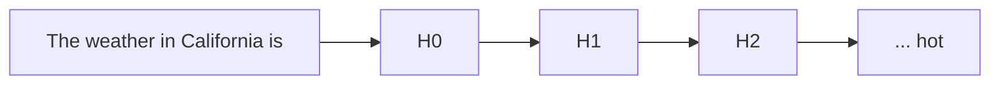
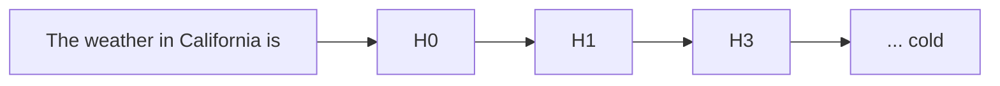

> The subfield of alignment that delves into reverse engineering of a neural network, especially [[thoughts/LLMs]]

To attack the _curse of dimensionality_, the question remains: _==how do we hope to understand a function over such a large space, without an exponential amount of time?==_ [^lesswrongarc]

[^lesswrongarc]: good read from [Lawrence C](https://www.lesswrong.com/posts/6FkWnktH3mjMAxdRT/what-i-would-do-if-i-wasn-t-at-arc-evals#Ambitious_mechanistic_interpretability) for ambitious mech interp.

## open problems

see also: [neuronpedia aug 25 landscape reports](https://www.neuronpedia.org/graph/info#section-directions-for-future-work), @sharkey2025openproblemsmechanisticinterpretability

- differentiate between "reverse engineering" versus "concept-based"
  - reverse engineer:
    - decomposition -> hypotheses -> validation
      - Decomposition via dimensionality [[thoughts/university/twenty-four-twenty-five/sfwr-4ml3/principal component analysis|reduction]]
  - drawbacks with [[thoughts/sparse autoencoder#sparse dictionary learning|SDL]]:
    - SDL reconstruction error are way too high [@rajamanoharan2024improvingdictionarylearninggated{see section 2.3}]
    - SDL assumes linear representation hypothesis against non-linear feature space.
    - SDL leaves feature geometry unexplained ^geometry

![[thoughts/circuit tracing#open problems]]

## transcoders

[@paulo2025transcodersbeatsparseautoencoders]. SAE variant: reconstruct component output from input, not activations from themselves. CLT (cross-layer transcoder): feature reads residual at L, writes into MLPs at layers > L. ~50% substitution match. Skip transcoders: affine skip connections.

linear attribution: MLP replaced by transcoder → feature edges linear → [[thoughts/Attribution parameter decomposition|attribution graphs]] well-defined.

## inference

Application in the wild: [Goodfire](https://goodfire.ai/) and [Transluce](https://transluce.org/)

> [!question]- How we would do inference with SAE?
>
> https://x.com/aarnphm/status/1839016131321016380

idea: treat SAEs as a logit bias, similar to [[thoughts/structured outputs]]

> [!abstract] proposal for [[thoughts/vllm|vLLM]] plugin
>
> Design goals: <5% latency overhead, support for CLTs and matryoshka SAEs, feature drift detection, production-grade observability

see also: [[hinterland/attn/interp plugins|proposal for designing an efficient SAE plugin support]], but most of the field have now moved beyond SAE.

## steering

refers to the process of manually modifying certain activations and hidden state of the neural net to influence its
outputs

For example, the following is a toy example of how a decoder-only transformers (i.e: GPT-2) generate text given the prompt "The weather in California is"


```mermaid
flowchart LR
  A[The weather in California is] --> B[H0] --> D[H1] --> E[H2] --> C[... hot]
```

To steer to model, we modify $H_2$ layers with certain features amplifier with scale 20 (called it $H_{3}$)[^1]

[^1]: An example steering function can be:

    $$
    H_{3} = H_{2} + \text{steering\_strength} * \text{SAE}.W_{\text{dec}}[20] * \text{max\_activation}
    $$


```mermaid
flowchart LR
  A[The weather in California is] --> B[H0] --> D[H1] --> E[H3] --> C[... cold]
```

One usually use techniques such as [[thoughts/mechanistic interpretability#sparse autoencoders]] to decompose model activations into a set of
interpretable features.

For feature [[thoughts/mechanistic interpretability#ablation]], we observe that manipulation of features activation can be strengthened or weakened
to directly influence the model's outputs

@panickssery2024steeringllama2contrastive uses [[thoughts/contrastive representation learning|contrastive activation additions]] to [steer](https://github.com/nrimsky/CAA) Llama 2

### [[thoughts/contrastive representation learning|contrastive]] activation additions

intuition: using a contrast pair for steering vector additions at certain activations layers

Uses _mean difference_ which produce difference vector similar to PCA:

Given a dataset $\mathcal{D}$ of prompt $p$ with positive completion $c_p$ and negative completion $c_n$, we calculate mean-difference $v_\text{MD}$ at layer $L$ as follow:

$$
v_\text{MD} = \frac{1}{\mid \mathcal{D} \mid} \sum_{p,c_p,c_n \in \mathcal{D}} a_L(p,c_p) - a_L(p, c_n)
$$

> [!important] implication
>
> by steering existing learned representations of behaviors, CAA results in better out-of-distribution generalization than basic supervised finetuning of the entire model.

## superposition hypothesis

see also: https://colab.research.google.com/github/anthropics/toy-models-of-superposition/blob/main/toy_models.ipynb

a phenomena when a neural network represents _more_ than $n$ features in a $n$-dimensional space

> [!abstract]+ tl/dr
>
> Linear representation of neurons can represent more features than dimensions. As sparsity increases, model use
> superposition to represent more [[thoughts/mechanistic interpretability#features]] than dimensions.
>
> neural networks “want to represent more features than they have neurons”.

When features are sparsed, superposition allows compression beyond what linear model can do, at a cost of interference that requires {{sidenotes<dropdown:true>[non-linear]: or "noisy simulation", where small neural networks exploit feature sparsity and properties of high-dimensional spaces to approximately simulate much larger much sparser neural networks}} filtering.

In a sense, superposition is a form of **lossy [[thoughts/Compression|compression]]**

This is plausible because:

- almost _orthogonal vectors_
  - it's only possible to have $n$ orthogonal vectors in an $n$-dimensional space, it's possible to have $\exp (n)$ many "almost orthogonal" ($< \epsilon$ cosine similarity) vectors in {{sidenotes[high-dimensional spaces.]: See the [Johnson–Lindenstrauss lemma](https://en.wikipedia.org/wiki/Johnson%E2%80%93Lindenstrauss_lemma) for the mathematical foundation.}}
- compressed sensing
  - In general, if one projects a vector into a lower-dimensional space, one can't reconstruct the {{sidenotes<inline: true>[original vector.]: However, this changes if one knows that the original vector is sparse - in this case, it is often possible to recover the original vector.}}

### properties

One can think in terms of _four progressively more strict properties_ that [[/tags/ml|neural network]] representations might have:

- **Decomposability**:
  - Neural network activations which are _decomposable_ can be into features, the meaning of which is not dependent on the value of other features.
  - This property is ultimately the most important — see the role of decomposition in defeating the curse of dimensionality.
- **Linearity**:
  - Features correspond to directions. Each feature $f_i$ has a corresponding representation direction $W_i$.
  - The presence of multiple features $f_1, f_2, \dots$ activating with values $x_{f_1}, x_{f_2}, \dots$ is represented by
  - $$
    x_{f_1} W_{f_1} + x_{f_2} W_{f_2} + \dots.
    $$
- **Superposition vs Non-Superposition**:
  - A linear representation exhibits superposition if $W^\top W$ is _not_ invertible.
  - If $W^\top W$ _is_ invertible, it does _not_ exhibit superposition.
- **Basis-Aligned**:
  - A representation is [[thoughts/basis]] aligned if _all_ $W_i$ are one-hot basis vectors.
  - A representation is partially basis aligned if _all_ $W_i$ are sparse. This requires a privileged basis.

The first two (decomposability and linearity) are properties we hypothesize to be widespread, while the latter (non-superposition and basis-aligned) are properties we believe only sometimes occur.

### importance

- sparsity: how _frequently_ is it in the input?

- importance: how useful is it for lowering loss?

### over-complete basis

_reasoning for the set of $n$ directions [^direction]_

[^direction]: Even though features still correspond to directions, the set of interpretable direction is larger than the number of dimensions

## features

> A property of an input to the model

When we talk about features [@elhage2022superposition{see "Empirical Phenomena"}], the theory building around
several observed empirical phenomena:

1. Word Embeddings: have direction which corresponding to semantic properties [@mikolov-etal-2013-linguistic]. For
   example:
   ```prolog
   V(king) - V(man) = V(monarch)
   ```
2. Latent space: similar vector arithmetics and interpretable directions have also been found in generative adversarial
   network.

We can define features as properties of inputs which a sufficiently large neural network will reliably dedicate
a neuron to represent [@elhage2022superposition{see "Features as Direction"}]

## ablation

> refers to the process of removing a subset of a model's parameters to evaluate its predictions outcome.

idea: deletes one activation of the network to see how performance on a task changes.

- zero ablation or _pruning_: Deletion by setting activations to zero
- mean ablation: Deletion by setting activations to the mean of the dataset
- random ablation or _resampling_

## mathematical frameworks to transformers

see also: @elhage2021mathematical, [[thoughts/mathematical framework transformers circuits|notes]]

### residual stream

```jsx imports={Zoomable,ResidualStream}
<Zoomable label="residual stream diagram">
  <ResidualStream caption="Residual stream view of a transformer: each attention head and MLP layer reads from and writes back into the same shared stream." />
</Zoomable>
```

intuition: we can think of residual as highway networks, in a sense portrays linearity of the {{sidenotes[network]: Constructing models with a residual stream traces back to early work by the Schmidhuber group, such as highway networks and LSTMs, which have found significant modern success in the more recent residual network architecture. In transformers, the residual stream vectors are often called the "embedding" - we prefer the residual stream terminology because it emphasizes the residual nature and because the residual stream often dedicates subspaces to tokens other than the present token.}}

residual stream $x_{0}$ has dimension $\mathit{(C,E)}$ where

- $\mathit{C}$: the number of tokens in context windows and
- $\mathit{E}$: embedding dimension.

[[thoughts/Attention]] mechanism $\mathit{H}$ process given residual stream $x_{0}$ as the result is added back to $x_{1}$:

$$
x_{1} = \mathit{H}{(x_{0})} + x_{0}
$$

![[thoughts/induction heads|induction heads]]

## grokking

See also: [writeup](https://www.alignmentforum.org/posts/N6WM6hs7RQMKDhYjB/a-mechanistic-interpretability-analysis-of-grokking), [code](https://colab.research.google.com/drive/1F6_1_cWXE5M7WocUcpQWp3v8z4b1jL20), [circuit threads](https://transformer-circuits.pub/2022/in-context-learning-and-induction-heads/index.html)

> A phenomena discovered by @power2022grokkinggeneralizationoverfittingsmall where small algorithmic tasks like modular addition will initially memorise training data, but after a long time ti will suddenly learn to generalise to unseen data

The idea is somewhat similar to phase change in [[thoughts/Fourier transform|Fourier transform]]

## attribution graph

see also [[thoughts/Attribution parameter decomposition]], [Circuit Tracing: Revealing Computational Graphs in Language Models](https://transformer-circuits.pub/2025/attribution-graphs/methods.html), [On the Biology of a Large Language Model](https://transformer-circuits.pub/2025/attribution-graphs/biology.html)

graphs over replacement-model features. nodes: feature activations + tokens + recon-error + logits. edges: linear contributions.

```jsx imports={MethodologyStep,MethodologyTree}
<MethodologyTree title="methodology" description="transcoders + frozen attention + pruning.">
  <MethodologyStep
    title="train transcoders"
    badge="replacement"
    summary="CLT preferred. feature reads residual L, writes MLP > L."
  >
    <MethodologyStep title="cross-layer" summary="shallower circuits. ~50% substitution match." />
  </MethodologyStep>
  <MethodologyStep
    title="freeze attention"
    badge="context"
    summary="freeze QK + LayerNorm denom. (b) needs QK attribution."
  />
  <MethodologyStep
    title="build graph"
    badge="graph"
    summary="node = activation. edge = linear contribution."
  >
    <MethodologyStep
      title="encode"
      summary="token nodes anchor. recon-error nodes for approximation."
    />
  </MethodologyStep>
  <MethodologyStep
    title="prune"
    badge="sparsity"
    summary="smallest subgraph hitting target logit."
  />
  <MethodologyStep
    title="validate"
    badge="verify"
    summary="ablate features. measure logit delta."
  />
</MethodologyTree>
```

### parameter decomposition

activation level vs weight level. see [[thoughts/Attribution parameter decomposition|APD]], @bushnaq2025stochasticparameterdecomposition.

### limitations

- attention circuits missing → [[thoughts/QK attributions]]
- replacement model $\neq$ base
- pruning subjective
- single-forward-pass only

### applications

- mechanism discovery
- targeted editing (via APD)
- mechanistic anomaly detection
- cross-model circuit transfer
- developmental: IOI emergence in training

## stochastic parameter decomposition

@bushnaq2025stochasticparameterdecomposition improves upon [[thoughts/Attribution parameter decomposition|APD]] by being more scalable and robust to {{sidenotes[hyperparameters.]: SPD demonstrates decomposition on models slightly larger and more complex than was possible with APD, avoids parameter shrinkage issues, and better identifies ground truth mechanisms in toy models.}}

see also: https://github.com/goodfire-ai/spd

## QK attributions

https://transformer-circuits.pub/2025/attention-qk

> describe attention head scores as a bilinear function of feature activations on the respective query and key positions.

## manipulate manifolds

https://transformer-circuits.pub/2025/linebreaks/index.html
