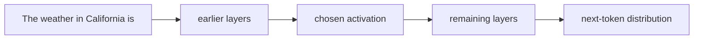
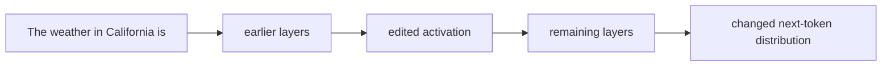

mechanistic interpretability asks how a neural network produces a behaviour. An explanation identifies representations and computations inside the network, then predicts what will happen when we change them. Alignment supplies many of the motivating questions, especially for [[thoughts/LLMs]].

The scale problem remains: _==how do we hope to understand a function over such a large space, without an exponential amount of time?==_ [^lesswrongarc] Decomposition is one proposed answer. If the same components recur across inputs, we can study their interactions and reuse that explanation. We still have to establish where it holds.

[^lesswrongarc]: [Lawrence C's ambitious mechanistic interpretability agenda](https://www.lesswrong.com/posts/6FkWnktH3mjMAxdRT/what-i-would-do-if-i-wasn-t-at-arc-evals#Ambitious_mechanistic_interpretability).

## open problems

see also: [Neuronpedia's August 2025 landscape](https://www.neuronpedia.org/graph/info#section-directions-for-future-work), @sharkey2025openproblemsmechanisticinterpretability

Finding a direction associated with a concept gives us a hypothesis about representation. Reverse engineering also requires an account of how the model uses it. The working sequence is decomposition, hypotheses, and intervention tests.

- **Choosing components.** [[thoughts/university/twenty-four-twenty-five/sfwr-4ml3/principal component analysis|PCA]] finds directions of variance. [[thoughts/sparse autoencoder#sparse dictionary learning|Sparse dictionary learning]] finds directions that reconstruct activations with sparse coefficients. Each objective imposes a different decomposition; neither objective establishes a component's causal role.
- **Reconstruction.** Sparse autoencoders trade reconstruction fidelity against sparsity. Gated SAEs improve this tradeoff in their experiments by separating feature selection from magnitude estimation. The remaining error needs to be measured at the activation and model-output levels. [@rajamanoharan2024improvingdictionarylearninggated]
- **Representation assumptions.** A linear decoder assumes that activations can be approximated by sums of feature directions. Curved or context-dependent representations can require many such directions.
- **Geometry.** A dictionary can identify useful directions while leaving their relationships unexplained. What determines their angles, groups, and dependence on context? ^geometry

![[thoughts/circuit tracing#limits]]

## transcoders

An SAE reconstructs the activations it receives. A transcoder receives a component's input and predicts its output, commonly the output of an MLP. @paulo2025transcodersbeatsparseautoencoders reports more interpretable features in the tested setting. Their skip transcoder adds an affine input-to-output path and improves reconstruction at comparable interpretability.

A cross-layer transcoder, or CLT, extends this across layers. A feature read at layer $\ell$ contributes to reconstructed MLP outputs at layers $\ell,\ell+1,\ldots,L$. Including its own layer matters. See [[thoughts/circuit tracing#the replacement model|the replacement-model equations]] and the [CLT architecture](https://transformer-circuits.pub/2025/attribution-graphs/methods.html).

## inference

Projects to follow: [Goodfire](https://goodfire.ai/) and [Transluce](https://transluce.org/).

> [!question]- How would we do inference with an SAE?
>
> https://x.com/aarnphm/status/1839016131321016380

idea: expose feature controls during generation. A logit bias changes scores for vocabulary tokens at the output. An SAE intervention changes an internal activation, after which the remaining network computes new logits. That distinction determines where an inference engine needs a hook. [[thoughts/structured outputs|Structured output constraints]] operate at the token-selection boundary and can enforce a grammar; an internal steering vector supplies no equivalent guarantee.

> [!abstract] proposal for a [[thoughts/vllm|vLLM]] plugin
>
> Design targets: less than $5\%$ latency overhead, support for CLTs and matryoshka SAEs, feature drift detection, and measurements of latency and intervention effects. These are requirements to test, with overhead measured against the same workload without the plugin.

see also: [[hinterland/attn/interp plugins|proposal for efficient SAE plugin support]]. The intervention interface depends on the representation: a CLT feature has decoder vectors for several layers, while a single-site SAE feature has one decoder direction at its training site.

## steering

Steering changes a model's activations during a forward pass. For an activation $h_{\ell,t}$ at layer $\ell$ and token position $t$, an additive intervention is

$$
h'_{\ell,t}=h_{\ell,t}+\alpha d_i.
$$

Here $d_i$ is a chosen direction, such as decoder feature $i$ from a [[thoughts/sparse autoencoder|sparse autoencoder]], and $\alpha$ sets the strength. The feature index and the strength are separate choices. [^1]

[^1]: Some implementations set $\alpha=s m_i$, where $m_i$ is a reference activation magnitude for feature $i$ and $s$ is a dimensionless multiplier. State the reference dataset and statistic when using this convention. A recorded maximum depends on which examples were sampled.

For the prompt “The weather in California is”, the unmodified computation might favour “hot”. An intervention could change that distribution:


```mermaid
flowchart LR
  A[The weather in California is] --> B[earlier layers] --> D[chosen activation] --> E[remaining layers] --> C[next-token distribution]
```


```mermaid
flowchart LR
  A[The weather in California is] --> B[earlier layers] --> D[edited activation] --> E[remaining layers] --> C[changed next-token distribution]
```

“Cold” becoming more likely would be an experimental result to measure. Naming the direction “cold” does not establish that effect, and large edits can disrupt unrelated behaviour. [[thoughts/mechanistic interpretability#ablation|Ablation]] tests what happens when a component's contribution is removed or replaced.

### [[thoughts/contrastive representation learning|contrastive]] activation additions

Contrastive activation addition (CAA) constructs a direction from paired examples. In @panickssery2024steeringllama2contrastive, each pair shares a multiple-choice question and differs in its final answer letter. One answer expresses the target behaviour. Activations are read at the answer-letter position.

For triples $(p,c_p,c_n)\in\mathcal{D}$, define

$$
v_{\mathrm{MD}}^{(L)}
=\frac{1}{|\mathcal{D}|}
\sum_{(p,c_p,c_n)\in\mathcal{D}}
\left[a_L(p,c_p)-a_L(p,c_n)\right].
$$

The subtraction belongs inside the sum. Pairing reduces variation from the question's wording; averaging combines the remaining differences. This mean-difference estimator uses the behaviour labels. PCA instead selects directions by variance.

At inference, the paper adds $\alpha v_{\mathrm{MD}}^{(L)}$ at post-prompt token positions. See the [method and experiments](https://aclanthology.org/2024.acl-long.828/) and [code](https://github.com/nrimsky/CAA).

> [!important] scope of the result
>
> On the paper's Llama 2 sycophancy experiment, CAA transferred from multiple-choice examples to open-ended generation where the tested finetuning setup failed. This supports transfer in that setting. A general advantage over supervised finetuning remains a separate claim.

## superposition hypothesis

A linear representation uses superposition when its feature directions are linearly dependent. In the common overcomplete case, there are more feature directions than dimensions. Sparse features make this useful because only a few are active on a given input, reducing interference between them. @elhage2022superposition demonstrates this in small networks with synthetic features; the [toy notebook](https://colab.research.google.com/github/anthropics/toy-models-of-superposition/blob/main/toy_models.ipynb) makes the assumptions inspectable.

Suppose a model represents feature strengths $x_i$ using directions $w_i$:

$$
h=Wx=\sum_{i=1}^{m}x_iw_i,
\qquad W\in\mathbb{R}^{d\times m}.
$$

For unit-length directions, reading along $w_j$ gives

$$
w_j^\top h=x_j+\sum_{i\ne j}x_i w_j^\top w_i.
$$

The second term is interference. Sparsity sets many of its coefficients to zero; small pairwise inner products reduce the remaining terms. Nonlinear filtering can then help recover features. This explains how superposition can act as **lossy [[thoughts/Compression|compression]]**.

High-dimensional geometry permits many directions with small pairwise inner products. The number depends on the tolerated overlap and the dimension; see the [[thoughts/Johnson-Lindenstrauss lemma]]. Compressed sensing adds another condition: recovery from fewer measurements can be possible when the original signal is sparse and the measurement matrix has suitable properties. Sparsity alone does not guarantee recovery.

### properties

These are distinct questions about a representation:

- **Decomposability:** can we assign stable meanings to components across inputs?
- **Linearity:** can their contributions be approximated by the sum above?
- **Superposition:** are the represented directions linearly dependent? With columns $w_i$, this is equivalent to $W^\top W$ being singular. It necessarily holds when $m>d$.
- **Basis alignment:** does a feature align with an individual neuron, or use several coordinates in the model's [[thoughts/basis|basis]]?

Several linearly independent features can each use many neurons. Keeping these questions separate prevents “distributed” and “superposed” from becoming interchangeable labels.

### importance

The toy model varies two quantities: how often a feature is active, and how heavily its reconstruction error contributes to the loss. The first controls sparsity; the second encodes importance. Changing either can change which features the trained model retains and how they share dimensions. [@elhage2022superposition]

### over-complete basis

“Overcomplete basis” usually means a dictionary with more vectors than the activation space has dimensions. It is linearly dependent, so it is not a basis in the strict linear-algebra sense. [[thoughts/sparse autoencoder|SAEs]] learn such dictionaries by seeking sparse reconstructions. The resulting directions are candidates for features, with their meaning and causal role still to check.

## features

A feature is a property represented in a model, such as a word's grammatical role or the presence of an edge in an image. In toy models we choose the features ourselves. In a trained language model, identifying them is part of the research problem.

Word embeddings supply an early example of semantic directions. Their analogy results include approximate relations of the form

$$
v_{\mathrm{king}}-v_{\mathrm{man}}+v_{\mathrm{woman}}
\approx v_{\mathrm{queen}}.
$$

The operation retrieves a nearby word vector; it does not assert an exact identity or isolate every aspect of the words' meanings. [@mikolov-etal-2013-linguistic]

The same burden applies when interpreting an SAE latent. Examples with high activation suggest a label. Held-out examples test the label's coverage, and interventions test whether the direction affects the proposed computation.

## ablation

Ablation removes or replaces a chosen component's contribution and measures how model behaviour changes. The component can be an activation, feature, attention head, or parameter subset.

- **Zero ablation:** replace the chosen activation with zero.
- **Mean ablation:** replace it with an average over a stated reference dataset.
- **Resample ablation:** replace it with an activation from another example, chosen according to a stated sampling rule.

The replacement defines the experiment. Zero can be atypical at a chosen site; a mean can erase context; resampling can introduce unrelated information. Record the task, replacement, and output metric. A drop in performance supports a contribution under that intervention, with the replacement's side effects still to examine. An unchanged output can also reflect redundant paths. [@heimersheim2024useinterpretactivationpatching] Parameter pruning is a related use of removal, usually aimed at changing the model permanently.

## mathematical frameworks to transformers

see also: @elhage2021mathematical, [[thoughts/mathematical framework transformers circuits|notes]]

### residual stream

```jsx imports={Zoomable,ResidualStream}
<Zoomable label="residual stream diagram">
  <ResidualStream caption="Residual stream view of a transformer: each attention head and MLP layer reads from and writes back into the same shared stream." />
</Zoomable>
```

For a sequence of $C$ tokens and model width $d$, write the residual stream as $x_0\in\mathbb{R}^{C\times d}$. An [[thoughts/Attention|attention]] sublayer computes an update and adds it to the stream:

$$
x_1=x_0+H(x_0).
$$

Here $H$ includes any normalization at that sublayer's input. An MLP sublayer then adds its own update. Addition lets us track which component wrote a contribution and which later component reads it. The functions producing those updates remain nonlinear, and attention can move information between token positions.

![[thoughts/induction heads|induction heads]]

## grokking

Grokking is delayed generalization: training performance becomes good well before test performance improves. @power2022grokkinggeneralizationoverfittingsmall observed this on small algorithmic datasets.

For modular addition, a later [mechanistic analysis](https://arxiv.org/abs/2301.05217) identified a learned algorithm using [[thoughts/Fourier transform|Fourier]] components. Its circuitry developed before the sharp rise in test accuracy. The Fourier structure describes that model's algorithm; the delay in generalization is the phenomenon to explain.

see also: [author's writeup](https://www.alignmentforum.org/posts/N6WM6hs7RQMKDhYjB/a-mechanistic-interpretability-analysis-of-grokking), [analysis notebook](https://colab.research.google.com/drive/1F6_1_cWXE5M7WocUcpQWp3v8z4b1jL20), [induction-head training dynamics](https://transformer-circuits.pub/2022/in-context-learning-and-induction-heads/index.html).

## attribution graph

An attribution graph describes a chosen output on one prompt. In [Circuit Tracing](https://transformer-circuits.pub/2025/attribution-graphs/methods.html), nodes are active CLT features, input embeddings, reconstruction errors, and logits. Direct edges become linear contributions after fixing attention patterns and normalization denominators at their observed values. See [[thoughts/circuit tracing]] for the equations and [On the Biology of a Large Language Model](https://transformer-circuits.pub/2025/attribution-graphs/biology.html) for case studies.

```jsx imports={MethodologyStep,MethodologyTree}
<MethodologyTree
  title="methodology"
  description="construct a local explanation, then test its predictions."
>
  <MethodologyStep
    title="train transcoders"
    badge="replacement"
    summary="approximate MLP outputs with sparse features."
  >
    <MethodologyStep
      title="cross-layer"
      summary="features can write to their own and later layers."
    />
  </MethodologyStep>
  <MethodologyStep
    title="freeze attention"
    badge="context"
    summary="hold attention patterns and normalization denominators fixed."
  />
  <MethodologyStep
    title="build graph"
    badge="graph"
    summary="attribute direct contributions between nodes."
  >
    <MethodologyStep
      title="include error"
      summary="retain MLP output left unexplained by the reconstruction."
    />
  </MethodologyStep>
  <MethodologyStep
    title="prune"
    badge="sparsity"
    summary="retain nodes and edges above chosen influence thresholds."
  />
  <MethodologyStep
    title="validate"
    badge="verify"
    summary="intervene in the original model and compare downstream effects."
  />
</MethodologyTree>
```

### parameter decomposition

[[thoughts/Attribution parameter decomposition|APD]] decomposes weights into sparsely used components. Those components can span several layers. Connecting them to an attribution graph requires a definition of their interactions and tests of the proposed edges.

### limitations

The replacement model can compute differently from the original. Pruning hides paths, and the graph is local to a forward pass. Frozen attention leaves the causes of its attention weights unexplained; [[thoughts/mechanistic interpretability#QK attributions|QK attributions]] examine how query and key features assign weight to source positions.

### applications

Circuit graphs guide mechanism discovery and candidate interventions. Anomaly detection, cross-model circuit transfer, and tracking how circuits emerge during training are research directions. Each needs its own evaluation: output agreement, correspondence between models, or evidence across training checkpoints.

## stochastic parameter decomposition

@bushnaq2025stochasticparameterdecomposition follows [[thoughts/Attribution parameter decomposition|APD]] with a stochastic ablation objective. Its experiments recover known mechanisms in toy models that are larger or more complex than the earlier APD examples, with improved robustness to hyperparameters. These results establish progress within that test suite; decomposition of large deployed models requires further evidence.

see also: [paper](https://arxiv.org/abs/2506.20790), [code](https://github.com/goodfire-ai/spd).

## QK attributions

[Tracing Attention Computation Through Feature Interactions](https://transformer-circuits.pub/2025/attention-qk) decomposes attention scores into interactions between query-side and key-side features. The score before softmax is bilinear in the query and key representations. Expanding both into feature contributions gives terms that help explain why an attention head selected particular tokens. Softmax still couples the resulting attention weights across candidate positions.

## manipulate manifolds

[When Models Manipulate Manifolds](https://transformer-circuits.pub/2025/linebreaks/index.html) studies how Claude 3.5 Haiku predicts line breaks in fixed-width text. Character counts lie along curved, low-dimensional representations. Attention heads transform those representations to compare the current count with the line width, then the model combines the space remaining with the next word's length.

This gives a concrete reason to inspect feature geometry. Several discrete dictionary features can describe nearby parts of one counting representation. Parameterizing the count exposes the computation shared across those features, and targeted interventions test that account.
