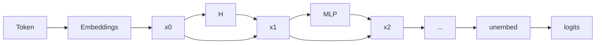

[whirlwind tour](https://www.youtube.com/watch?v=veT2VI4vHyU&ab_channel=FAR%E2%80%A4AI), [[thoughts/pdfs/tinymorph exploration.pdf|initial exploration]], [glossary](https://dynalist.io/d/n2ZWtnoYHrU1s4vnFSAQ519J)

> The subfield of alignment that delves into reverse engineering of a neural network, especially [[thoughts/LLMs]]

To attack the _curse of dimensionality_, the question remains: _==how do we hope to understand a function over such a large space, without an exponential amount of time?==_ [^lesswrongarc]

[^lesswrongarc]: good read from [Lawrence C](https://www.lesswrong.com/posts/6FkWnktH3mjMAxdRT/what-i-would-do-if-i-wasn-t-at-arc-evals#Ambitious_mechanistic_interpretability) for ambitious mech interp.

## inference

application in the wild: [Goodfire](https://goodfire.ai/) and [Transluce](https://transluce.org/)

> [!question]+ How we would do inference with SAE?
>
> https://x.com/aarnphm_/status/1839016131321016380

idea: treat SAEs as a `logit_processor`, though there are currently some bottleneck with `logit_processor` in [[thoughts/vllm|vLLM]], similar to [[thoughts/vllm#guided decoding]]

Currently, before v1, `logit_processor` are row-wise, meaning logits are currently being processed before passing down to scheduling group [^vllm-caveats]

[^vllm-caveats]: [the benchmark](https://github.com/vllm-project/vllm/pull/10046) was run against `vllm#0.6.3.dev236+g48138a84`, with all configuration specified in the pull request.

## steering

refers to the process of manually modifying certain activations and hidden state of the neural net to influence its
outputs

For example, the following is a toy example of how a decoder-only transformers (i.e: GPT-2) generate text given the prompt "The weather in California is"


To steer to model, we modify $H_2$ layers with certain features amplifier with scale 20 (called it $H_{3}$)[^1]

[^1]: An example steering function can be:

    $$
    H_{3} = H_{2} + \text{steering\_strength} * \text{SAE}.W_{\text{dec}}[20] * \text{max\_activation}
    $$


One usually use techniques such as [[thoughts/mechanistic interpretability#sparse autoencoders]] to decompose model activations into a set of
interpretable features.

For feature [[thoughts/mechanistic interpretability#ablation]], we observe that manipulation of features activation can be strengthened or weakened
to directly influence the model's outputs

A few examples where [@panickssery2024steeringllama2contrastive] uses contrastive activation additions to steer Llama 2

### contrastive activation additions

intuition: using a contrast pair for steering vector additions at certain activations layers

Uses _mean difference_ which produce difference vector similar to PCA:

Given a dataset $\mathcal{D}$ of prompt $p$ with positive completion $c_p$ and negative completion $c_n$, we calculate mean-difference $v_\text{MD}$ at layer $L$ as follow:

$$
v_\text{MD} = \frac{1}{\mid \mathcal{D} \mid} \sum_{p,c_p,c_n \in \mathcal{D}} a_L(p,c_p) - a_L(p, c_n)
$$

> [!important] implication
>
> by steering existing learned representations of behaviors, CAA results in better out-of-distribution generalization than basic supervised finetuning of the entire model.

## sparse autoencoders

![[thoughts/sparse autoencoder]]

## superposition hypothesis

> [!abstract]+ tl/dr
>
> phenomena when a neural network represents _more_ than $n$ features in a $n$-dimensional space

> Linear representation of neurons can represent more features than dimensions. As sparsity increases, model use
> superposition to represent more [[thoughts/mechanistic interpretability#features]] than dimensions.
>
> neural networks “want to represent more features than they have neurons”.

When features are sparsed, superposition allows compression beyond what linear model can do, at a cost of interference that requires non-linear filtering.

reasoning: “noisy simulation”, where small neural networks exploit feature sparsity and properties of high-dimensional spaces to approximately simulate much larger much sparser neural networks

In a sense, superposition is a form of **lossy [[thoughts/Compression|compression]]**

### importance

- sparsity: how _frequently_ is it in the input?

- importance: how useful is it for lowering loss?

### overcomplete basis

_reasoning for the set of $n$ directions [^direction]_

[^direction]: Even though features still correspond to directions, the set of interpretable direction is larger than the number of dimensions

## features

> A property of an input to the model

When we talk about features [@elhage2022superposition{see "Empirical Phenomena"}], the theory building around
several observed empirical phenomena:

1. Word Embeddings: have direction which corresponding to semantic properties [@mikolov-etal-2013-linguistic]. For
   example:
   ```prolog
   V(king) - V(man) = V(monarch)
   ```
2. Latent space: similar vector arithmetics and interpretable directions have also been found in generative adversarial
   network.

We can define features as properties of inputs which a sufficiently large neural network will reliably dedicate
a neuron to represent [@elhage2022superposition{see "Features as Direction"}]

## ablation

> refers to the process of removing a subset of a model's parameters to evaluate its predictions outcome.

idea: deletes one activation of the network to see how performance on a task changes.

- zero ablation or _pruning_: Deletion by setting activations to zero
- mean ablation: Deletion by setting activations to the mean of the dataset
- random ablation or _resampling_

## residual stream



residual stream $x_{0}$ has dimension $\mathit{(C,E)}$ where

- $\mathit{C}$: the number of tokens in context windows and
- $\mathit{E}$: embedding dimension.

[[thoughts/Attention]] mechanism $\mathit{H}$ process given residual stream $x_{0}$ as the result is added back to $x_{1}$:

$$
x_{1} = \mathit{H}{(x_{0})} + x_{0}
$$

## grokking

See also: [writeup](https://www.alignmentforum.org/posts/N6WM6hs7RQMKDhYjB/a-mechanistic-interpretability-analysis-of-grokking), [code](https://colab.research.google.com/drive/1F6_1_cWXE5M7WocUcpQWp3v8z4b1jL20), [circuit threads](https://transformer-circuits.pub/2022/in-context-learning-and-induction-heads/index.html)

> A phenomena discovered by [@power2022grokkinggeneralizationoverfittingsmall] where small algorithmic tasks like modular addition will initially memorise training data, but after a long time ti will suddenly learn to generalise to unseen data

> [!important] empirical claims
>
> related to phase change

[^ref]
