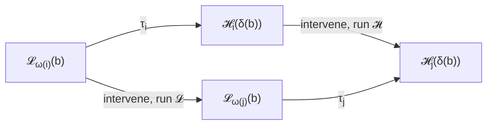
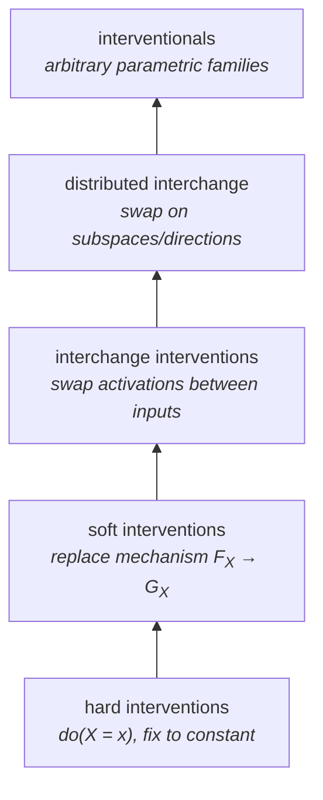

---
author:
  - Atticus Geiger
  - Zhengxuan Wu
  - Thomas Icard
  - Christopher Potts
  - Noah D. Goodman
date: '2025-11-23'
description: generalisation of causal abstraction from mechanism intervention to transformations
id: '@geiger2025causalabstraction'
modified: 2026-03-12 04:00:49 GMT-04:00
tags:
  - interp
title: 'Causal abstraction: A theoretical foundation for mechanistic interpretability'
year: 2025
---

the stanford causal abstraction program, culminating in this JMLR survey [@geiger2025causalabstraction], makes one claim: every [[thoughts/mechanistic interpretability|mech interp]] method is a special case of a single mathematical object. that object is a commuting diagram between causal models at different levels of description. the framework provides the formal skeleton that was implicit when practitioners talked about "circuits" or "features" or "representations," then shows that ~12 existing methods occupy specific cells within that skeleton. [^earlier]

[^earlier]: the earlier version [@geiger2021causalabstractions] introduced causal abstraction for neural networks but handled only hard and interchange interventions. the 2025 paper generalizes to arbitrary intervention families and proves a decomposition theorem that makes the framework complete. roughly a 4:1 ratio of new-material to inherited-material relative to the 2021 paper.

## causal models as the unit of analysis

a causal model $\mathcal{C} = (V, \Sigma, \mathcal{F})$ consists of variables $V$ organized in a DAG, a signature $\Sigma$ assigning each variable $X \in V$ a domain $\Sigma(X)$, and mechanisms $\mathcal{F} = \{F_X\}_{X \in V}$ where each $F_X$ computes $X$'s value from its parents. given a setting of exogenous variables (inputs), the model has a unique solution: the value assignment obtained by propagating through the mechanisms.

neural networks are causal models in this sense. literally. variables are neurons (or attention heads, or residual stream positions). domains are $\mathbb{R}^d$. mechanisms are weight matrices composed with nonlinearities. the forward pass IS solving the structural equations. [^loadbearing]

[^loadbearing]: this identification is load-bearing. once you accept that a neural network is a causal model, you inherit the full machinery of causal inference (interventions, counterfactuals, d-separation). the question "does this circuit implement this algorithm" becomes a precise question about whether a causal abstraction holds between two models.

the high-level model $\mathcal{H}$ is whatever interpretable algorithm you think the network implements: a two-variable boolean circuit for indirect object identification, a modular arithmetic algorithm for grokking, a sentiment classifier with three variables. the low-level model $\mathcal{L}$ is the [[thoughts/LLMs|neural network]] itself. [[thoughts/mechanistic interpretability|mechanistic interpretability]] is the project of establishing when $\mathcal{H}$ is a valid abstraction of $\mathcal{L}$.

## the commuting diagram

an abstraction consists of three maps:

- $\omega: V_\mathcal{H} \to \mathcal{P}(V_\mathcal{L})$ assigns each high-level variable to a set of low-level variables
- $\tau = \{\tau_i\}$ are alignment functions mapping low-level values to high-level values
- $\delta$ translates high-level inputs to low-level inputs

the central requirement: for any intervention on a high-level variable, performing the corresponding intervention on $\mathcal{L}$ and then reading off $\tau$ gives the same result as reading off $\tau$ and then performing the intervention on $\mathcal{H}$.

going right-then-down equals going down-then-right. if this holds across all relevant interventions, $\mathcal{H}$ is a causal abstraction of $\mathcal{L}$. if it fails, your hypothesis about what the network is doing is wrong (or your alignment maps are wrong, which amounts to the same thing).

### constructive abstraction

the paper provides a constructive route via alignment tuples $(\Pi, \pi)$:

- $\Pi$ partitions the low-level variables into groups, each group mapping to one high-level variable
- $\pi$ maps the values of each group's variables to a single high-level value

this is the "how to build an abstraction" recipe. the key structural result is the **decomposition theorem**: any causal abstraction decomposes into a composition of three primitives:

1. **marginalization**: dropping irrelevant variables (the network has thousands of neurons; your hypothesis has three variables)
2. **variable merge**: combining multiple low-level variables into one high-level variable
3. **value merge**: coarsening the domain (many activation patterns map to the same high-level state, e.g., "positive sentiment")

these three are complete. any abstraction you could need is a composition of these operations. [^catthy]

[^catthy]: this has a category-theoretic flavor. the authors don't push this direction explicitly, but the decomposition theorem is essentially saying that the category of causal models has a nice factorization system. if you've seen the lens/optics framework in applied category theory, the alignment maps $\tau$ play the role of lenses between state spaces.

## intervention hierarchy

the paper defines five levels of intervention, each strictly generalizing the previous:

each level corresponds to a class of mech interp experiments:

| level                   | what it tests                                                       | mech interp method                      |
| :---------------------- | :------------------------------------------------------------------ | :-------------------------------------- |
| hard                    | does fixing a neuron to a constant produce the predicted output?    | ablation studies, zero/mean ablation    |
| soft                    | does replacing a mechanism change behavior as predicted?            | concept erasure, LEACE                  |
| interchange             | does swapping activations between inputs produce predicted output?  | activation patching, causal scrubbing   |
| distributed interchange | does swapping along a _learned direction_ produce predicted output? | DAS [@geiger2024finding], boundless DAS |
| interventional          | does an arbitrary intervention family produce predicted outputs?    | full causal abstraction testing         |

the hierarchy matters because weaker intervention types can't distinguish hypotheses that stronger types can. a model might pass all hard-intervention tests while failing interchange tests, meaning: the right information is there, but it's routed through the network differently than your hypothesis predicts.

## the unification

the paper's main payoff is showing that ~12 interpretability methods sit at specific positions in a 2D space: (level of intervention) × (what part of the commute you test). [^twod]

[^twod]: this 2D framing is mine, not the paper's exact presentation. the paper organizes methods along the intervention hierarchy and whether they test the full commuting diagram or only part of it. i find the grid view clearer.

**probing** tests $\tau$ only (no interventions). you train a classifier to predict a high-level variable from low-level activations. this checks if the information is _encoded_ in the representation. probing is the weakest form: it occupies the bottom-left cell, testing alignment without any causal consistency. a representation can encode a concept without the model _using_ that concept in its computation. [^probinggap]

[^probinggap]: this is the "encoded vs used" gap. [[thoughts/sparse autoencoder|SAEs]] inherit the same limitation when used purely for decomposition without causal testing. you can find a feature in the SAE dictionary that correlates with sentiment, but unless you run interchange interventions, you can't distinguish "the model reads sentiment from this direction" from "sentiment happens to be recoverable from this direction as a byproduct of something else." @wu2025axbenchsteeringllmssimple makes this point empirically: steering with SAE features often underperforms simple baselines, precisely because encoded ≠ used.

**activation patching** tests one cell of the commuting diagram. you patch one activation from one input into another and check if the output changes as predicted. this is an interchange intervention, but typically tests one (source input, variable) pair at a time. most [[thoughts/circuit tracing|circuit tracing]] validation uses activation patching.

**DAS** (distributed alignment search) [@geiger2024finding] tests the full commute with _learned_ distributed interchange interventions. DAS optimizes a linear projection that defines the alignment map $\tau$, then measures IIA across the full intervention space. this is the strongest standard method because it searches over the alignment space rather than assuming a fixed axis. [^daslinear]

[^daslinear]: the restriction to _linear_ projections is doing enormous work here. see [[#the non-linear representation dilemma]].

**[[thoughts/sparse autoencoder|SAEs]]** and **[[thoughts/sparse crosscoders|sparse crosscoders]]** provide a decomposition of representations into features, which amounts to a specific choice of $\tau$ (the encoder). the decomposition is not itself a causal abstraction test. it's a proposal for what the alignment maps _could_ be, which then needs to be validated with interventions. [[thoughts/Attribution parameter decomposition]] operates in parameter space rather than activation space but faces the same requirement: decomposition is necessary, not sufficient.

## IIA as the metric

interchange intervention accuracy is the fraction of interchange interventions where the model's output matches the hypothesis:

$$
\text{IIA} = \frac{1}{|\mathcal{B}|} \sum_{(b_1, b_2) \in \mathcal{B}} \mathbb{1}\left[ \tau_j\!\left(\mathcal{L}_{\omega(j)}\!\left(\text{do}(\omega(i) \leftarrow \mathcal{L}_{\omega(i)}(b_2)); b_1\right)\right) = \mathcal{H}_j\!\left(\text{do}(i \leftarrow \mathcal{H}_i(\delta(b_2))); \delta(b_1)\right) \right]
$$

in words: take two inputs $b_1, b_2$. run the network on $b_1$ but swap in the representation of variable $i$ from running on $b_2$. apply $\tau$ to the output. does this match what the high-level model predicts when you do the corresponding swap?

97% IIA on a three-variable hypothesis means: on 97% of input pairs, the network's behavior under activation swaps matches the interpretable model's behavior under the corresponding variable swaps. {{sidenotes[the remaining 3%]: could be noise, could be a systematic failure of the hypothesis in some regime. for safety-critical applications, the distribution of the 3% matters more than the aggregate number.}}

the practical hierarchy of rigor:

- probing accuracy $\gg$ random: the information is encoded (weak claim)
- high IIA under fixed-axis interchange: the information is used along that axis (medium claim)
- high IIA under DAS-learned directions: the information is used along the optimal linear direction (strong claim)
- high IIA under distributed interchange across multiple variables simultaneously: the full causal structure matches (strongest standard claim)

## the non-linear representation dilemma

@sutter2025nonlinear proved that if you allow arbitrary smooth alignment maps $\tau$, causal abstraction becomes trivially satisfiable. they demonstrated 100% IIA on _random_ (untrained) GPT-2 using non-linear $\tau$. any hypothesis about any network is "confirmed" if you're willing to use a sufficiently expressive alignment function.

this is the skeleton in the closet. the entire framework's discriminative power rests on the linearity assumption: $\tau$ must be an affine map (or at most a low-degree polynomial). without this constraint, you can "align" any pair of causal models, which makes the whole enterprise vacuous.

the linearity assumption connects to the linear representation hypothesis that also motivates [[thoughts/sparse autoencoder|SAEs]] and [[thoughts/sparse crosscoders|crosscoders]]. the bet is that neural networks represent concepts as directions in activation space, so a linear map suffices to read them off. this is an empirical bet, not a theorem. [^linearity]

[^linearity]: the dilemma is sharp: if you restrict $\tau$ to linear maps, you get a powerful framework that can distinguish good hypotheses from bad ones, but you might miss non-linear structure that the network actually uses. if you allow non-linear $\tau$, you lose all discriminative power. there's no principled middle ground. this is, i think, the most important open problem in the causal abstraction program, and the 2025 paper acknowledges it only glancingly.

two responses are available:

1. **bite the bullet**: linearity is the right inductive bias for current architectures, supported by the empirical success of linear probes, DAS, and SAEs. non-linear representations exist but are edge cases.
2. **find a middle ground**: constrain $\tau$ to some complexity class between "linear" and "arbitrary smooth." spline maps, low-rank non-linear maps, or neural networks with bounded capacity. no one has made this work yet.

## open edges

**hypothesis generation.** the framework tests a given hypothesis but doesn't generate one. where do good high-level causal models come from? right now: human intuition, informed by probing results and ablation studies. {{sidenotes[automating this]: is approximately the problem of automated scientific discovery applied to neural network internals. the [[thoughts/circuit tracing]] pipeline gets partway there by discovering circuits bottom-up, but connecting those circuits to interpretable causal variables remains manual.}}

**compositionality.** can you compose small causal abstractions into larger ones? if module A implements addition and module B implements comparison, does the composition implement "compare sums"? the framework supports this in principle (compose the commuting diagrams), but empirical work hasn't tested compositional abstractions at scale.

**approximate abstraction for safety.** 97% IIA sounds good until you need to make safety claims. the framework defines exact causal abstraction (100% IIA) cleanly, but "approximate" causal abstraction lacks a principled definition. how much error can you tolerate before the abstraction becomes meaningless? the answer depends on the distribution of failures, which the aggregate IIA number doesn't capture.

**the foundational puzzle.** why should we expect neural networks to have clean causal abstractions at all? [[thoughts/mechanistic interpretability#superposition hypothesis|superposition]] suggests that networks represent many more concepts than they have dimensions, using overlapping directions. if features are in superposition, the alignment maps $\tau$ become many-to-many rather than clean projections, and the commuting diagram becomes approximate at best. the [[thoughts/philosophical zombies|p-zombie]] analogy: even a perfect causal map of the network's computation might leave us with an [[thoughts/philosophical zombies#the expensive step: conceivability → possibility|explanatory gap]] between mechanism and understanding.
